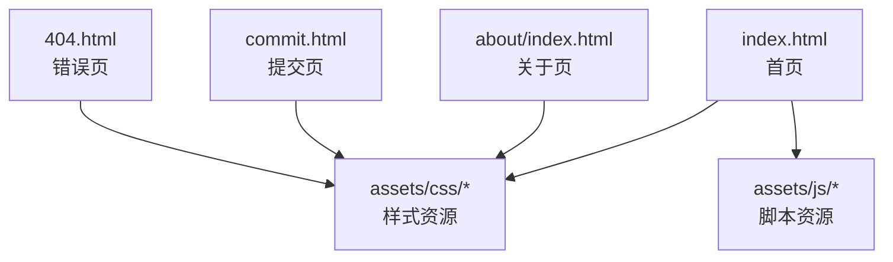
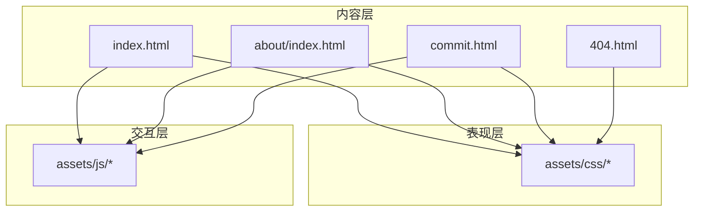
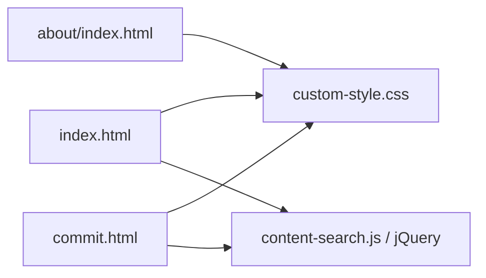

# 搜索引擎优化

<cite>
**本文引用的文件**
- [index.html](file://index.html)
- [about/index.html](file://about/index.html)
- [commit.html](file://commit.html)
- [404.html](file://404.html)
- [README.md](file://README.md)
- [assets/css/custom-style.css](file://assets/css/custom-style.css)
</cite>

## 目录
1. [简介](#简介)
2. [项目结构](#项目结构)
3. [核心组件](#核心组件)
4. [架构总览](#架构总览)
5. [详细组件分析](#详细组件分析)
6. [依赖关系分析](#依赖关系分析)
7. [性能考量](#性能考量)
8. [故障排查指南](#故障排查指南)
9. [结论](#结论)
10. [附录](#附录)

## 简介
本文件面向该静态导航站点的SEO优化，基于仓库中的HTML与样式文件，系统梳理当前已实现的元信息、移动端适配、错误页等基础能力，并给出结构化数据、站点地图、移动端索引优化以及主流站长工具（Google Search Console、百度站长平台）的配置与使用建议。文档同时提供可操作的检查清单与落地步骤，帮助快速提升收录与排名表现。

## 项目结构
本项目为纯静态站点，核心页面包括首页、关于页、提交页和404错误页；资源集中在 assets 目录下，包含CSS、JS与图标库。整体结构简单清晰，便于进行SEO基础配置与持续优化。

图表来源
- [index.html:1-35](file://index.html#L1-L35)
- [about/index.html:1-26](file://about/index.html#L1-L26)
- [commit.html:1-26](file://commit.html#L1-L26)
- [404.html:1-3](file://404.html#L1-L3)

章节来源
- [index.html:1-35](file://index.html#L1-L35)
- [about/index.html:1-26](file://about/index.html#L1-L26)
- [commit.html:1-26](file://commit.html#L1-L26)
- [404.html:1-3](file://404.html#L1-L3)
- [README.md:298-314](file://README.md#L298-L314)

## 核心组件
- 元信息与标题：各页面均设置了 charset、viewport、theme-color、title、keywords、description 等基础元标签，利于搜索引擎理解页面语言、渲染行为与摘要展示。
- 移动端适配：通过 viewport 设置与响应式布局，确保在移动设备上的可读性与交互体验。
- 错误处理：提供 404.html，便于用户与爬虫在找不到页面时获得友好提示。
- 资源组织：CSS/JS/图片等资源集中管理，便于缓存与压缩。

章节来源
- [index.html:7-15](file://index.html#L7-L15)
- [about/index.html:5-13](file://about/index.html#L5-L13)
- [commit.html:5-13](file://commit.html#L5-L13)
- [404.html:1-3](file://404.html#L1-L3)

## 架构总览
从SEO视角看，站点由“内容层（HTML）+ 表现层（CSS）+ 交互层（JS）”构成。当前实现以静态HTML为主，SEO优化重点在于：
- 完善元信息（标题、描述、关键词、语言、主题色）
- 添加结构化数据（JSON-LD 优先）
- 生成并提交站点地图（sitemap.xml）
- 强化移动端友好性（视口、字体、触控区域、首屏加载）
- 接入站长平台（Google Search Console、百度站长平台）

图表来源
- [index.html:17-31](file://index.html#L17-L31)
- [about/index.html:15-26](file://about/index.html#L15-L26)
- [commit.html:15-26](file://commit.html#L15-L26)

## 详细组件分析

### Meta 标签优化
- 标题标签（title）：每个页面均有独立且语义清晰的标题，建议保持简洁明确，突出核心价值与品牌词。
- 描述标签（description）：用于搜索结果摘要，应准确概括页面内容，长度适中，避免堆砌关键词。
- 关键词标签（keywords）：虽对排名影响有限，但可作为内部参考；建议精简、相关性强。
- 其他元信息：charset、viewport、theme-color 已正确设置，有利于跨浏览器兼容与移动端体验。

章节来源
- [index.html:12-15](file://index.html#L12-L15)
- [about/index.html:10-13](file://about/index.html#L10-L13)
- [commit.html:10-13](file://commit.html#L10-L13)

### 结构化数据配置
当前页面未内嵌结构化数据。建议采用 JSON-LD 格式，按页面类型添加：
- 网站根级：WebSite + SiteNavigationElement（站点导航）
- 首页：Organization 或 WebSite
- 列表/分类页：ItemList
- 文章/工具页：HowTo 或 SoftwareApplication（如适用）
- 面包屑：BreadcrumbList

实施要点：
- 将 JSON-LD 放置在 <head> 中，确保爬虫可抓取
- 字段完整、值真实有效，避免误导
- 定期校验（Google Rich Results Test、Baidu Structured Data Validator）

[本节为通用实践说明，不直接分析具体代码文件]

### 站点地图生成与维护
当前仓库未包含 sitemap.xml。建议：
- 生成 sitemap.xml，列出所有重要URL（首页、分类页、提交页、关于页等）
- 设置合理的 lastmod、priority、changefreq
- 在 robots.txt 中声明 sitemap 路径
- 提交至 Google Search Console 与百度站长平台

维护策略：
- 新增/删除页面后及时更新
- 使用增量更新或定时任务自动化
- 监控抓取状态与报错

[本节为通用实践说明，不直接分析具体代码文件]

### 移动端SEO优化
当前已具备基础移动端支持：
- viewport 设置合理，禁止缩放，保证首屏宽度与比例
- 响应式布局与媒体查询，适配不同屏幕尺寸
- 主题色与字体大小适合移动端阅读

进一步优化建议：
- 首屏关键CSS内联，减少阻塞
- 图片懒加载与WebP格式
- 触控目标尺寸不小于44px
- 避免阻塞渲染的第三方脚本延迟加载
- 使用 Lighthouse/Pagespeed Insights 检测并修复问题

章节来源
- [index.html:9-11](file://index.html#L9-L11)
- [about/index.html:7-9](file://about/index.html#L7-L9)
- [commit.html:7-9](file://commit.html#L7-L9)
- [assets/css/custom-style.css:1-126](file://assets/css/custom-style.css#L1-L126)

### SEO分析工具配置与使用
- Google Search Console
  - 验证站点所有权（DNS记录、HTML文件、GTM/GA等）
  - 提交 sitemap.xml
  - 检查索引覆盖、安全问题和手动操作
  - 使用“网址检查”与“性能报告”定位问题
- 百度站长平台
  - 站点接入与验证
  - 提交 sitemap.xml 与主动推送
  - 查看抓取诊断、索引量、搜索词
  - 使用“移动适配”与“健康度检测”

[本节为通用实践说明，不直接分析具体代码文件]

## 依赖关系分析
- 页面与样式：各HTML页面通过 link 引入统一样式，便于全局SEO一致性控制（如字体、颜色、布局）。
- 页面与脚本：首页与提交页引用jQuery与业务脚本，注意脚本加载顺序与异步化，避免阻塞首屏。
- 外部资源：Font Awesome、天气插件等第三方资源，建议使用预连接与按需加载，降低首屏耗时。

图表来源
- [index.html:17-31](file://index.html#L17-L31)
- [about/index.html:15-26](file://about/index.html#L15-L26)
- [commit.html:15-26](file://commit.html#L15-L26)

章节来源
- [index.html:17-31](file://index.html#L17-L31)
- [about/index.html:15-26](file://about/index.html#L15-L26)
- [commit.html:15-26](file://commit.html#L15-L26)

## 性能考量
- 首屏渲染：合并与压缩CSS/JS，启用Gzip/Brotli，开启HTTP缓存
- 图片优化：使用WebP/AVIF，设置合适的宽高与alt文本，懒加载非首屏图片
- 第三方脚本：延迟加载、异步执行，避免阻塞解析
- 服务器配置：Nginx开启gzip、缓存静态资源、设置过期时间
- 监控与测试：Lighthouse、Pagespeed Insights、WebPageTest

[本节为通用实践说明，不直接分析具体代码文件]

## 故障排查指南
- 404页面：确认服务器已正确返回404状态码并指向 404.html，避免软404
- 资源加载失败：检查相对路径与CDN域名是否正确，控制台是否有CORS或404错误
- 移动端异常：使用开发者工具的移动端模拟器检查布局与交互
- 搜索引擎抓取：在Search Console/百度站长平台查看抓取日志与报错

章节来源
- [404.html:1-3](file://404.html#L1-L3)
- [README.md:104-115](file://README.md#L104-L115)

## 结论
该项目已具备基础的SEO元信息与移动端适配能力。下一步建议优先完成结构化数据（JSON-LD）、站点地图（sitemap.xml）与站长平台接入，并结合性能优化与持续监控，稳步提升收录质量与搜索可见性。

[本节为总结性内容，不直接分析具体代码文件]

## 附录
- 检查清单
  - 每页唯一且准确的 title、description、keywords
  - 正确的 lang、viewport、theme-color
  - 图片 alt 文本与尺寸
  - 链接 rel="canonical" 与 rel="nofollow" 合理使用
  - robots.txt 与 sitemap.xml 存在并可访问
  - 结构化数据通过校验
  - 在Google Search Console与百度站长平台完成验证与提交
  - 移动端可用性良好，无遮挡与过小点击目标
  - 首屏加载时间达标，无阻塞资源

[本节为通用实践说明，不直接分析具体代码文件]