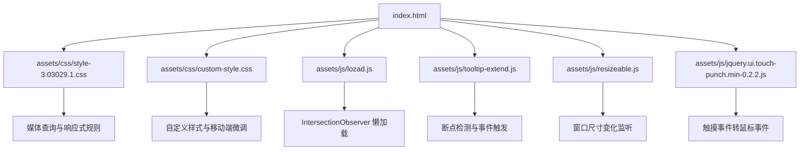
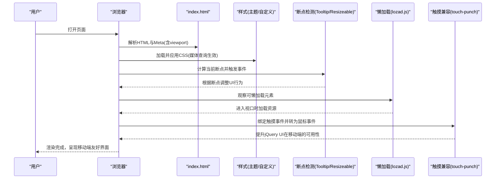
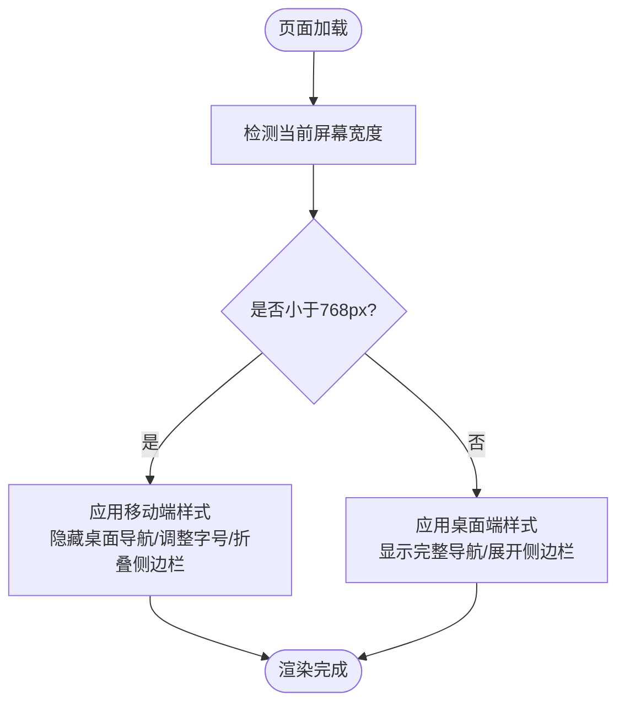
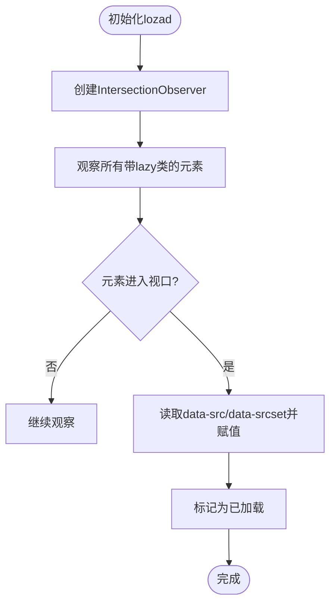
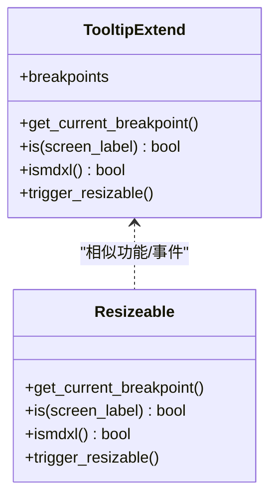
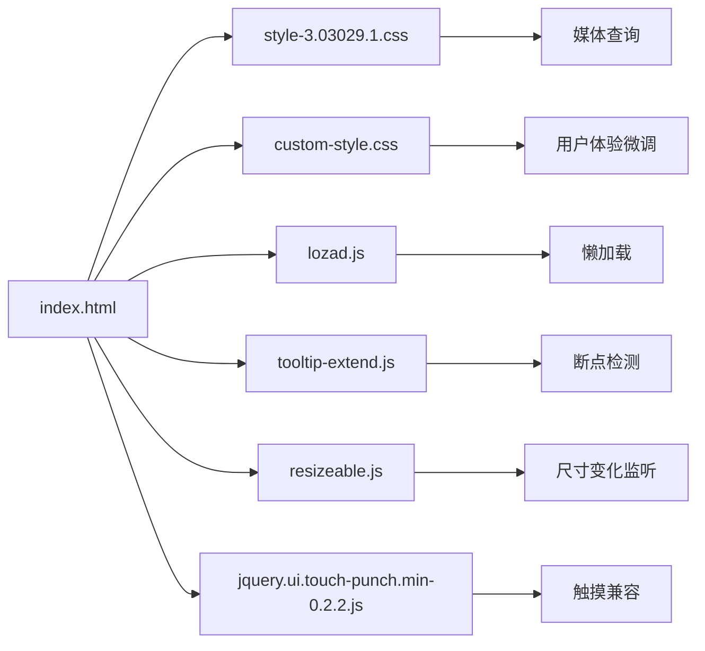

# 移动端SEO优化

<cite>
**本文引用的文件**
- [index.html](file://index.html)
- [custom-style.css](file://assets/css/custom-style.css)
- [style-3.03029.1.css](file://assets/css/style-3.03029.1.css)
- [lozad.js](file://assets/js/lozad.js)
- [tooltip-extend.js](file://assets/js/tooltip-extend.js)
- [resizeable.js](file://assets/js/resizeable.js)
- [jquery.ui.touch-punch.min-0.2.2.js](file://assets/js/jquery.ui.touch-punch.min-0.2.2.js)
- [README.md](file://README.md)
</cite>

## 目录
1. [简介](#简介)
2. [项目结构](#项目结构)
3. [核心组件](#核心组件)
4. [架构总览](#架构总览)
5. [详细组件分析](#详细组件分析)
6. [依赖关系分析](#依赖关系分析)
7. [性能考量](#性能考量)
8. [故障排查指南](#故障排查指南)
9. [结论](#结论)
10. [附录：移动端SEO检查清单与最佳实践](#附录移动端seo检查清单与最佳实践)

## 简介
本文件面向“移动端SEO优化”，结合仓库中的实际实现，系统阐述移动设备友好的网站优化策略。内容覆盖响应式设计（viewport、媒体查询、弹性布局）、移动优先索引配置要点、页面加载速度优化（图片压缩、代码精简、资源懒加载）、用户体验优化（触摸交互、字体大小、按钮尺寸），以及Google Mobile-Friendly测试工具的使用方法与移动端SEO检查清单和最佳实践建议。

## 项目结构
本项目为纯静态站点，采用HTML+CSS+JS构建，使用Bootstrap栅格与自定义样式实现响应式布局，并通过JavaScript库实现移动端交互与性能优化。关键入口与资源组织如下：
- 入口页面：index.html（包含meta、资源引用、导航与内容区块）
- 样式：assets/css 下的主题样式与自定义样式
- 脚本：assets/js 下的交互、响应式断点检测、懒加载与触摸兼容等
- 图标与字体：assets/fontawesome-5.15.4
- 图片资源：assets/images

图表来源
- [index.html:1-35](file://index.html#L1-L35)
- [style-3.03029.1.css:143-163](file://assets/css/style-3.03029.1.css#L143-L163)
- [custom-style.css:1-126](file://assets/css/custom-style.css#L1-L126)
- [lozad.js:117-169](file://assets/js/lozad.js#L117-L169)
- [tooltip-extend.js:5-12](file://assets/js/tooltip-extend.js#L5-L12)
- [resizeable.js:90-122](file://assets/js/resizeable.js#L90-L122)
- [jquery.ui.touch-punch.min-0.2.2.js:1-11](file://assets/js/jquery.ui.touch-punch.min-0.2.2.js#L1-L11)

章节来源
- [index.html:1-35](file://index.html#L1-L35)
- [README.md:298-314](file://README.md#L298-L314)

## 核心组件
- 视口与元信息：在入口HTML中设置viewport、主题色、标题、描述与关键词，确保搜索引擎正确理解页面内容与移动端适配。
- 响应式样式：通过Bootstrap栅格与自定义CSS的媒体查询，在不同屏幕宽度下调整布局、字号与间距。
- 懒加载：使用lozad.js基于IntersectionObserver实现图片等资源按需加载，降低首屏负载。
- 断点检测与交互：通过tooltip-extend.js与resizeable.js进行断点判断与窗口尺寸变化监听，驱动UI行为切换。
- 触摸兼容：引入touch-punch将触摸事件转换为鼠标事件，提升jQuery UI在移动端的兼容性。

章节来源
- [index.html:7-15](file://index.html#L7-L15)
- [style-3.03029.1.css:143-163](file://assets/css/style-3.03029.1.css#L143-L163)
- [lozad.js:117-169](file://assets/js/lozad.js#L117-L169)
- [tooltip-extend.js:5-12](file://assets/js/tooltip-extend.js#L5-L12)
- [resizeable.js:90-122](file://assets/js/resizeable.js#L90-L122)
- [jquery.ui.touch-punch.min-0.2.2.js:1-11](file://assets/js/jquery.ui.touch-punch.min-0.2.2.js#L1-L11)

## 架构总览
下图展示了移动端SEO相关的关键流程：从页面初始化到样式应用、断点检测、懒加载执行与触摸交互处理。

图表来源
- [index.html:7-15](file://index.html#L7-L15)
- [style-3.03029.1.css:143-163](file://assets/css/style-3.03029.1.css#L143-L163)
- [tooltip-extend.js:5-12](file://assets/js/tooltip-extend.js#L5-L12)
- [resizeable.js:90-122](file://assets/js/resizeable.js#L90-L122)
- [lozad.js:117-169](file://assets/js/lozad.js#L117-L169)
- [jquery.ui.touch-punch.min-0.2.2.js:1-11](file://assets/js/jquery.ui.touch-punch.min-0.2.2.js#L1-L11)

## 详细组件分析

### 视口与元信息（移动端基础）
- viewport设置：在入口HTML中声明viewport，控制缩放与宽度，确保移动端正确渲染。
- 主题色与描述：设置theme-color、title、description与keywords，利于搜索引擎抓取与展示。
- 资源引用：按顺序引入样式与脚本，减少阻塞与重排。

章节来源
- [index.html:7-15](file://index.html#L7-L15)
- [index.html:17-31](file://index.html#L17-L31)

### 响应式设计（媒体查询与弹性布局）
- 媒体查询断点：在主题样式中定义多档断点，针对小屏隐藏或调整导航、侧边栏与字号等。
- 弹性布局：使用flex布局与Bootstrap栅格，使卡片与内容在不同屏幕下自适应排列。
- 移动端菜单：在小屏下隐藏桌面端导航，提供移动端菜单入口，提升可访问性。

图表来源
- [style-3.03029.1.css:143-163](file://assets/css/style-3.03029.1.css#L143-L163)
- [style-3.03029.1.css:157-163](file://assets/css/style-3.03029.1.css#L157-L163)
- [custom-style.css:1-126](file://assets/css/custom-style.css#L1-L126)

章节来源
- [style-3.03029.1.css:143-163](file://assets/css/style-3.03029.1.css#L143-L163)
- [custom-style.css:1-126](file://assets/css/custom-style.css#L1-L126)

### 资源懒加载（性能优化）
- IntersectionObserver：lozad.js利用IntersectionObserver监听元素进入视口，按需加载图片与背景图。
- data-src与srcset：通过data-src与data-srcset属性延迟加载，支持不同分辨率的资源选择。
- 降级策略：在不支持IntersectionObserver的环境中直接加载，保证兼容性。

图表来源
- [lozad.js:117-169](file://assets/js/lozad.js#L117-L169)

章节来源
- [lozad.js:117-169](file://assets/js/lozad.js#L117-L169)

### 断点检测与交互（移动端行为）
- 断点定义：tooltip-extend.js定义了多档断点（如large/tablet/device/s-device）。
- 尺寸变化监听：resizeable.js监听窗口尺寸变化，触发对应逻辑与事件。
- 事件触发：在断点变化时触发自定义事件，供其他模块响应。

图表来源
- [tooltip-extend.js:5-12](file://assets/js/tooltip-extend.js#L5-L12)
- [resizeable.js:90-122](file://assets/js/resizeable.js#L90-L122)

章节来源
- [tooltip-extend.js:5-12](file://assets/js/tooltip-extend.js#L5-L12)
- [resizeable.js:90-122](file://assets/js/resizeable.js#L90-L122)

### 触摸交互兼容（提升移动端体验）
- touch-punch：将触摸事件转换为鼠标事件，使jQuery UI在移动端可用。
- 适用场景：拖拽、点击、悬停等交互在触屏设备上更自然。

章节来源
- [jquery.ui.touch-punch.min-0.2.2.js:1-11](file://assets/js/jquery.ui.touch-punch.min-0.2.2.js#L1-L11)

## 依赖关系分析
- index.html依赖主题样式与自定义样式，用于布局与视觉呈现。
- 样式层依赖媒体查询与弹性布局，支撑响应式行为。
- 脚本层依赖断点检测、懒加载与触摸兼容，增强交互与性能。
- 各脚本之间通过事件与全局变量协作，避免强耦合。

图表来源
- [index.html:17-31](file://index.html#L17-L31)
- [style-3.03029.1.css:143-163](file://assets/css/style-3.03029.1.css#L143-L163)
- [custom-style.css:1-126](file://assets/css/custom-style.css#L1-L126)
- [lozad.js:117-169](file://assets/js/lozad.js#L117-L169)
- [tooltip-extend.js:5-12](file://assets/js/tooltip-extend.js#L5-L12)
- [resizeable.js:90-122](file://assets/js/resizeable.js#L90-L122)
- [jquery.ui.touch-punch.min-0.2.2.js:1-11](file://assets/js/jquery.ui.touch-punch.min-0.2.2.js#L1-L11)

章节来源
- [index.html:17-31](file://index.html#L17-L31)
- [style-3.03029.1.css:143-163](file://assets/css/style-3.03029.1.css#L143-L163)
- [custom-style.css:1-126](file://assets/css/custom-style.css#L1-L126)
- [lozad.js:117-169](file://assets/js/lozad.js#L117-L169)
- [tooltip-extend.js:5-12](file://assets/js/tooltip-extend.js#L5-L12)
- [resizeable.js:90-122](file://assets/js/resizeable.js#L90-L122)
- [jquery.ui.touch-punch.min-0.2.2.js:1-11](file://assets/js/jquery.ui.touch-punch.min-0.2.2.js#L1-L11)

## 性能考量
- 首屏优化：通过viewport与合理的资源加载顺序，减少阻塞；使用媒体查询仅加载必要样式。
- 图片优化：使用懒加载与data-src延迟加载图片，结合srcset提供多分辨率资源，降低带宽占用。
- 代码精简：主题样式与脚本均为压缩版本，减少传输体积。
- 缓存策略：参考部署文档中的静态资源缓存配置，提升重复访问性能。

章节来源
- [index.html:17-31](file://index.html#L17-L31)
- [lozad.js:117-169](file://assets/js/lozad.js#L117-L169)
- [README.md:96-116](file://README.md#L96-L116)

## 故障排查指南
- 图片或样式加载失败：检查资源路径是否正确，确保相对路径引用准确。
- 移动端菜单不显示：确认媒体查询断点与样式是否生效，检查是否有遮挡或z-index问题。
- 懒加载未触发：验证元素是否带有lazy类与data-src，确认IntersectionObserver是否被调用。
- 触摸交互异常：确认touch-punch已加载且jQuery UI事件绑定正常。

章节来源
- [README.md:316-341](file://README.md#L316-L341)
- [lozad.js:117-169](file://assets/js/lozad.js#L117-L169)
- [jquery.ui.touch-punch.min-0.2.2.js:1-11](file://assets/js/jquery.ui.touch-punch.min-0.2.2.js#L1-L11)

## 结论
本项目在移动端SEO方面具备良好基础：正确的viewport与元信息、完善的媒体查询与弹性布局、高效的懒加载与触摸兼容。建议在后续迭代中持续优化图片资源、精简代码、完善移动端交互细节，并使用Google Mobile-Friendly测试工具进行验证与改进。

## 附录：移动端SEO检查清单与最佳实践
- 视口与元信息
  - 设置viewport为设备宽度与初始缩放，禁止不必要的缩放
  - 完善title、description、keywords与theme-color
  - 确保语言与字符编码正确
- 响应式设计
  - 使用媒体查询覆盖常见断点（手机、平板、桌面）
  - 采用弹性布局与栅格系统，保证内容自适应
  - 在小屏隐藏非关键导航，提供移动端菜单入口
- 移动优先索引
  - 确保移动端与桌面端内容一致，避免隐藏重要内容
  - 使用规范的语义化标签与结构化数据
  - 提交站点地图并监控抓取状态
- 页面加载速度
  - 图片压缩与格式优化（WebP/AVIF）
  - 使用懒加载与预加载策略
  - 启用Gzip/Brotli压缩与HTTP缓存
  - 最小化与合并CSS/JS，移除冗余代码
- 用户体验优化
  - 触摸目标尺寸不小于44x44像素
  - 合理字体大小与行高，确保可读性
  - 避免悬浮悬停依赖，提供点击替代
  - 优化滚动与动画性能，减少重排重绘
- Google Mobile-Friendly测试工具
  - 使用在线工具检测页面是否符合移动端友好标准
  - 关注提示项：视口设置、字体大小、链接间距、弹窗拦截等
  - 根据报告逐项修复并复测

[本节为通用指导，不直接分析具体文件]