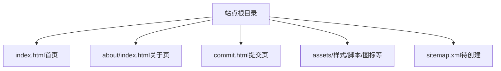
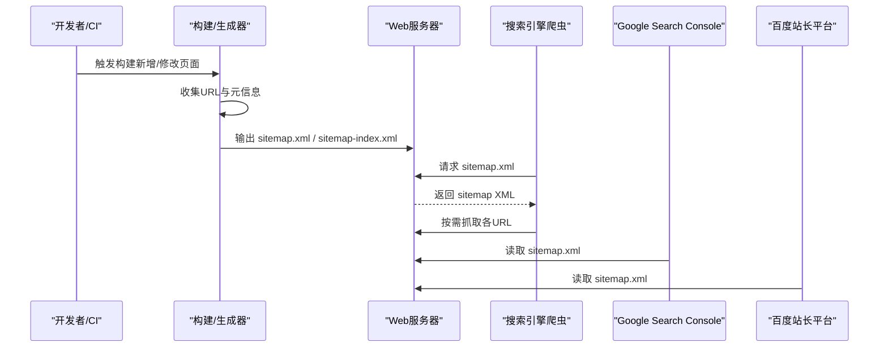
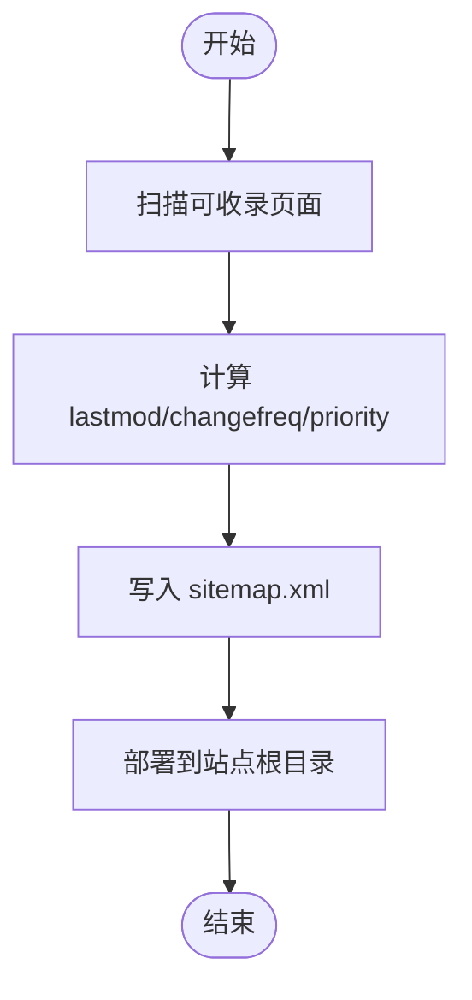
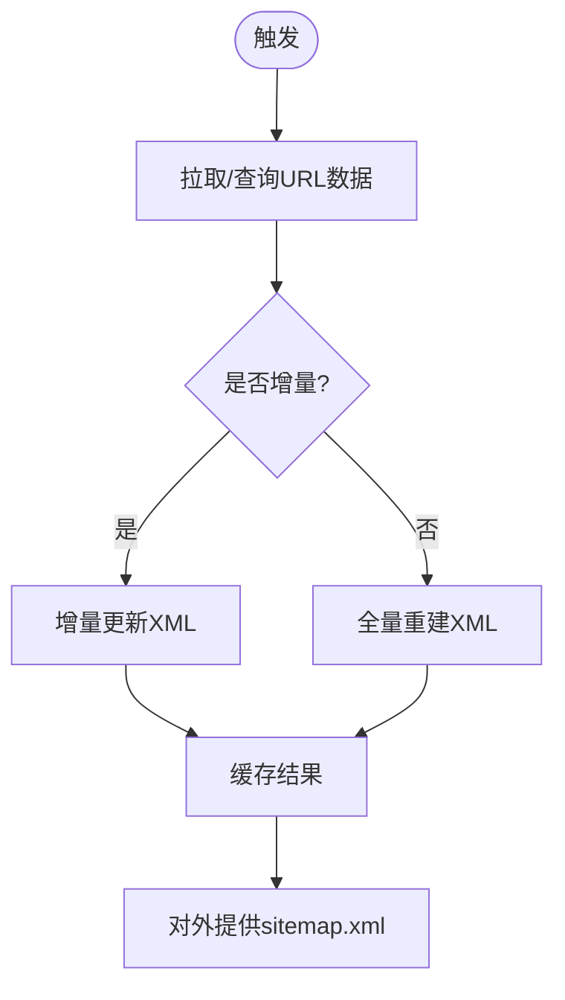
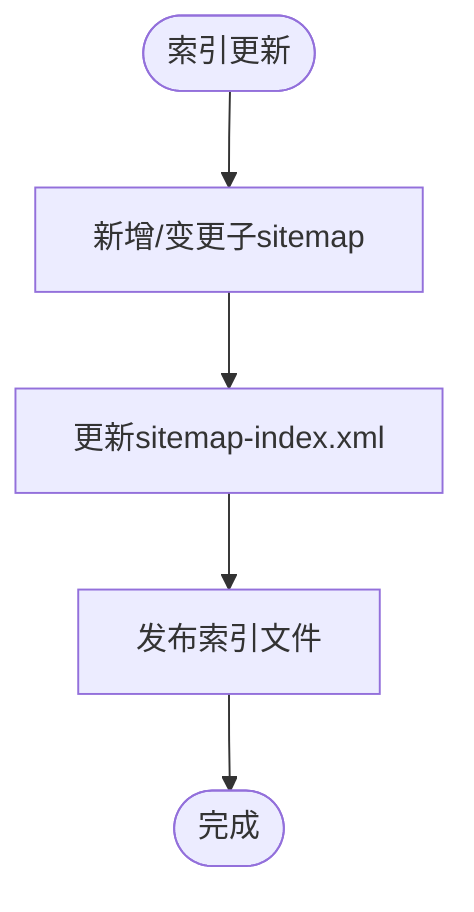

# 站点地图生成

<cite>
**本文引用的文件**
- [README.md](file://README.md)
- [Readme-en.md](file://Readme-en.md)
- [index.html](file://index.html)
- [about/index.html](file://about/index.html)
- [commit.html](file://commit.html)
</cite>

## 目录
1. [简介](#简介)
2. [项目结构](#项目结构)
3. [核心组件](#核心组件)
4. [架构总览](#架构总览)
5. [详细组件分析](#详细组件分析)
6. [依赖关系分析](#依赖关系分析)
7. [性能考量](#性能考量)
8. [故障排查指南](#故障排查指南)
9. [结论](#结论)
10. [附录](#附录)

## 简介
本文件面向静态站点（HTML + CSS + JavaScript）的站点地图（sitemap.xml）创建、配置与维护，覆盖标准格式与字段说明、静态与动态两种生成方案、搜索引擎提交方法（Google Search Console 与百度站长平台）、大型网站的索引文件（sitemap index）策略，以及验证工具与常见问题处理。本项目为纯静态网站，未包含 sitemap.xml 或后端服务，因此文档提供从零搭建与落地的完整实践路径，并结合项目现有页面结构给出落地建议。

## 项目结构
当前仓库是一个纯静态导航站，主要入口包括首页、关于页和提交页；资源集中在 assets 目录。站点地图属于 SEO 基础设施，通常以根目录下的 sitemap.xml 暴露给搜索引擎爬虫。

图表来源
- [index.html:1-35](file://index.html#L1-L35)
- [about/index.html:1-20](file://about/index.html#L1-L20)
- [commit.html:1-20](file://commit.html#L1-L20)

章节来源
- [README.md:298-314](file://README.md#L298-L314)

## 核心组件
- 站点地图（sitemap.xml）：声明站点可被爬取的 URL 集合及元信息（最后修改时间、优先级、更新频率）。
- 站点地图索引（sitemap-index.xml）：当站点规模较大时，将多个 sitemap 聚合到一个索引文件中，便于管理。
- 构建/生成器：根据站点内容（静态页面列表或数据库/接口数据）生成 sitemap 或 sitemap index。
- 部署与缓存：确保 sitemap 可被搜索引擎稳定访问，并合理设置缓存策略。
- 提交与监控：在 Google Search Console 与百度站长平台提交 sitemap，并监控抓取状态。

章节来源
- [README.md:336-341](file://README.md#L336-L341)
- [Readme-en.md:372-377](file://Readme-en.md#L372-L377)

## 架构总览
下图展示静态站点中 sitemap 的典型工作流：构建阶段生成 sitemap.xml，部署后由搜索引擎抓取，并在需要时通过索引文件指向多个子 sitemap。

图表来源
- [index.html:1-35](file://index.html#L1-L35)
- [about/index.html:1-20](file://about/index.html#L1-L20)
- [commit.html:1-20](file://commit.html#L1-L20)

## 详细组件分析

### 1) XML 站点地图标准格式与字段规范
- 根元素与命名空间：使用 sitemap 协议的标准命名空间。
- URL 条目：每个 <url> 包含一个 <loc>（绝对地址），可选字段包括：
  - <lastmod>：最后修改时间（W3C DateTime 格式）
  - <changefreq>：更新频率（如 daily、weekly、monthly、yearly、never 等）
  - <priority>：相对优先级（0.0~1.0）
- 编码与大小限制：UTF-8 编码；单个 sitemap 不超过 50MB 或 50,000 个 URL。
- 多语言与移动端：如需标注多语言版本或移动适配，可使用扩展标签（如 hreflang、xhtml:link）。

章节来源
- [README.md:336-341](file://README.md#L336-L341)
- [Readme-en.md:372-377](file://Readme-en.md#L372-L377)

### 2) 静态站点地图生成（适用于固定内容网站）
适用场景：页面数量稳定、变更不频繁，适合在构建期生成 sitemap.xml。

实现要点
- 收集页面清单：从项目结构中扫描所有可公开访问的 HTML 页面（如 index.html、about/index.html、commit.html）。
- 填充元信息：为每个 URL 设置 lastmod（基于文件修改时间或发布版本）、changefreq（按页面类型设定）、priority（按重要性分级）。
- 输出文件：生成 sitemap.xml 并放置于站点根目录，确保可通过 https://yourdomain.com/sitemap.xml 访问。
- 构建集成：在 CI/CD 流程中加入 sitemap 生成步骤，保证每次发布都更新。

流程图（概念性）

[此图为概念流程图，无需代码映射]

### 3) 动态站点地图生成（适用于内容频繁更新的网站）
适用场景：页面随业务数据变化而频繁增减，适合运行时或定时任务生成。

实现要点
- 数据源：从数据库、CMS 或 API 获取最新 URL 列表与元信息。
- 生成策略：
  - 实时生成：在请求 sitemap.xml 时即时拼装 XML（注意缓存与限流）。
  - 定时生成：通过 Cron/任务队列定期生成并持久化到静态存储。
- 增量更新：仅对新增/修改的 URL 进行更新，减少生成开销。
- 大站点拆分：超过阈值时使用 sitemap index 拆分多个子 sitemap。

流程图（概念性）

[此图为概念流程图，无需代码映射]

### 4) 站点地图索引文件（sitemap index）
当站点规模较大时，建议使用 sitemap index 将多个 sitemap 聚合管理。

要点
- 索引文件：sitemap-index.xml，包含多个 <sitemap><loc>...</loc></sitemap> 条目。
- 拆分策略：按模块、域名、语言或更新时间维度拆分。
- 维护方式：新增 sitemap 时同步更新索引；删除 sitemap 时移除对应条目。

流程图（概念性）

[此图为概念流程图，无需代码映射]

### 5) 提交到搜索引擎（Google Search Console 与百度站长平台）
- Google Search Console
  - 登录控制台，选择站点属性。
  - 进入“站点地图”页面，输入 sitemap.xml 的完整 URL 并提交。
  - 查看抓取状态与错误报告，必要时调整 sitemap 或修复链接。
- 百度站长平台
  - 登录百度站长平台，添加站点并完成验证。
  - 在“站点地图”功能中提交 sitemap.xml 的完整 URL。
  - 关注抓取日志与问题提示，持续优化。

章节来源
- [README.md:336-341](file://README.md#L336-L341)
- [Readme-en.md:372-377](file://Readme-en.md#L372-L377)

### 6) 验证工具与常见问题
- 在线校验：使用 W3C Sitemap Validator 或第三方工具校验 XML 语法与协议合规性。
- 常见错误
  - 无法访问：检查 robots.txt 是否屏蔽了 sitemap.xml。
  - 编码错误：确保 UTF-8 编码且无 BOM。
  - 超大文件：超过 50MB 或 50,000 条 URL 需拆分或使用索引。
  - 无效链接：确保 <loc> 为绝对地址且可达。
  - 缓存导致旧内容：适当设置 Cache-Control 或版本号参数。
- 调试建议：在浏览器直接访问 sitemap.xml 查看响应；结合搜索引擎抓取日志定位问题。

章节来源
- [README.md:336-341](file://README.md#L336-L341)
- [Readme-en.md:372-377](file://Readme-en.md#L372-L377)

## 依赖关系分析
- 页面与 sitemap 的关系：sitemap 中的 URL 应来源于实际可访问的页面（如 index.html、about/index.html、commit.html）。
- 构建与部署：sitemap 应在构建阶段生成并随静态资源一同部署。
- 搜索引擎：Google 与百度通过抓取 sitemap.xml 发现并索引页面。

图表来源
- [index.html:1-35](file://index.html#L1-L35)
- [about/index.html:1-20](file://about/index.html#L1-L20)
- [commit.html:1-20](file://commit.html#L1-L20)

章节来源
- [README.md:298-314](file://README.md#L298-L314)

## 性能考量
- 生成效率：静态站点可在构建期一次性生成；动态站点建议缓存生成的 XML，避免重复计算。
- 传输体积：控制 sitemap 大小，必要时拆分或使用索引。
- 缓存策略：对 sitemap.xml 设置合理的 Cache-Control，平衡新鲜度与带宽消耗。
- 压缩：启用 gzip/br 压缩（Nginx 已支持 text/xml 类型压缩）。

章节来源
- [README.md:86-116](file://README.md#L86-L116)

## 故障排查指南
- 无法抓取：确认 robots.txt 未禁止抓取 sitemap.xml；检查服务器返回码与 MIME 类型。
- 链接失效：逐一检查 <loc> 地址是否可达，修正死链。
- 更新延迟：检查 lastmod 是否正确设置；清理 CDN/代理缓存。
- 索引异常：核对 sitemap-index.xml 中各子 sitemap 的可访问性与完整性。
- 统计与监控：结合搜索引擎控制台抓取日志与错误报告进行定位。

章节来源
- [README.md:336-341](file://README.md#L336-L341)
- [Readme-en.md:372-377](file://Readme-en.md#L372-L377)

## 结论
对于本项目的纯静态站点，推荐在构建阶段生成 sitemap.xml，并在 CI/CD 中自动发布到站点根目录；若未来扩展为动态站点，可采用运行时或定时任务生成，并结合索引文件管理大规模 URL。配合 Google Search Console 与百度站长平台的提交与监控，可有效提升站点收录与检索质量。

## 附录
- 快速检查清单
  - sitemap.xml 位于站点根目录并可公网访问
  - 所有 <loc> 为绝对地址且可达
  - lastmod 准确反映页面变更
  - changefreq 与 priority 符合页面特性
  - 单文件不超过 50MB/50,000 条 URL
  - 已在 Google 与百度提交 sitemap
  - robots.txt 未屏蔽 sitemap.xml
  - 启用 gzip 压缩并设置合理缓存

章节来源
- [README.md:336-341](file://README.md#L336-L341)
- [Readme-en.md:372-377](file://Readme-en.md#L372-L377)