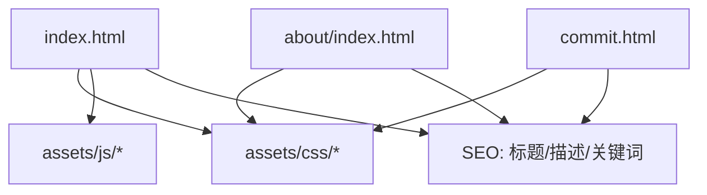
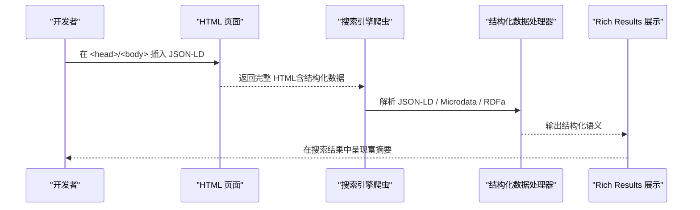
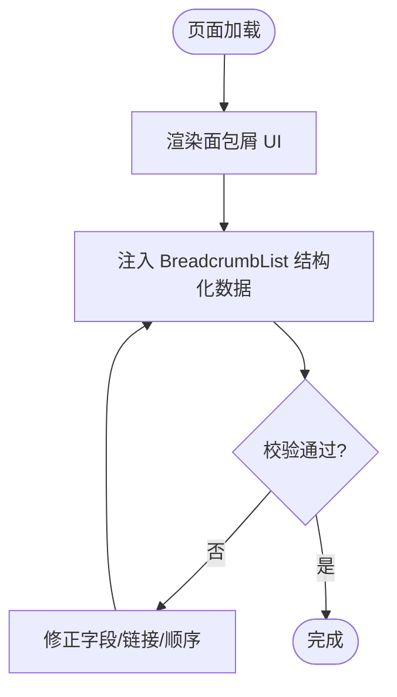
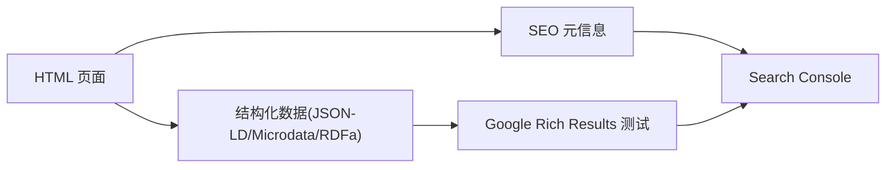

# 结构化数据

<cite>
**本文引用的文件**   
- [index.html](file://index.html)
- [about/index.html](file://about/index.html)
- [commit.html](file://commit.html)
- [README.md](file://README.md)
</cite>

## 目录
1. [简介](#简介)
2. [项目结构](#项目结构)
3. [核心组件](#核心组件)
4. [架构总览](#架构总览)
5. [详细组件分析](#详细组件分析)
6. [依赖关系分析](#依赖关系分析)
7. [性能与可维护性建议](#性能与可维护性建议)
8. [故障排查指南](#故障排查指南)
9. [结论](#结论)
10. [附录：实施清单与示例位置指引](#附录：实施清单与示例位置指引)

## 简介
本文件面向希望在网站中通过结构化数据提升搜索引擎理解能力与搜索结果展示效果的读者。结合当前仓库中的静态页面（首页、关于页、提交页），提供基于 JSON-LD、Microdata、RDFa 三种主流格式的实施指导，覆盖 WebSite、Organization、BreadcrumbList 等常用类型，并给出在 Google Rich Results 测试工具中的验证方法。文档同时说明不同格式的适用场景与选择原则，帮助在不同技术栈和发布流程下做出合理决策。

## 项目结构
本项目为纯静态站点，主要入口包括：
- 首页 index.html：导航与内容聚合页，适合放置站点级结构化数据（如 WebSite）与面包屑（BreadcrumbList）。
- 关于页 about/index.html：组织/个人介绍页，适合放置 Organization 或 Person 等实体信息。
- 提交页 commit.html：表单交互页，通常不承载结构化数据，但可作为 SEO 元信息优化点。
- README.md：部署与二次开发说明，包含 SEO 优化建议条目。

图表来源
- [index.html:1-35](file://index.html#L1-L35)
- [about/index.html:1-26](file://about/index.html#L1-L26)
- [commit.html:1-26](file://commit.html#L1-L26)

章节来源
- [index.html:1-35](file://index.html#L1-L35)
- [about/index.html:1-26](file://about/index.html#L1-L26)
- [commit.html:1-26](file://commit.html#L1-L26)
- [README.md:336-341](file://README.md#L336-L341)

## 核心组件
- 站点级信息：WebSite（名称、URL、搜索框 URL、图标等）
- 组织信息：Organization（名称、Logo、联系方式、社交账号等）
- 面包屑导航：BreadcrumbList（层级路径、名称、链接）
- 页面级元信息：title、meta description、keywords（配合结构化数据增强可读性与索引）

上述三类是提升搜索引擎理解与富摘要展示的基础构件。对于导航类站点，建议在首页实现 WebSite + BreadcrumbList；在“关于”页实现 Organization；在多级分类页补充 BreadcrumbList。

章节来源
- [README.md:336-341](file://README.md#L336-L341)

## 架构总览
下图展示了结构化数据在页面中的注入位置与数据流向：开发者在 HTML 的 <head> 或 <body> 中嵌入 JSON-LD 脚本块，搜索引擎爬虫解析后将其与可见内容关联，用于生成富摘要（如站点搜索框、面包屑路径、组织信息等）。

图表来源
- [index.html:1-35](file://index.html#L1-L35)
- [about/index.html:1-26](file://about/index.html#L1-L26)

## 详细组件分析

### JSON-LD 实施方案（推荐）
JSON-LD 以独立脚本块形式嵌入页面，便于集中管理、版本控制与动态注入，且对页面 DOM 无侵入，推荐作为首选方案。

- WebSite
  - 适用位置：首页 <head> 或 <body>
  - 关键属性：name、url、potentialAction（SearchAction，含 target 与 query 占位符）、image（可选）
  - 收益：在搜索结果中显示站点搜索框，提升点击率

- Organization
  - 适用位置：关于页 or 首页底部
  - 关键属性：name、url、logo、contactPoint、sameAs（社交账号）
  - 收益：增强品牌识别，有助于知识图谱关联

- BreadcrumbList
  - 适用位置：各内容页顶部
  - 关键属性：itemListElement（每个 item 含 name、position、item）
  - 收益：在搜索结果中显示清晰的路径层级

- 其他常见类型（按需扩展）
  - Article、FAQPage、HowTo、Product、Event 等，依据页面内容选择

实施要点
- 使用 https://schema.org 命名空间
- 确保 JSON 语法正确，避免注释与尾逗号
- 字段值尽量使用绝对 URL
- 与页面可见内容保持一致，避免误导

章节来源
- [index.html:1-35](file://index.html#L1-L35)
- [about/index.html:1-26](file://about/index.html#L1-L26)

### Microdata 实施方案
Microdata 将结构化标记直接嵌入 HTML 元素中，适合已有丰富语义化标签的场景。

- 典型用法
  - 使用 itemscope、itemtype、itemprop 标注实体与属性
  - 适用于列表项、文章、产品等结构的细粒度标注
- 优点
  - 与 HTML 紧密耦合，利于局部更新
- 缺点
  - 易受模板重构影响；多实体时维护成本较高

选择原则
- 若团队已大量使用语义化 HTML 且变更频繁，Microdata 更贴近视图层
- 若追求解耦与集中管理，优先 JSON-LD

章节来源
- [index.html:1-35](file://index.html#L1-L35)
- [about/index.html:1-26](file://about/index.html#L1-L26)

### RDFa 实施方案
RDFa 通过在 HTML 中添加属性来表达资源与关系，适合需要表达复杂语义关系的场景（如知识图谱构建）。

- 典型用法
  - 使用 prefix、property、typeof、resource 等属性
- 适用场景
  - 学术/百科/机构站点，强调实体间关系
- 注意
  - 学习曲线较陡；需关注浏览器兼容与工具链支持

章节来源
- [index.html:1-35](file://index.html#L1-L35)
- [about/index.html:1-26](file://about/index.html#L1-L26)

### 导航面包屑的结构化数据实现
面包屑能显著提升搜索结果的可读性与点击意愿。

- 推荐格式：JSON-LD 的 BreadcrumbList
- 关键步骤
  - 在页面顶部渲染面包屑 UI
  - 在对应位置添加 BreadcrumbList 结构化数据
  - 保证每个 item 的 name 与可见文本一致，item 的 item 指向实际 URL
- 效果
  - 搜索结果中显示“首页 > 分类 > 子分类 > 当前页”

图表来源
- [index.html:1-35](file://index.html#L1-L35)

章节来源
- [index.html:1-35](file://index.html#L1-L35)

### 网站组织信息的结构化数据配置
在“关于”页或首页底部加入 Organization，统一对外品牌信息。

- 关键字段
  - name：组织名称
  - url：官网地址
  - logo：Logo 图片 URL
  - contactPoint：客服邮箱/电话
  - sameAs：社交媒体主页链接
- 最佳实践
  - 与页面可见信息一致
  - Logo 尺寸规范，URL 可访问
  - 社交账号链接使用 HTTPS

章节来源
- [about/index.html:1-26](file://about/index.html#L1-L26)

### Google Rich Results 测试工具使用方法
- 打开 Google Rich Results 测试工具
- 输入目标页面 URL 或直接粘贴 HTML 源码
- 运行检测，查看是否识别到预期结构化数据类型（如 WebSite、BreadcrumbList、Organization）
- 根据提示修复错误与警告，直至全部通过
- 上线后使用 Google Search Console 的“网址检查”与“增强功能”报告持续监控

章节来源
- [README.md:336-341](file://README.md#L336-L341)

## 依赖关系分析
- 页面与结构化数据的耦合度低（尤其 JSON-LD），便于独立迭代
- 与 SEO 元信息（title、description、keywords）协同工作，形成完整的检索信号
- 与外部工具（Google Rich Results、Search Console）形成闭环验证与反馈

图表来源
- [index.html:1-35](file://index.html#L1-L35)
- [about/index.html:1-26](file://about/index.html#L1-L26)
- [commit.html:1-26](file://commit.html#L1-L26)

章节来源
- [index.html:1-35](file://index.html#L1-L35)
- [about/index.html:1-26](file://about/index.html#L1-L26)
- [commit.html:1-26](file://commit.html#L1-L26)

## 性能与可维护性建议
- 优先使用 JSON-LD，减少与 DOM 的耦合，便于集中管理与缓存
- 结构化数据体积应精简，仅包含必要字段
- 与页面内容保持同步，避免不一致导致被降权
- 在 CI/CD 中加入结构化数据语法校验（如 JSON 校验、schema 校验）
- 定期用 Google Rich Results 工具巡检，及时修复问题

[本节为通用建议，无需特定文件引用]

## 故障排查指南
常见问题与处理思路
- 结构化数据未生效
  - 检查 JSON 语法是否正确（无注释、无尾逗号）
  - 确认 script 标签 type 与 charset 设置正确
  - 使用 Google Rich Results 测试工具复现问题
- 面包屑显示异常
  - 核对每个 item 的 name、position、item 是否完整
  - 确保 item 的 URL 可访问且与 UI 一致
- 组织信息缺失
  - 检查 name、url、logo 是否为必填且有效
  - sameAs 链接需为公开可访问的官方主页
- 与页面内容不一致
  - 统一维护单一数据源，避免多处修改遗漏

章节来源
- [index.html:1-35](file://index.html#L1-L35)
- [about/index.html:1-26](file://about/index.html#L1-L26)
- [commit.html:1-26](file://commit.html#L1-L26)

## 结论
在当前静态站点基础上，建议优先采用 JSON-LD 在首页注入 WebSite 与 BreadcrumbList，在“关于”页注入 Organization，并通过 Google Rich Results 测试工具进行验证与持续优化。Microdata 与 RDFa 可根据具体业务需求与团队技术栈选择性引入。通过一致的元信息与结构化数据，可显著提升搜索引擎理解能力与搜索结果展示效果。

[本节为总结性内容，无需特定文件引用]

## 附录：实施清单与示例位置指引
- 首页（index.html）
  - 在 <head> 或 <body> 中注入 WebSite 与 BreadcrumbList 的 JSON-LD
  - 参考位置：页面头部区域
  - 参考文件：[index.html:1-35](file://index.html#L1-L35)
- 关于页（about/index.html）
  - 注入 Organization 的 JSON-LD
  - 参考位置：页面头部或内容区
  - 参考文件：[about/index.html:1-26](file://about/index.html#L1-L26)
- 提交页（commit.html）
  - 一般不承载结构化数据，重点完善 title、description、keywords
  - 参考文件：[commit.html:1-26](file://commit.html#L1-L26)
- 验证与监控
  - 使用 Google Rich Results 测试工具逐项验证
  - 在 Search Console 中观察增强功能报告
  - 参考文件：[README.md:336-341](file://README.md#L336-L341)