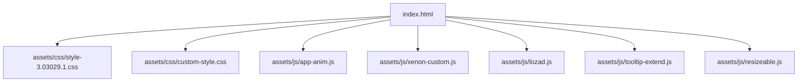
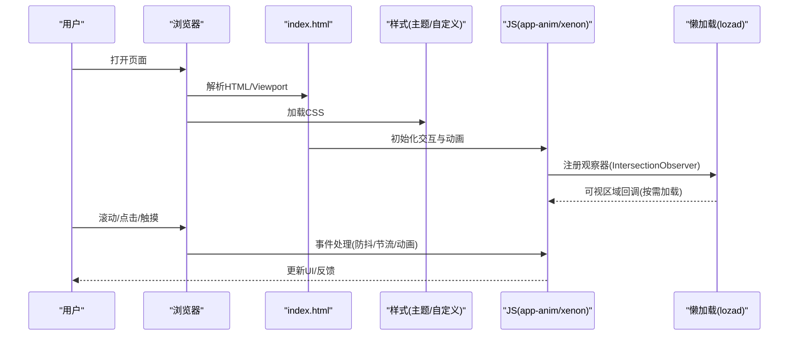
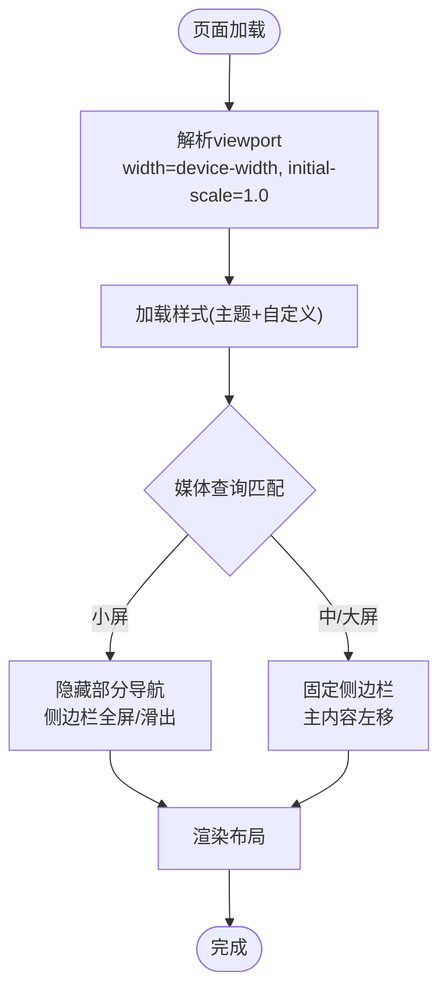
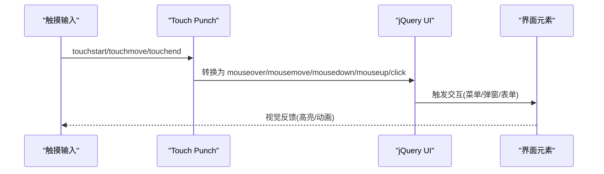
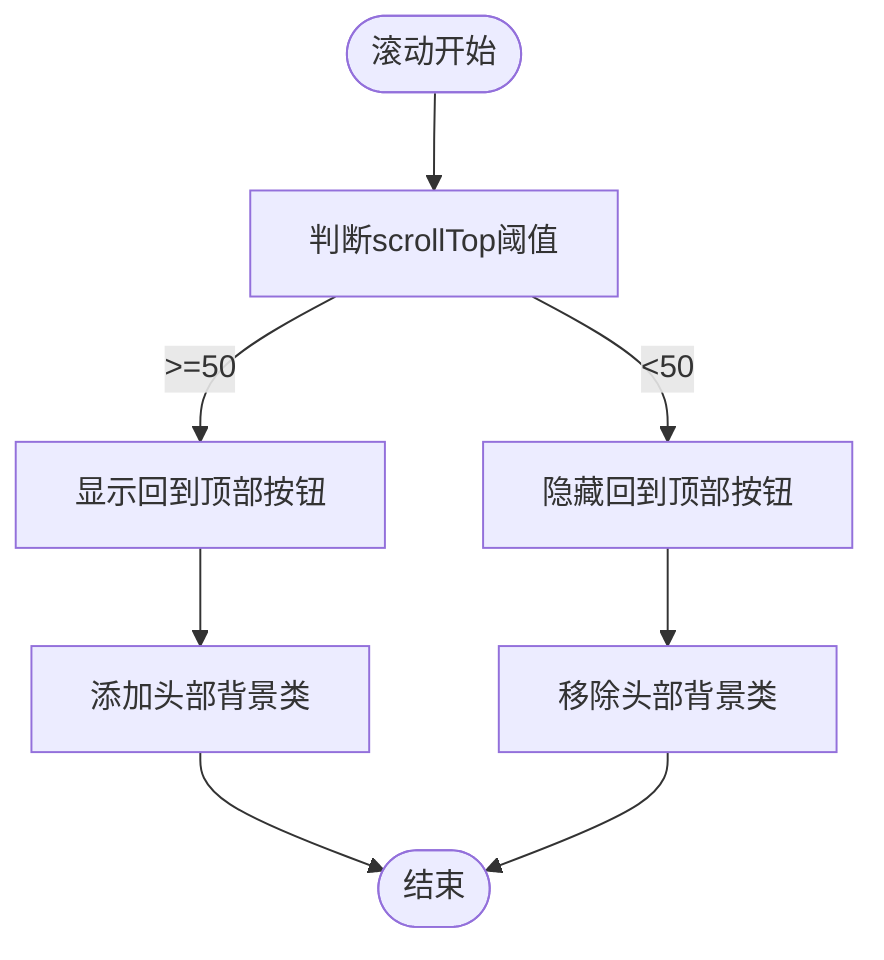
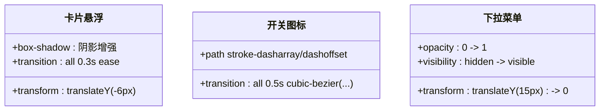
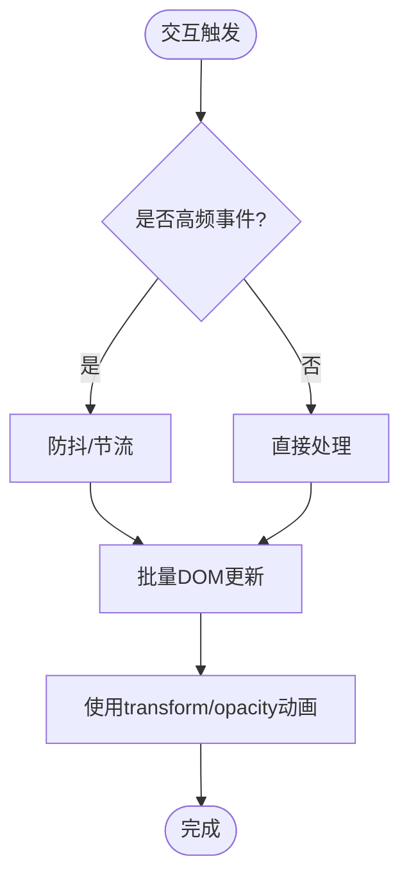
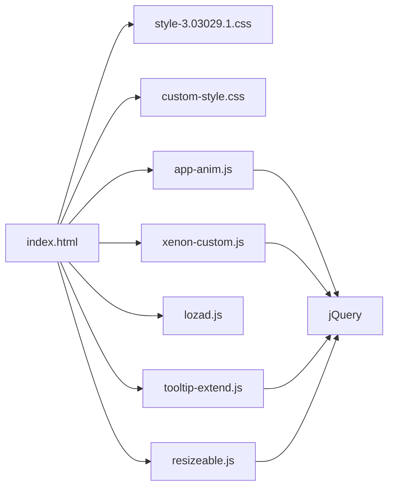

# 渲染性能优化

<cite>
**本文引用的文件**
- [index.html](file://index.html)
- [custom-style.css](file://assets/css/custom-style.css)
- [style-3.03029.1.css](file://assets/css/style-3.03029.1.css)
- [app-anim.js](file://assets/js/app-anim.js)
- [xenon-custom.js](file://assets/js/xenon-custom.js)
- [lozad.js](file://assets/js/lozad.js)
- [tooltip-extend.js](file://assets/js/tooltip-extend.js)
- [resizeable.js](file://assets/js/resizeable.js)
- [README.md](file://README.md)
</cite>

## 目录
1. [简介](#简介)
2. [项目结构](#项目结构)
3. [核心组件](#核心组件)
4. [架构总览](#架构总览)
5. [详细组件分析](#详细组件分析)
6. [依赖关系分析](#依赖关系分析)
7. [性能考量](#性能考量)
8. [故障排查指南](#故障排查指南)
9. [结论](#结论)
10. [附录：测试与工具](#附录测试与工具)

## 简介
本文件聚焦移动设备界面渲染的性能优化，围绕视口适配、触摸反馈、滚动性能、CSS 渲染优化与 JavaScript 渲染优化五个方面展开。文档结合仓库中的实际实现（viewport 设置、响应式布局、媒体查询、懒加载、动画与交互等），给出可落地的优化策略与最佳实践，并附带性能测试与优化工具使用方法。

## 项目结构
本项目为纯静态站点，采用 HTML + CSS + jQuery 的轻量技术栈，资源组织清晰：
- 入口页面 index.html 负责视口配置、样式与脚本引入、页面骨架与内容区块
- 样式集中在 assets/css，包含主题样式与自定义样式
- 交互逻辑在 assets/js，包括动画、滚动、菜单、懒加载等
- README 提供部署与二次开发说明

图表来源
- [index.html:1-35](file://index.html#L1-L35)
- [style-3.03029.1.css:1-200](file://assets/css/style-3.03029.1.css#L1-L200)
- [custom-style.css:1-126](file://assets/css/custom-style.css#L1-L126)
- [app-anim.js:1-800](file://assets/js/app-anim.js#L1-L800)
- [xenon-custom.js:1-800](file://assets/js/xenon-custom.js#L1-L800)
- [lozad.js:1-174](file://assets/js/lozad.js#L1-L174)
- [tooltip-extend.js:57-442](file://assets/js/tooltip-extend.js#L57-L442)
- [resizeable.js:86-122](file://assets/js/resizeable.js#L86-L122)

章节来源
- [index.html:1-35](file://index.html#L1-L35)
- [README.md:298-314](file://README.md#L298-L314)

## 核心组件
- 视口与基础样式：通过 viewport meta 控制移动端缩放与布局；基础字体、颜色、过渡与响应式断点定义于样式文件中
- 响应式布局与媒体查询：使用 Bootstrap 栅格与自定义媒体查询，在不同屏幕宽度下调整侧边栏、主内容区与导航
- 滚动与粘性元素：sticky header、粘性页脚、滚动监听显示“回到顶部”按钮
- 懒加载：基于 IntersectionObserver 的图片懒加载库 lozad.js，减少首屏负载
- 动画与微交互：transform、opacity、transition 驱动的卡片悬浮、菜单切换、开关图标动画等
- 触摸与事件：jQuery UI Touch Punch 兼容移动端触摸事件；hoverIntent 优化悬停体验；防抖/节流处理 resize 与滚动

章节来源
- [index.html:9-11](file://index.html#L9-L11)
- [style-3.03029.1.css:25-32](file://assets/css/style-3.03029.1.css#L25-L32)
- [style-3.03029.1.css:143-163](file://assets/css/style-3.03029.1.css#L143-L163)
- [app-anim.js:239-253](file://assets/js/app-anim.js#L239-L253)
- [lozad.js:117-169](file://assets/js/lozad.js#L117-L169)
- [style-3.03029.1.css:195-198](file://assets/css/style-3.03029.1.css#L195-L198)

## 架构总览
整体渲染流程如下：
- 浏览器解析 index.html，读取 viewport 与样式表，构建 DOM/CSSOM
- 初始化交互模块：app-anim.js 与 xenon-custom.js 分别处理业务动画与框架级功能（滚动条、表单、日期选择器等）
- 懒加载模块 lozad.js 监听可视区域，按需加载图片与背景图
- 响应式逻辑由 tooltip-extend.js 与 resizeable.js 统一触发断点变化与重排

图表来源
- [index.html:1-35](file://index.html#L1-L35)
- [app-anim.js:1-800](file://assets/js/app-anim.js#L1-L800)
- [xenon-custom.js:1-800](file://assets/js/xenon-custom.js#L1-L800)
- [lozad.js:117-169](file://assets/js/lozad.js#L117-L169)

## 详细组件分析

### 视口适配优化
- viewport 设置：通过 viewport meta 限制最小/最大缩放与禁止用户缩放，确保移动端布局稳定
- 响应式布局：Bootstrap 栅格配合媒体查询，在小屏隐藏部分导航、调整侧边栏宽度与主内容区边距
- 字体与可读性：基础字体平滑与字号层级，在小屏下调大标题字号，保证可读性

图表来源
- [index.html:9-11](file://index.html#L9-L11)
- [style-3.03029.1.css:143-163](file://assets/css/style-3.03029.1.css#L143-L163)
- [style-3.03029.1.css:175-178](file://assets/css/style-3.03029.1.css#L175-L178)

章节来源
- [index.html:9-11](file://index.html#L9-L11)
- [style-3.03029.1.css:143-163](file://assets/css/style-3.03029.1.css#L143-L163)
- [style-3.03029.1.css:175-178](file://assets/css/style-3.03029.1.css#L175-L178)

### 触摸反馈优化
- 点击延迟消除：使用 jQuery UI Touch Punch 将 touch 事件映射为 mouse 事件，避免移动端 300ms 点击延迟
- 快速响应设计：对高频交互（如菜单切换、搜索框焦点）使用即时反馈与状态切换
- 微交互动画：卡片悬浮、开关图标路径动画、下拉菜单显隐均使用 transform/opacity/transition，避免 layout thrashing

图表来源
- [jquery.ui.touch-punch.min-0.2.2.js:1-11](file://assets/js/jquery.ui.touch-punch.min-0.2.2.js#L1-L11)
- [style-3.03029.1.css:125-140](file://assets/css/style-3.03029.1.css#L125-L140)
- [style-3.03029.1.css:195-198](file://assets/css/style-3.03029.1.css#L195-L198)

章节来源
- [style-3.03029.1.css:125-140](file://assets/css/style-3.03029.1.css#L125-L140)
- [style-3.03029.1.css:195-198](file://assets/css/style-3.03029.1.css#L195-L198)

### 滚动性能优化
- 滚动事件优化：滚动监听用于显示“回到顶部”和头部背景变化，避免在滚动回调中进行昂贵计算
- 粘性元素：header 使用 sticky 定位，减少重排；页脚粘性通过 JS 计算高度并设置 margin-top
- 虚拟列表/懒加载：使用 lozad.js 的 IntersectionObserver 仅加载可视区域图片与背景图，降低首屏压力

图表来源
- [app-anim.js:239-253](file://assets/js/app-anim.js#L239-L253)
- [app-anim.js:294-308](file://assets/js/app-anim.js#L294-L308)
- [lozad.js:117-169](file://assets/js/lozad.js#L117-L169)

章节来源
- [app-anim.js:239-253](file://assets/js/app-anim.js#L239-L253)
- [app-anim.js:294-308](file://assets/js/app-anim.js#L294-L308)
- [lozad.js:117-169](file://assets/js/lozad.js#L117-L169)

### CSS 渲染优化
- GPU 加速：大量使用 transform 与 opacity 进行动画（卡片悬浮、菜单显隐、开关图标），避免触发布局与绘制
- 合成层优化：transition 属性声明合理的持续时间与缓动函数，减少重排重绘
- will-change 建议：对频繁动画的元素可考虑 will-change 提示浏览器提前创建合成层（当前代码未直接使用，可作为增强项）

图表来源
- [style-3.03029.1.css:195-198](file://assets/css/style-3.03029.1.css#L195-L198)
- [style-3.03029.1.css:125-140](file://assets/css/style-3.03029.1.css#L125-L140)
- [style-3.03029.1.css:113-118](file://assets/css/style-3.03029.1.css#L113-L118)

章节来源
- [style-3.03029.1.css:113-118](file://assets/css/style-3.03029.1.css#L113-L118)
- [style-3.03029.1.css:125-140](file://assets/css/style-3.03029.1.css#L125-L140)
- [style-3.03029.1.css:195-198](file://assets/css/style-3.03029.1.css#L195-L198)

### JavaScript 渲染优化
- DOM 操作优化：批量插入节点、避免在循环中频繁读写样式；使用模板字符串生成节点后一次性插入
- 重排重绘避免：优先使用 transform/opacity 动画；在滚动与 resize 中使用防抖/节流
- Web Workers：当前项目未使用，可在复杂计算（如大数据排序、图像处理）时引入 Worker 以释放主线程

图表来源
- [app-anim.js:36-45](file://assets/js/app-anim.js#L36-L45)
- [tooltip-extend.js:439-442](file://assets/js/tooltip-extend.js#L439-L442)
- [resizeable.js:110-122](file://assets/js/resizeable.js#L110-L122)

章节来源
- [app-anim.js:36-45](file://assets/js/app-anim.js#L36-L45)
- [tooltip-extend.js:439-442](file://assets/js/tooltip-extend.js#L439-L442)
- [resizeable.js:110-122](file://assets/js/resizeable.js#L110-L122)

## 依赖关系分析
- index.html 作为入口，依赖主题样式与自定义样式，以及多个 JS 模块
- app-anim.js 负责业务动画与交互，依赖 jQuery 与第三方插件（Fancybox、Tooltip 等）
- xenon-custom.js 提供框架级功能（滚动条、表单、日期选择器等），与主题样式紧密耦合
- lozad.js 提供懒加载能力，被业务逻辑调用以优化首屏性能
- tooltip-extend.js 与 resizeable.js 提供响应式与断点检测，驱动布局与交互的重置

图表来源
- [index.html:17-31](file://index.html#L17-L31)
- [app-anim.js:1-800](file://assets/js/app-anim.js#L1-L800)
- [xenon-custom.js:1-800](file://assets/js/xenon-custom.js#L1-L800)
- [lozad.js:1-174](file://assets/js/lozad.js#L1-L174)
- [tooltip-extend.js:57-442](file://assets/js/tooltip-extend.js#L57-L442)
- [resizeable.js:86-122](file://assets/js/resizeable.js#L86-L122)

章节来源
- [index.html:17-31](file://index.html#L17-L31)
- [app-anim.js:1-800](file://assets/js/app-anim.js#L1-L800)
- [xenon-custom.js:1-800](file://assets/js/xenon-custom.js#L1-L800)
- [lozad.js:1-174](file://assets/js/lozad.js#L1-L174)
- [tooltip-extend.js:57-442](file://assets/js/tooltip-extend.js#L57-L442)
- [resizeable.js:86-122](file://assets/js/resizeable.js#L86-L122)

## 性能考量
- 首屏加载：启用 gzip 压缩与静态资源缓存（Nginx/Vercel/Cloudflare Pages 均可配置）
- 图片优化：使用懒加载与合适的图片格式（WebP/AVIF），避免阻塞渲染
- 动画性能：优先使用 transform/opacity，避免触发 layout；合理设置 transition 时长与缓动
- 滚动性能：减少滚动回调中的 DOM 操作，使用 requestAnimationFrame 或防抖/节流
- 内存管理：及时移除不再使用的观察者与事件监听，避免内存泄漏

[本节为通用指导，不直接分析具体文件]

## 故障排查指南
- 图片或样式加载失败：检查资源路径是否正确，确保相对路径引用准确
- 提交功能后端集成：如需持久化存储，可使用 Vercel Serverless Functions 或第三方表单服务
- 统计与SEO：完善 meta 标签、添加 sitemap.xml、提交搜索引擎收录

章节来源
- [README.md:316-341](file://README.md#L316-L341)

## 结论
本项目在移动端渲染性能方面已具备良好基础：viewport 配置合理、响应式布局完善、动画与交互使用 GPU 友好属性、懒加载降低首屏压力。建议在后续迭代中持续监控性能指标，结合工具链进行精细化优化，进一步提升用户体验。

[本节为总结，不直接分析具体文件]

## 附录：测试与工具
- Chrome DevTools Performance 面板：录制关键路径，识别长任务与重排重绘热点
- Lighthouse：运行移动端审计，获取性能评分与优化建议
- Network 面板：分析资源加载顺序与体积，优化缓存与压缩策略
- 控制台日志：在关键交互处输出耗时信息，辅助定位瓶颈

[本节为通用指导，不直接分析具体文件]