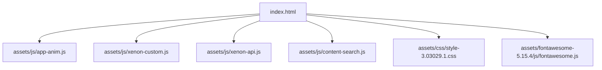
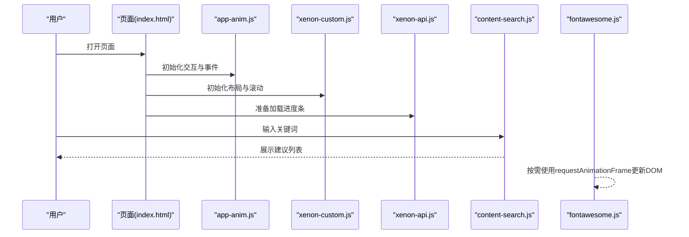
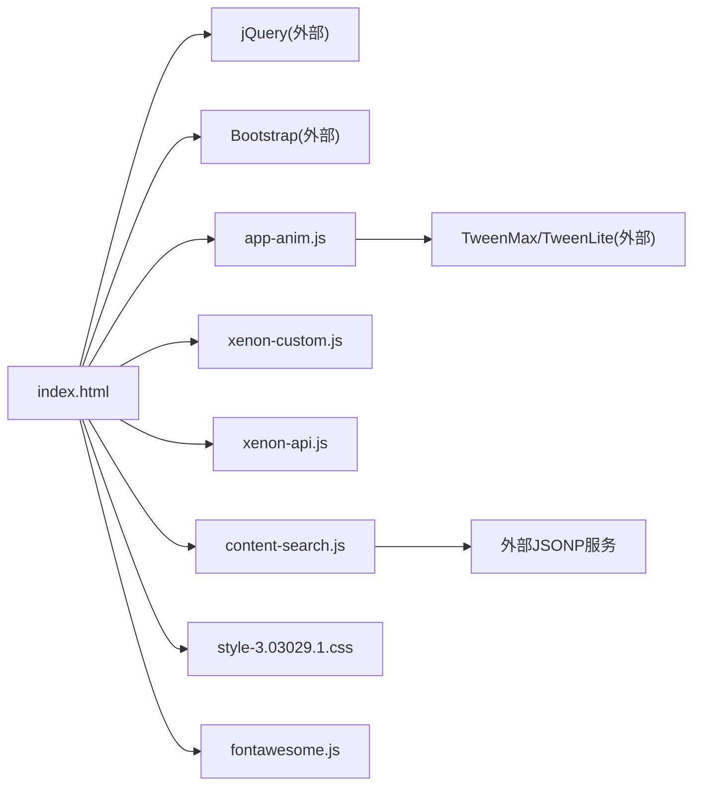

# 电池使用优化

<cite>
**本文引用的文件**
- [index.html](file://index.html)
- [README.md](file://README.md)
- [assets/js/app-anim.js](file://assets/js/app-anim.js)
- [assets/js/xenon-custom.js](file://assets/js/xenon-custom.js)
- [assets/js/xenon-api.js](file://assets/js/xenon-api.js)
- [assets/js/content-search.js](file://assets/js/content-search.js)
- [assets/css/style-3.03029.1.css](file://assets/css/style-3.03029.1.css)
- [assets/fontawesome-5.15.4/js/fontawesome.js](file://assets/fontawesome-5.15.4/js/fontawesome.js)
</cite>

## 目录
1. [简介](#简介)
2. [项目结构](#项目结构)
3. [核心组件](#核心组件)
4. [架构总览](#架构总览)
5. [详细组件分析](#详细组件分析)
6. [依赖关系分析](#依赖关系分析)
7. [性能与能耗考量](#性能与能耗考量)
8. [故障排查指南](#故障排查指南)
9. [结论](#结论)
10. [附录](#附录)

## 简介
本文件面向移动设备的省电策略与能耗管理，围绕后台任务限制、CPU使用优化、屏幕刷新率优化、传感器使用优化、电池状态检测与自适应功能、以及能耗监控与性能分析方法，提供可落地的技术实现建议。文档同时结合仓库中的实际代码位置（如动画、定时器、CSS动画等）给出具体优化点与改进建议，帮助在现有静态站点基础上进一步提升移动端续航表现。

## 项目结构
本项目为纯静态网站，包含首页、提交页、关于页及资源目录。前端交互主要基于 jQuery、Bootstrap 和自定义脚本；动画与交互由 app-anim.js、xenon-custom.js、xenon-api.js 等脚本承担；样式集中在 assets/css 中；第三方图标库通过 fontawesome 引入。

图表来源
- [index.html:1-35](file://index.html#L1-L35)
- [assets/js/app-anim.js:1-25](file://assets/js/app-anim.js#L1-L25)
- [assets/js/xenon-custom.js:1-20](file://assets/js/xenon-custom.js#L1-L20)
- [assets/js/xenon-api.js:1-20](file://assets/js/xenon-api.js#L1-L20)
- [assets/js/content-search.js:1-10](file://assets/js/content-search.js#L1-L10)
- [assets/css/style-3.03029.1.css:771-792](file://assets/css/style-3.03029.1.css#L771-L792)
- [assets/fontawesome-5.15.4/js/fontawesome.js:1413-1424](file://assets/fontawesome-5.15.4/js/fontawesome.js#L1413-L1424)

章节来源
- [index.html:1-35](file://index.html#L1-L35)
- [README.md:298-314](file://README.md#L298-L314)

## 核心组件
- 页面初始化与交互：app-anim.js 负责侧栏、滑块、滚动、夜间模式切换、懒加载提示等。
- 主题与布局控制：xenon-custom.js 负责菜单、滚动条、固定页脚、全局事件绑定等。
- 进度条与UI反馈：xenon-api.js 提供加载进度条的显示/隐藏逻辑。
- 搜索建议：content-search.js 监听输入并请求远程建议数据。
- CSS动画：style-3.03029.1.css 定义了多组关键帧动画。
- 第三方库：fontawesome.js 内部使用 requestAnimationFrame 进行 DOM 变更调度。

章节来源
- [assets/js/app-anim.js:1-25](file://assets/js/app-anim.js#L1-L25)
- [assets/js/xenon-custom.js:1-20](file://assets/js/xenon-custom.js#L1-L20)
- [assets/js/xenon-api.js:20-91](file://assets/js/xenon-api.js#L20-L91)
- [assets/js/content-search.js:1-91](file://assets/js/content-search.js#L1-L91)
- [assets/css/style-3.03029.1.css:771-792](file://assets/css/style-3.03029.1.css#L771-L792)
- [assets/fontawesome-5.15.4/js/fontawesome.js:1413-1424](file://assets/fontawesome-5.15.4/js/fontawesome.js#L1413-L1424)

## 架构总览
从能耗视角看，页面执行路径如下：
- 页面加载后，app-anim.js 初始化 UI 行为与事件；xenon-custom.js 设置全局布局与滚动行为；xenon-api.js 提供加载反馈；content-search.js 处理搜索建议请求。
- 动画方面，既有 jQuery 动画与 TweenMax/TweenLite 驱动的过渡，也有 CSS 关键帧动画。
- 第三方库（如 fontawesome）在必要时使用 requestAnimationFrame 批量更新 DOM，减少重排重绘。

图表来源
- [assets/js/app-anim.js:1-25](file://assets/js/app-anim.js#L1-L25)
- [assets/js/xenon-custom.js:1-20](file://assets/js/xenon-custom.js#L1-L20)
- [assets/js/xenon-api.js:20-91](file://assets/js/xenon-api.js#L20-L91)
- [assets/js/content-search.js:1-91](file://assets/js/content-search.js#L1-L91)
- [assets/fontawesome-5.15.4/js/fontawesome.js:1413-1424](file://assets/fontawesome-5.15.4/js/fontawesome.js#L1413-L1424)

## 详细组件分析

### 后台任务限制与可见性检测
- 现状：当前代码未直接实现页面可见性监听或后台任务节流。
- 建议实现：
  - 使用 Visibility API 监听页面切换，在页面不可见时暂停非关键动画、降低轮询频率、停止网络请求。
  - 对长轮询或定时任务采用节流/去抖策略，避免后台持续耗电。
  - 将高频操作合并到 requestAnimationFrame 或 requestIdleCallback 中执行，减少主线程占用。
- 参考位置：
  - 动画与定时器集中处：[assets/js/app-anim.js:35-45](file://assets/js/app-anim.js#L35-L45)、[assets/js/app-anim.js:271-274](file://assets/js/app-anim.js#L271-L274)
  - 全局事件与滚动处理：[assets/js/xenon-custom.js:75-132](file://assets/js/xenon-custom.js#L75-L132)

章节来源
- [assets/js/app-anim.js:35-45](file://assets/js/app-anim.js#L35-L45)
- [assets/js/app-anim.js:271-274](file://assets/js/app-anim.js#L271-L274)
- [assets/js/xenon-custom.js:75-132](file://assets/js/xenon-custom.js#L75-L132)

### CPU使用优化：动画帧率控制与计算任务调度
- 现状：
  - 多处使用 setTimeout 进行延时与防抖（例如窗口 resize 防抖）。
  - 使用 TweenMax/TweenLite 驱动动画，具备较好的性能控制能力。
  - 第三方库在必要时使用 requestAnimationFrame 调度 DOM 变更。
- 优化建议：
  - 统一动画调度：优先使用 requestAnimationFrame 或 TweenMax 的时间轴控制，避免频繁创建/销毁定时器。
  - 计算密集型任务拆分：使用 Web Workers 或分片执行，避免阻塞主线程。
  - 内存泄漏预防：及时移除事件监听、清理定时器、释放引用；在页面卸载时主动销毁动画实例。
- 参考位置：
  - 防抖与定时器：[assets/js/app-anim.js:35-45](file://assets/js/app-anim.js#L35-L45)、[assets/js/app-anim.js:271-274](file://assets/js/app-anim.js#L271-L274)
  - 动画引擎：[assets/js/xenon-api.js:61-80](file://assets/js/xenon-api.js#L61-L80)
  - requestAnimationFrame 使用：[assets/fontawesome-5.15.4/js/fontawesome.js:1413-1424](file://assets/fontawesome-5.15.4/js/fontawesome.js#L1413-L1424)

章节来源
- [assets/js/app-anim.js:35-45](file://assets/js/app-anim.js#L35-L45)
- [assets/js/xenon-api.js:61-80](file://assets/js/xenon-api.js#L61-L80)
- [assets/fontawesome-5.15.4/js/fontawesome.js:1413-1424](file://assets/fontawesome-5.15.4/js/fontawesome.js#L1413-L1424)

### 屏幕刷新率优化：requestAnimationFrame、CSS硬件加速与GPU渲染
- 现状：
  - CSS 中定义多组关键帧动画，可能触发 GPU 合成层。
  - 第三方库使用 requestAnimationFrame 进行 DOM 变更，有助于减少重排重绘。
- 优化建议：
  - 尽量使用 transform 与 opacity 触发 GPU 加速，避免 layout 抖动。
  - 将复杂动画拆分为多个轻量级图层，减少合成代价。
  - 使用 will-change 谨慎提升元素至独立图层，仅在必要时启用。
  - 控制动画时长与速率，避免过高帧率造成不必要的刷新。
- 参考位置：
  - CSS关键帧动画：[assets/css/style-3.03029.1.css:771-792](file://assets/css/style-3.03029.1.css#L771-L792)
  - requestAnimationFrame 使用：[assets/fontawesome-5.15.4/js/fontawesome.js:1413-1424](file://assets/fontawesome-5.15.4/js/fontawesome.js#L1413-L1424)

章节来源
- [assets/css/style-3.03029.1.css:771-792](file://assets/css/style-3.03029.1.css#L771-L792)
- [assets/fontawesome-5.15.4/js/fontawesome.js:1413-1424](file://assets/fontawesome-5.15.4/js/fontawesome.js#L1413-L1424)

### 传感器使用优化：按需启用与频率控制
- 现状：未发现直接使用陀螺仪、加速度计等传感器的代码。
- 建议实现：
  - 仅在用户交互或明确场景下启用传感器，避免常驻监听。
  - 使用节流/采样降低事件频率，例如将高频运动事件降频为 10-30Hz。
  - 在页面不可见或无交互时立即关闭传感器监听。
  - 提供降级方案，在无权限或不支持的设备上优雅回退。
- 参考位置：
  - 事件监听与交互入口：[assets/js/app-anim.js:1-25](file://assets/js/app-anim.js#L1-L25)、[assets/js/xenon-custom.js:75-132](file://assets/js/xenon-custom.js#L75-L132)

章节来源
- [assets/js/app-anim.js:1-25](file://assets/js/app-anim.js#L1-L25)
- [assets/js/xenon-custom.js:75-132](file://assets/js/xenon-custom.js#L75-L132)

### 电池状态检测与自适应功能
- 现状：未发现 BatteryManager 或相关电池 API 的使用。
- 建议实现：
  - 使用 Battery API 检测低电量状态，动态降低动画复杂度、减少网络请求、禁用非必要效果。
  - 根据电池状态切换“节能模式”，例如关闭背景图片、简化布局、降低字体大小。
  - 在低电量时暂停非关键任务（如统计上报、缓存预取）。
- 参考位置：
  - 全局交互与状态切换入口：[assets/js/app-anim.js:201-237](file://assets/js/app-anim.js#L201-L237)

章节来源
- [assets/js/app-anim.js:201-237](file://assets/js/app-anim.js#L201-L237)

### 能耗监控工具与性能分析方法
- 建议方法：
  - 使用浏览器开发者工具的 Performance 面板录制关键交互，识别长任务与掉帧。
  - 使用 Memory 面板检查内存增长与潜在泄漏（事件监听、闭包引用、定时器未清理）。
  - 使用 Network 面板分析请求频率与体积，合并请求、启用缓存与压缩。
  - 使用 Lighthouse 进行移动端性能与能耗评估，关注“最大内容绘制”、“首次输入延迟”等指标。
- 参考位置：
  - 搜索建议的网络请求：[assets/js/content-search.js:5-73](file://assets/js/content-search.js#L5-L73)
  - 加载进度与UI反馈：[assets/js/xenon-api.js:20-91](file://assets/js/xenon-api.js#L20-L91)

章节来源
- [assets/js/content-search.js:5-73](file://assets/js/content-search.js#L5-L73)
- [assets/js/xenon-api.js:20-91](file://assets/js/xenon-api.js#L20-L91)

## 依赖关系分析
- 脚本依赖：
  - index.html 引入 jQuery、Bootstrap、自定义脚本与样式。
  - app-anim.js 依赖 jQuery 与第三方动画库（TweenMax/TweenLite）。
  - xenon-custom.js 与 xenon-api.js 提供全局交互与UI反馈。
  - content-search.js 发起外部 JSONP 请求获取搜索建议。
  - fontawesome.js 在内部使用 requestAnimationFrame 优化 DOM 更新。
- 样式依赖：
  - style-3.03029.1.css 定义关键帧动画，影响渲染路径与GPU合成。

图表来源
- [index.html:17-31](file://index.html#L17-L31)
- [assets/js/app-anim.js:1-25](file://assets/js/app-anim.js#L1-L25)
- [assets/js/xenon-custom.js:1-20](file://assets/js/xenon-custom.js#L1-L20)
- [assets/js/xenon-api.js:1-20](file://assets/js/xenon-api.js#L1-L20)
- [assets/js/content-search.js:1-10](file://assets/js/content-search.js#L1-L10)
- [assets/css/style-3.03029.1.css:771-792](file://assets/css/style-3.03029.1.css#L771-L792)
- [assets/fontawesome-5.15.4/js/fontawesome.js:1413-1424](file://assets/fontawesome-5.15.4/js/fontawesome.js#L1413-L1424)

章节来源
- [index.html:17-31](file://index.html#L17-L31)
- [assets/js/app-anim.js:1-25](file://assets/js/app-anim.js#L1-L25)
- [assets/js/xenon-custom.js:1-20](file://assets/js/xenon-custom.js#L1-L20)
- [assets/js/xenon-api.js:1-20](file://assets/js/xenon-api.js#L1-L20)
- [assets/js/content-search.js:1-10](file://assets/js/content-search.js#L1-L10)
- [assets/css/style-3.03029.1.css:771-792](file://assets/css/style-3.03029.1.css#L771-L792)
- [assets/fontawesome-5.15.4/js/fontawesome.js:1413-1424](file://assets/fontawesome-5.15.4/js/fontawesome.js#L1413-L1424)

## 性能与能耗考量
- 动画与渲染：
  - 优先使用 transform/opacity 触发 GPU 加速，减少 layout 抖动。
  - 控制动画数量与时长，避免过多并行动画导致掉帧。
  - 使用 requestAnimationFrame 或 TweenMax 时间轴统一管理动画节奏。
- 定时器与后台任务：
  - 使用防抖/节流降低高频事件处理成本（如 resize、scroll）。
  - 在页面不可见时暂停或降级非关键任务。
- 网络与I/O：
  - 合并请求、启用缓存与压缩，减少重复请求。
  - 对搜索建议等异步请求增加超时与错误重试机制。
- 内存与泄漏：
  - 及时移除事件监听、清理定时器、释放动画实例。
  - 避免闭包持有大对象引用，防止内存持续增长。

章节来源
- [assets/js/app-anim.js:35-45](file://assets/js/app-anim.js#L35-L45)
- [assets/js/xenon-custom.js:75-132](file://assets/js/xenon-custom.js#L75-L132)
- [assets/js/content-search.js:5-73](file://assets/js/content-search.js#L5-L73)
- [assets/css/style-3.03029.1.css:771-792](file://assets/css/style-3.03029.1.css#L771-L792)
- [assets/fontawesome-5.15.4/js/fontawesome.js:1413-1424](file://assets/fontawesome-5.15.4/js/fontawesome.js#L1413-L1424)

## 故障排查指南
- 动画卡顿或掉帧：
  - 检查是否存在过多并行动画或复杂布局计算。
  - 使用 Performance 面板定位长任务与重排重绘热点。
- 网络请求异常：
  - 检查搜索建议接口是否可用，增加超时与错误处理。
  - 观察 Network 面板的请求频率与响应时间。
- 内存泄漏：
  - 检查是否有未清理的事件监听、定时器或动画实例。
  - 使用 Memory 面板对比不同交互前后的内存变化。
- 参考位置：
  - 搜索建议与错误处理：[assets/js/content-search.js:5-73](file://assets/js/content-search.js#L5-L73)
  - 加载进度与UI反馈：[assets/js/xenon-api.js:20-91](file://assets/js/xenon-api.js#L20-L91)
  - 全局事件与滚动处理：[assets/js/xenon-custom.js:75-132](file://assets/js/xenon-custom.js#L75-L132)

章节来源
- [assets/js/content-search.js:5-73](file://assets/js/content-search.js#L5-L73)
- [assets/js/xenon-api.js:20-91](file://assets/js/xenon-api.js#L20-L91)
- [assets/js/xenon-custom.js:75-132](file://assets/js/xenon-custom.js#L75-L132)

## 结论
本项目为纯静态站点，具备良好的基础结构与交互实现。通过引入页面可见性检测、后台任务节流、动画帧率控制、CSS硬件加速与GPU渲染优化、传感器按需启用、电池状态自适应以及完善的能耗监控与性能分析方法，可以显著提升移动端续航表现与用户体验。建议在现有代码基础上逐步落地上述优化点，并结合浏览器工具持续验证效果。

## 附录
- 快速开始与部署：参见项目 README，了解本地运行与多种部署方式。
- 二次开发：可根据需求扩展搜索、提交、统计等功能模块。

章节来源
- [README.md:22-43](file://README.md#L22-L43)
- [README.md:242-296](file://README.md#L242-L296)