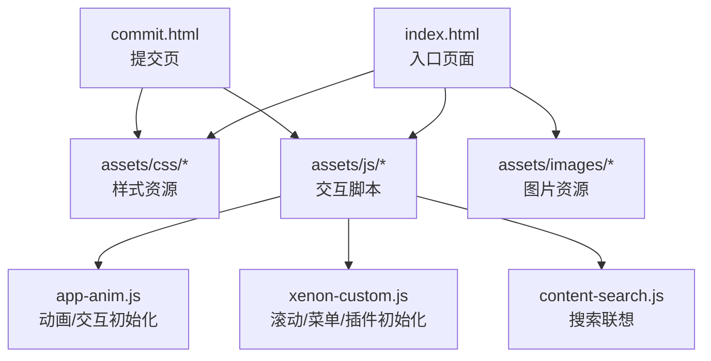
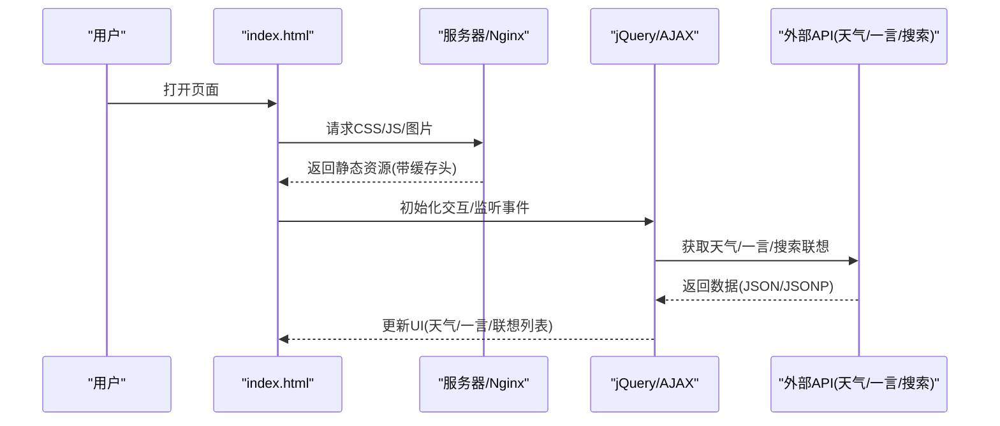
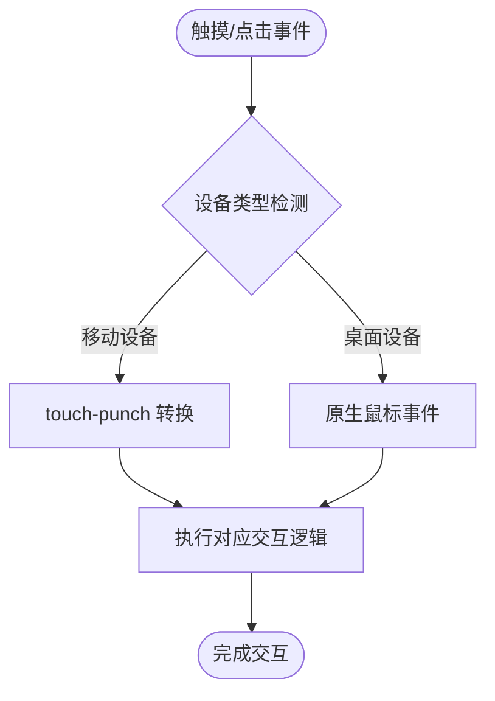
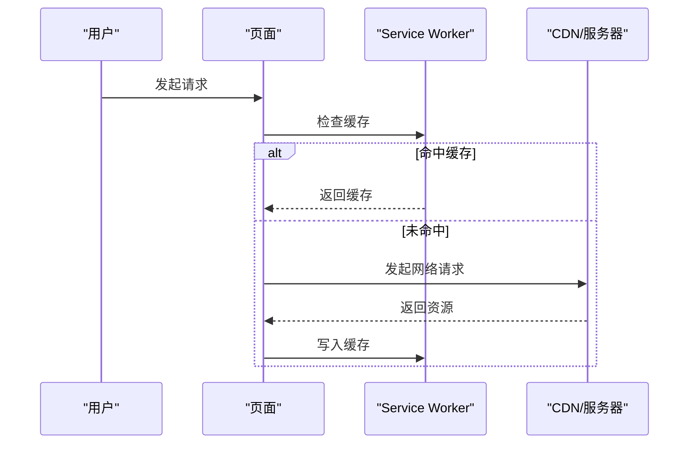
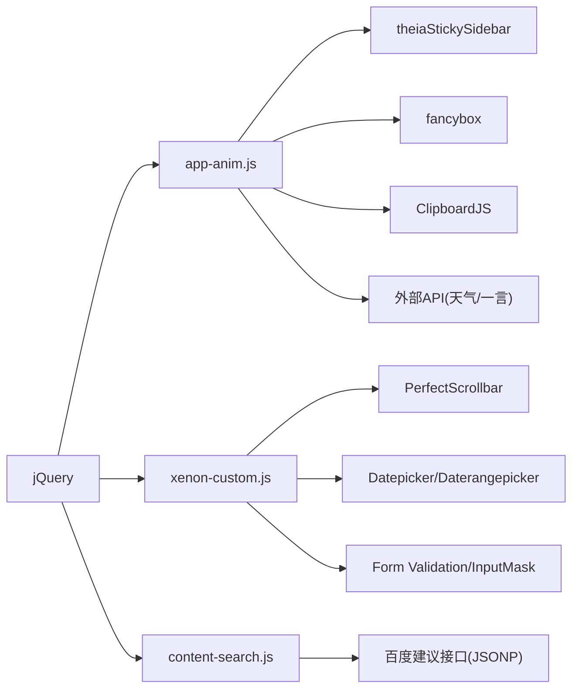

# 移动端性能优化

<cite>
**本文引用的文件**
- [index.html](file://index.html)
- [README.md](file://README.md)
- [assets/js/app-anim.js](file://assets/js/app-anim.js)
- [assets/js/xenon-custom.js](file://assets/js/xenon-custom.js)
- [assets/js/content-search.js](file://assets/js/content-search.js)
- [assets/css/custom-style.css](file://assets/css/custom-style.css)
- [commit.html](file://commit.html)
- [assets/js/jquery.ui.touch-punch.min-0.2.2.js](file://assets/js/jquery.ui.touch-punch.min-0.2.2.js)
</cite>

## 目录
1. [简介](#简介)
2. [项目结构](#项目结构)
3. [核心组件](#核心组件)
4. [架构总览](#架构总览)
5. [详细组件分析](#详细组件分析)
6. [依赖关系分析](#依赖关系分析)
7. [性能考量与优化建议](#性能考量与优化建议)
8. [故障排查指南](#故障排查指南)
9. [结论](#结论)
10. [附录：移动端性能测试工具使用指南](#附录移动端性能测试工具使用指南)

## 简介
本文件面向移动端性能优化，结合仓库中的实际代码与资源，系统梳理触摸交互、网络请求、电池使用、渲染体验等方面的现状与改进方向，并给出可落地的优化策略与工具使用方法。本项目为纯静态站点（HTML/CSS/JS），具备响应式布局与基础交互逻辑，适合在移动端浏览器中访问。

## 项目结构
- 入口页面 index.html 定义了视口、主题色、资源加载顺序与主要 DOM 结构，包含侧边栏、头部导航、搜索区域与内容卡片网格。
- 样式集中在 assets/css 下，custom-style.css 提供移动端友好的局部样式调整。
- 脚本集中在 assets/js 下，app-anim.js 负责动画与交互初始化，xenon-custom.js 提供滚动、菜单等通用能力，content-search.js 实现搜索联想。
- 提交页 commit.html 提供表单与校验样式。
- README.md 提供了部署与 Nginx 缓存配置示例，可作为服务端缓存优化的参考。

图表来源
- [index.html:1-35](file://index.html#L1-L35)
- [assets/js/app-anim.js:1-25](file://assets/js/app-anim.js#L1-L25)
- [assets/js/xenon-custom.js:13-132](file://assets/js/xenon-custom.js#L13-L132)
- [assets/js/content-search.js:1-91](file://assets/js/content-search.js#L1-L91)

章节来源
- [index.html:1-35](file://index.html#L1-L35)
- [README.md:298-314](file://README.md#L298-L314)

## 核心组件
- 视口与主题：通过 viewport 与 theme-color 控制移动端缩放与状态栏颜色，提升首屏体验。
- 侧边栏与导航：支持折叠/展开、粘性定位与二级悬浮菜单，适配不同屏幕宽度。
- 搜索模块：输入联想、热词提示、多搜索引擎切换。
- 懒加载与图片处理：图片占位与错误回退，减少首屏压力。
- 夜间模式：通过类名切换主题，AJAX 同步偏好。
- 滚动与锚点：平滑滚动、返回顶部、粘性页脚。

章节来源
- [index.html:7-11](file://index.html#L7-L11)
- [assets/js/app-anim.js:1-25](file://assets/js/app-anim.js#L1-L25)
- [assets/js/content-search.js:1-91](file://assets/js/content-search.js#L1-L91)
- [assets/css/custom-style.css:1-126](file://assets/css/custom-style.css#L1-L126)

## 架构总览
整体采用“静态资源 + 轻量 JS 交互”的架构，前端通过 jQuery 与第三方库完成 UI 行为，数据交互以 AJAX/JSONP 为主，服务端由 Nginx 或托管平台提供静态资源与缓存策略。

图表来源
- [index.html:270-314](file://index.html#L270-L314)
- [assets/js/content-search.js:1-91](file://assets/js/content-search.js#L1-L91)
- [README.md:88-116](file://README.md#L88-L116)

## 详细组件分析

### 触摸交互优化
- 触摸事件兼容：引入 touch-punch 将触摸事件转换为鼠标事件，使基于 mouse 的交互库在移动端可用。
- 侧边栏手势：点击切换迷你/展开状态，窗口 resize 时自动适配；二级菜单悬浮面板在窄屏下避免遮挡。
- 滚动与锚点：平滑滚动到目标位置，返回顶部按钮在滚动一定距离后显示。
- 搜索联想：键盘输入触发联想，点击选项自动填充并提交搜索。

图表来源
- [assets/js/jquery.ui.touch-punch.min-0.2.2.js:1-11](file://assets/js/jquery.ui.touch-punch.min-0.2.2.js#L1-L11)
- [assets/js/app-anim.js:311-430](file://assets/js/app-anim.js#L311-L430)
- [assets/js/content-search.js:1-91](file://assets/js/content-search.js#L1-L91)

章节来源
- [assets/js/jquery.ui.touch-punch.min-0.2.2.js:1-11](file://assets/js/jquery.ui.touch-punch.min-0.2.2.js#L1-L11)
- [assets/js/app-anim.js:311-430](file://assets/js/app-anim.js#L311-L430)
- [assets/js/content-search.js:1-91](file://assets/js/content-search.js#L1-L91)

### 网络请求优化
- 当前实现：
  - 天气与一言通过 fetch 直接调用外部接口。
  - 搜索联想通过 JSONP 调用百度建议接口。
  - 部分功能通过 AJAX 与后端主题接口交互（如点赞、收藏、排序）。
- 优化建议（结合仓库现有能力）：
  - 启用 HTTP/2：在 Nginx 或托管平台开启 HTTP/2，提升并发与头部压缩效率。
  - 请求合并：将多个小请求合并为一次批量请求（例如聚合统计、收藏、排序等）。
  - 离线缓存：利用 Service Worker 对关键静态资源进行缓存，配合 ETag/Last-Modified 与强缓存策略。
  - 弱网适配：增加超时与重试机制、降级展示（无网络时显示缓存内容）、节流/防抖减少频繁请求。
  - 跨域与容错：JSONP 失败时提供本地兜底文案；fetch 失败时捕获并提示。

图表来源
- [README.md:88-116](file://README.md#L88-L116)
- [index.html:304-314](file://index.html#L304-L314)
- [assets/js/content-search.js:1-91](file://assets/js/content-search.js#L1-L91)

章节来源
- [README.md:88-116](file://README.md#L88-L116)
- [index.html:304-314](file://index.html#L304-L314)
- [assets/js/content-search.js:1-91](file://assets/js/content-search.js#L1-L91)

### 电池使用优化
- 后台任务限制：避免在页面不可见时继续高频轮询；使用 Page Visibility API 暂停非关键任务。
- CPU 使用优化：减少不必要的重排重绘，合并 DOM 操作；动画优先使用 transform/opacity 等合成层属性。
- 屏幕刷新率控制：长列表滚动时使用虚拟滚动或分页加载；避免每帧大量计算。
- 当前实践：
  - 滚动监听中使用节流（resize 场景有延时处理）。
  - 动画使用 CSS transition 与少量 jQuery animate。
  - 图片懒加载与错误回退降低首屏负载。

章节来源
- [assets/js/app-anim.js:36-45](file://assets/js/app-anim.js#L36-L45)
- [assets/js/app-anim.js:239-253](file://assets/js/app-anim.js#L239-L253)
- [index.html:604-605](file://index.html#L604-L605)

### 移动端渲染优化
- 视口适配：viewport 设置禁止缩放，确保布局稳定；主题色适配状态栏。
- 触摸反馈：按钮与链接添加 hover/active 态，提升交互确认感。
- 滚动性能：使用 sticky 定位与固定高度容器，减少回流；自定义滚动条隐藏以提升视觉一致性。
- 图片优化：懒加载与 onerror 回退默认图，减少无效请求与闪烁。

章节来源
- [index.html:7-11](file://index.html#L7-L11)
- [assets/css/custom-style.css:9-10](file://assets/css/custom-style.css#L9-L10)
- [index.html:604-605](file://index.html#L604-L605)

## 依赖关系分析
- 脚本依赖：
  - app-anim.js 依赖 jQuery 与第三方插件（theiaStickySidebar、fancybox、ClipboardJS 等）。
  - xenon-custom.js 初始化滚动、日期选择器、表单验证等通用能力。
  - content-search.js 依赖 jQuery 与百度建议接口。
- 样式依赖：
  - custom-style.css 覆盖主题样式，增强移动端体验。
- 外部依赖：
  - Bootstrap、Font Awesome、FancyBox 等 UI 库。
  - 天气与一言外部 API。

图表来源
- [assets/js/app-anim.js:1-25](file://assets/js/app-anim.js#L1-L25)
- [assets/js/xenon-custom.js:13-132](file://assets/js/xenon-custom.js#L13-L132)
- [assets/js/content-search.js:1-91](file://assets/js/content-search.js#L1-L91)

章节来源
- [assets/js/app-anim.js:1-25](file://assets/js/app-anim.js#L1-L25)
- [assets/js/xenon-custom.js:13-132](file://assets/js/xenon-custom.js#L13-L132)
- [assets/js/content-search.js:1-91](file://assets/js/content-search.js#L1-L91)

## 性能考量与优化建议
- 触摸交互
  - 统一使用 Pointer Events 替代分散的 touch/mouse 事件，减少重复绑定与兼容层开销。
  - 对高频事件（scroll、resize、input）实施节流/防抖，避免主线程阻塞。
  - 复杂手势识别建议使用专用库（如 Hammer.js），并在移动端禁用不必要的动画。
- 网络请求
  - 启用 HTTP/2 与 Gzip/Brotli 压缩，减少传输体积。
  - 使用 Service Worker 缓存关键资源，实现离线可用与弱网降级。
  - 对 JSONP/fetch 增加超时、重试与错误边界，保证用户体验。
- 电池使用
  - 使用 requestAnimationFrame 驱动动画，避免 layout thrashing。
  - 在页面不可见时暂停非关键任务，降低 CPU 占用。
  - 图片使用 WebP/AVIF 与响应式 srcset，减少带宽与解码成本。
- 渲染体验
  - 尽量使用 transform/opacity 进行动画，避免强制同步布局。
  - 长列表使用虚拟滚动或分页加载，减少 DOM 节点数量。
  - 预加载关键字体与首屏图片，提升感知速度。

[本节为通用指导，不直接分析具体文件]

## 故障排查指南
- 图片或样式加载失败
  - 检查相对路径是否正确，确保资源存在且可访问。
  - 查看浏览器控制台网络面板，确认资源是否被拦截或跨域失败。
- 搜索联想不显示
  - 检查 JSONP 回调是否成功，确认网络连通性与域名白名单。
  - 在错误分支中提供兜底提示，避免空白界面。
- 夜间模式切换异常
  - 检查 AJAX 请求是否成功，确认主题类名切换逻辑。
- 移动端手势失效
  - 确认 touch-punch 已正确引入，且相关交互库支持触摸事件转换。

章节来源
- [assets/js/content-search.js:67-72](file://assets/js/content-search.js#L67-L72)
- [assets/js/app-anim.js:201-237](file://assets/js/app-anim.js#L201-L237)
- [assets/js/jquery.ui.touch-punch.min-0.2.2.js:1-11](file://assets/js/jquery.ui.touch-punch.min-0.2.2.js#L1-L11)

## 结论
本项目在移动端具备基础的响应式与交互能力，通过合理的资源组织与轻量脚本实现了较好的可用性。进一步优化可从触摸事件统一化、网络请求健壮性、电池友好型动画与渲染优化入手，并结合 Service Worker 与 CDN 缓存策略提升整体性能与用户体验。

[本节为总结，不直接分析具体文件]

## 附录：移动端性能测试工具使用指南
- Chrome DevTools 移动端模拟
  - 打开开发者工具，切换到设备模拟器，选择典型移动设备型号与网络条件（如 3G/慢速 3G）。
  - 使用 Performance 面板录制页面加载与交互过程，关注主线程阻塞、重排重绘与脚本执行时间。
  - 使用 Network 面板检查资源大小、缓存命中与请求次数，评估 HTTP/2 与压缩效果。
- Lighthouse 移动端审计
  - 在 DevTools 的 Lighthouse 标签中选择“Mobile”模式，运行审计。
  - 关注 Performance、Accessibility、Best Practices 与 SEO 得分，根据建议逐项优化。
  - 针对“减少 JavaScript 执行时间”“避免布局抖动”“图片优化”等项制定改进计划。
- 其他工具
  - WebPageTest：提供多地点、多设备与视频回放，便于分析首屏与可交互时间。
  - PageSpeed Insights：在线快速诊断，提供移动端优化建议与截图对比。

[本节为工具使用指导，不直接分析具体文件]