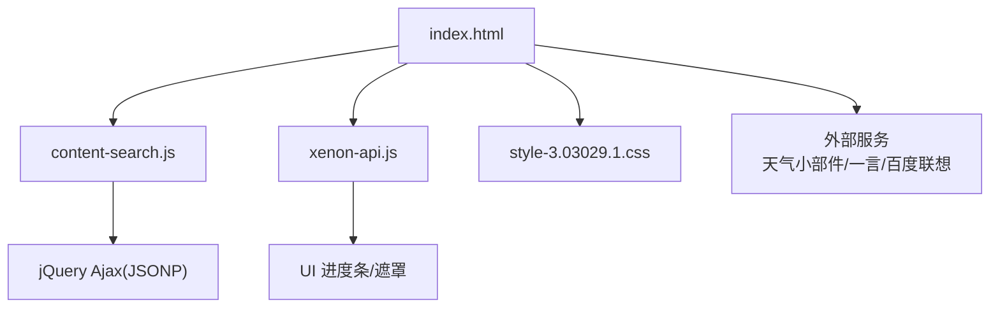
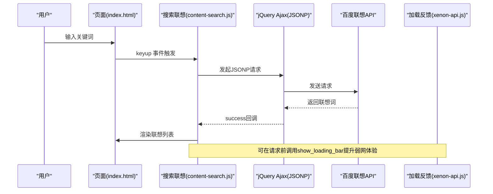
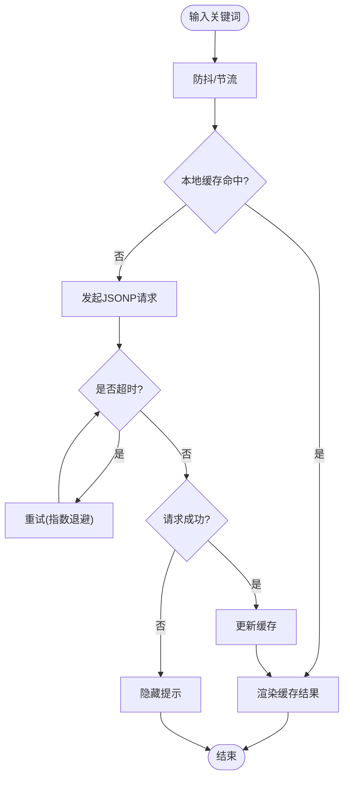
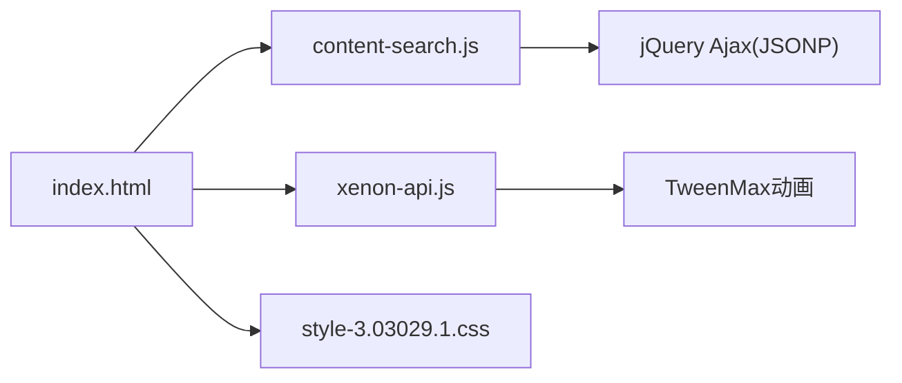

# 网络请求优化

<cite>
**本文引用的文件**
- [index.html](file://index.html)
- [content-search.js](file://assets/js/content-search.js)
- [xenon-api.js](file://assets/js/xenon-api.js)
- [app-mini.js](file://assets/js/app-mini.js)
- [style-3.03029.1.css](file://assets/css/style-3.03029.1.css)
- [README.md](file://README.md)
</cite>

## 目录
1. [简介](#简介)
2. [项目结构](#项目结构)
3. [核心组件](#核心组件)
4. [架构总览](#架构总览)
5. [详细组件分析](#详细组件分析)
6. [依赖关系分析](#依赖关系分析)
7. [性能考量](#性能考量)
8. [故障排查指南](#故障排查指南)
9. [结论](#结论)
10. [附录](#附录)

## 简介
本文件聚焦移动设备网络环境的网络请求优化策略，结合仓库中现有的前端实现与可落地的工程实践，系统阐述：
- HTTP/2 协议在移动端的启用与收益（多路复用、头部压缩、服务器推送）
- 请求合并与去重机制（重复检测、批量处理、缓存策略）
- 离线缓存方案（Service Worker、localStorage、IndexedDB）
- 弱网适配（超时、重试、降级、进度提示）
- 移动端网络状态检测与自适应加载
- API 调用示例与网络性能监控方法

本项目为纯静态站点，当前未内置统一网络层封装。以下内容为基于现有代码的扩展建议与落地路径，便于在不破坏现有结构的前提下增强网络能力。

## 项目结构
- 入口页面 index.html 负责资源加载与基础交互；其中包含对第三方天气小部件与“一言”数据的 fetch 调用。
- 搜索联想功能由 assets/js/content-search.js 实现，使用 jQuery Ajax 发起 JSONP 请求获取百度联想词。
- 全局 UI 进度条与遮罩由 assets/js/xenon-api.js 提供，用于展示加载进度。
- 样式 assets/css/style-3.03029.1.css 定义了全局 loading 覆盖层样式。
- README.md 提供了 Nginx 部署配置示例，包含 gzip 压缩与静态资源缓存策略，可作为 HTTP/2 与缓存优化的参考。

图表来源
- [index.html:304-313](file://index.html#L304-L313)
- [content-search.js:1-91](file://assets/js/content-search.js#L1-L91)
- [xenon-api.js:20-91](file://assets/js/xenon-api.js#L20-L91)
- [style-3.03029.1.css:409-415](file://assets/css/style-3.03029.1.css#L409-L415)

章节来源
- [index.html:1-800](file://index.html#L1-L800)
- [content-search.js:1-91](file://assets/js/content-search.js#L1-L91)
- [xenon-api.js:1-91](file://assets/js/xenon-api.js#L1-L91)
- [style-3.03029.1.css:409-415](file://assets/css/style-3.03029.1.css#L409-L415)
- [README.md:86-116](file://README.md#L86-L116)

## 核心组件
- 搜索联想请求：通过 jQuery Ajax 向百度联想接口发起 JSONP 请求，并在成功时渲染下拉列表，失败时隐藏提示。
- 全局加载反馈：提供 show_loading_bar/hide_loading_bar 等函数，配合 CSS 遮罩层提升弱网体验。
- 外部数据拉取：首页通过 fetch 拉取“一言”文本并注入 DOM。

章节来源
- [content-search.js:1-91](file://assets/js/content-search.js#L1-L91)
- [xenon-api.js:20-91](file://assets/js/xenon-api.js#L20-L91)
- [index.html:304-313](file://index.html#L304-L313)
- [style-3.03029.1.css:409-415](file://assets/css/style-3.03029.1.css#L409-L415)

## 架构总览
下图展示了从用户输入到网络请求、再到 UI 反馈的整体流程，以及未来可扩展的网络层位置。

图表来源
- [content-search.js:1-91](file://assets/js/content-search.js#L1-L91)
- [xenon-api.js:20-91](file://assets/js/xenon-api.js#L20-L91)

## 详细组件分析

### 搜索联想请求（content-search.js）
- 触发时机：输入框 keyup 事件。
- 请求方式：jQuery Ajax + JSONP，目标为百度联想接口。
- 成功处理：清空并显示联想列表，绑定点击事件回填搜索框。
- 失败处理：隐藏提示区域。
- 可优化点：
  - 防抖/节流：避免频繁请求。
  - 请求去重：相同关键词在等待期间不重复发请求。
  - 超时与重试：增加超时控制与指数退避重试。
  - 进度反馈：请求开始时调用 show_loading_bar，完成后 hide。

图表来源
- [content-search.js:1-91](file://assets/js/content-search.js#L1-L91)
- [xenon-api.js:20-91](file://assets/js/xenon-api.js#L20-L91)

章节来源
- [content-search.js:1-91](file://assets/js/content-search.js#L1-L91)

### 全局加载反馈（xenon-api.js）
- 提供 show_loading_bar/hide_loading_bar 等函数，动态创建或更新进度条元素。
- 支持 before/finish 钩子，便于与业务逻辑联动。
- 建议在所有网络请求前后调用，以改善弱网下的感知延迟。

章节来源
- [xenon-api.js:20-91](file://assets/js/xenon-api.js#L20-L91)

### 首页外部数据拉取（index.html）
- 使用 fetch 拉取“一言”文本并插入 DOM。
- 可加入错误捕获与降级文案，确保在网络异常时仍可展示默认内容。

章节来源
- [index.html:304-313](file://index.html#L304-L313)

### 加载遮罩样式（style-3.03029.1.css）
- 定义全局 loading 覆盖层样式，用于全屏遮罩与居中旋转器。
- 可与 JS 逻辑配合，在首屏或关键请求期间显示，提升感知性能。

章节来源
- [style-3.03029.1.css:409-415](file://assets/css/style-3.03029.1.css#L409-L415)

## 依赖关系分析
- index.html 引入 content-search.js、xenon-api.js 等脚本，并通过 jQuery 驱动 Ajax。
- content-search.js 依赖 jQuery Ajax 与外部百度联想接口。
- xenon-api.js 依赖 TweenMax 动画库进行进度条动画。
- 样式文件提供统一的加载视觉反馈。

图表来源
- [index.html:30-31](file://index.html#L30-L31)
- [content-search.js:1-91](file://assets/js/content-search.js#L1-L91)
- [xenon-api.js:20-91](file://assets/js/xenon-api.js#L20-L91)
- [style-3.03029.1.css:409-415](file://assets/css/style-3.03029.1.css#L409-L415)

章节来源
- [index.html:1-800](file://index.html#L1-L800)
- [content-search.js:1-91](file://assets/js/content-search.js#L1-L91)
- [xenon-api.js:1-91](file://assets/js/xenon-api.js#L1-L91)
- [style-3.03029.1.css:409-415](file://assets/css/style-3.03029.1.css#L409-L415)

## 性能考量
- HTTP/2 启用与收益
  - 服务端（Nginx）开启 HTTP/2，利用多路复用减少连接开销，降低移动端握手成本；启用头部压缩减小传输体积；必要时启用服务器推送预加载关键资源。
  - 参考 README 中的 Nginx 配置片段，已包含 gzip 与静态资源缓存策略，可在此基础上启用 HTTP/2。
- 请求合并与去重
  - 在统一网络层中维护请求队列，按 URL+参数生成唯一键，相同键在等待期内合并请求。
  - 批量请求：将多个短请求聚合为一次批量接口，减少往返次数。
- 缓存策略
  - 浏览器缓存：合理设置 Cache-Control/ETag，静态资源长期缓存，接口数据短期缓存。
  - 客户端存储：常用数据写入 localStorage/IndexedDB，提高二次访问速度。
- 弱网适配
  - 超时与重试：为每个请求设置超时阈值，失败后采用指数退避重试，限制最大重试次数。
  - 降级策略：网络不可用时返回本地缓存或占位内容，保证基本可用。
  - 进度提示：使用 show_loading_bar 与全局遮罩，提升用户感知。
- 移动端网络状态检测与自适应加载
  - 监听 navigator.onLine 与 online/offline 事件，切换加载策略。
  - 根据 Connection API 的 effectiveType 调整图片质量、视频码率或禁用非关键请求。

章节来源
- [README.md:86-116](file://README.md#L86-L116)

## 故障排查指南
- 搜索联想无响应
  - 检查网络连接与跨域策略（JSONP 需服务端支持）。
  - 查看控制台是否有超时或错误日志，确认是否正确调用 error 分支。
  - 在 beforeSend 阶段调用 show_loading_bar，观察是否被正确触发。
- 外部数据拉取失败
  - 检查 fetch 的 catch 分支是否执行，必要时提供默认文案降级。
- 加载遮罩不消失
  - 确认请求完成或异常时调用了 hide_loading_bar。
  - 检查全局错误捕获（window.onerror）是否能兜底关闭遮罩。

章节来源
- [content-search.js:1-91](file://assets/js/content-search.js#L1-L91)
- [xenon-api.js:20-91](file://assets/js/xenon-api.js#L20-L91)
- [index.html:304-313](file://index.html#L304-L313)

## 结论
本项目当前以静态页面为主，网络请求分散在各处。建议引入统一网络层封装，集中实现 HTTP/2 优化、请求合并与去重、缓存与离线策略、弱网适配与进度反馈。借助现有加载组件与样式，可快速提升移动端用户体验与稳定性。

## 附录

### HTTP/2 配置要点（服务端）
- 启用 HTTP/2 协议。
- 开启 gzip/brotli 压缩。
- 为静态资源设置长期缓存头。
- 按需启用服务器推送（谨慎评估收益与复杂度）。

章节来源
- [README.md:86-116](file://README.md#L86-L116)

### 移动端网络状态检测与自适应加载（实现思路）
- 监听 online/offline 事件，切换加载策略。
- 使用 Connection API 判断网络类型，动态调整资源质量。
- 在弱网下优先加载关键资源，延迟加载非关键资源。

### API 调用示例（概念性）
- 统一 fetch 封装：支持超时、重试、缓存、进度回调。
- 搜索联想：在 keyup 事件中触发，带防抖与去重。
- 外部数据：fetch 成功后更新 DOM，失败时降级展示。

[本节为概念性说明，不直接引用具体代码]