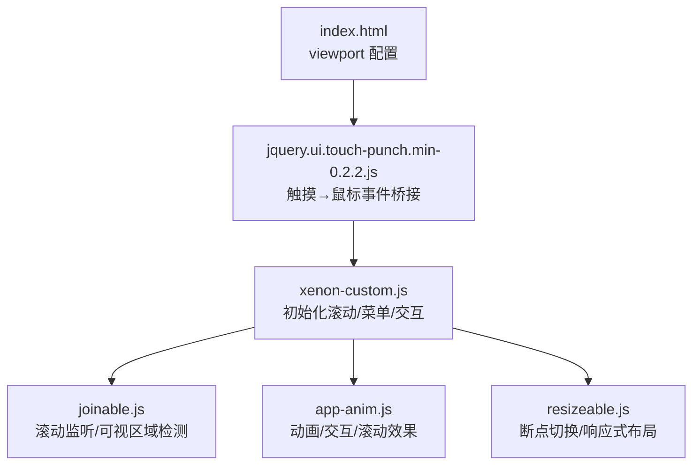
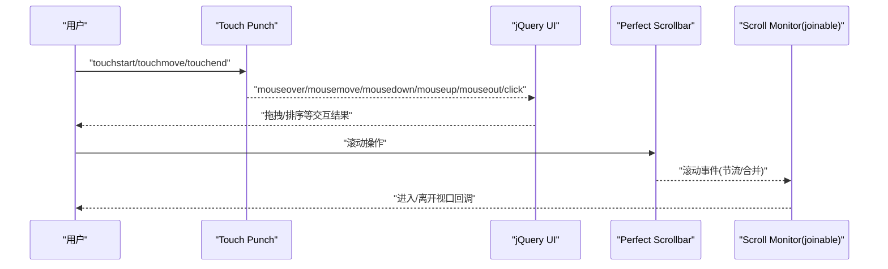
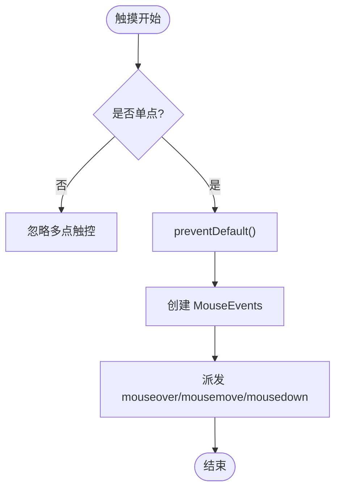
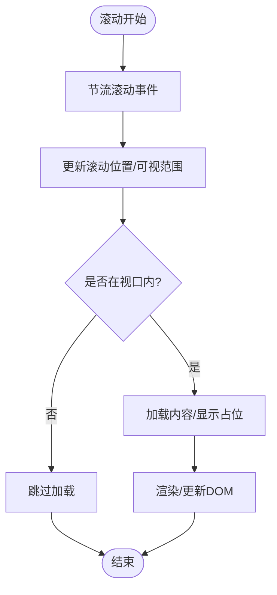
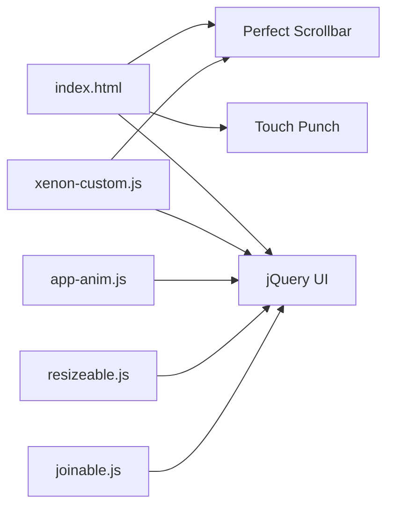

# 触摸交互优化

<cite>
**本文引用的文件**
- [index.html](file://index.html)
- [assets/js/jquery.ui.touch-punch.min-0.2.2.js](file://assets/js/jquery.ui.touch-punch.min-0.2.2.js)
- [assets/js/xenon-custom.js](file://assets/js/xenon-custom.js)
- [assets/js/app-anim.js](file://assets/js/app-anim.js)
- [assets/js/resizeable.js](file://assets/js/resizeable.js)
- [assets/js/joinable.js](file://assets/js/joinable.js)
- [assets/js/content-search.js](file://assets/js/content-search.js)
</cite>

## 目录
1. [简介](#简介)
2. [项目结构](#项目结构)
3. [核心组件](#核心组件)
4. [架构总览](#架构总览)
5. [详细组件分析](#详细组件分析)
6. [依赖关系分析](#依赖关系分析)
7. [性能考量](#性能考量)
8. [故障排查指南](#故障排查指南)
9. [结论](#结论)
10. [附录](#附录)

## 简介
本文件聚焦移动设备上的触摸交互优化，围绕以下目标展开：
- 原生触摸事件处理机制（touchstart、touchmove、touchend）与优化策略
- 手势识别实现（滑动、缩放、长按等）及性能优化
- 触摸反馈优化（视觉、触觉、动画）提升用户体验
- 移动端滚动优化（惯性滚动、滚动性能监控、虚拟滚动）
- 防抖与节流的最佳实践，避免频繁触发导致的性能问题
- 结合本项目代码的具体示例与测试方法

## 项目结构
本项目为基于 jQuery 的导航型 Web 应用，包含侧边栏、搜索、内容区等模块。与触摸交互相关的关键位置包括：
- 入口页面 meta viewport 配置，控制移动端缩放行为
- 通过 Touch Punch 将触摸事件映射为鼠标事件，兼容 jQuery UI 拖拽/可排序等交互
- 使用 Perfect Scrollbar 提供自定义滚动体验
- 响应式断点切换与侧边栏折叠逻辑
- 滚动监听与可视区域检测（用于懒加载或按需渲染）

图表来源
- [index.html:9-10](file://index.html#L9-L10)
- [assets/js/jquery.ui.touch-punch.min-0.2.2.js:1-11](file://assets/js/jquery.ui.touch-punch.min-0.2.2.js#L1-L11)
- [assets/js/xenon-custom.js:75-132](file://assets/js/xenon-custom.js#L75-L132)
- [assets/js/joinable.js:18-29](file://assets/js/joinable.js#L18-L29)
- [assets/js/app-anim.js:239-253](file://assets/js/app-anim.js#L239-L253)
- [assets/js/resizeable.js:21-59](file://assets/js/resizeable.js#L21-L59)

章节来源
- [index.html:9-10](file://index.html#L9-L10)
- [assets/js/jquery.ui.touch-punch.min-0.2.2.js:1-11](file://assets/js/jquery.ui.touch-punch.min-0.2.2.js#L1-L11)
- [assets/js/xenon-custom.js:75-132](file://assets/js/xenon-custom.js#L75-L132)
- [assets/js/joinable.js:18-29](file://assets/js/joinable.js#L18-L29)
- [assets/js/app-anim.js:239-253](file://assets/js/app-anim.js#L239-L253)
- [assets/js/resizeable.js:21-59](file://assets/js/resizeable.js#L21-L59)

## 核心组件
- 触摸到鼠标事件桥接：Touch Punch 在 touchstart/touchmove/touchend 上创建并派发 MouseEvents，使 jQuery UI 的 drag/sortable 等在移动端可用
- 滚动系统：Perfect Scrollbar 提供高性能滚动条；joinable.js 提供滚动监听与可视区域判断
- 响应式与交互：resizeable.js 管理断点变化；app-anim.js 负责动画与交互细节；xenon-custom.js 统一初始化各模块

章节来源
- [assets/js/jquery.ui.touch-punch.min-0.2.2.js:1-11](file://assets/js/jquery.ui.touch-punch.min-0.2.2.js#L1-L11)
- [assets/js/xenon-custom.js:75-132](file://assets/js/xenon-custom.js#L75-L132)
- [assets/js/joinable.js:18-29](file://assets/js/joinable.js#L18-L29)
- [assets/js/resizeable.js:21-59](file://assets/js/resizeable.js#L21-L59)
- [assets/js/app-anim.js:239-253](file://assets/js/app-anim.js#L239-L253)

## 架构总览
整体交互流程如下：
- 用户触摸屏幕 → 浏览器产生 touchstart/touchmove/touchend
- Touch Punch 拦截触摸事件，生成对应的 mouseover/mousemove/mousedown/mouseup/mouseout/click 事件并派发
- jQuery UI 的拖拽/可排序等组件接收鼠标事件完成交互
- 滚动由 Perfect Scrollbar 接管，配合 joinable.js 的滚动监听进行可视区域检测
- 响应式断点变化时，resizeable.js 调整布局与交互状态

图表来源
- [assets/js/jquery.ui.touch-punch.min-0.2.2.js:1-11](file://assets/js/jquery.ui.touch-punch.min-0.2.2.js#L1-L11)
- [assets/js/xenon-custom.js:75-132](file://assets/js/xenon-custom.js#L75-L132)
- [assets/js/joinable.js:18-29](file://assets/js/joinable.js#L18-L29)

## 详细组件分析

### 触摸事件处理机制与优化
- 事件桥接：Touch Punch 在 touchstart/touchmove/touchend 上绑定处理器，阻止默认行为，构造 MouseEvents 并派发，从而让 jQuery UI 的交互在移动端生效
- 多点触控保护：仅处理单点触摸，忽略多点触控场景，避免误触发
- 性能要点：
  - 使用 preventDefault 减少不必要的滚动冲突
  - 仅在必要时派发事件，降低主线程压力
  - 与 jQuery UI 的事件捕获配合，确保交互顺序正确

图表来源
- [assets/js/jquery.ui.touch-punch.min-0.2.2.js:1-11](file://assets/js/jquery.ui.touch-punch.min-0.2.2.js#L1-L11)

章节来源
- [assets/js/jquery.ui.touch-punch.min-0.2.2.js:1-11](file://assets/js/jquery.ui.touch-punch.min-0.2.2.js#L1-L11)

### 手势识别实现（滑动、缩放、长按）
- 滑动：可通过 Touch Punch + jQuery UI 的 sortable/draggable 实现列表项拖拽与重排；也可自行实现滑动阈值判定（例如记录起点与终点坐标差）
- 缩放：当前仓库未直接实现双指缩放手势；如需支持，可在 touchstart/touchmove 中计算两点距离变化，结合 requestAnimationFrame 更新元素 scale
- 长按：可在 touchstart 设置定时器，在 touchend/touchcancel 清除；达到时长阈值则触发长按回调
- 性能优化：
  - 使用 requestAnimationFrame 驱动动画与手势更新
  - 对高频事件（如 touchmove）进行节流，减少 DOM 操作
  - 避免在事件回调中进行昂贵计算，采用增量更新

章节来源
- [assets/js/jquery.ui.touch-punch.min-0.2.2.js:1-11](file://assets/js/jquery.ui.touch-punch.min-0.2.2.js#L1-L11)
- [assets/js/app-anim.js:239-253](file://assets/js/app-anim.js#L239-L253)

### 触摸反馈优化（视觉、触觉、动画）
- 视觉反馈：点击态、hover 态、加载指示器、提示框等；本项目中使用 tooltip、loading overlay、动画过渡等增强反馈
- 触觉反馈：可使用 navigator.vibrate API 在关键交互（如确认、错误）时提供震动反馈
- 动画效果：使用 CSS transition/transform 或 TweenMax 等库实现流畅动画；注意避免阻塞主线程的重绘/回流

章节来源
- [assets/js/app-anim.js:58-64](file://assets/js/app-anim.js#L58-L64)
- [assets/js/app-anim.js:239-253](file://assets/js/app-anim.js#L239-L253)

### 移动端滚动优化（惯性滚动、滚动性能监控、虚拟滚动）
- 惯性滚动：Perfect Scrollbar 提供平滑滚动体验，适合复杂容器内的滚动
- 滚动性能监控：joinable.js 提供滚动监听与可视区域检测，可用于懒加载图片、按需渲染列表项
- 虚拟滚动：对于长列表，建议仅渲染可视区域内的节点，结合滚动监听动态增减 DOM 节点，减少内存占用与重排开销

图表来源
- [assets/js/joinable.js:18-29](file://assets/js/joinable.js#L18-L29)
- [assets/js/xenon-custom.js:75-132](file://assets/js/xenon-custom.js#L75-L132)

章节来源
- [assets/js/joinable.js:18-29](file://assets/js/joinable.js#L18-L29)
- [assets/js/xenon-custom.js:75-132](file://assets/js/xenon-custom.js#L75-L132)

### 防抖与节流最佳实践
- 防抖（Debounce）：适用于 resize、search input 等低频触发但高成本的操作，等待一段时间不再触发再执行
- 节流（Throttle）：适用于 scroll、touchmove 等高频事件，限制单位时间内的执行次数
- 本项目中的实践：
  - 窗口 resize 使用 setTimeout 防抖（200ms），避免频繁重排
  - 滚动监听使用节流（100ms），降低滚动回调频率
  - 搜索输入建议使用防抖，减少请求频率

章节来源
- [assets/js/app-anim.js:35-45](file://assets/js/app-anim.js#L35-L45)
- [assets/js/joinable.js:18-29](file://assets/js/joinable.js#L18-L29)
- [assets/js/content-search.js:5-73](file://assets/js/content-search.js#L5-L73)

## 依赖关系分析
- index.html 引入 Touch Punch、jQuery UI、Perfect Scrollbar 等库
- xenon-custom.js 初始化滚动、菜单、表单等交互
- app-anim.js 处理动画与交互细节
- resizeable.js 管理响应式断点
- joinable.js 提供滚动监听能力

图表来源
- [index.html:9-10](file://index.html#L9-L10)
- [assets/js/xenon-custom.js:75-132](file://assets/js/xenon-custom.js#L75-L132)
- [assets/js/app-anim.js:239-253](file://assets/js/app-anim.js#L239-L253)
- [assets/js/resizeable.js:21-59](file://assets/js/resizeable.js#L21-L59)
- [assets/js/joinable.js:18-29](file://assets/js/joinable.js#L18-L29)

章节来源
- [index.html:9-10](file://index.html#L9-L10)
- [assets/js/xenon-custom.js:75-132](file://assets/js/xenon-custom.js#L75-L132)
- [assets/js/app-anim.js:239-253](file://assets/js/app-anim.js#L239-L253)
- [assets/js/resizeable.js:21-59](file://assets/js/resizeable.js#L21-L59)
- [assets/js/joinable.js:18-29](file://assets/js/joinable.js#L18-L29)

## 性能考量
- 事件处理：
  - 使用 preventDefault 避免不必要的滚动与默认行为
  - 对高频事件（scroll、touchmove）进行节流，减少主线程压力
- 动画与渲染：
  - 优先使用 transform/opacity 等合成属性，避免触发重排
  - 使用 requestAnimationFrame 驱动动画，保证帧率稳定
- 滚动优化：
  - 使用 Perfect Scrollbar 提升滚动体验
  - 使用滚动监听进行懒加载与虚拟滚动，减少 DOM 数量
- 响应式：
  - 合理设置断点，避免在小屏设备上启用重型交互
  - 根据设备类型启用/禁用特定功能（如 PC 上启用 tooltip，移动端简化）

[本节为通用指导，不直接分析具体文件]

## 故障排查指南
- 触摸无响应：
  - 检查是否引入了 Touch Punch，并确保其位于 jQuery UI 之前
  - 确认事件未被其他脚本 preventDefault 阻断
- 滚动卡顿：
  - 检查是否同时存在多个滚动库（如 native scroll 与 Perfect Scrollbar）导致冲突
  - 对滚动回调进行节流，避免过多 DOM 操作
- 动画掉帧：
  - 避免在动画回调中进行大量计算或 DOM 查询
  - 使用 requestAnimationFrame 与合成属性优化

章节来源
- [assets/js/jquery.ui.touch-punch.min-0.2.2.js:1-11](file://assets/js/jquery.ui.touch-punch.min-0.2.2.js#L1-L11)
- [assets/js/xenon-custom.js:75-132](file://assets/js/xenon-custom.js#L75-L132)
- [assets/js/joinable.js:18-29](file://assets/js/joinable.js#L18-L29)

## 结论
本项目通过 Touch Punch 将触摸事件映射为鼠标事件，使 jQuery UI 的交互在移动端可用；结合 Perfect Scrollbar 与滚动监听，实现了较为完善的滚动体验。为进一步优化触摸交互，建议：
- 在高频事件中广泛使用节流/防抖
- 使用 requestAnimationFrame 与合成属性优化动画
- 针对长列表实施虚拟滚动与懒加载
- 在关键交互处增加触觉反馈与清晰的视觉反馈

[本节为总结性内容，不直接分析具体文件]

## 附录
- 代码示例路径（不展示具体代码内容）：
  - 触摸→鼠标事件桥接：[assets/js/jquery.ui.touch-punch.min-0.2.2.js:1-11](file://assets/js/jquery.ui.touch-punch.min-0.2.2.js#L1-L11)
  - 滚动初始化与配置：[assets/js/xenon-custom.js:75-132](file://assets/js/xenon-custom.js#L75-L132)
  - 滚动监听与可视区域检测：[assets/js/joinable.js:18-29](file://assets/js/joinable.js#L18-L29)
  - 窗口 resize 防抖：[assets/js/app-anim.js:35-45](file://assets/js/app-anim.js#L35-L45)
  - 返回顶部与滚动效果：[assets/js/app-anim.js:239-253](file://assets/js/app-anim.js#L239-L253)
  - 搜索输入与请求：[assets/js/content-search.js:5-73](file://assets/js/content-search.js#L5-L73)

[本节为参考路径汇总，不直接分析具体文件]