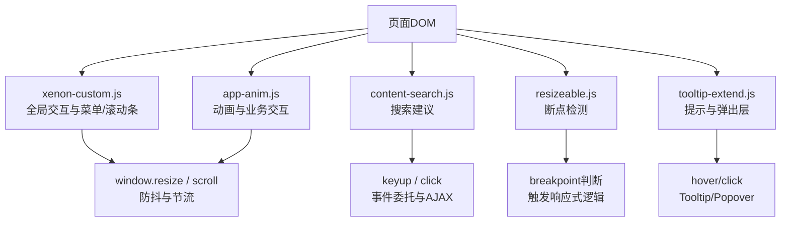
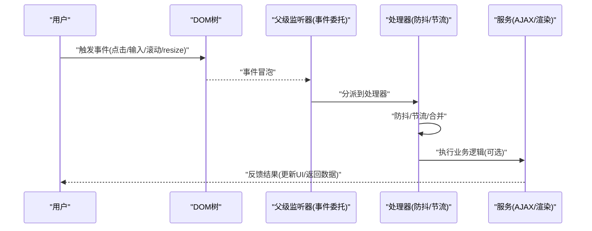
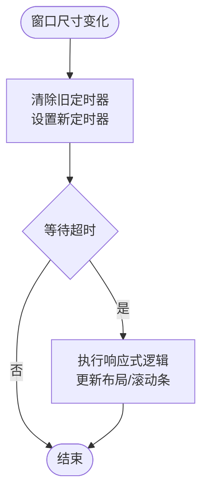
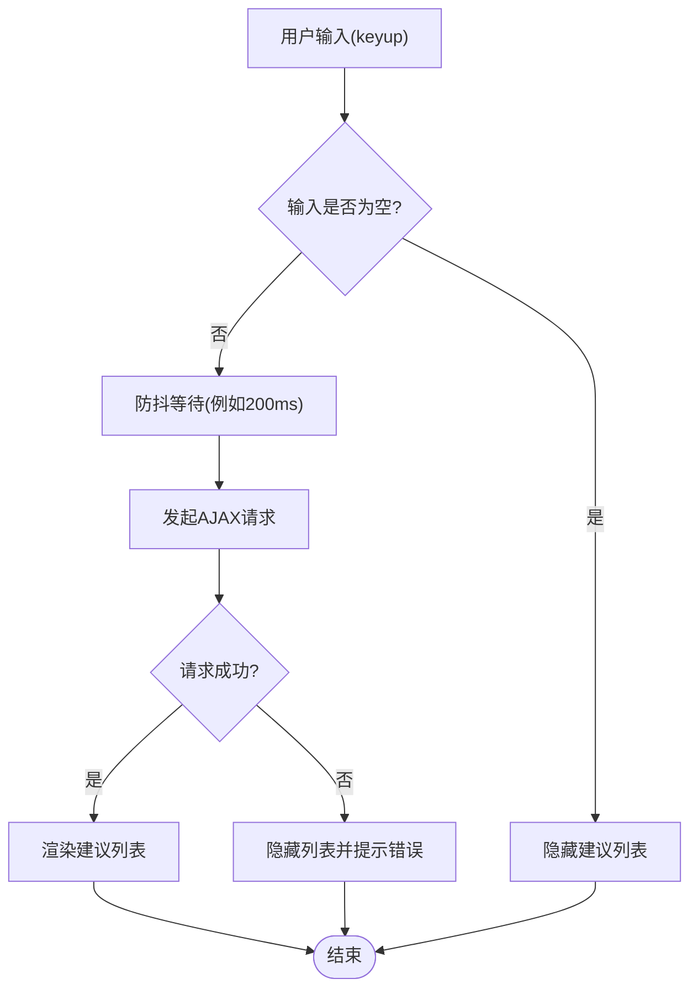
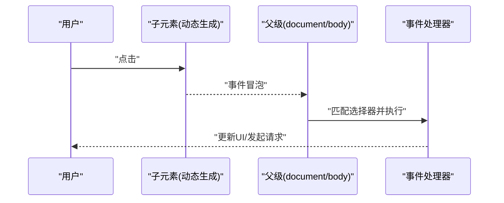
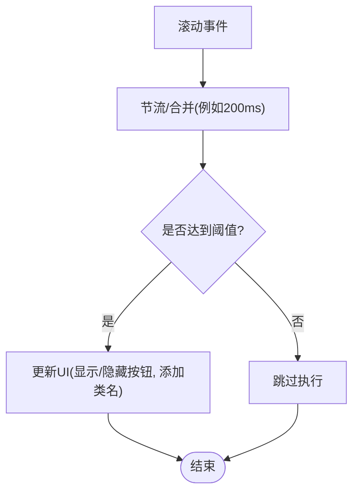
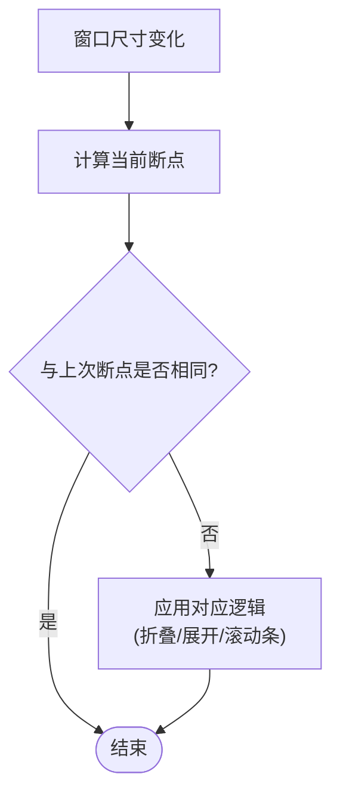
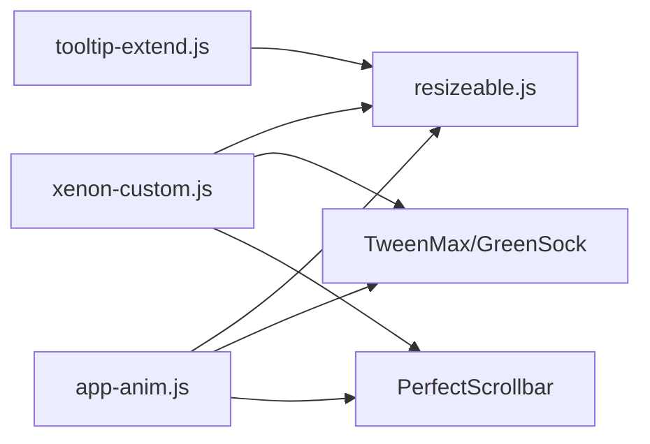

# 事件处理优化

<cite>
**本文引用的文件**
- [assets/js/xenon-custom.js](file://assets/js/xenon-custom.js)
- [assets/js/app-anim.js](file://assets/js/app-anim.js)
- [assets/js/content-search.js](file://assets/js/content-search.js)
- [assets/js/resizeable.js](file://assets/js/resizeable.js)
- [assets/js/tooltip-extend.js](file://assets/js/tooltip-extend.js)
</cite>

## 目录
1. [简介](#简介)
2. [项目结构](#项目结构)
3. [核心组件](#核心组件)
4. [架构总览](#架构总览)
5. [详细组件分析](#详细组件分析)
6. [依赖关系分析](#依赖关系分析)
7. [性能考量](#性能考量)
8. [故障排查指南](#故障排查指南)
9. [结论](#结论)
10. [附录](#附录)

## 简介
本文件围绕“高性能事件处理”的目标，结合仓库中的实际代码，系统梳理并总结以下优化实践：
- 事件委托与冒泡机制：通过父级统一监听减少监听器数量、降低内存占用与绑定成本。
- 防抖与节流：针对搜索输入、窗口 resize、滚动等高频事件进行频率控制，避免频繁计算与重排。
- 批量事件处理策略：合并多次触发、延迟执行，降低主线程压力。
- 监听器性能影响与控制：条件绑定、按需初始化、及时销毁，避免不必要的开销。
- 实战示例路径：提供具体文件与行号，便于快速定位与复用。

## 项目结构
本项目的前端交互逻辑主要分布在 assets/js 下的若干脚本中：
- xenon-custom.js：主题核心交互（菜单、滚动条、表单、滑块等），包含大量事件绑定与窗口尺寸变化处理。
- app-anim.js：页面动画与交互增强（夜间模式切换、点赞、滚动显示、侧边栏展开等）。
- content-search.js：搜索建议与键盘输入处理。
- resizeable.js：断点检测与响应式布局触发。
- tooltip-extend.js：工具提示与弹出层交互，以及部分窗口尺寸变化处理。

**图表来源**
- [assets/js/xenon-custom.js:1108-1113](file://assets/js/xenon-custom.js#L1108-L1113)
- [assets/js/app-anim.js:35-45](file://assets/js/app-anim.js#L35-L45)
- [assets/js/content-search.js:5-73](file://assets/js/content-search.js#L5-L73)
- [assets/js/resizeable.js:66-122](file://assets/js/resizeable.js#L66-L122)
- [assets/js/tooltip-extend.js:439-445](file://assets/js/tooltip-extend.js#L439-L445)

**章节来源**
- [assets/js/xenon-custom.js:1108-1113](file://assets/js/xenon-custom.js#L1108-L1113)
- [assets/js/app-anim.js:35-45](file://assets/js/app-anim.js#L35-L45)
- [assets/js/content-search.js:5-73](file://assets/js/content-search.js#L5-L73)
- [assets/js/resizeable.js:66-122](file://assets/js/resizeable.js#L66-L122)
- [assets/js/tooltip-extend.js:439-445](file://assets/js/tooltip-extend.js#L439-L445)

## 核心组件
- 窗口尺寸变化处理（防抖）：在多个文件中对 window.resize 使用 clearTimeout/setTimeout 实现防抖，避免频繁触发响应式逻辑。
- 滚动与交互（节流/批处理）：滚动时更新UI或统计，采用定时器合并多次触发，减少重绘与网络请求。
- 事件委托：通过 $(document).on(...) 或 $('body').on(...) 将子元素事件统一委派到父节点，减少监听器数量。
- 搜索输入（防抖建议）：当前实现为每次 keyup 直接发起 AJAX，可引入防抖以降低请求频率。
- 断点检测与响应式：根据窗口宽度判断设备类型，触发不同逻辑（如侧边栏折叠、滚动条初始化）。

**章节来源**
- [assets/js/xenon-custom.js:1108-1113](file://assets/js/xenon-custom.js#L1108-L1113)
- [assets/js/app-anim.js:35-45](file://assets/js/app-anim.js#L35-L45)
- [assets/js/content-search.js:5-73](file://assets/js/content-search.js#L5-L73)
- [assets/js/resizeable.js:66-122](file://assets/js/resizeable.js#L66-L122)
- [assets/js/tooltip-extend.js:439-445](file://assets/js/tooltip-extend.js#L439-L445)

## 架构总览
整体事件处理流程如下：
- 用户操作（点击、输入、滚动、窗口大小变化）触发浏览器事件。
- 事件冒泡至已绑定的父级监听器（事件委托）。
- 根据目标元素特征与上下文，调用相应处理函数。
- 对高频事件应用防抖/节流，合并或延迟执行。
- 必要时发起网络请求或更新DOM，完成交互闭环。

[此图为概念性流程图，不直接映射具体源码文件]

## 详细组件分析

### 窗口尺寸变化处理（防抖）
- 现象：多处对 window.resize 使用 clearTimeout/setTimeout，确保在用户停止调整窗口大小后才执行一次逻辑。
- 优点：显著减少 resize 回调的调用次数，避免频繁计算布局与样式。
- 关键位置：
  - 主题核心：在 xenon-custom.js 中对 resize 进行防抖，调用统一的 trigger_resizable。
  - 动画模块：在 app-anim.js 中同样对 resize 进行防抖，调用 go_resize 以更新页脚与侧边栏状态。
  - 提示扩展：在 tooltip-extend.js 中也有类似的防抖实现。

**图表来源**
- [assets/js/xenon-custom.js:1108-1113](file://assets/js/xenon-custom.js#L1108-L1113)
- [assets/js/app-anim.js:35-45](file://assets/js/app-anim.js#L35-L45)
- [assets/js/tooltip-extend.js:439-445](file://assets/js/tooltip-extend.js#L439-L445)

**章节来源**
- [assets/js/xenon-custom.js:1108-1113](file://assets/js/xenon-custom.js#L1108-L1113)
- [assets/js/app-anim.js:35-45](file://assets/js/app-anim.js#L35-L45)
- [assets/js/tooltip-extend.js:439-445](file://assets/js/tooltip-extend.js#L439-L445)

### 搜索输入（建议引入防抖）
- 现状：content-search.js 在 keyup 事件中直接发起 AJAX 请求获取搜索建议，未做防抖。
- 风险：用户快速输入时会频繁触发网络请求，增加服务器压力与客户端开销。
- 建议：为搜索输入添加防抖，例如在 200-300ms 内只执行一次请求；或在输入为空时立即隐藏建议列表。
- 参考位置：
  - 搜索建议与AJAX：content-search.js 中 keyup 与 success/error 回调。

**图表来源**
- [assets/js/content-search.js:5-73](file://assets/js/content-search.js#L5-L73)

**章节来源**
- [assets/js/content-search.js:5-73](file://assets/js/content-search.js#L5-L73)

### 事件委托与冒泡机制
- 实践：多处使用 $(document).on('click', '.selector', handler) 或 $('body').on(...)，将子元素事件统一委派到父级。
- 优势：减少监听器数量，提升动态内容的事件处理能力，降低内存占用。
- 典型场景：
  - 点赞按钮、夜间模式切换、下载统计等动态元素的事件处理。
  - 侧边栏菜单项点击、面板关闭/重载等交互。

**图表来源**
- [assets/js/app-anim.js:58-64](file://assets/js/app-anim.js#L58-L64)
- [assets/js/app-anim.js:140-167](file://assets/js/app-anim.js#L140-L167)
- [assets/js/app-anim.js:202-219](file://assets/js/app-anim.js#L202-L219)
- [assets/js/xenon-custom.js:407-415](file://assets/js/xenon-custom.js#L407-L415)

**章节来源**
- [assets/js/app-anim.js:58-64](file://assets/js/app-anim.js#L58-L64)
- [assets/js/app-anim.js:140-167](file://assets/js/app-anim.js#L140-L167)
- [assets/js/app-anim.js:202-219](file://assets/js/app-anim.js#L202-L219)
- [assets/js/xenon-custom.js:407-415](file://assets/js/xenon-custom.js#L407-L415)

### 滚动事件与批处理
- 实践：在滚动时更新“回到顶部”按钮显示、头部背景等，结合定时器进行批处理，避免每帧都执行复杂逻辑。
- 优化点：
  - 使用 requestAnimationFrame 或 setTimeout 合并多次滚动回调。
  - 仅在滚动超过阈值时执行必要的DOM操作。
- 参考位置：
  - 滚动显示“回到顶部”：app-anim.js 中 window.scroll 的处理。

**图表来源**
- [assets/js/app-anim.js:239-247](file://assets/js/app-anim.js#L239-L247)

**章节来源**
- [assets/js/app-anim.js:239-247](file://assets/js/app-anim.js#L239-L247)

### 断点检测与响应式逻辑
- 实践：通过 get_current_breakpoint 与 is/isxs/ismdxl 等函数判断当前设备类型，触发不同的交互逻辑（如侧边栏折叠、滚动条初始化/销毁）。
- 优势：集中管理断点逻辑，便于维护与扩展。
- 参考位置：
  - 断点检测与触发：resizeable.js 与 tooltip-extend.js 中的相关函数。

**图表来源**
- [assets/js/resizeable.js:66-122](file://assets/js/resizeable.js#L66-L122)
- [assets/js/tooltip-extend.js:43-86](file://assets/js/tooltip-extend.js#L43-L86)

**章节来源**
- [assets/js/resizeable.js:66-122](file://assets/js/resizeable.js#L66-L122)
- [assets/js/tooltip-extend.js:43-86](file://assets/js/tooltip-extend.js#L43-L86)

## 依赖关系分析
- 模块耦合：
  - xenon-custom.js 与 app-anim.js 均依赖 window.resize 与滚动事件，存在重复的防抖实现，可考虑抽取公共函数。
  - resizeable.js 与 tooltip-extend.js 共享断点检测逻辑，可进一步抽象为独立模块。
- 外部依赖：
  - jQuery：用于事件绑定与DOM操作。
  - TweenMax/GreenSock：用于动画与时间轴控制。
  - PerfectScrollbar：用于自定义滚动条。
- 潜在循环依赖：未发现明显循环依赖，但建议在大型项目中对通用逻辑进行模块化拆分，降低耦合度。

**图表来源**
- [assets/js/xenon-custom.js:1108-1113](file://assets/js/xenon-custom.js#L1108-L1113)
- [assets/js/app-anim.js:35-45](file://assets/js/app-anim.js#L35-L45)
- [assets/js/resizeable.js:66-122](file://assets/js/resizeable.js#L66-L122)
- [assets/js/tooltip-extend.js:439-445](file://assets/js/tooltip-extend.js#L439-L445)

**章节来源**
- [assets/js/xenon-custom.js:1108-1113](file://assets/js/xenon-custom.js#L1108-L1113)
- [assets/js/app-anim.js:35-45](file://assets/js/app-anim.js#L35-L45)
- [assets/js/resizeable.js:66-122](file://assets/js/resizeable.js#L66-L122)
- [assets/js/tooltip-extend.js:439-445](file://assets/js/tooltip-extend.js#L439-L445)

## 性能考量
- 监听器数量控制：
  - 优先使用事件委托，减少每个子元素的监听器数量。
  - 对动态生成的元素，确保在插入DOM后再绑定事件或使用委托。
- 高频事件优化：
  - 对 window.resize、scroll、mousemove 等高频事件使用防抖/节流。
  - 合并多次触发，延迟执行，避免阻塞主线程。
- 条件绑定：
  - 仅在需要时初始化滚动条、工具提示等插件，减少不必要的开销。
  - 根据设备类型或屏幕尺寸启用/禁用特定功能。
- 内存管理：
  - 在页面卸载或模块销毁时移除事件监听器，防止内存泄漏。
  - 避免在高频回调中进行昂贵的DOM查询与样式计算。

[本节为通用指导，不直接分析具体文件]

## 故障排查指南
- 搜索建议卡顿：
  - 检查是否在 keyup 中直接发起AJAX，建议加入防抖。
  - 参考：content-search.js 中的 keyup 与 AJAX 逻辑。
- 窗口调整卡顿：
  - 确认是否对 window.resize 进行了防抖处理。
  - 参考：xenon-custom.js、app-anim.js、tooltip-extend.js 中的防抖实现。
- 滚动性能问题：
  - 检查滚动回调是否过于频繁，考虑节流或合并执行。
  - 参考：app-anim.js 中的滚动处理。
- 事件委托失效：
  - 确认父级元素是否存在且未被移除。
  - 检查选择器是否正确匹配目标元素。
  - 参考：app-anim.js、xenon-custom.js 中的 $(document).on(...) 用法。

**章节来源**
- [assets/js/content-search.js:5-73](file://assets/js/content-search.js#L5-L73)
- [assets/js/xenon-custom.js:1108-1113](file://assets/js/xenon-custom.js#L1108-L1113)
- [assets/js/app-anim.js:35-45](file://assets/js/app-anim.js#L35-L45)
- [assets/js/app-anim.js:239-247](file://assets/js/app-anim.js#L239-L247)

## 结论
本项目在事件处理方面已具备较好的基础：
- 广泛使用事件委托，有效减少了监听器数量。
- 对窗口尺寸变化进行了防抖处理，提升了响应式性能。
- 滚动与交互逻辑中使用了定时器进行批处理，降低了主线程压力。
建议进一步优化：
- 为搜索输入添加防抖，降低网络请求频率。
- 抽取通用的防抖/节流函数，避免重复实现。
- 对高频滚动事件进行节流，提升滚动流畅度。
- 定期审查事件监听器的生命周期，避免内存泄漏。

[本节为总结性内容，不直接分析具体文件]

## 附录
- 关键实现路径参考：
  - 窗口尺寸防抖：[assets/js/xenon-custom.js:1108-1113](file://assets/js/xenon-custom.js#L1108-L1113)、[assets/js/app-anim.js:35-45](file://assets/js/app-anim.js#L35-L45)、[assets/js/tooltip-extend.js:439-445](file://assets/js/tooltip-extend.js#L439-L445)
  - 搜索输入与AJAX：[assets/js/content-search.js:5-73](file://assets/js/content-search.js#L5-L73)
  - 断点检测与响应式：[assets/js/resizeable.js:66-122](file://assets/js/resizeable.js#L66-L122)、[assets/js/tooltip-extend.js:43-86](file://assets/js/tooltip-extend.js#L43-L86)
  - 滚动批处理：[assets/js/app-anim.js:239-247](file://assets/js/app-anim.js#L239-L247)
  - 事件委托示例：[assets/js/app-anim.js:58-64](file://assets/js/app-anim.js#L58-L64)、[assets/js/xenon-custom.js:407-415](file://assets/js/xenon-custom.js#L407-L415)

[本节为索引性内容，不直接分析具体文件]