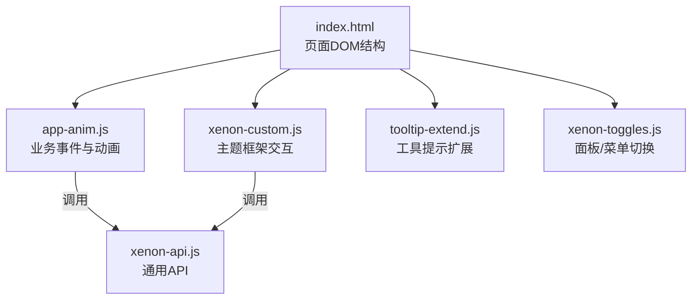
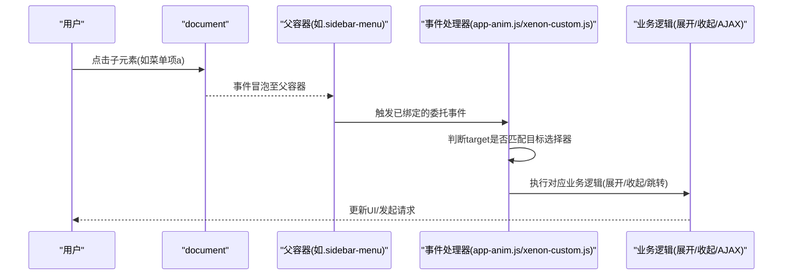
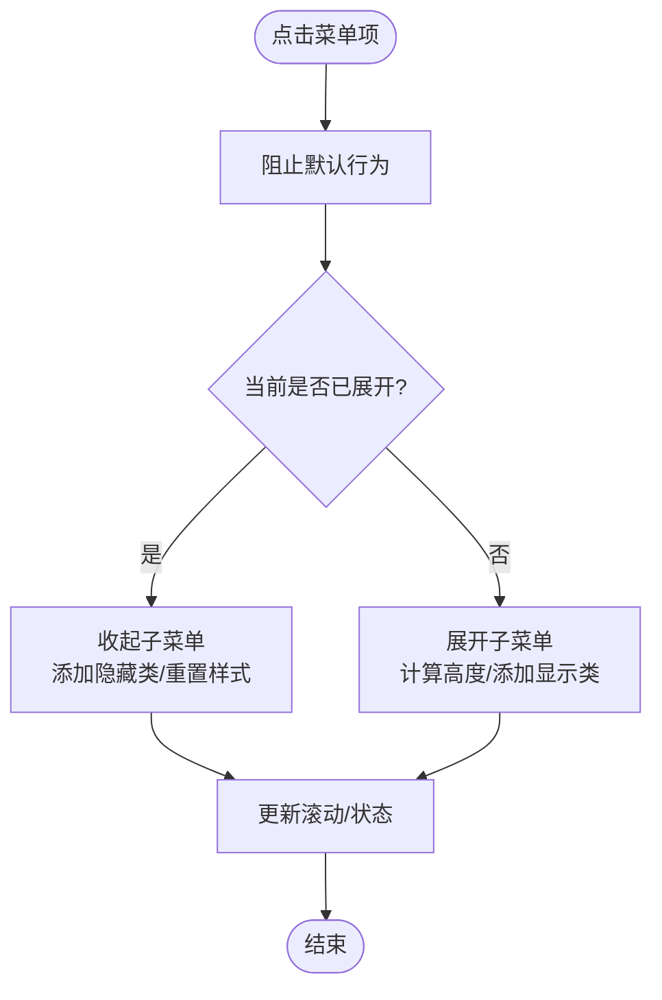
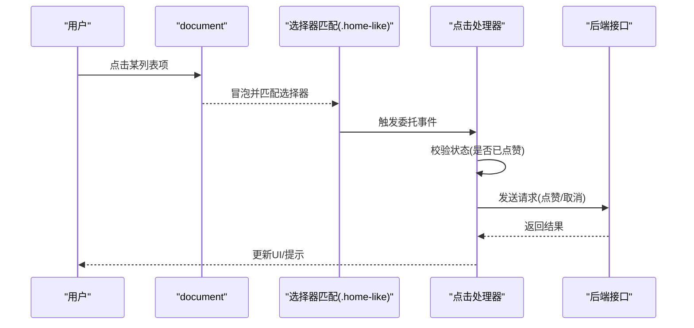
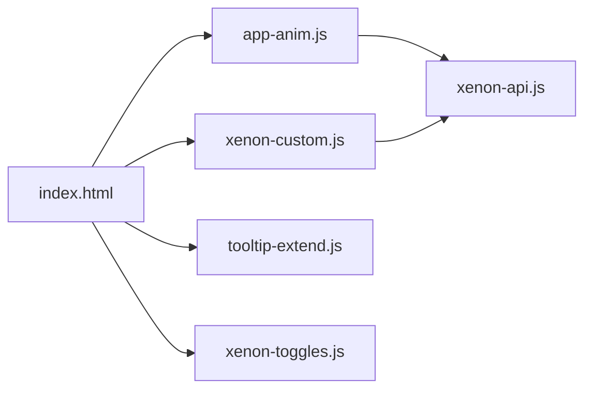

# 事件委托技术

<cite>
**本文引用的文件**
- [index.html](file://index.html)
- [assets/js/app-anim.js](file://assets/js/app-anim.js)
- [assets/js/xenon-custom.js](file://assets/js/xenon-custom.js)
- [assets/js/tooltip-extend.js](file://assets/js/tooltip-extend.js)
- [assets/js/xenon-toggles.js](file://assets/js/xenon-toggles.js)
- [assets/js/xenon-api.js](file://assets/js/xenon-api.js)
- [README.md](file://README.md)
</cite>

## 目录
1. [简介](#简介)
2. [项目结构](#项目结构)
3. [核心组件](#核心组件)
4. [架构总览](#架构总览)
5. [详细组件分析](#详细组件分析)
6. [依赖关系分析](#依赖关系分析)
7. [性能考量](#性能考量)
8. [故障排查指南](#故障排查指南)
9. [结论](#结论)
10. [附录](#附录)

## 简介
本文件围绕“事件委托”技术，结合本项目中的侧边栏菜单、导航链接点击等实际代码，系统阐述如何利用事件冒泡机制在父元素上统一监听子元素事件，从而减少监听器数量、提升性能与可维护性。文档同时给出适用场景、实现要点、最佳实践与常见问题排查方法。

## 项目结构
本项目为纯静态网站，前端交互逻辑主要分布在多个 JavaScript 文件中：
- index.html：页面结构与 DOM 骨架（包含侧边栏、主内容区、搜索区域等）
- assets/js/app-anim.js：业务交互与动画相关的事件绑定（大量使用 jQuery 的 .on() 进行事件委托）
- assets/js/xenon-custom.js：主题框架的核心交互（包括侧边栏菜单展开/收起、水平菜单等）
- assets/js/tooltip-extend.js：工具提示扩展与部分菜单行为
- assets/js/xenon-toggles.js：面板切换、移动端菜单等开关逻辑
- assets/js/xenon-api.js：通用 API（如加载进度条）

图表来源
- [index.html:44-216](file://index.html#L44-L216)
- [assets/js/app-anim.js:1-120](file://assets/js/app-anim.js#L1-L120)
- [assets/js/xenon-custom.js:1152-1265](file://assets/js/xenon-custom.js#L1152-L1265)
- [assets/js/tooltip-extend.js:570-614](file://assets/js/tooltip-extend.js#L570-L614)
- [assets/js/xenon-toggles.js:111-132](file://assets/js/xenon-toggles.js#L111-L132)
- [assets/js/xenon-api.js:21-91](file://assets/js/xenon-api.js#L21-L91)

章节来源
- [index.html:44-216](file://index.html#L44-L216)
- [README.md:298-314](file://README.md#L298-L314)

## 核心组件
- 侧边栏菜单（sidebar-menu）：负责分类折叠/展开、二级菜单显示、最小化模式下的悬浮面板等
- 导航链接与列表项：首页卡片、搜索类型选择、AJAX 动态加载列表等
- 面板与开关：设置面板、聊天面板、移动端菜单等
- 通用工具：加载进度条、滚动处理、响应式断点判断等

这些组件通过 jQuery 的事件系统完成交互，其中多处采用事件委托（将事件绑定到父容器或 document，再根据目标元素匹配处理），有效降低监听器数量并支持动态元素。

章节来源
- [assets/js/app-anim.js:58-179](file://assets/js/app-anim.js#L58-L179)
- [assets/js/xenon-custom.js:1152-1265](file://assets/js/xenon-custom.js#L1152-L1265)
- [assets/js/tooltip-extend.js:570-614](file://assets/js/tooltip-extend.js#L570-L614)
- [assets/js/xenon-toggles.js:111-132](file://assets/js/xenon-toggles.js#L111-L132)

## 架构总览
下图展示了事件从用户操作到具体处理的流程，以及事件委托在其中的作用位置。

图表来源
- [assets/js/app-anim.js:58-179](file://assets/js/app-anim.js#L58-L179)
- [assets/js/xenon-custom.js:1152-1265](file://assets/js/xenon-custom.js#L1152-L1265)
- [assets/js/tooltip-extend.js:570-614](file://assets/js/tooltip-extend.js#L570-L614)

## 详细组件分析

### 侧边栏菜单的事件委托与优化
- 工作原理
  - 在 xenon-custom.js 中，针对带有子菜单的 li 元素，为其 a 标签绑定 click 事件，用于展开/收起子菜单；同时提供 expand/collapse 函数配合动画库进行高度过渡。
  - 在 tooltip-extend.js 中，对水平菜单也做了类似的展开/收起逻辑，并在移动端与点击展开模式下分别处理。
  - app-anim.js 中对侧边栏的最小化按钮、二级悬浮面板等也使用了事件委托，确保动态生成的元素也能正确响应。

- 适用场景
  - 大量相似结构的菜单项（每个 li>a 都有相同行为）
  - 动态增删菜单项（事件委托无需重新绑定）
  - 多级嵌套菜单（利用冒泡统一处理）

- 关键实现要点
  - 阻止默认行为：ev.preventDefault() 避免锚点跳转干扰展开/收起
  - 状态管理：通过类名（如 expanded/opened）与 data 属性控制状态
  - 动画与滚动：使用 TweenMax 进行高度动画，必要时更新滚动条

图表来源
- [assets/js/xenon-custom.js:1152-1265](file://assets/js/xenon-custom.js#L1152-L1265)
- [assets/js/tooltip-extend.js:570-614](file://assets/js/tooltip-extend.js#L570-L614)

章节来源
- [assets/js/xenon-custom.js:1152-1265](file://assets/js/xenon-custom.js#L1152-L1265)
- [assets/js/tooltip-extend.js:570-614](file://assets/js/tooltip-extend.js#L570-L614)

### 导航链接与列表项点击的事件委托
- 工作原理
  - app-anim.js 中使用 $(document).on('click', '.home-like', ...) 等形式，将事件绑定到 document，再通过选择器匹配实际目标元素，实现事件委托。
  - 对于 AJAX 动态加载的列表项（如 .ajax-list a），同样采用委托方式，确保新插入的元素自动具备交互能力。

- 适用场景
  - 动态渲染的列表项（如搜索结果、分页加载）
  - 大量相似按钮/链接的统一处理（点赞、收藏、统计等）

- 关键实现要点
  - 使用 event.target 或 this 获取真实触发元素
  - 防止重复触发（如已点赞状态检查）
  - 错误处理与用户反馈（网络错误提示、禁用态）

图表来源
- [assets/js/app-anim.js:140-179](file://assets/js/app-anim.js#L140-L179)

章节来源
- [assets/js/app-anim.js:140-179](file://assets/js/app-anim.js#L140-L179)

### 面板与开关的事件委托
- 工作原理
  - xenon-toggles.js 中为多种 data-toggle 元素绑定 click 事件，通过切换 class 控制面板显示/隐藏，并在需要时更新滚动条或触发自定义事件。
  - 这类开关通常数量不多，但涉及全局 UI 状态变化，适合集中管理。

- 适用场景
  - 设置面板、聊天面板、移动端菜单等全局开关
  - 需要与滚动、布局联动的交互

- 关键实现要点
  - 统一入口：通过 data-toggle 值分发不同逻辑
  - 兼容动画与非动画路径
  - 触发窗口 resize 事件以刷新布局

章节来源
- [assets/js/xenon-toggles.js:111-132](file://assets/js/xenon-toggles.js#L111-L132)

### 通用工具与加载进度条
- 工作原理
  - xenon-api.js 提供 show_loading_bar / hide_loading_bar 等工具函数，用于在异步操作期间展示进度条，增强用户体验。
  - 这些函数被其他模块调用，形成统一的视觉反馈。

- 适用场景
  - 页面加载、AJAX 请求、复杂动画前的等待提示

章节来源
- [assets/js/xenon-api.js:21-91](file://assets/js/xenon-api.js#L21-L91)

## 依赖关系分析
- 事件委托的主要实现集中在 app-anim.js、xenon-custom.js、tooltip-extend.js、xenon-toggles.js
- 这些文件共同依赖 jQuery 与第三方动画库（TweenMax），并通过公共变量 public_vars 共享 DOM 引用
- 页面结构由 index.html 提供，所有交互均基于该 DOM 树

图表来源
- [index.html:44-216](file://index.html#L44-L216)
- [assets/js/app-anim.js:1-120](file://assets/js/app-anim.js#L1-L120)
- [assets/js/xenon-custom.js:1152-1265](file://assets/js/xenon-custom.js#L1152-L1265)
- [assets/js/tooltip-extend.js:570-614](file://assets/js/tooltip-extend.js#L570-L614)
- [assets/js/xenon-toggles.js:111-132](file://assets/js/xenon-toggles.js#L111-L132)
- [assets/js/xenon-api.js:21-91](file://assets/js/xenon-api.js#L21-L91)

章节来源
- [assets/js/app-anim.js:1-120](file://assets/js/app-anim.js#L1-L120)
- [assets/js/xenon-custom.js:1152-1265](file://assets/js/xenon-custom.js#L1152-L1265)
- [assets/js/tooltip-extend.js:570-614](file://assets/js/tooltip-extend.js#L570-L614)
- [assets/js/xenon-toggles.js:111-132](file://assets/js/xenon-toggles.js#L111-L132)
- [assets/js/xenon-api.js:21-91](file://assets/js/xenon-api.js#L21-L91)

## 性能考量
- 减少监听器数量：通过事件委托将多个子元素的事件统一绑定到父容器或 document，显著降低内存占用与事件分发开销
- 动态元素友好：新增的子元素无需重新绑定事件，天然支持动态渲染
- 合理选择委托层级：尽量将事件绑定到最近的稳定父节点，避免过度冒泡到 document 造成不必要的匹配成本
- 避免频繁重排重绘：在展开/收起时使用 CSS 类切换与动画库优化，减少直接样式操作
- 防抖与节流：对高频事件（如滚动、resize）进行节流，避免性能抖动

[本节为通用指导，不直接分析具体文件]

## 故障排查指南
- 事件未触发
  - 检查选择器是否正确匹配目标元素
  - 确认父容器是否存在且未被移除
  - 查看是否有 preventDefault 或 stopPropagation 影响事件流
- 动态元素无响应
  - 确认使用的是事件委托而非直接绑定
  - 检查元素是否在委托后插入 DOM
- 多次触发或状态异常
  - 检查是否重复绑定事件
  - 核对状态类名（如 expanded/opened）与数据属性的一致性
- 动画卡顿
  - 检查 TweenMax 配置与高度计算逻辑
  - 避免在动画过程中频繁修改样式

章节来源
- [assets/js/app-anim.js:58-179](file://assets/js/app-anim.js#L58-L179)
- [assets/js/xenon-custom.js:1152-1265](file://assets/js/xenon-custom.js#L1152-L1265)
- [assets/js/tooltip-extend.js:570-614](file://assets/js/tooltip-extend.js#L570-L614)
- [assets/js/xenon-toggles.js:111-132](file://assets/js/xenon-toggles.js#L111-L132)

## 结论
本项目广泛采用事件委托技术，尤其在侧边栏菜单、导航链接与动态列表等场景中，通过父元素监听子元素事件，有效减少了监听器数量，提升了性能与可维护性。结合合理的状态管理、动画优化与错误处理，实现了流畅的用户体验。建议在后续开发中继续遵循事件委托的最佳实践，并根据实际场景选择合适的委托层级与选择器，以获得更优的性能表现。

[本节为总结性内容，不直接分析具体文件]

## 附录
- 事件委托最佳实践清单
  - 优先将事件绑定到稳定的父容器或 document
  - 使用精确的选择器匹配目标元素
  - 在处理器中合理使用 preventDefault 与 stopPropagation
  - 对动态元素采用委托，避免重复绑定
  - 对高频事件进行节流/防抖
  - 保持状态一致性与可预测性

[本节为通用指导，不直接分析具体文件]