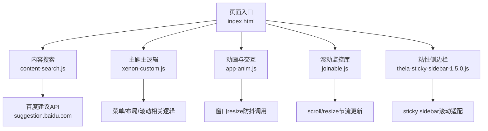
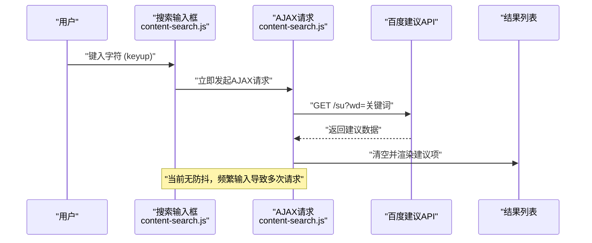
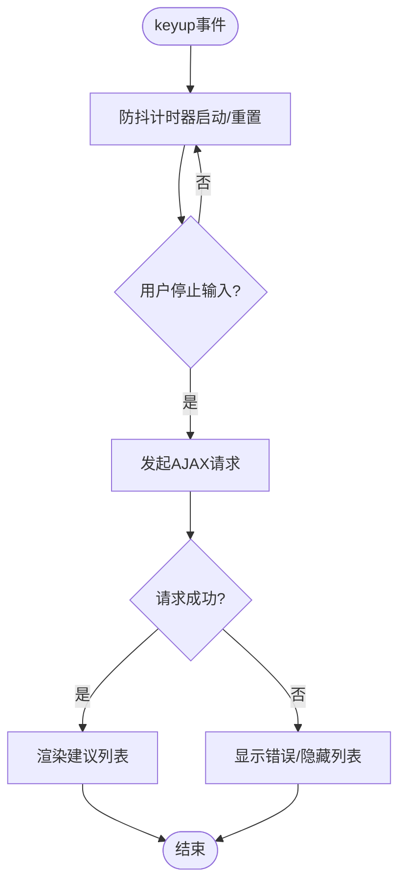
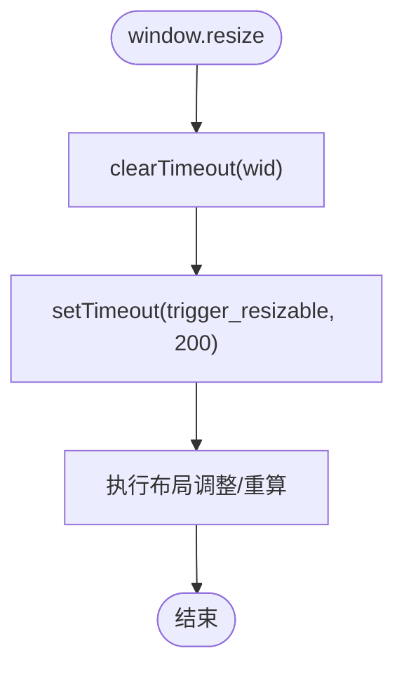
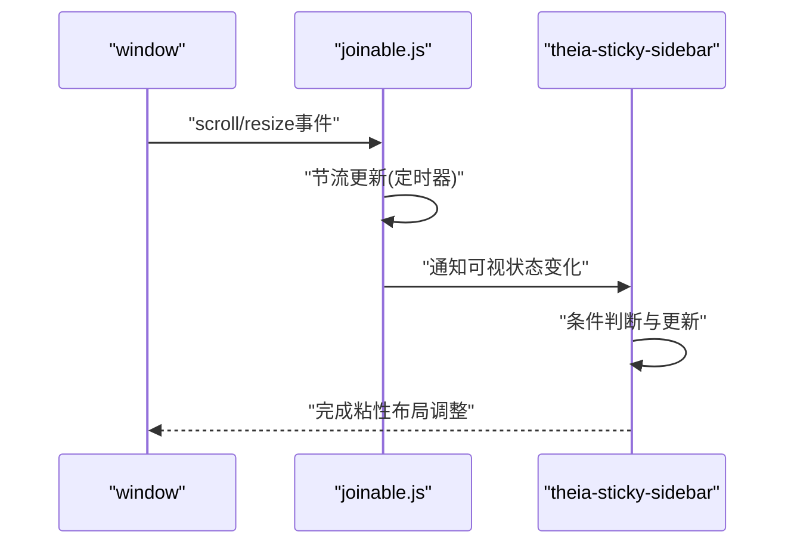
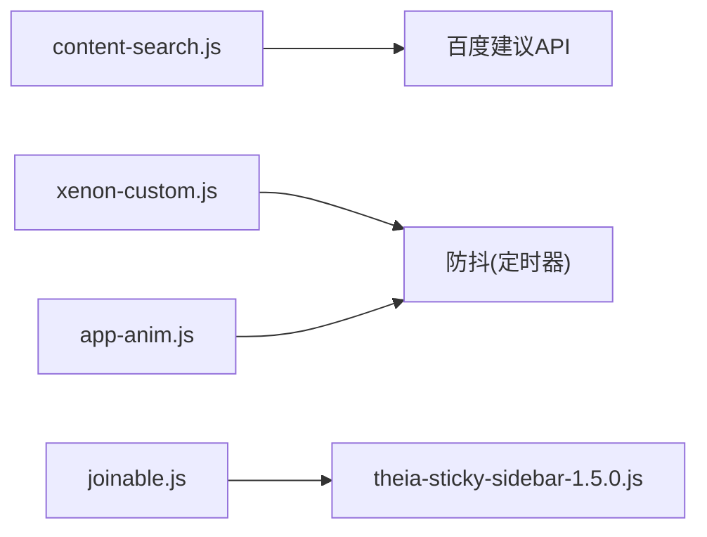

# 防抖与节流

<cite>
**本文引用的文件**
- [content-search.js](file://assets/js/content-search.js)
- [xenon-custom.js](file://assets/js/xenon-custom.js)
- [app-anim.js](file://assets/js/app-anim.js)
- [joinable.js](file://assets/js/joinable.js)
- [theia-sticky-sidebar-1.5.0.js](file://assets/js/theia-sticky-sidebar-1.5.0.js)
</cite>

## 目录
1. [简介](#简介)
2. [项目结构](#项目结构)
3. [核心组件](#核心组件)
4. [架构总览](#架构总览)
5. [详细组件分析](#详细组件分析)
6. [依赖关系分析](#依赖关系分析)
7. [性能考量](#性能考量)
8. [故障排查指南](#故障排查指南)
9. [结论](#结论)
10. [附录](#附录)

## 简介
本文件围绕高频事件处理的两种经典优化技术——防抖（Debounce）与节流（Throttle），结合本项目中的实际代码进行系统化说明。重点包括：
- 防抖：在用户输入、搜索建议等“等待操作完成”的场景中，合并多次触发，仅在停止后执行一次。
- 节流：在滚动、鼠标移动、窗口resize等“限制执行频率”的场景中，按固定时间间隔执行，避免过度计算。
- 项目中content-search.js的搜索实现现状与改进建议；xenon-custom.js与app-anim.js中的resize/滚动相关处理模式分析；以及第三方库joinable.js、theia-sticky-sidebar-1.5.0.js中的滚动优化实践。

## 项目结构
本项目前端资源位于assets目录下，关键脚本包括：
- assets/js/content-search.js：搜索建议功能，绑定键盘事件并发起AJAX请求。
- assets/js/xenon-custom.js：主题主逻辑，包含窗口resize处理、菜单交互、滚动监听等。
- assets/js/app-anim.js：动画与交互增强，包含窗口resize防抖调用。
- assets/js/joinable.js：滚动可视区域监控库（scrollMonitor），内部对scroll事件做了节流式更新。
- assets/js/theia-sticky-sidebar-1.5.0.js：粘性侧边栏插件，监听滚动并做条件判断与更新。

**图表来源**
- [content-search.js:1-91](file://assets/js/content-search.js#L1-L91)
- [xenon-custom.js:1107-1116](file://assets/js/xenon-custom.js#L1107-L1116)
- [app-anim.js:34-45](file://assets/js/app-anim.js#L34-L45)
- [joinable.js:18-19](file://assets/js/joinable.js#L18-L19)
- [theia-sticky-sidebar-1.5.0.js:152-178](file://assets/js/theia-sticky-sidebar-1.5.0.js#L152-L178)

**章节来源**
- [content-search.js:1-91](file://assets/js/content-search.js#L1-L91)
- [xenon-custom.js:1107-1116](file://assets/js/xenon-custom.js#L1107-L1116)
- [app-anim.js:34-45](file://assets/js/app-anim.js#L34-L45)
- [joinable.js:18-19](file://assets/js/joinable.js#L18-L19)
- [theia-sticky-sidebar-1.5.0.js:152-178](file://assets/js/theia-sticky-sidebar-1.5.0.js#L152-L178)

## 核心组件
- 搜索建议（content-search.js）
  - 行为：监听输入框keyup事件，直接发起AJAX请求获取搜索建议。
  - 问题：未使用防抖，频繁输入会导致大量网络请求与DOM更新。
  - 建议：为keyup事件添加防抖，延迟一定时间（如300ms）后再发送请求，提升用户体验与性能。
- 窗口resize处理（xenon-custom.js, app-anim.js）
  - xenon-custom.js：通过setTimeout/clearTimeout实现简单的防抖，延迟200ms执行trigger_resizable。
  - app-anim.js：同样采用setTimeout/clearTimeout模式，延迟200ms执行go_resize，再调用stickFooter与trigger_resizable。
  - 评价：属于基础防抖实现，能有效减少频繁resize带来的重排重绘开销。
- 滚动监控与粘性侧边栏（joinable.js, theia-sticky-sidebar-1.5.0.js）
  - joinable.js：对window.scroll与resize事件进行节流式更新，内部维护定时器批量更新状态。
  - theia-sticky-sidebar-1.5.0.js：在滚动回调中进行可见性、尺寸等条件判断，避免不必要的计算。

**章节来源**
- [content-search.js:4-73](file://assets/js/content-search.js#L4-L73)
- [xenon-custom.js:1107-1116](file://assets/js/xenon-custom.js#L1107-L1116)
- [app-anim.js:34-45](file://assets/js/app-anim.js#L34-L45)
- [joinable.js:18-19](file://assets/js/joinable.js#L18-L19)
- [theia-sticky-sidebar-1.5.0.js:152-178](file://assets/js/theia-sticky-sidebar-1.5.0.js#L152-L178)

## 架构总览
以下序列图展示搜索建议从输入到请求再到渲染的流程，并标注当前缺少防抖的问题点。

**图表来源**
- [content-search.js:4-73](file://assets/js/content-search.js#L4-L73)

**章节来源**
- [content-search.js:4-73](file://assets/js/content-search.js#L4-L73)

## 详细组件分析

### 搜索建议（content-search.js）
- 事件绑定：keyup事件直接触发AJAX请求。
- 数据处理：根据返回数据动态生成列表项，并绑定点击事件以填充搜索框并跳转。
- 性能风险：每次按键都请求服务器，可能导致带宽浪费与UI卡顿。
- 改进方案：
  - 引入防抖：在keyup事件中设置定时器，若用户在指定时间内再次输入则重置定时器，仅当停止输入超过阈值后才执行请求。
  - 参数配置：可配置延迟时间（如300ms）、是否允许空查询、错误重试策略等。
  - 返回值处理：统一封装成功/失败回调，确保UI状态一致。

**图表来源**
- [content-search.js:4-73](file://assets/js/content-search.js#L4-L73)

**章节来源**
- [content-search.js:4-73](file://assets/js/content-search.js#L4-L73)

### 窗口resize处理（xenon-custom.js, app-anim.js）
- xenon-custom.js：
  - 使用全局变量wid保存定时器ID，在resize时先clearTimeout再setTimeout，延迟200ms执行trigger_resizable。
  - 优点：简单有效，避免频繁计算布局。
  - 注意：需确保在不同模块间共享wid或封装为函数以避免冲突。
- app-anim.js：
  - 同样采用setTimeout/clearTimeout模式，延迟200ms执行go_resize，再调用stickFooter与trigger_resizable。
  - 优点：与主题逻辑解耦，便于复用。
  - 建议：将防抖逻辑抽象为通用函数，支持自定义延迟与回调。

**图表来源**
- [xenon-custom.js:1107-1116](file://assets/js/xenon-custom.js#L1107-L1116)
- [app-anim.js:34-45](file://assets/js/app-anim.js#L34-L45)

**章节来源**
- [xenon-custom.js:1107-1116](file://assets/js/xenon-custom.js#L1107-L1116)
- [app-anim.js:34-45](file://assets/js/app-anim.js#L34-L45)

### 滚动监控与粘性侧边栏（joinable.js, theia-sticky-sidebar-1.5.0.js）
- joinable.js：
  - 对window.scroll与resize事件进行节流式更新，内部维护定时器批量更新元素可视状态。
  - 优势：降低scroll事件的高频触发对性能的影响。
- theia-sticky-sidebar-1.5.0.js：
  - 在滚动回调中进行条件判断（如宽度、可见性），避免不必要的计算。
  - 建议：结合防抖/节流进一步优化，减少重复计算。

**图表来源**
- [joinable.js:18-19](file://assets/js/joinable.js#L18-L19)
- [theia-sticky-sidebar-1.5.0.js:152-178](file://assets/js/theia-sticky-sidebar-1.5.0.js#L152-L178)

**章节来源**
- [joinable.js:18-19](file://assets/js/joinable.js#L18-L19)
- [theia-sticky-sidebar-1.5.0.js:152-178](file://assets/js/theia-sticky-sidebar-1.5.0.js#L152-L178)

## 依赖关系分析
- content-search.js依赖jQuery与百度建议API，当前无防抖，易造成请求风暴。
- xenon-custom.js与app-anim.js均依赖jQuery，使用原生setTimeout/clearTimeout实现防抖。
- joinable.js提供滚动监控能力，被theia-sticky-sidebar-1.5.0.js用于粘性侧边栏逻辑。
- 各模块之间相对独立，但可通过抽取公共防抖/节流函数进一步提升复用性与一致性。

**图表来源**
- [content-search.js:4-73](file://assets/js/content-search.js#L4-L73)
- [xenon-custom.js:1107-1116](file://assets/js/xenon-custom.js#L1107-L1116)
- [app-anim.js:34-45](file://assets/js/app-anim.js#L34-L45)
- [joinable.js:18-19](file://assets/js/joinable.js#L18-L19)
- [theia-sticky-sidebar-1.5.0.js:152-178](file://assets/js/theia-sticky-sidebar-1.5.0.js#L152-L178)

**章节来源**
- [content-search.js:4-73](file://assets/js/content-search.js#L4-L73)
- [xenon-custom.js:1107-1116](file://assets/js/xenon-custom.js#L1107-L1116)
- [app-anim.js:34-45](file://assets/js/app-anim.js#L34-L45)
- [joinable.js:18-19](file://assets/js/joinable.js#L18-L19)
- [theia-sticky-sidebar-1.5.0.js:152-178](file://assets/js/theia-sticky-sidebar-1.5.0.js#L152-L178)

## 性能考量
- 搜索建议：
  - 当前每键一次即请求，建议在keyup上增加防抖，延迟300ms左右，显著降低请求量。
  - 可加入取消机制（如AbortController）以丢弃过期请求。
- 窗口resize：
  - 已使用防抖，延迟200ms，合理且有效。
  - 建议封装为通用函数，支持不同场景的延迟与回调。
- 滚动监控：
  - joinable.js已内置节流，theia-sticky-sidebar-1.5.0.js在回调中做条件判断，整体性能良好。
  - 可考虑结合requestAnimationFrame进一步平滑更新。

[本节为通用性能讨论，不直接分析具体文件]

## 故障排查指南
- 搜索建议无响应或过多请求：
  - 检查keyup事件是否被多次绑定。
  - 确认是否已添加防抖，避免频繁请求。
  - 查看网络面板确认请求频率与响应状态。
- 窗口resize卡顿：
  - 检查是否存在多个resize处理器同时运行。
  - 确认防抖定时器是否正确清理，避免内存泄漏。
- 粘性侧边栏异常：
  - 检查滚动监听是否被其他库覆盖或禁用。
  - 验证条件判断逻辑（如宽度、可见性）是否符合预期。

**章节来源**
- [content-search.js:4-73](file://assets/js/content-search.js#L4-L73)
- [xenon-custom.js:1107-1116](file://assets/js/xenon-custom.js#L1107-L1116)
- [app-anim.js:34-45](file://assets/js/app-anim.js#L34-L45)
- [joinable.js:18-19](file://assets/js/joinable.js#L18-L19)
- [theia-sticky-sidebar-1.5.0.js:152-178](file://assets/js/theia-sticky-sidebar-1.5.0.js#L152-L178)

## 结论
- 本项目在窗口resize方面已采用基础防抖，效果良好。
- 搜索建议尚未使用防抖，建议尽快引入以提升性能与用户体验。
- 滚动监控由第三方库提供节流支持，粘性侧边栏逻辑合理。
- 建议将防抖/节流逻辑抽象为公共工具函数，统一管理与配置，提高可维护性与复用性。

[本节为总结性内容，不直接分析具体文件]

## 附录
- 防抖（Debounce）参考实现要点：
  - 使用闭包保存定时器ID。
  - 在事件触发时清除旧定时器并设置新定时器。
  - 在定时器回调中执行目标函数。
  - 支持立即执行选项与取消机制。
- 节流（Throttle）参考实现要点：
  - 使用时间戳或定时器控制执行频率。
  - 在事件触发时判断是否到达执行时间。
  - 支持leading/trailing选项以控制首次/末次执行。
- 实际应用示例路径：
  - 搜索防抖：待添加到content-search.js的keyup事件处理中。
  - 滚动节流：参考joinable.js的scroll/resize节流更新逻辑。
  - 粘性侧边栏：参考theia-sticky-sidebar-1.5.0.js的条件判断与更新流程。

[本节为概念性内容，不直接分析具体文件]