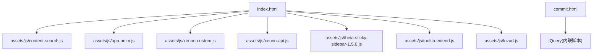
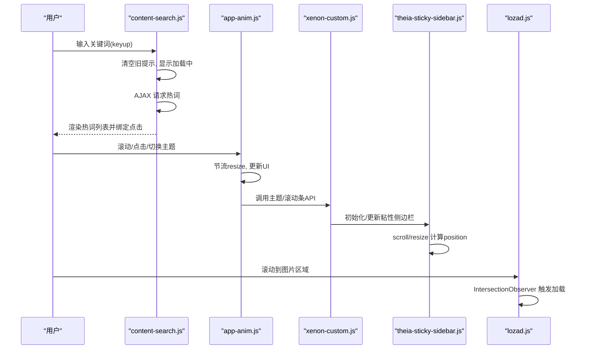
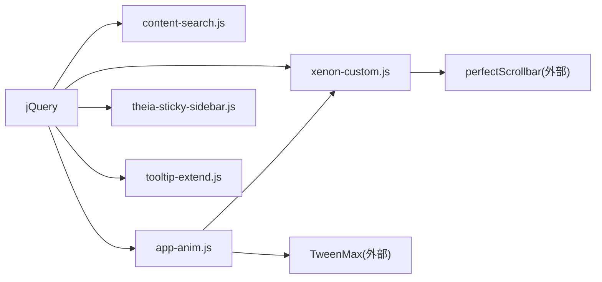

# 内存管理优化

<cite>
**本文引用的文件**   
- [index.html](file://index.html)
- [commit.html](file://commit.html)
- [README.md](file://README.md)
- [assets/js/content-search.js](file://assets/js/content-search.js)
- [assets/js/app-anim.js](file://assets/js/app-anim.js)
- [assets/js/xenon-custom.js](file://assets/js/xenon-custom.js)
- [assets/js/xenon-api.js](file://assets/js/xenon-api.js)
- [assets/js/theia-sticky-sidebar-1.5.0.js](file://assets/js/theia-sticky-sidebar-1.5.0.js)
- [assets/js/tooltip-extend.js](file://assets/js/tooltip-extend.js)
- [assets/js/lozad.js](file://assets/js/lozad.js)
</cite>

## 目录
1. [简介](#简介)
2. [项目结构](#项目结构)
3. [核心组件](#核心组件)
4. [架构总览](#架构总览)
5. [详细组件分析](#详细组件分析)
6. [依赖关系分析](#依赖关系分析)
7. [性能考量](#性能考量)
8. [故障排查指南](#故障排查指南)
9. [结论](#结论)
10. [附录](#附录)

## 简介
本文件面向在该项目中实施“内存管理优化”的开发者，围绕以下目标提供可落地的实践与示例：对象池化、事件监听器清理（含 DOM 移除时的解绑与定时器清理）、闭包与全局变量的合理使用、大对象处理策略（数据分片与懒加载），以及内存监控工具的使用。文档同时结合仓库中的实际代码位置，给出“代码片段路径”，便于快速定位与对照实现。

## 项目结构
本项目为纯静态站点，主要包含首页、提交页、资源目录与若干交互脚本。关键 JavaScript 职责如下：
- 搜索建议与热词列表：content-search.js
- 动画、滚动、侧边栏、AJAX 内容加载等：app-anim.js
- 主题初始化、滚动条、菜单、弹窗等：xenon-custom.js、xenon-api.js
- 粘性侧边栏：theia-sticky-sidebar-1.5.0.js
- Tooltip/Popover 扩展与窗口断点响应：tooltip-extend.js
- 图片懒加载：lozad.js

图表来源
- [index.html:1-35](file://index.html#L1-L35)
- [commit.html:285-382](file://commit.html#L285-L382)

章节来源
- [index.html:1-35](file://index.html#L1-L35)
- [README.md:298-314](file://README.md#L298-L314)

## 核心组件
- 搜索建议模块：基于 jQuery 的 keyup 事件触发 AJAX 获取热词，动态插入 <li> 并绑定点击事件。
- 页面交互与动画：滚动监听、返回顶部、夜间模式切换、AJAX 加载分类内容、拖拽排序等。
- 主题与 UI 组件：侧边栏展开/收起、粘性页脚、滚动条插件、Tooltip/Popover 初始化。
- 粘性侧边栏：根据滚动计算 position，频繁读写样式与布局。
- 图片懒加载：使用 IntersectionObserver 按需加载图片与背景图。

章节来源
- [assets/js/content-search.js:1-91](file://assets/js/content-search.js#L1-L91)
- [assets/js/app-anim.js:1-800](file://assets/js/app-anim.js#L1-L800)
- [assets/js/xenon-custom.js:1-800](file://assets/js/xenon-custom.js#L1-L800)
- [assets/js/theia-sticky-sidebar-1.5.0.js:1-355](file://assets/js/theia-sticky-sidebar-1.5.0.js#L1-L355)
- [assets/js/lozad.js:1-174](file://assets/js/lozad.js#L1-L174)

## 架构总览
从内存视角看，该项目的交互由多个独立脚本组成，各自维护少量状态并通过 jQuery 操作 DOM。潜在内存风险集中在：
- 高频事件（scroll、resize）未节流/防抖导致大量回调执行
- 动态生成的 DOM 节点频繁创建/销毁，缺少统一回收
- 第三方库（如滚动条、Tooltip）实例未正确销毁
- 全局变量与闭包持有长生命周期引用

图表来源
- [assets/js/content-search.js:1-91](file://assets/js/content-search.js#L1-L91)
- [assets/js/app-anim.js:1-800](file://assets/js/app-anim.js#L1-L800)
- [assets/js/xenon-custom.js:1-800](file://assets/js/xenon-custom.js#L1-L800)
- [assets/js/theia-sticky-sidebar-1.5.0.js:1-355](file://assets/js/theia-sticky-sidebar-1.5.0.js#L1-L355)
- [assets/js/lozad.js:1-174](file://assets/js/lozad.js#L1-L174)

## 详细组件分析

### 搜索建议模块（content-search.js）
- 行为要点
  - 监听 #search-text 的 keyup，发起 JSONP 请求获取热词
  - 动态生成 <li> 并绑定 click，点击后回填搜索框并提交
  - 点击页面空白处隐藏热词列表
- 内存关注点
  - 每次 keyup 都会清空并重建热词列表，若频繁输入会产生大量临时 DOM 与事件处理器
  - 建议在高频输入场景下增加防抖，减少不必要的 DOM 操作与网络请求
  - 对动态创建的 <li> 建议使用事件委托或统一清理，避免重复绑定
- 优化建议
  - 防抖 keyup 事件，降低请求频率与 DOM 重建次数
  - 将热词列表容器作为单一挂载点，避免多次 append 导致的重排
  - 在关闭热词面板时显式清空文本与隐藏，确保无残留引用

章节来源
- [assets/js/content-search.js:1-91](file://assets/js/content-search.js#L1-L91)

### 页面交互与动画（app-anim.js）
- 行为要点
  - 窗口 resize 使用 clearTimeout 做简单节流
  - 滚动监听用于显示“回到顶部”按钮与头部背景变化
  - 多处 AJAX 加载分类内容，动态插入 HTML 并重新初始化 tooltip
  - 拖拽排序、夜间模式切换、点赞等交互
- 内存关注点
  - 频繁的 DOM 插入/替换可能产生大量临时对象
  - 动态内容需重新初始化 tooltip，注意旧实例的销毁
  - 滚动与 resize 事件应统一节流/防抖，避免回调风暴
- 优化建议
  - 统一封装“加载骨架 + 占位符”，减少闪烁与重排
  - 对 tooltip 等插件，在替换内容前销毁旧实例，再初始化新实例
  - 将滚动相关逻辑合并为单次节流函数，减少计算开销

章节来源
- [assets/js/app-anim.js:1-800](file://assets/js/app-anim.js#L1-L800)

### 主题与 UI 组件（xenon-custom.js / xenon-api.js）
- 行为要点
  - 初始化全局 DOM 引用、设置滚动条、菜单、页脚等
  - 提供 show/hide loading bar 等 API
  - 通过 perfectScrollbar 实现自定义滚动条
- 内存关注点
  - 滚动条插件需在合适时机 destroy，否则会在元素移除后仍持有引用
  - 全局变量 public_vars 持有大量 DOM 引用，需注意生命周期
- 优化建议
  - 在切换视图或销毁组件时，调用 ps_destroy() 释放滚动条实例
  - 对不再使用的 DOM 引用置空，帮助 GC 回收
  - 将 loading bar 的生命周期与页面路由/组件生命周期对齐

章节来源
- [assets/js/xenon-custom.js:1-800](file://assets/js/xenon-custom.js#L1-L800)
- [assets/js/xenon-api.js:1-91](file://assets/js/xenon-api.js#L1-L91)

### 粘性侧边栏（theia-sticky-sidebar-1.5.0.js）
- 行为要点
  - 监听 document.scroll 与 window.resize，计算并切换 position 为 fixed/absolute/static
  - 在初始化时注入样式、包裹子节点、计算高度与偏移
- 内存关注点
  - 高频 scroll/resize 回调中读取 offset、outerHeight 等布局属性，易引发回流/重绘
  - 未提供显式的 destroy 接口，在多页应用或 SPA 中需自行清理
- 优化建议
  - 对 scroll/resize 进行节流，减少计算频率
  - 在离开页面或销毁组件时，手动移除事件监听并恢复样式
  - 避免在回调中进行大规模 DOM 查询，尽量缓存必要尺寸

章节来源
- [assets/js/theia-sticky-sidebar-1.5.0.js:1-355](file://assets/js/theia-sticky-sidebar-1.5.0.js#L1-L355)

### Tooltip/Popover 扩展（tooltip-extend.js）
- 行为要点
  - 批量初始化 data-toggle="tooltip/popover" 的元素
  - 提供窗口断点判断与菜单展开/收起逻辑
  - 封装滚动条初始化与销毁函数 ps_init/ps_destroy
- 内存关注点
  - 动态内容替换后需重新初始化 tooltip/popover，且应销毁旧实例
  - 滚动条实例需与可见性同步，避免不可见时仍占用内存
- 优化建议
  - 在替换 DOM 前调用 tooltip/popover 的 destroy
  - 在菜单收起或面板隐藏时调用 ps_destroy，避免无用滚动条实例驻留

章节来源
- [assets/js/tooltip-extend.js:1-768](file://assets/js/tooltip-extend.js#L1-L768)

### 图片懒加载（lozad.js）
- 行为要点
  - 使用 IntersectionObserver 检测元素进入视口后加载图片或背景图
  - 支持 picture/video 等特殊元素，标记已加载避免重复加载
- 内存关注点
  - 观察器在元素加载完成后会 unobserve，避免长期持有
  - 大量图片懒加载时，应避免一次性创建过多观察者
- 优化建议
  - 合理设置 rootMargin 与 threshold，平衡性能与体验
  - 对于超大图片，结合分片/缩略图策略，减少首屏内存峰值

章节来源
- [assets/js/lozad.js:1-174](file://assets/js/lozad.js#L1-L174)

### 提交表单（commit.html）
- 行为要点
  - 表单校验、字数统计、禁用提交按钮防止重复提交
- 内存关注点
  - 事件监听器仅在页面生命周期内有效，无需额外清理
  - 若未来改为单页路由切换，需在离开页面时移除事件监听
- 优化建议
  - 保持当前轻量实现即可；若引入复杂交互，建议统一事件管理与清理

章节来源
- [commit.html:285-382](file://commit.html#L285-L382)

## 依赖关系分析
- 脚本加载顺序与耦合
  - index.html 中按序引入 jQuery、content-search.js 等，保证依赖可用
  - app-anim.js 依赖 jQuery 与部分主题脚本提供的 API
  - theia-sticky-sidebar.js 与 tooltip-extend.js 均依赖 jQuery
- 潜在循环依赖
  - 各脚本相对独立，未见直接循环引用；但共享全局变量（如 public_vars）需注意作用域
- 外部库
  - jQuery、TweenMax、Fancybox、PerfectScrollbar 等第三方库，需关注其内部事件与实例生命周期

图表来源
- [index.html:1-35](file://index.html#L1-L35)
- [assets/js/app-anim.js:1-800](file://assets/js/app-anim.js#L1-L800)
- [assets/js/xenon-custom.js:1-800](file://assets/js/xenon-custom.js#L1-L800)
- [assets/js/theia-sticky-sidebar-1.5.0.js:1-355](file://assets/js/theia-sticky-sidebar-1.5.0.js#L1-L355)
- [assets/js/tooltip-extend.js:1-768](file://assets/js/tooltip-extend.js#L1-L768)

章节来源
- [index.html:1-35](file://index.html#L1-L35)

## 性能考量
- 事件节流/防抖
  - 对 scroll、resize、keyup 等高频率事件进行节流/防抖，减少回调执行次数与布局计算
- DOM 操作优化
  - 批量更新 DOM，避免频繁重排；使用 DocumentFragment 或 innerHTML 拼接后再插入
  - 动态内容替换后及时销毁旧插件实例（如 tooltip、滚动条）
- 内存泄漏防护
  - 移除 DOM 节点时，确保解绑所有事件监听器
  - 定时器与动画在组件销毁时停止并清理
  - 避免在全局或闭包中持有不必要的长生命周期引用
- 大对象与大数据
  - 采用分页/虚拟滚动/懒加载，避免一次性加载大量数据
  - 对图片等资源使用压缩与懒加载，降低首屏内存压力

[本节为通用指导，不直接分析具体文件]

## 故障排查指南
- 症状：页面卡顿、内存持续增长
  - 检查是否存在未清理的事件监听器（尤其是动态生成的节点）
  - 确认滚动条、Tooltip、轮播等插件是否在切换页面时销毁
  - 查看是否有 setInterval/setTimeout 未清除
- 症状：滚动条异常或内存占用高
  - 在面板隐藏或页面切换时调用 ps_destroy()
  - 避免在不可见容器中维持滚动条实例
- 症状：搜索热词闪烁或内存抖动
  - 对 keyup 增加防抖，减少频繁 DOM 重建
  - 统一热词容器，避免多次 append 造成重排
- 症状：粘性侧边栏抖动
  - 对 scroll/resize 节流，减少布局计算
  - 在离开页面时移除监听并恢复样式

章节来源
- [assets/js/xenon-custom.js:1-800](file://assets/js/xenon-custom.js#L1-L800)
- [assets/js/theia-sticky-sidebar-1.5.0.js:1-355](file://assets/js/theia-sticky-sidebar-1.5.0.js#L1-L355)
- [assets/js/content-search.js:1-91](file://assets/js/content-search.js#L1-L91)

## 结论
本项目以 jQuery 为核心，配合多个交互脚本实现导航与内容展示。从内存管理角度，重点在于：
- 对高频事件进行节流/防抖
- 动态 DOM 与插件实例的生命周期管理
- 避免全局与闭包中的长生命周期引用
- 合理使用懒加载与分片策略降低内存峰值
通过上述优化，可有效减少垃圾回收压力，提升页面流畅度与稳定性。

[本节为总结，不直接分析具体文件]

## 附录

### 对象池化实践（概念与落地建议）
- 适用场景：频繁创建/销毁的小对象（如节点、配置对象、临时数组）
- 实现思路
  - 维护一个空闲对象池，提供 acquire/release 方法
  - 复用对象时重置状态，避免重复分配
  - 限制池大小，防止无限增长
- 在本项目中的应用建议
  - 热词列表项可考虑复用模板节点，减少 createElement 与事件绑定
  - 对频繁显示的提示框、卡片模板，预创建并缓存，按需显示/隐藏

[本节为概念说明，不直接分析具体文件]

### 事件监听器清理机制（DOM 移除与定时器）
- DOM 事件
  - 使用事件委托减少绑定数量
  - 在移除节点前，调用 off/unbind 解绑对应事件
  - 对第三方插件（如 Tooltip、滚动条）调用 destroy
- 定时器
  - 记录定时器 ID，在组件销毁时 clearInterval/clearTimeout
  - 避免在长生命周期对象中持有短生命周期回调

[本节为概念说明，不直接分析具体文件]

### 闭包与全局变量的合理使用
- 避免将大对象或 DOM 引用放入全局或闭包
- 将必要的 DOM 引用集中管理，并在适当时机置空
- 使用模块化或 IIFE 隔离作用域，减少全局污染

[本节为概念说明，不直接分析具体文件]

### 大对象处理策略（数据分片与懒加载）
- 数据分片：分页加载、虚拟列表、增量渲染
- 懒加载：图片、视频、富文本按需加载
- 在本项目中
  - 使用 lozad.js 进行图片懒加载
  - 对分类内容采用 AJAX 按需加载，避免一次性渲染全部

章节来源
- [assets/js/lozad.js:1-174](file://assets/js/lozad.js#L1-L174)
- [assets/js/app-anim.js:1-800](file://assets/js/app-anim.js#L1-L800)

### 内存监控工具使用指南
- Chrome DevTools
  - Memory 面板：Heap Snapshot 对比、Allocation instrumentation on JS 调用栈
  - Performance 面板：录制页面操作，查找长时间运行的任务与布局抖动
- 常见指标
  - 堆快照中 DOM 节点数量与大小
  - 事件监听器数量与分布
  - 定时器与 Promise 残留
- 定位步骤
  - 录制基线快照 -> 执行操作 -> 再次快照 -> 对比差异
  - 聚焦增长最多的对象类型，回溯引用链
  - 结合 Sources 面板定位源码位置，修复泄漏

[本节为通用指导，不直接分析具体文件]