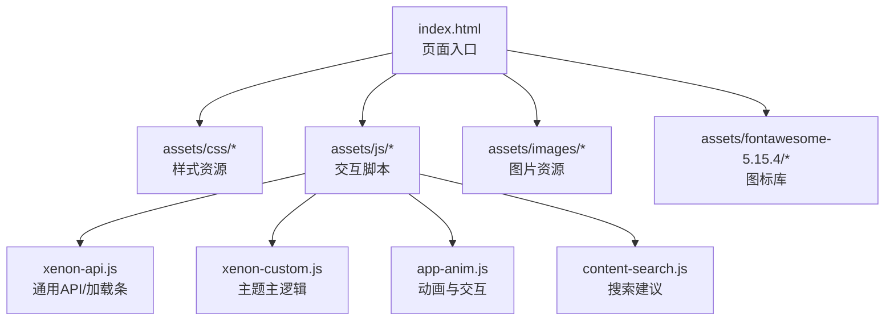
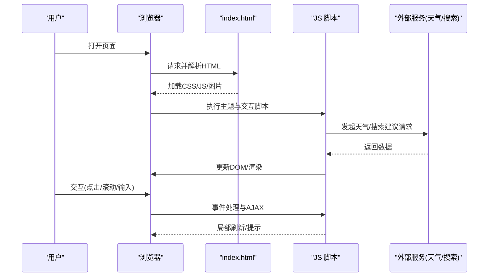
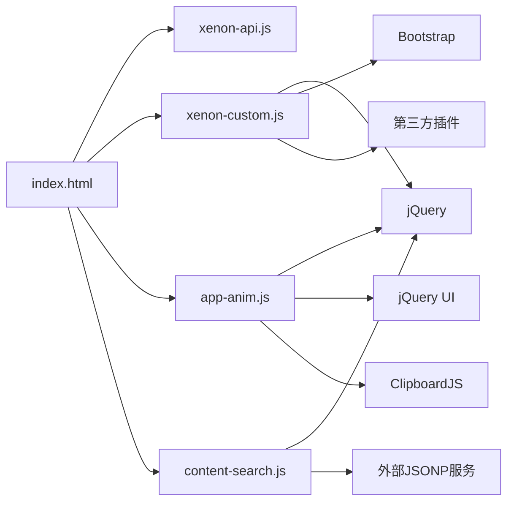

# 性能监控与分析

<cite>
**本文引用的文件**
- [index.html](file://index.html)
- [README.md](file://README.md)
- [assets/js/xenon-api.js](file://assets/js/xenon-api.js)
- [assets/js/xenon-custom.js](file://assets/js/xenon-custom.js)
- [assets/js/app-anim.js](file://assets/js/app-anim.js)
- [assets/js/content-search.js](file://assets/js/content-search.js)
- [commit.html](file://commit.html)
</cite>

## 目录
1. [引言](#引言)
2. [项目结构](#项目结构)
3. [核心组件](#核心组件)
4. [架构总览](#架构总览)
5. [详细组件分析](#详细组件分析)
6. [依赖关系分析](#依赖关系分析)
7. [性能考量与优化建议](#性能考量与优化建议)
8. [故障排查指南](#故障排查指南)
9. [结论](#结论)
10. [附录](#附录)

## 引言
本文件面向前端开发者，系统化介绍如何在本项目中开展性能监控与分析。内容涵盖：
- 浏览器内置开发工具（Chrome DevTools）的 Performance、Memory、Network 面板使用方法
- 关键性能指标定义与测量方法（首屏加载时间、交互响应时间、内存使用量等）
- 第三方监控 SDK 集成与自定义埋点实现思路
- 常见问题诊断流程（内存泄漏、CPU 瓶颈、网络请求优化）
- 结合本项目代码结构的优化建议与最佳实践

## 项目结构
本项目为纯静态站点，主要资源包括 HTML、CSS、JavaScript 与图标库。页面入口为 index.html，功能脚本集中在 assets/js 下，样式在 assets/css 下，图标资源在 assets/fontawesome-5.15.4。

图表来源
- [index.html:1-35](file://index.html#L1-L35)
- [assets/js/xenon-api.js:1-91](file://assets/js/xenon-api.js#L1-L91)
- [assets/js/xenon-custom.js:1-120](file://assets/js/xenon-custom.js#L1-L120)
- [assets/js/app-anim.js:1-40](file://assets/js/app-anim.js#L1-L40)
- [assets/js/content-search.js:1-91](file://assets/js/content-search.js#L1-L91)

章节来源
- [index.html:1-35](file://index.html#L1-L35)
- [README.md:298-314](file://README.md#L298-L314)

## 核心组件
- 页面加载与骨架：index.html 引入 CSS/JS 资源，构建导航、搜索、卡片列表等基础结构
- 主题与交互：xenon-custom.js 初始化滚动、菜单、表单、日期选择器等大量 UI 行为
- 通用 API：xenon-api.js 提供加载进度条等通用能力
- 动画与业务交互：app-anim.js 处理侧栏、夜间模式、AJAX 动态加载、排序等
- 搜索建议：content-search.js 通过百度建议接口实现输入联想

章节来源
- [index.html:17-31](file://index.html#L17-L31)
- [assets/js/xenon-custom.js:13-132](file://assets/js/xenon-custom.js#L13-L132)
- [assets/js/xenon-api.js:20-91](file://assets/js/xenon-api.js#L20-L91)
- [assets/js/app-anim.js:1-40](file://assets/js/app-anim.js#L1-L40)
- [assets/js/content-search.js:1-91](file://assets/js/content-search.js#L1-L91)

## 架构总览
从性能视角看，页面渲染与交互的关键路径如下：
- 资源加载阶段：HTML/CSS/JS/字体/图片并行或串行加载，影响首屏时间与可交互时间
- DOM 构建与解析：index.html 结构较复杂，包含大量卡片与分类，需关注重排重绘
- 脚本执行：多个 JS 文件依次执行，可能阻塞渲染；UI 插件初始化（如滚动、轮播、日期选择器）会增加 CPU 占用
- 用户交互：搜索建议、AJAX 动态加载、拖拽排序等操作触发网络请求与 DOM 更新

图表来源
- [index.html:17-31](file://index.html#L17-L31)
- [assets/js/content-search.js:5-73](file://assets/js/content-search.js#L5-L73)
- [assets/js/app-anim.js:432-510](file://assets/js/app-anim.js#L432-L510)

## 详细组件分析

### 页面加载与资源管理（index.html）
- 资源引入顺序：CSS 优先，JS 后加载，利于首屏渲染
- 外部资源：天气小部件与搜索建议通过脚本注入，增加额外网络开销
- 潜在优化点：
  - 对非关键脚本使用 defer/async
  - 图片懒加载（已有 lazy 类），确保仅可视区域加载
  - 合并/压缩 CSS/JS，启用 Gzip/Brotli

章节来源
- [index.html:17-31](file://index.html#L17-L31)
- [index.html:270-296](file://index.html#L270-L296)

### 主题与交互初始化（xenon-custom.js）
- 初始化大量 UI 插件（滚动条、日期选择器、表单验证、向导等），可能在首屏造成 CPU 峰值
- 事件绑定密集，注意避免重复绑定与过度监听
- 潜在优化点：
  - 按需加载插件（仅在需要时初始化）
  - 将非关键初始化延迟到空闲时段（requestIdleCallback）
  - 减少不必要的 DOM 查询与样式计算

章节来源
- [assets/js/xenon-custom.js:13-132](file://assets/js/xenon-custom.js#L13-L132)
- [assets/js/xenon-custom.js:135-200](file://assets/js/xenon-custom.js#L135-L200)
- [assets/js/xenon-custom.js:266-337](file://assets/js/xenon-custom.js#L266-L337)
- [assets/js/xenon-custom.js:361-478](file://assets/js/xenon-custom.js#L361-L478)

### 通用加载条（xenon-api.js）
- 提供 show_loading_bar/hide_loading_bar，用于反馈加载状态
- 使用 TweenMax 进行动画，注意动画帧率与性能
- 潜在优化点：
  - 仅在必要时显示加载条，避免频繁创建/销毁节点
  - 控制动画时长与缓动函数，降低重排压力

章节来源
- [assets/js/xenon-api.js:20-91](file://assets/js/xenon-api.js#L20-L91)

### 动画与业务交互（app-anim.js）
- 处理侧栏展开/收起、夜间模式切换、AJAX 动态加载、拖拽排序等
- 多处 AJAX 调用与 DOM 操作，需注意请求频率与缓存策略
- 潜在优化点：
  - 对高频事件（resize/scroll）做防抖/节流
  - 合理使用缓存（cache:true）减少重复请求
  - 避免在动画过程中进行大规模 DOM 更新

章节来源
- [assets/js/app-anim.js:1-40](file://assets/js/app-anim.js#L1-L40)
- [assets/js/app-anim.js:58-64](file://assets/js/app-anim.js#L58-L64)
- [assets/js/app-anim.js:432-510](file://assets/js/app-anim.js#L432-L510)
- [assets/js/app-anim.js:738-779](file://assets/js/app-anim.js#L738-L779)

### 搜索建议（content-search.js）
- 基于百度建议接口，输入时发起 JSONP 请求，展示热词
- 潜在优化点：
  - 输入防抖，降低请求频率
  - 错误处理与降级策略（无网络时隐藏建议）
  - 结果缓存，避免重复请求相同关键词

章节来源
- [assets/js/content-search.js:5-73](file://assets/js/content-search.js#L5-L73)
- [assets/js/content-search.js:75-91](file://assets/js/content-search.js#L75-L91)

### 提交页面（commit.html）
- 提供网址提交流程，包含表单校验与成功提示
- 潜在优化点：
  - 前端校验即时反馈，减少无效请求
  - 提交过程添加加载态，提升用户体验
  - 错误信息清晰化，便于定位问题

章节来源
- [commit.html:27-175](file://commit.html#L27-L175)
- [commit.html:178-200](file://commit.html#L178-L200)

## 依赖关系分析
- 页面入口 index.html 依赖多个 CSS/JS 资源，形成强耦合
- 主题脚本 xenon-custom.js 依赖 jQuery、Bootstrap、第三方插件（如 datepicker、select2）
- 业务脚本 app-anim.js 依赖 jQuery、jQuery UI、ClipboardJS 等
- 搜索建议 content-search.js 依赖 jQuery 与外部 JSONP 服务

图表来源
- [index.html:17-31](file://index.html#L17-L31)
- [assets/js/xenon-custom.js:13-132](file://assets/js/xenon-custom.js#L13-L132)
- [assets/js/app-anim.js:432-510](file://assets/js/app-anim.js#L432-L510)
- [assets/js/content-search.js:5-73](file://assets/js/content-search.js#L5-L73)

章节来源
- [index.html:17-31](file://index.html#L17-L31)
- [assets/js/xenon-custom.js:13-132](file://assets/js/xenon-custom.js#L13-L132)
- [assets/js/app-anim.js:432-510](file://assets/js/app-anim.js#L432-L510)
- [assets/js/content-search.js:5-73](file://assets/js/content-search.js#L5-L73)

## 性能考量与优化建议

### 关键性能指标与测量
- 首屏加载时间（FCP/LCP）
  - 使用 Chrome DevTools Performance 面板记录页面加载，观察 FCP/LCP 时间点
  - 关注 index.html 中资源加载顺序与体积，评估 CSS/JS 对首屏的影响
- 交互响应时间（INP/TBT）
  - 使用 Performance 面板录制用户交互（点击、滚动、输入），查看长任务与主线程阻塞
  - 针对 search 输入、AJAX 加载、拖拽排序等场景进行专项分析
- 内存使用量
  - 使用 Memory 面板拍摄堆快照，对比交互前后内存变化，识别增长趋势
  - 关注事件监听器、闭包引用、大对象未释放等问题

章节来源
- [index.html:17-31](file://index.html#L17-L31)
- [assets/js/content-search.js:5-73](file://assets/js/content-search.js#L5-L73)
- [assets/js/app-anim.js:432-510](file://assets/js/app-anim.js#L432-L510)

### 常见性能问题与优化策略
- 资源体积过大
  - 压缩与合并 CSS/JS，启用 Gzip/Brotli
  - 图片使用 WebP/AVIF，按需懒加载
- 主线程阻塞
  - 拆分大脚本，使用模块加载与按需初始化
  - 将非关键任务移至 requestIdleCallback 或 Web Worker
- 频繁重排重绘
  - 批量 DOM 操作，避免在循环中读写布局属性
  - 使用 transform/opacity 替代位置/尺寸动画
- 网络请求过多
  - 合并请求，使用 CDN，合理设置缓存头
  - 对搜索建议等接口做防抖与缓存

章节来源
- [assets/js/xenon-custom.js:13-132](file://assets/js/xenon-custom.js#L13-L132)
- [assets/js/app-anim.js:432-510](file://assets/js/app-anim.js#L432-L510)
- [assets/js/content-search.js:5-73](file://assets/js/content-search.js#L5-L73)

### 第三方监控 SDK 集成与自定义埋点
- 集成方案
  - 在 index.html 头部插入 SDK 初始化脚本（如 Google Analytics、百度统计、51.la）
  - 配置关键事件上报（页面加载完成、用户交互、错误捕获）
- 自定义埋点
  - 在关键路径添加性能标记（performance.mark/measure）
  - 上报业务指标（搜索次数、提交成功率、错误类型）
- 注意事项
  - 避免在热路径中执行重型计算
  - 使用采样与去重，减少上报开销

章节来源
- [index.html:17-31](file://index.html#L17-L31)
- [README.md:329-335](file://README.md#L329-L335)

## 故障排查指南

### 内存泄漏检测
- 使用 Memory 面板拍摄堆快照，比较不同交互阶段的内存分布
- 检查事件监听器是否重复绑定或未移除
- 关注闭包与大对象的生命周期，避免意外引用

章节来源
- [assets/js/xenon-custom.js:13-132](file://assets/js/xenon-custom.js#L13-L132)
- [assets/js/app-anim.js:432-510](file://assets/js/app-anim.js#L432-L510)

### CPU 瓶颈分析
- 使用 Performance 面板录制交互过程，定位长任务与高 CPU 占用函数
- 检查动画与 DOM 操作是否过于频繁
- 对搜索输入、AJAX 请求等热点路径进行专项优化

章节来源
- [assets/js/content-search.js:5-73](file://assets/js/content-search.js#L5-L73)
- [assets/js/app-anim.js:432-510](file://assets/js/app-anim.js#L432-L510)

### 网络请求优化
- 使用 Network 面板分析请求耗时、大小与缓存命中情况
- 对静态资源启用缓存与压缩
- 对动态请求增加重试与降级策略

章节来源
- [assets/js/content-search.js:5-73](file://assets/js/content-search.js#L5-L73)
- [assets/js/app-anim.js:432-510](file://assets/js/app-anim.js#L432-L510)

## 结论
本项目为纯静态站点，性能优化的重点在于资源加载、主线程任务调度与用户交互响应。通过 Chrome DevTools 的 Performance/Memory/Network 面板，结合合理的监控与埋点，可以系统性地定位与解决性能问题。建议在后续迭代中逐步引入按需加载、缓存策略与异步任务，持续提升用户体验。

## 附录

### 常用性能指标速查
- 首屏相关：FCP（首次内容绘制）、LCP（最大内容绘制）
- 交互相关：INP（交互到下一次绘制）、TBT（总阻塞时间）
- 资源相关：TTI（可交互时间）、CLS（累积布局偏移）
- 内存相关：Heap Size、JS Heap Size、DOM Nodes

### 推荐工具与技巧
- Chrome DevTools：Performance、Memory、Network、Lighthouse
- 线上监控：Web Vitals、RUM（真实用户监控）
- 本地测试：模拟慢网络、低性能设备