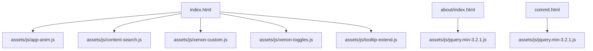
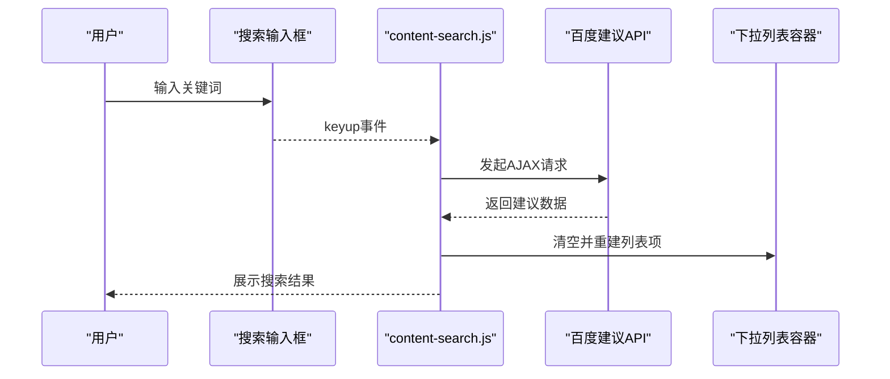
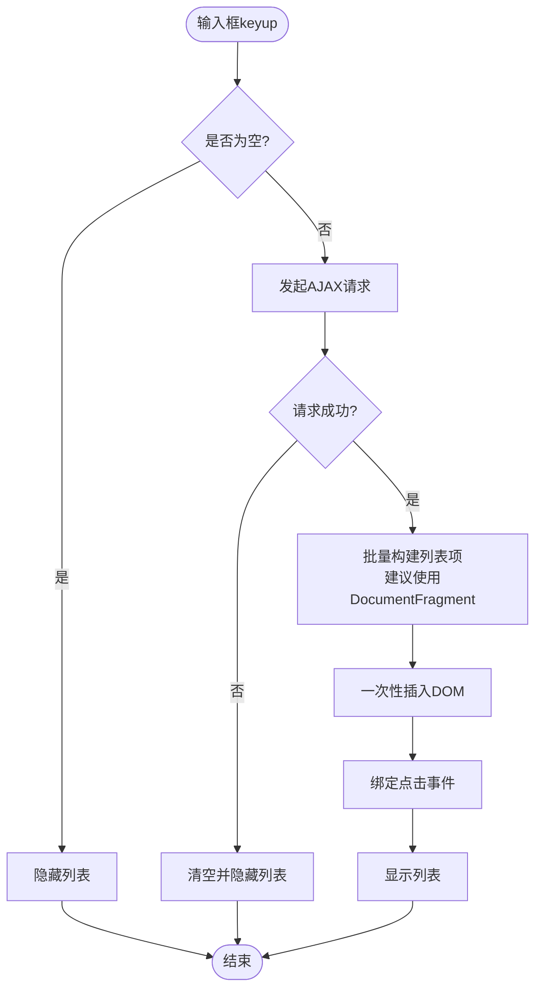
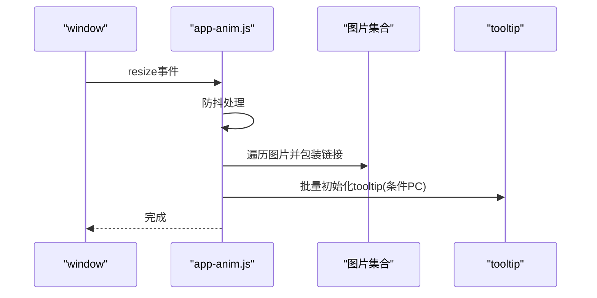
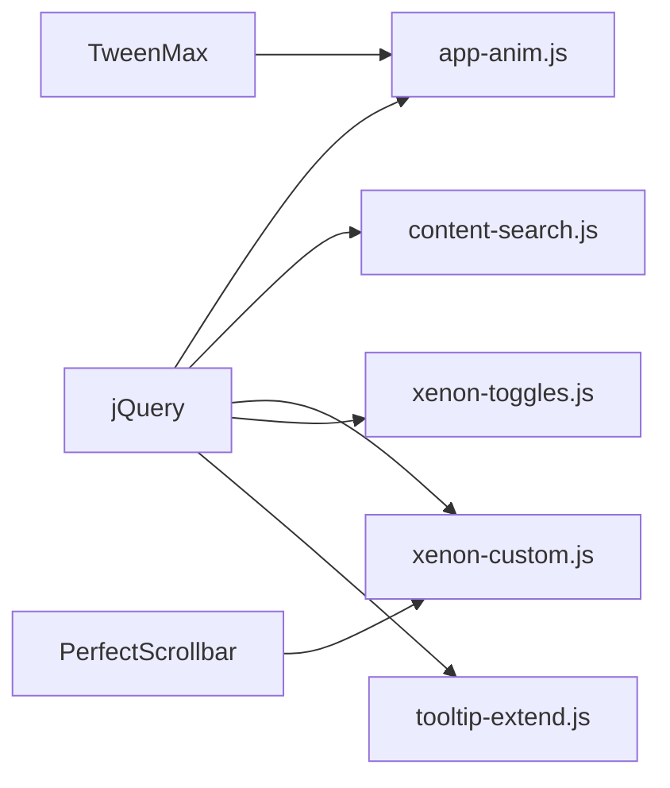

# DOM操作优化

<cite>
**本文引用的文件**
- [index.html](file://index.html)
- [about/index.html](file://about/index.html)
- [commit.html](file://commit.html)
- [assets/js/content-search.js](file://assets/js/content-search.js)
- [assets/js/app-anim.js](file://assets/js/app-anim.js)
- [assets/js/xenon-custom.js](file://assets/js/xenon-custom.js)
- [assets/js/xenon-toggles.js](file://assets/js/xenon-toggles.js)
- [assets/js/tooltip-extend.js](file://assets/js/tooltip-extend.js)
</cite>

## 目录
1. [简介](#简介)
2. [项目结构](#项目结构)
3. [核心组件](#核心组件)
4. [架构总览](#架构总览)
5. [详细组件分析](#详细组件分析)
6. [依赖关系分析](#依赖关系分析)
7. [性能考量](#性能考量)
8. [故障排查指南](#故障排查指南)
9. [结论](#结论)
10. [附录：实践清单与示例定位](#附录：实践清单与示例定位)

## 简介
本文件围绕“DOM操作优化”的目标，结合仓库中的实际代码，系统梳理重排（Reflow）与重绘（Repaint）的影响、批量更新策略、查询优化、动态渲染优化等主题。文档不仅解释概念，还通过具体文件与行号定位到项目中的实现位置，帮助读者在现有工程中落地优化措施。

## 项目结构
本项目为静态站点型导航网站，主要包含：
- HTML页面：首页、关于页、提交页
- 样式资源：Bootstrap、自定义样式、图标库
- 脚本资源：jQuery、动画库、业务交互逻辑

图表来源
- [index.html:1-35](file://index.html#L1-L35)
- [assets/js/app-anim.js:1-25](file://assets/js/app-anim.js#L1-L25)
- [assets/js/content-search.js:1-10](file://assets/js/content-search.js#L1-L10)
- [assets/js/xenon-custom.js:1-20](file://assets/js/xenon-custom.js#L1-L20)
- [assets/js/xenon-toggles.js:1-15](file://assets/js/xenon-toggles.js#L1-L15)
- [assets/js/tooltip-extend.js:1-15](file://assets/js/tooltip-extend.js#L1-L15)

章节来源
- [index.html:1-35](file://index.html#L1-L35)
- [about/index.html:1-25](file://about/index.html#L1-L25)
- [commit.html:1-25](file://commit.html#L1-L25)

## 核心组件
- 搜索建议与下拉列表渲染：content-search.js
- 首页交互与动态内容加载：app-anim.js
- 全局UI初始化与滚动条、菜单等：xenon-custom.js
- 面板切换与交互：xenon-toggles.js
- 响应式与工具扩展：tooltip-extend.js

章节来源
- [assets/js/content-search.js:1-91](file://assets/js/content-search.js#L1-L91)
- [assets/js/app-anim.js:1-120](file://assets/js/app-anim.js#L1-L120)
- [assets/js/xenon-custom.js:1-120](file://assets/js/xenon-custom.js#L1-L120)
- [assets/js/xenon-toggles.js:1-120](file://assets/js/xenon-toggles.js#L1-L120)
- [assets/js/tooltip-extend.js:1-120](file://assets/js/tooltip-extend.js#L1-L120)

## 架构总览
从用户交互到DOM更新的典型流程如下：

图表来源
- [assets/js/content-search.js:5-73](file://assets/js/content-search.js#L5-L73)
- [index.html:336-370](file://index.html#L336-L370)

章节来源
- [assets/js/content-search.js:5-73](file://assets/js/content-search.js#L5-L73)
- [index.html:336-370](file://index.html#L336-L370)

## 详细组件分析

### 搜索建议渲染（content-search.js）
- 功能要点
  - 监听输入框keyup事件，触发AJAX获取建议词
  - 成功回调中清空目标容器并循环插入列表项
  - 点击建议项回填输入框并关闭列表
- 潜在性能问题
  - 每次按键都清空并重建DOM节点，可能引发多次重排重绘
  - 频繁append和样式设置会放大布局抖动
- 优化建议
  - 使用DocumentFragment批量构建列表项后一次性插入
  - 将样式设置合并到字符串模板或类名切换，减少逐元素样式写入
  - 防抖节流避免高频输入导致的重复请求与渲染

图表来源
- [assets/js/content-search.js:5-73](file://assets/js/content-search.js#L5-L73)

章节来源
- [assets/js/content-search.js:5-73](file://assets/js/content-search.js#L5-L73)

### 首页动态内容与懒加载（app-anim.js）
- 功能要点
  - 图片懒加载包装与提示初始化
  - 窗口resize时执行粘性页脚与可调整尺寸逻辑
  - AJAX加载分类内容，先插入loading占位再替换内容
- 潜在性能问题
  - 大量img的wrap与tooltip初始化可能触发多次重排
  - 频繁读取offset/height等布局属性导致强制同步布局
- 优化建议
  - 批量处理图片时，使用DocumentFragment包裹后再插入
  - 将tooltip初始化延迟到内容稳定后，或使用一次性批量初始化
  - 对resize事件进行防抖，减少计算与样式更新频率

图表来源
- [assets/js/app-anim.js:26-33](file://assets/js/app-anim.js#L26-L33)
- [assets/js/app-anim.js:36-45](file://assets/js/app-anim.js#L36-L45)

章节来源
- [assets/js/app-anim.js:26-45](file://assets/js/app-anim.js#L26-L45)

### 全局UI与滚动条（xenon-custom.js）
- 功能要点
  - 初始化侧边栏、水平菜单、粘性页脚、滚动条插件
  - 表单验证、日期选择器、颜色选择器等组件初始化
- 潜在性能问题
  - 多处each遍历并调用插件，可能在大型页面造成初始化开销
  - 滚动条update与destroy/init频繁调用可能影响性能
- 优化建议
  - 按需初始化，仅在可见区域或需要时启用滚动条
  - 合并多次样式更新，减少layout thrashing
  - 对复杂组件初始化进行延迟或分片

章节来源
- [assets/js/xenon-custom.js:1-120](file://assets/js/xenon-custom.js#L1-L120)

### 面板切换与交互（xenon-toggles.js）
- 功能要点
  - 聊天面板、设置面板、侧边栏等的显示/隐藏切换
  - 移动端菜单与用户信息菜单的切换
- 潜在性能问题
  - 切换过程中多次修改样式与高度，可能触发重排
- 优化建议
  - 使用CSS过渡与transform替代直接高度动画，减少重排
  - 批量添加/移除类名，减少样式计算次数

章节来源
- [assets/js/xenon-toggles.js:1-120](file://assets/js/xenon-toggles.js#L1-L120)

### 响应式与工具扩展（tooltip-extend.js）
- 功能要点
  - 断点检测与响应式行为
  - 全局tooltip/popover初始化与样式增强
- 潜在性能问题
  - 大量元素初始化tooltip可能带来额外开销
- 优化建议
  - 仅对必要元素启用tooltip，或使用事件委托
  - 合并初始化批次，减少DOM访问次数

章节来源
- [assets/js/tooltip-extend.js:1-120](file://assets/js/tooltip-extend.js#L1-L120)

## 依赖关系分析
- 页面脚本依赖jQuery与第三方库（如TweenMax、PerfectScrollbar）
- 各JS模块职责清晰但存在部分重复初始化逻辑（如滚动条、菜单）
- 建议在入口统一编排初始化顺序，避免重复与冲突

图表来源
- [index.html:30-31](file://index.html#L30-L31)
- [assets/js/app-anim.js:1-25](file://assets/js/app-anim.js#L1-L25)
- [assets/js/xenon-custom.js:75-132](file://assets/js/xenon-custom.js#L75-L132)

章节来源
- [index.html:30-31](file://index.html#L30-L31)
- [assets/js/xenon-custom.js:75-132](file://assets/js/xenon-custom.js#L75-L132)

## 性能考量
- 重排与重绘
  - 重排：当DOM结构或几何属性变化时浏览器重新计算布局
  - 重绘：当元素外观变化但不影响布局时重新绘制像素
  - 优化原则：批量更新、减少布局属性读取、避免强制同步布局
- 批量DOM更新
  - 使用DocumentFragment缓存多个子节点，最后一次性插入
  - 使用innerHTML拼接大块HTML，减少多次createElement/appendChild
  - 将样式变更集中到类名切换，避免逐元素style写入
- 查询优化
  - 缓存常用DOM引用，避免重复querySelector/querySelectorAll
  - 使用更具体的选择器减少匹配范围
  - 对长列表使用虚拟滚动或分页加载
- 动态渲染优化
  - 模板引擎预编译模板，减少运行时拼接开销
  - 条件渲染：根据状态决定渲染分支，避免无用节点
  - 懒加载与按需初始化：首屏只渲染关键内容，其余延后

章节来源
- [assets/js/content-search.js:17-55](file://assets/js/content-search.js#L17-L55)
- [assets/js/app-anim.js:46-64](file://assets/js/app-anim.js#L46-L64)
- [assets/js/xenon-custom.js:75-132](file://assets/js/xenon-custom.js#L75-L132)

## 故障排查指南
- 常见问题
  - 搜索建议闪烁或卡顿：检查是否在每次keyup中清空并重建DOM，考虑防抖与批量构建
  - 页面滚动不流畅：检查是否频繁调用scrollHeight/scrollTop等布局属性，尽量合并读取
  - 移动端菜单异常：检查滚动条插件初始化时机与销毁逻辑
- 调试建议
  - 使用浏览器Performance面板记录重排重绘热点
  - 对关键函数加时间戳统计耗时
  - 逐步禁用第三方插件定位瓶颈

章节来源
- [assets/js/content-search.js:5-73](file://assets/js/content-search.js#L5-L73)
- [assets/js/xenon-custom.js:75-132](file://assets/js/xenon-custom.js#L75-L132)

## 结论
本项目在搜索建议、首页动态内容加载、全局UI初始化等方面存在较多DOM操作场景。通过采用批量更新、查询优化、条件渲染与懒加载等手段，可以显著降低重排重绘开销，提升页面性能与用户体验。建议在后续迭代中引入统一的初始化编排与性能监控，持续优化关键路径。

## 附录：实践清单与示例定位
- 批量更新技巧
  - 使用DocumentFragment批量插入列表项：参考搜索建议渲染流程
    - 参考位置：[assets/js/content-search.js:17-55](file://assets/js/content-search.js#L17-L55)
  - 使用innerHTML批量拼接HTML片段：参考动态卡片生成
    - 参考位置：[assets/js/app-anim.js:568-598](file://assets/js/app-anim.js#L568-L598)
- 查询优化
  - 缓存DOM引用，避免重复查找：参考全局变量缓存
    - 参考位置：[assets/js/xenon-custom.js:16-39](file://assets/js/xenon-custom.js#L16-L39)
  - 使用querySelectorAll批量处理：参考滚动条初始化
    - 参考位置：[assets/js/xenon-custom.js:81-93](file://assets/js/xenon-custom.js#L81-L93)
- 动态渲染优化
  - 条件渲染与懒加载：参考图片懒加载与tooltip初始化
    - 参考位置：[assets/js/app-anim.js:26-33](file://assets/js/app-anim.js#L26-L33)
  - 防抖节流：参考resize事件处理
    - 参考位置：[assets/js/app-anim.js:36-45](file://assets/js/app-anim.js#L36-L45)
- 表单与交互优化
  - 表单验证与错误提示：参考提交页表单逻辑
    - 参考位置：[commit.html:287-378](file://commit.html#L287-L378)
  - 面板切换与样式优化：参考面板切换逻辑
    - 参考位置：[assets/js/xenon-toggles.js:36-107](file://assets/js/xenon-toggles.js#L36-L107)