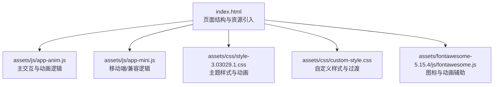
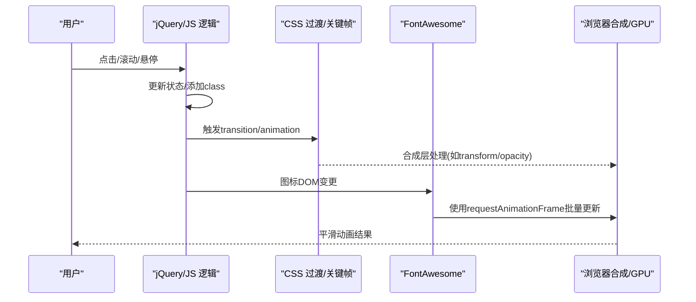
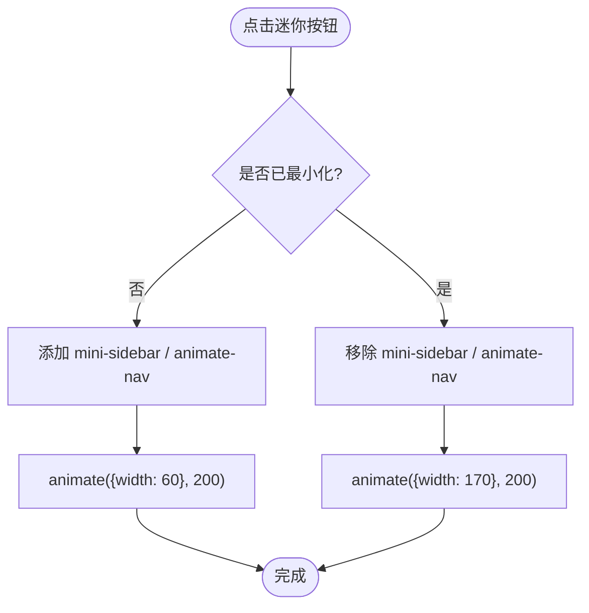
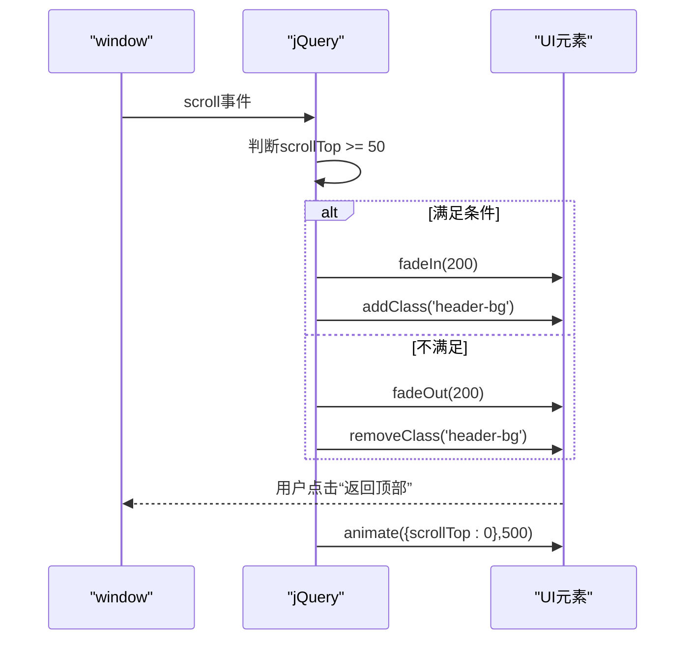
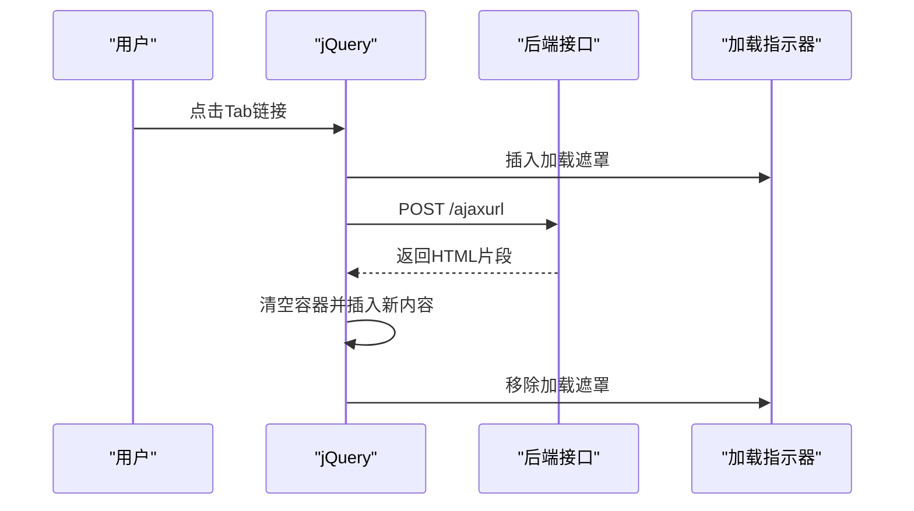
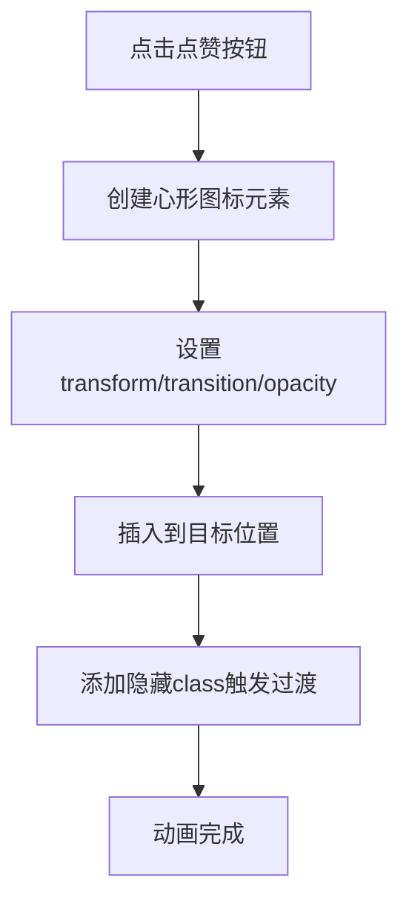
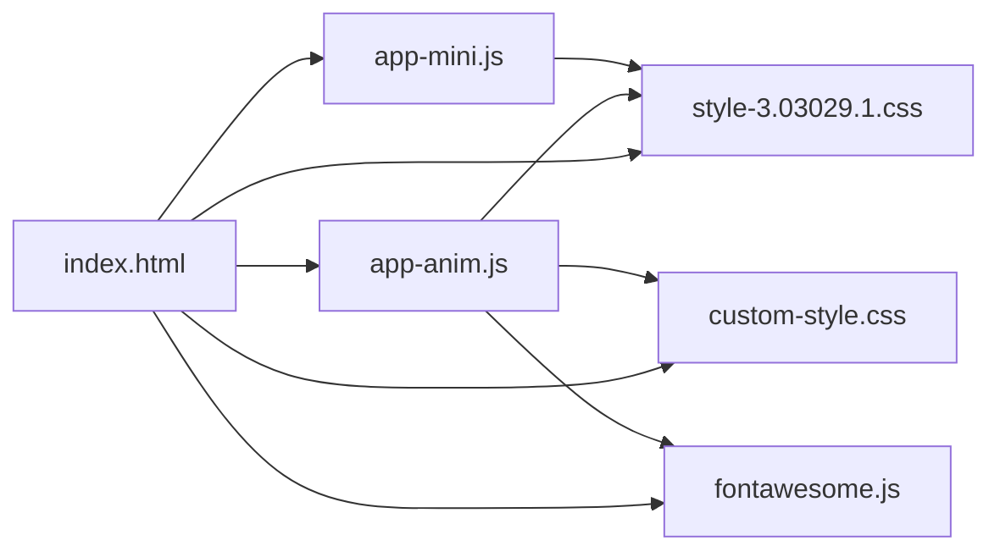

# 动画性能优化

<cite>
**本文引用的文件**
- [index.html](file://index.html)
- [app-anim.js](file://assets/js/app-anim.js)
- [app-mini.js](file://assets/js/app-mini.js)
- [custom-style.css](file://assets/css/custom-style.css)
- [style-3.03029.1.css](file://assets/css/style-3.03029.1.css)
- [fontawesome.js](file://assets/fontawesome-5.15.4/js/fontawesome.js)
</cite>

## 目录
1. [简介](#简介)
2. [项目结构](#项目结构)
3. [核心组件](#核心组件)
4. [架构总览](#架构总览)
5. [详细组件分析](#详细组件分析)
6. [依赖关系分析](#依赖关系分析)
7. [性能考量](#性能考量)
8. [故障排查指南](#故障排查指南)
9. [结论](#结论)
10. [附录](#附录)

## 简介
本文件围绕前端动画性能优化，结合仓库中的实际代码与样式，系统讲解：
- 使用 requestAnimationFrame 替代 setInterval/setTimeout 以获得更流畅的动画体验
- CSS3 硬件加速原理（transform、opacity 等属性如何触发 GPU 加速）
- 动画帧率控制与性能监控（FPS 监测、性能分析工具）
- 复杂动画优化策略（动画分片、离屏渲染等）
- TweenMax/TweenLite 等动画库的优化实践（实例管理、内存释放）
- 基于本项目现有动画与交互的优化建议与对比思路

## 项目结构
本项目为导航类站点，包含侧边栏、顶部导航、搜索区与内容卡片。动画与交互主要分布在：
- JS 逻辑：页面初始化、菜单展开/收起、滚动显示/隐藏、AJAX 加载、点赞反馈等
- CSS 样式：过渡、关键帧动画、变换与透明度变化
- 第三方库：jQuery、FontAwesome、Fancybox 等

图表来源
- [index.html:1-35](file://index.html#L1-L35)
- [app-anim.js:1-25](file://assets/js/app-anim.js#L1-L25)
- [app-mini.js:1-25](file://assets/js/app-mini.js#L1-L25)
- [style-3.03029.1.css:56-149](file://assets/css/style-3.03029.1.css#L56-L149)
- [custom-style.css:16-43](file://assets/css/custom-style.css#L16-L43)
- [fontawesome.js:138-160](file://assets/fontawesome-5.15.4/js/fontawesome.js#L138-L160)

章节来源
- [index.html:1-35](file://index.html#L1-L35)

## 核心组件
- 侧边栏与菜单动画：通过 jQuery animate 与 CSS transition 实现宽度变化、子菜单展开/收起、悬浮面板定位等
- 滚动与显隐：返回顶部按钮淡入淡出、头部背景切换
- AJAX 加载：Tab 切换时动态加载内容并展示加载指示器
- 点赞反馈：插入心形图标并使用 CSS transition + transform 做缩放与位移效果
- 图标与旋转：FontAwesome 提供旋转动画与 SVG 路径过渡

章节来源
- [app-anim.js:238-253](file://assets/js/app-anim.js#L238-L253)
- [app-anim.js:318-407](file://assets/js/app-anim.js#L318-L407)
- [app-anim.js:427-510](file://assets/js/app-anim.js#L427-L510)
- [app-anim.js:66-167](file://assets/js/app-anim.js#L66-L167)
- [style-3.03029.1.css:113-149](file://assets/css/style-3.03029.1.css#L113-L149)
- [custom-style.css:16-43](file://assets/css/custom-style.css#L16-L43)
- [fontawesome.js:1413-1424](file://assets/fontawesome-5.15.4/js/fontawesome.js#L1413-L1424)

## 架构总览
从用户交互到渲染的流程如下：
- 用户操作（点击、滚动、悬停）触发事件监听
- JS 逻辑处理状态变化（添加/移除 class、调用 animate、发起 AJAX）
- CSS transition/keyframes 负责视觉过渡与动画
- 浏览器合成层在合适的情况下将动画交由 GPU 加速（transform、opacity）
- FontAwesome 内部对 DOM 变更采用 requestAnimationFrame 进行批处理，减少重排重绘

图表来源
- [app-anim.js:318-407](file://assets/js/app-anim.js#L318-L407)
- [style-3.03029.1.css:113-149](file://assets/css/style-3.03029.1.css#L113-L149)
- [fontawesome.js:1413-1424](file://assets/fontawesome-5.15.4/js/fontawesome.js#L1413-L1424)

## 详细组件分析

### 侧边栏收缩/展开动画
- 行为：点击迷你按钮或响应窗口尺寸变化，切换侧边栏宽度与子菜单可见性
- 技术点：
  - jQuery animate 控制 width 变化，配合 CSS transition 使过渡更顺滑
  - 通过添加/移除 class（mini-sidebar、animate-nav）驱动样式变化
  - 子菜单使用 slideUp/slideDown 控制显示/隐藏
- 优化建议：
  - 优先使用 CSS transition 控制 width，避免频繁读取布局属性导致回流
  - 对大型列表可考虑使用 transform: translateX 替代 width 变化以减少重排
  - 使用 will-change 谨慎提示合成层（仅在必要时）

图表来源
- [app-anim.js:368-407](file://assets/js/app-anim.js#L368-L407)
- [style-3.03029.1.css:146-149](file://assets/css/style-3.03029.1.css#L146-L149)

章节来源
- [app-anim.js:318-407](file://assets/js/app-anim.js#L318-L407)
- [style-3.03029.1.css:146-149](file://assets/css/style-3.03029.1.css#L146-L149)

### 滚动与返回顶部
- 行为：滚动超过阈值显示“返回顶部”按钮，点击平滑回到顶部
- 技术点：
  - 监听 window.scroll 事件，使用 fadeIn/fadeOut 控制显隐
  - 使用 jQuery animate 平滑滚动至顶部
- 优化建议：
  - 使用节流/防抖减少 scroll 事件频率
  - 使用 CSS transition 控制 fade，避免 JS 逐帧修改 opacity

图表来源
- [app-anim.js:238-253](file://assets/js/app-anim.js#L238-L253)

章节来源
- [app-anim.js:238-253](file://assets/js/app-anim.js#L238-L253)

### AJAX 加载与加载指示器
- 行为：点击 Tab 链接后，动态加载内容并显示加载指示器
- 技术点：
  - 使用 $.ajax 请求后端数据，成功后替换容器内容
  - 加载期间插入带旋转图标的遮罩层
- 优化建议：
  - 使用 CSS transition 控制遮罩层的淡入淡出
  - 避免在回调中大量同步 DOM 操作，必要时分批更新或使用 DocumentFragment

图表来源
- [app-anim.js:466-510](file://assets/js/app-anim.js#L466-L510)

章节来源
- [app-anim.js:466-510](file://assets/js/app-anim.js#L466-L510)

### 点赞反馈动画
- 行为：点击点赞按钮后插入心形图标，使用 CSS transition 与 transform 实现缩放与位移
- 技术点：
  - 动态创建 <i> 元素并设置内联样式（transform、transition、opacity）
  - 通过添加 class 触发动画结束后的隐藏
- 优化建议：
  - 尽量使用 CSS class 切换而非内联样式，便于复用与缓存
  - 使用 transform: scale/translateY 与 opacity 触发 GPU 加速

图表来源
- [app-anim.js:66-167](file://assets/js/app-anim.js#L66-L167)

章节来源
- [app-anim.js:66-167](file://assets/js/app-anim.js#L66-L167)

### FontAwesome 动画与 requestAnimationFrame
- 行为：图标旋转、SVG 路径过渡等
- 技术点：
  - 内部对 DOM 变更使用 requestAnimationFrame 进行批处理，降低重排重绘开销
  - 提供 @keyframes 旋转动画（fa-spin）
- 优化建议：
  - 避免频繁手动修改图标样式，利用库提供的 API
  - 合理使用 CSS transition 与 animation，减少 JS 干预

章节来源
- [fontawesome.js:1413-1424](file://assets/fontawesome-5.15.4/js/fontawesome.js#L1413-L1424)
- [style-3.03029.1.css:809-810](file://assets/css/style-3.03029.1.css#L809-L810)

## 依赖关系分析
- index.html 引入 jQuery、FontAwesome、Bootstrap、主题样式与自定义样式
- app-anim.js 与 app-mini.js 依赖 jQuery 进行 DOM 操作与动画
- style-3.03029.1.css 与 custom-style.css 定义过渡与关键帧动画
- FontAwesome 提供图标与动画支持，内部使用 requestAnimationFrame 优化

图表来源
- [index.html:17-31](file://index.html#L17-L31)
- [app-anim.js:1-25](file://assets/js/app-anim.js#L1-L25)
- [app-mini.js:1-25](file://assets/js/app-mini.js#L1-L25)
- [style-3.03029.1.css:56-149](file://assets/css/style-3.03029.1.css#L56-L149)
- [custom-style.css:16-43](file://assets/css/custom-style.css#L16-L43)
- [fontawesome.js:138-160](file://assets/fontawesome-5.15.4/js/fontawesome.js#L138-L160)

章节来源
- [index.html:17-31](file://index.html#L17-L31)

## 性能考量
- 使用 requestAnimationFrame 的优势：
  - 与浏览器刷新率同步，避免掉帧与卡顿
  - 自动节流，后台标签页暂停执行，节省电量与CPU
  - 适合高频更新的动画场景（如滚动、拖拽、粒子效果）
- 替代 setInterval/setTimeout：
  - setInterval/setTimeout 不受屏幕刷新率约束，可能导致多余计算与丢帧
  - 在需要精确时间控制的场景（如游戏循环）优先使用 rAF
- CSS3 硬件加速：
  - transform 与 opacity 通常由 GPU 合成层处理，减少重排重绘
  - 避免对 layout-affecting 属性（如 width、height、top、left）进行高频动画
  - 合理使用 will-change 提示浏览器提前创建合成层（谨慎使用，避免过度）
- 帧率控制与监控：
  - 使用浏览器开发者工具的 Performance 面板录制动画过程，观察 FPS、长任务、重排重绘
  - 使用 FPS 计数器（如简单的 rAF 计数）评估动画性能
  - 关注主线程阻塞，避免长时间脚本执行影响动画流畅度
- 复杂动画优化策略：
  - 动画分片：将大任务拆分为多个小帧，避免单帧过长
  - 离屏渲染：使用 Canvas/WebGL 或 offscreen canvas 处理复杂图形，再合成到页面
  - 合并样式变更：批量更新 DOM/CSS，减少多次强制同步布局
  - 使用 CSS transition/animation 替代 JS 逐帧动画，提升性能与可维护性
- TweenMax/TweenLite 优化实践：
  - 合理管理动画实例，及时销毁不再使用的 tween，避免内存泄漏
  - 使用 kill() 或 clear() 清理定时器与回调
  - 避免在同一元素上同时运行多个冲突的 tween
  - 使用 stagger 与批量动画减少重复计算
  - 在大数据量场景中，考虑使用 CSS 动画或 Web Animations API 替代部分 tween

[本节为通用指导，无需特定文件引用]

## 故障排查指南
- 动画卡顿：
  - 检查是否存在大量重排重绘（频繁读写 layout 属性）
  - 使用 Performance 面板定位长任务与强制同步布局
- 内存泄漏：
  - 检查未销毁的 tween 实例、事件监听器、定时器
  - 确保在组件卸载时清理资源
- 兼容性：
  - 确认目标浏览器对 requestAnimationFrame、CSS transition、GPU 加速的支持
  - 使用 polyfill 或降级方案（如 fallback 到 setTimeout）

章节来源
- [app-anim.js:318-407](file://assets/js/app-anim.js#L318-L407)
- [fontawesome.js:1413-1424](file://assets/fontawesome-5.15.4/js/fontawesome.js#L1413-L1424)

## 结论
本项目在动画与交互方面结合了 jQuery animate、CSS transition/keyframes 与 FontAwesome 的动画能力。通过理解 requestAnimationFrame 的优势、合理利用 CSS3 硬件加速、实施帧率控制与性能监控、以及优化复杂动画策略，可以显著提升动画流畅度与用户体验。对于 TweenMax/TweenLite 的使用，应注重实例管理与内存释放，避免性能退化。

[本节为总结，无需特定文件引用]

## 附录
- 参考文件路径：
  - 页面入口与资源引入：[index.html:17-31](file://index.html#L17-L31)
  - 主交互与动画逻辑：[app-anim.js:238-253](file://assets/js/app-anim.js#L238-L253)、[app-anim.js:318-407](file://assets/js/app-anim.js#L318-L407)、[app-anim.js:466-510](file://assets/js/app-anim.js#L466-L510)、[app-anim.js:66-167](file://assets/js/app-anim.js#L66-L167)
  - 主题样式与动画：[style-3.03029.1.css:113-149](file://assets/css/style-3.03029.1.css#L113-L149)、[style-3.03029.1.css:809-810](file://assets/css/style-3.03029.1.css#L809-L810)
  - 自定义样式与过渡：[custom-style.css:16-43](file://assets/css/custom-style.css#L16-L43)
  - FontAwesome 动画与 rAF：[fontawesome.js:1413-1424](file://assets/fontawesome-5.15.4/js/fontawesome.js#L1413-L1424)

[本节为附录，无需特定文件引用]