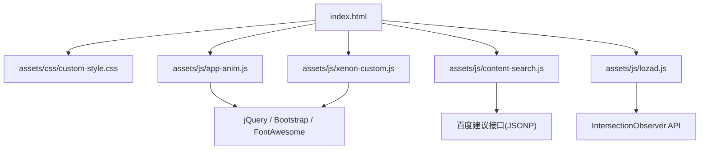
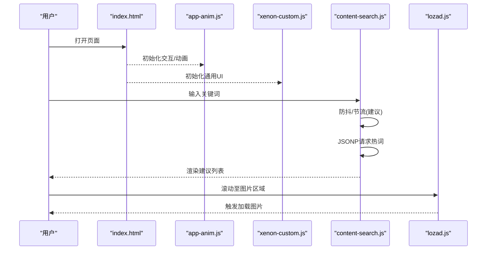
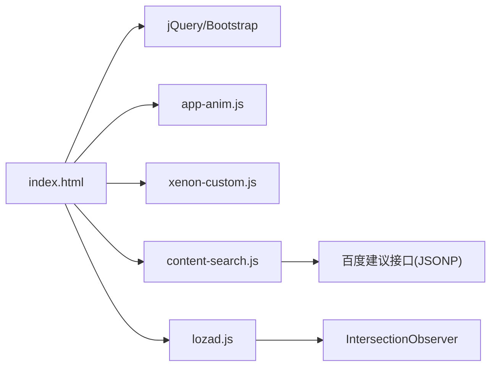

# 渲染性能优化

<cite>
**本文引用的文件**
- [index.html](file://index.html)
- [assets/js/app-anim.js](file://assets/js/app-anim.js)
- [assets/js/xenon-custom.js](file://assets/js/xenon-custom.js)
- [assets/css/custom-style.css](file://assets/css/custom-style.css)
- [assets/js/content-search.js](file://assets/js/content-search.js)
- [assets/js/lozad.js](file://assets/js/lozad.js)
- [README.md](file://README.md)
</cite>

## 目录
1. [简介](#简介)
2. [项目结构](#项目结构)
3. [核心组件](#核心组件)
4. [架构总览](#架构总览)
5. [详细组件分析](#详细组件分析)
6. [依赖关系分析](#依赖关系分析)
7. [性能考量](#性能考量)
8. [故障排查指南](#故障排查指南)
9. [结论](#结论)
10. [附录](#附录)

## 简介
本文件围绕本项目的前端渲染性能优化，系统阐述 DOM 操作优化、CSS 与 JS 动画差异、虚拟滚动与大数据列表优化、浏览器重排/重绘机制及优化方法，并给出基于 Chrome DevTools 的性能监控实践。内容结合仓库中的实际代码实现进行说明，帮助读者在真实项目中落地优化策略。

## 项目结构
本项目为纯静态站点，采用 HTML + CSS + JavaScript（jQuery）构建，包含导航、搜索、卡片列表、主题切换等模块。关键资源组织如下：
- 页面入口：index.html
- 样式：assets/css/custom-style.css 等
- 脚本：assets/js/app-anim.js、assets/js/xenon-custom.js、assets/js/content-search.js、assets/js/lozad.js 等
- 图标与第三方库：assets/fontawesome-5.15.4、Bootstrap 等

图表来源
- [index.html:1-35](file://index.html#L1-L35)
- [assets/js/app-anim.js:1-25](file://assets/js/app-anim.js#L1-L25)
- [assets/js/xenon-custom.js:13-132](file://assets/js/xenon-custom.js#L13-L132)
- [assets/js/content-search.js:1-91](file://assets/js/content-search.js#L1-L91)
- [assets/js/lozad.js:117-169](file://assets/js/lozad.js#L117-L169)

章节来源
- [index.html:1-35](file://index.html#L1-L35)
- [README.md:298-314](file://README.md#L298-L314)

## 核心组件
- 页面骨架与资源加载：index.html 负责引入 CSS/JS，定义页面结构与交互入口。
- 动画与交互：app-anim.js 处理侧边栏、菜单、夜间模式、滚动、AJAX 动态加载等。
- 通用 UI 逻辑：xenon-custom.js 提供滚动条、表单、日期选择器、下拉框等通用能力。
- 搜索建议：content-search.js 通过 JSONP 获取热词并渲染到 DOM。
- 懒加载：lozad.js 使用 IntersectionObserver 实现图片/背景图按需加载。
- 样式定制：custom-style.css 对布局、颜色、滚动条等进行微调。

章节来源
- [index.html:1-35](file://index.html#L1-L35)
- [assets/js/app-anim.js:1-25](file://assets/js/app-anim.js#L1-L25)
- [assets/js/xenon-custom.js:13-132](file://assets/js/xenon-custom.js#L13-L132)
- [assets/js/content-search.js:1-91](file://assets/js/content-search.js#L1-L91)
- [assets/js/lozad.js:117-169](file://assets/js/lozad.js#L117-L169)
- [assets/css/custom-style.css:1-126](file://assets/css/custom-style.css#L1-L126)

## 架构总览
前端渲染流程概览：
- 页面加载时，index.html 引入样式与脚本，初始化全局变量与事件。
- app-anim.js 与 xenon-custom.js 分别负责业务动画与通用 UI 行为。
- content-search.js 监听输入事件，发起网络请求并更新 DOM。
- lozad.js 监听可视区域变化，触发图片/背景图加载，减少首屏压力。

图表来源
- [index.html:1-35](file://index.html#L1-L35)
- [assets/js/app-anim.js:1-25](file://assets/js/app-anim.js#L1-L25)
- [assets/js/xenon-custom.js:13-132](file://assets/js/xenon-custom.js#L13-L132)
- [assets/js/content-search.js:1-91](file://assets/js/content-search.js#L1-L91)
- [assets/js/lozad.js:117-169](file://assets/js/lozad.js#L117-L169)

## 详细组件分析

### DOM 操作优化策略
- 批量更新与最小化重排重绘
  - 在 AJAX 成功后再一次性替换容器内容，避免多次写入导致的多次重排。例如在加载分类内容后清空并追加响应片段，减少中间状态。
  - 参考路径：[assets/js/app-anim.js:476-510](file://assets/js/app-anim.js#L476-L510)
- 使用 DocumentFragment 或字符串拼接
  - 在大量节点插入场景，优先使用字符串拼接或 DocumentFragment 后再一次性 append，降低重排次数。
  - 参考路径：[assets/js/content-search.js:16-55](file://assets/js/content-search.js#L16-L55)
- 避免强制同步布局
  - 避免在循环中频繁读取 layout 属性（如 offsetHeight、getBoundingClientRect），必要时缓存计算结果。
  - 参考路径：[assets/js/app-anim.js:275-292](file://assets/js/app-anim.js#L275-L292)
- 事件委托与去抖动
  - 对高频事件（如滚动、resize）使用节流/防抖，减少回调执行频率。
  - 参考路径：[assets/js/app-anim.js:35-45](file://assets/js/app-anim.js#L35-L45)

章节来源
- [assets/js/app-anim.js:35-45](file://assets/js/app-anim.js#L35-L45)
- [assets/js/app-anim.js:476-510](file://assets/js/app-anim.js#L476-L510)
- [assets/js/content-search.js:16-55](file://assets/js/content-search.js#L16-L55)

### CSS 动画与 JavaScript 动画的性能差异
- 硬件加速与 transform
  - 优先使用 CSS transform 与 opacity 进行动画，可启用 GPU 合成层，减少主线程负担。
  - 参考路径：[assets/js/app-anim.js:83-87](file://assets/js/app-anim.js#L83-L87)、[assets/js/app-anim.js:155-160](file://assets/js/app-anim.js#L155-L160)
- 避免触发布局与绘制
  - 尽量不修改影响布局的属性（width、height、top、left），改用 translate/scale/rotate。
  - 参考路径：[assets/js/app-anim.js:257-268](file://assets/js/app-anim.js#L257-L268)
- 过渡与动画时长控制
  - 合理设置 transition/animation 时长与缓动函数，避免过长动画阻塞交互。
  - 参考路径：[assets/js/app-anim.js:239-253](file://assets/js/app-anim.js#L239-L253)

章节来源
- [assets/js/app-anim.js:83-87](file://assets/js/app-anim.js#L83-L87)
- [assets/js/app-anim.js:155-160](file://assets/js/app-anim.js#L155-L160)
- [assets/js/app-anim.js:239-253](file://assets/js/app-anim.js#L239-L253)
- [assets/js/app-anim.js:257-268](file://assets/js/app-anim.js#L257-L268)

### 虚拟滚动与大数据列表优化
- 懒加载图片与背景图
  - 使用 IntersectionObserver 仅在元素进入可视区时加载资源，显著降低首屏渲染压力。
  - 参考路径：[assets/js/lozad.js:117-169](file://assets/js/lozad.js#L117-L169)
- 按需渲染与分页/无限滚动
  - 对于长列表，建议仅渲染可视区域内的条目，滚动到底部时再加载更多数据；当前项目可通过 AJAX 动态加载分类内容，配合分页或“加载更多”按钮实现。
  - 参考路径：[assets/js/app-anim.js:432-463](file://assets/js/app-anim.js#L432-L463)
- 可视区域外元素管理
  - 将不可见元素的 DOM 移除或隐藏，减少内存占用与重排开销。
  - 参考路径：[assets/js/app-anim.js:476-510](file://assets/js/app-anim.js#L476-L510)

章节来源
- [assets/js/lozad.js:117-169](file://assets/js/lozad.js#L117-L169)
- [assets/js/app-anim.js:432-463](file://assets/js/app-anim.js#L432-L463)
- [assets/js/app-anim.js:476-510](file://assets/js/app-anim.js#L476-L510)

### 浏览器渲染机制与优化方法
- 重排（Reflow）与重绘（Repaint）
  - 重排：几何尺寸或布局变化导致重新计算布局；重绘：外观变化但不影响布局。
  - 优化要点：合并样式变更、批量 DOM 操作、避免强制同步布局、使用 transform/opacity 动画。
  - 参考路径：[assets/js/app-anim.js:275-292](file://assets/js/app-anim.js#L275-L292)、[assets/js/app-anim.js:374-407](file://assets/js/app-anim.js#L374-L407)
- 合成层与 GPU 加速
  - 通过 transform、will-change、3D transform 等触发合成层，提升动画流畅度。
  - 参考路径：[assets/js/app-anim.js:83-87](file://assets/js/app-anim.js#L83-L87)、[assets/js/app-anim.js:155-160](file://assets/js/app-anim.js#L155-L160)
- 滚动与视口优化
  - 使用 IntersectionObserver 替代 scroll 事件监听，减少主线程压力。
  - 参考路径：[assets/js/lozad.js:117-169](file://assets/js/lozad.js#L117-L169)

章节来源
- [assets/js/app-anim.js:275-292](file://assets/js/app-anim.js#L275-L292)
- [assets/js/app-anim.js:374-407](file://assets/js/app-anim.js#L374-L407)
- [assets/js/app-anim.js:83-87](file://assets/js/app-anim.js#L83-L87)
- [assets/js/app-anim.js:155-160](file://assets/js/app-anim.js#L155-L160)
- [assets/js/lozad.js:117-169](file://assets/js/lozad.js#L117-L169)

### 具体优化案例与效果对比
- 搜索建议列表渲染
  - 原方案：逐条 append 可能引发多次重排。
  - 优化建议：使用字符串拼接或 DocumentFragment 一次性插入，减少重排次数。
  - 参考路径：[assets/js/content-search.js:16-55](file://assets/js/content-search.js#L16-L55)
- 分类内容 AJAX 加载
  - 原方案：直接 innerHTML 覆盖可能导致 tooltip 失效。
  - 优化建议：先清空容器再追加新内容，随后重新初始化 tooltip。
  - 参考路径：[assets/js/app-anim.js:476-510](file://assets/js/app-anim.js#L476-L510)
- 图片懒加载
  - 原方案：首屏加载所有图片，增加首屏时间。
  - 优化建议：使用 IntersectionObserver 懒加载，仅加载可视区域图片。
  - 参考路径：[assets/js/lozad.js:117-169](file://assets/js/lozad.js#L117-L169)

章节来源
- [assets/js/content-search.js:16-55](file://assets/js/content-search.js#L16-L55)
- [assets/js/app-anim.js:476-510](file://assets/js/app-anim.js#L476-L510)
- [assets/js/lozad.js:117-169](file://assets/js/lozad.js#L117-L169)

## 依赖关系分析
- index.html 作为入口，引入样式与脚本，形成页面渲染基础。
- app-anim.js 与 xenon-custom.js 分别承担业务动画与通用 UI 功能，二者均依赖 jQuery/Bootstrap。
- content-search.js 依赖外部 JSONP 接口，渲染热词列表。
- lozad.js 依赖 IntersectionObserver API，实现懒加载。

图表来源
- [index.html:1-35](file://index.html#L1-L35)
- [assets/js/app-anim.js:1-25](file://assets/js/app-anim.js#L1-L25)
- [assets/js/xenon-custom.js:13-132](file://assets/js/xenon-custom.js#L13-L132)
- [assets/js/content-search.js:1-91](file://assets/js/content-search.js#L1-L91)
- [assets/js/lozad.js:117-169](file://assets/js/lozad.js#L117-L169)

章节来源
- [index.html:1-35](file://index.html#L1-L35)
- [assets/js/app-anim.js:1-25](file://assets/js/app-anim.js#L1-L25)
- [assets/js/xenon-custom.js:13-132](file://assets/js/xenon-custom.js#L13-L132)
- [assets/js/content-search.js:1-91](file://assets/js/content-search.js#L1-L91)
- [assets/js/lozad.js:117-169](file://assets/js/lozad.js#L117-L169)

## 性能考量
- 首屏优化
  - 压缩与缓存：启用 gzip 与静态资源缓存，减少传输体积与重复请求。
  - 延迟加载：非关键资源（图片、第三方脚本）延迟加载，缩短首屏时间。
  - 参考路径：[README.md:96-108](file://README.md#L96-L108)
- 运行时优化
  - 事件节流/防抖：对滚动、resize、输入等高频事件进行节流/防抖，降低回调频率。
  - 批量 DOM 更新：合并多次写入，减少重排重绘。
  - 动画优化：使用 transform/opacity，避免触发布局。
  - 参考路径：[assets/js/app-anim.js:35-45](file://assets/js/app-anim.js#L35-L45)、[assets/js/app-anim.js:476-510](file://assets/js/app-anim.js#L476-L510)
- 内存与资源管理
  - 及时移除不可见元素或销毁不必要的监听器，防止内存泄漏。
  - 使用 IntersectionObserver 观察并停止观察不再需要的元素。
  - 参考路径：[assets/js/lozad.js:87-101](file://assets/js/lozad.js#L87-L101)

章节来源
- [README.md:96-108](file://README.md#L96-L108)
- [assets/js/app-anim.js:35-45](file://assets/js/app-anim.js#L35-L45)
- [assets/js/app-anim.js:476-510](file://assets/js/app-anim.js#L476-L510)
- [assets/js/lozad.js:87-101](file://assets/js/lozad.js#L87-L101)

## 故障排查指南
- 搜索建议未显示或闪烁
  - 检查 JSONP 请求是否成功，确保返回数据结构正确。
  - 避免在每次按键时频繁创建/销毁 DOM，建议使用字符串拼接或 Fragment。
  - 参考路径：[assets/js/content-search.js:16-55](file://assets/js/content-search.js#L16-L55)
- 动画卡顿
  - 检查是否使用了影响布局的属性（width/height/top/left），改为 transform。
  - 避免在动画过程中读取布局属性，必要时缓存。
  - 参考路径：[assets/js/app-anim.js:257-268](file://assets/js/app-anim.js#L257-L268)、[assets/js/app-anim.js:275-292](file://assets/js/app-anim.js#L275-L292)
- 图片加载缓慢
  - 启用懒加载，确保 IntersectionObserver 正常工作。
  - 检查图片尺寸与格式，使用合适的压缩与 CDN。
  - 参考路径：[assets/js/lozad.js:117-169](file://assets/js/lozad.js#L117-L169)

章节来源
- [assets/js/content-search.js:16-55](file://assets/js/content-search.js#L16-L55)
- [assets/js/app-anim.js:257-268](file://assets/js/app-anim.js#L257-L268)
- [assets/js/app-anim.js:275-292](file://assets/js/app-anim.js#L275-L292)
- [assets/js/lozad.js:117-169](file://assets/js/lozad.js#L117-L169)

## 结论
本项目已具备较好的性能基础：通过懒加载、AJAX 按需加载、合理的动画与样式优化，有效降低了首屏压力与运行时开销。进一步优化的方向包括：
- 全面采用字符串拼接或 DocumentFragment 批量更新 DOM。
- 对高频事件统一加入节流/防抖。
- 在大数据列表场景中引入虚拟滚动，仅渲染可视区域。
- 持续使用 Chrome DevTools 的 Performance/Memory 面板进行监控与定位瓶颈。

## 附录
- 性能监控工具使用指南（Chrome DevTools）
  - Performance 面板
    - 录制页面交互过程，关注 Long Tasks、Layout Shift、Paint 耗时。
    - 重点查看重排/重绘热点，定位频繁修改布局的代码。
  - Memory 面板
    - 使用 Heap Snapshot 与 Allocation Timeline 检测内存增长与泄漏。
    - 关注 Detached DOM Tree、Closure 占用。
  - Network 面板
    - 检查资源大小、缓存命中、请求时序，优化首屏资源加载。
  - Lighthouse
    - 运行性能审计，获取改进建议与评分。