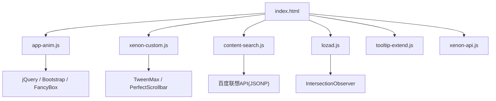
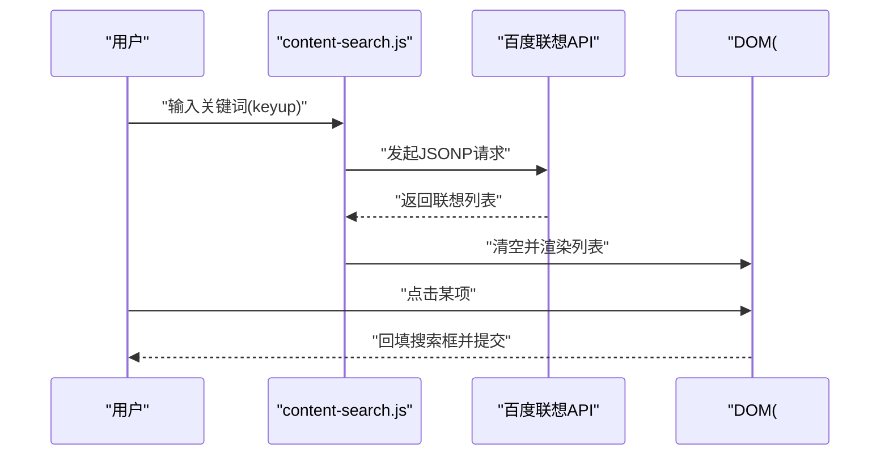
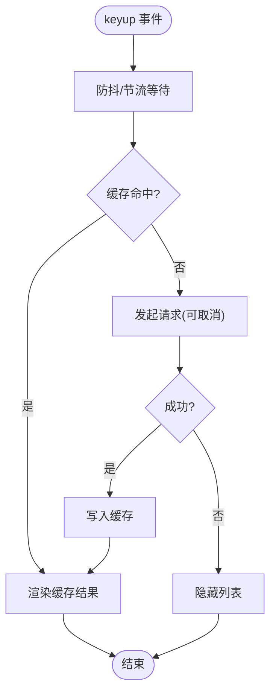
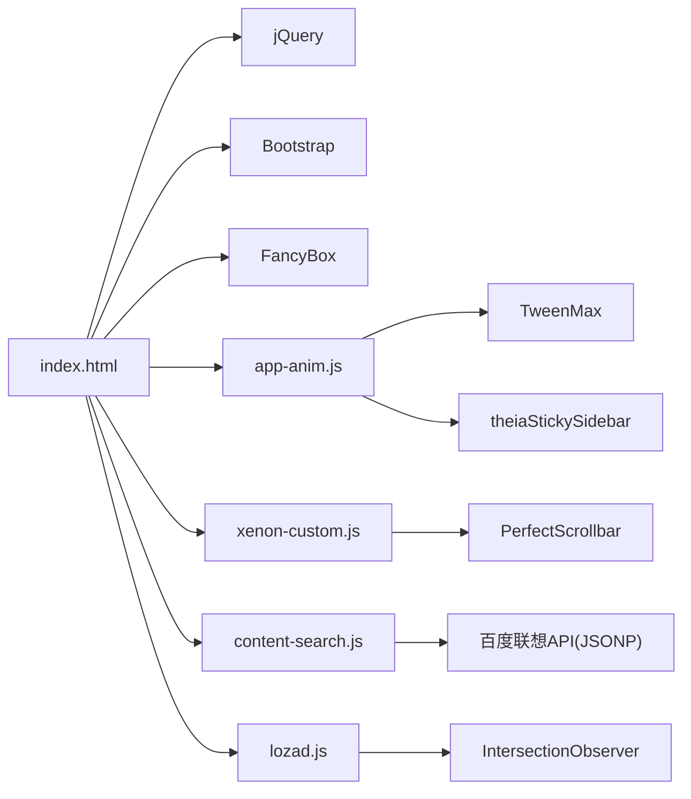

# 运行时性能优化

<cite>
**本文引用的文件**
- [index.html](file://index.html)
- [README.md](file://README.md)
- [assets/js/app-anim.js](file://assets/js/app-anim.js)
- [assets/js/xenon-custom.js](file://assets/js/xenon-custom.js)
- [assets/js/xenon-api.js](file://assets/js/xenon-api.js)
- [assets/js/content-search.js](file://assets/js/content-search.js)
- [assets/js/lozad.js](file://assets/js/lozad.js)
- [assets/js/tooltip-extend.js](file://assets/js/tooltip-extend.js)
</cite>

## 目录
1. [简介](#简介)
2. [项目结构](#项目结构)
3. [核心组件](#核心组件)
4. [架构总览](#架构总览)
5. [详细组件分析](#详细组件分析)
6. [依赖关系分析](#依赖关系分析)
7. [性能考量与优化建议](#性能考量与优化建议)
8. [故障排查指南](#故障排查指南)
9. [结论](#结论)
10. [附录](#附录)

## 简介
本文件围绕该项目的运行时性能优化，聚焦以下方面：内存管理策略（对象池化、事件监听器清理、定时器管理）、事件处理优化（事件委托、防抖节流、批量处理）、渲染性能提升（DOM操作优化、避免重排重绘、虚拟滚动思路）、动画性能优化（硬件加速、requestAnimationFrame使用、帧率控制），以及性能监控与分析工具的使用指南。内容基于仓库中实际代码进行分析与提炼，并提供可操作的改进建议。

## 项目结构
该项目为纯静态站点，主要资源位于 assets 目录，JavaScript 逻辑分布在多个脚本文件中，页面入口为 index.html。关键脚本职责如下：
- app-anim.js：首页交互、侧边栏、滚动、AJAX 加载、本地存储等
- xenon-custom.js：主题通用 UI 行为（菜单、滚动条、面板、响应式）
- xenon-api.js：加载进度条等 API 封装
- content-search.js：搜索联想与输入处理
- lozad.js：图片懒加载（IntersectionObserver）
- tooltip-extend.js：工具提示扩展与窗口断点适配

图表来源
- [index.html:17-31](file://index.html#L17-L31)
- [assets/js/app-anim.js:1-25](file://assets/js/app-anim.js#L1-L25)
- [assets/js/xenon-custom.js:1-12](file://assets/js/xenon-custom.js#L1-L12)
- [assets/js/content-search.js:1-10](file://assets/js/content-search.js#L1-L10)
- [assets/js/lozad.js:117-168](file://assets/js/lozad.js#L117-L168)
- [assets/js/xenon-api.js:20-91](file://assets/js/xenon-api.js#L20-L91)

章节来源
- [index.html:17-31](file://index.html#L17-L31)
- [README.md:298-314](file://README.md#L298-L314)

## 核心组件
- 搜索联想与输入处理：content-search.js 通过 keyup 触发 AJAX 请求获取联想词，存在高频调用风险，需引入防抖/节流。
- 图片懒加载：lozad.js 利用 IntersectionObserver 在元素进入视口时加载，减少首屏资源压力。
- 侧边栏与滚动：xenon-custom.js 初始化 perfect-scrollbar，并在菜单展开/收起时更新滚动条，注意销毁与重建的时机。
- 动画与过渡：app-anim.js 使用 jQuery animate 和 TweenMax 进行滚动、面板高度动画；需注意动画频率与主线程占用。
- 加载进度条：xenon-api.js 提供 show/hide 进度条，结合 TweenMax 实现平滑过渡。

章节来源
- [assets/js/content-search.js:1-91](file://assets/js/content-search.js#L1-L91)
- [assets/js/lozad.js:117-168](file://assets/js/lozad.js#L117-L168)
- [assets/js/xenon-custom.js:75-132](file://assets/js/xenon-custom.js#L75-L132)
- [assets/js/app-anim.js:36-45](file://assets/js/app-anim.js#L36-L45)
- [assets/js/xenon-api.js:20-91](file://assets/js/xenon-api.js#L20-L91)

## 架构总览
整体采用“页面 + 多脚本”的模块化组织方式，各脚本通过 jQuery 绑定事件、操作 DOM，并借助第三方库（Bootstrap、FancyBox、TweenMax、PerfectScrollbar、Lozad）增强交互与性能。数据流方面，搜索联想通过 JSONP 拉取，AJAX 用于点赞、统计、分类内容加载等。

图表来源
- [assets/js/content-search.js:3-83](file://assets/js/content-search.js#L3-L83)

章节来源
- [assets/js/content-search.js:3-83](file://assets/js/content-search.js#L3-L83)

## 详细组件分析

### 搜索联想与输入处理（content-search.js）
- 当前实现：每次 keyup 立即发送请求，未做防抖/节流，易造成网络抖动与频繁 DOM 操作。
- 优化建议：
  - 防抖/节流：对 keyup 事件进行节流（如 200-300ms），或防抖（输入停止后执行）。
  - 取消重复请求：使用 AbortController 或记录上次请求 ID，新请求到来时取消旧请求。
  - 结果缓存：对相同关键词的结果进行短期缓存，减少重复请求。
  - 批量渲染：合并多次 DOM 插入，使用 DocumentFragment 或一次性 innerHTML 更新。
  - 错误与空态：统一隐藏/显示状态，避免闪烁。

图表来源
- [assets/js/content-search.js:3-83](file://assets/js/content-search.js#L3-L83)

章节来源
- [assets/js/content-search.js:3-83](file://assets/js/content-search.js#L3-L83)

### 图片懒加载（lozad.js）
- 当前实现：使用 IntersectionObserver 检测元素可见性，按需加载图片/视频背景等，显著降低首屏负载。
- 优化建议：
  - 合理设置 rootMargin 与 threshold，提前预加载即将进入视口的资源。
  - 对大量图片场景考虑分片观察与去重标记，避免重复加载。
  - 结合 loading="lazy" 与 srcset 进一步优化带宽与清晰度。

章节来源
- [assets/js/lozad.js:19-77](file://assets/js/lozad.js#L19-L77)
- [assets/js/lozad.js:87-168](file://assets/js/lozad.js#L87-L168)

### 侧边栏与滚动条（xenon-custom.js）
- 当前实现：初始化 perfect-scrollbar，并在菜单展开/收起、下拉切换时更新滚动条；提供 ps_init/ps_destroy 生命周期管理。
- 优化建议：
  - 仅在必要时初始化/销毁滚动条，避免频繁创建销毁导致内存抖动。
  - 在大型列表场景下，考虑虚拟滚动（仅渲染可视区域节点），减少 DOM 节点数量。
  - 使用 requestAnimationFrame 包裹可能触发布局的计算，避免强制同步布局。

章节来源
- [assets/js/xenon-custom.js:75-132](file://assets/js/xenon-custom.js#L75-L132)
- [assets/js/xenon-custom.js:717-758](file://assets/js/xenon-custom.js#L717-L758)

### 动画与过渡（app-anim.js, xenon-api.js）
- 当前实现：使用 jQuery animate 与 TweenMax 进行滚动、面板高度、进度条动画。
- 优化建议：
  - 优先使用 CSS transform 与 opacity 实现动画，启用 GPU 硬件加速。
  - 使用 requestAnimationFrame 编排复杂动画，确保与浏览器刷新率同步。
  - 限制并发动画数量，避免主线程阻塞。

章节来源
- [assets/js/app-anim.js:36-45](file://assets/js/app-anim.js#L36-L45)
- [assets/js/app-anim.js:239-253](file://assets/js/app-anim.js#L239-L253)
- [assets/js/xenon-api.js:20-91](file://assets/js/xenon-api.js#L20-L91)

### 工具提示与响应式（tooltip-extend.js）
- 当前实现：根据断点调整侧边栏与滚动条行为，提供 tooltip/popover 初始化。
- 优化建议：
  - 对 tooltip 启用延迟显示与按需初始化，减少不必要的 DOM 与事件绑定。
  - 在移动端禁用或简化 tooltip，降低触摸交互开销。

章节来源
- [assets/js/tooltip-extend.js:275-322](file://assets/js/tooltip-extend.js#L275-L322)
- [assets/js/tooltip-extend.js:77-86](file://assets/js/tooltip-extend.js#L77-L86)

## 依赖关系分析
- 页面入口 index.html 引入 jQuery、Bootstrap、FancyBox、自定义样式与脚本。
- app-anim.js 依赖 jQuery、TweenMax、ClipboardJS、theiaStickySidebar 等。
- xenon-custom.js 依赖 jQuery、TweenMax、PerfectScrollbar。
- content-search.js 依赖 jQuery，外部 JSONP 接口。
- lozad.js 依赖 IntersectionObserver（现代浏览器原生能力）。

图表来源
- [index.html:17-31](file://index.html#L17-L31)
- [assets/js/app-anim.js:1-25](file://assets/js/app-anim.js#L1-L25)
- [assets/js/xenon-custom.js:1-12](file://assets/js/xenon-custom.js#L1-L12)
- [assets/js/content-search.js:1-10](file://assets/js/content-search.js#L1-L10)
- [assets/js/lozad.js:117-168](file://assets/js/lozad.js#L117-L168)

章节来源
- [index.html:17-31](file://index.html#L17-L31)

## 性能考量与优化建议

### 内存管理策略
- 对象池化
  - 场景：频繁创建/销毁 DOM 节点（如搜索结果列表、卡片列表）。
  - 建议：复用节点模板，使用 DocumentFragment 批量插入；对高频率小对象（如配置对象）建立轻量池。
  - 参考位置：content-search.js 的列表渲染与 app-anim.js 的动态节点创建。
- 事件监听器清理
  - 场景：动态添加/移除模块时，需解绑对应事件，避免悬挂引用导致内存泄漏。
  - 建议：使用事件委托（document/body 上统一监听），或在模块卸载时显式 removeEventListener。
  - 参考位置：app-anim.js 的多处 on('click', ...) 与 xenon-custom.js 的菜单事件。
- 定时器管理
  - 场景：resize 防抖、轮询、延时动画。
  - 建议：统一维护定时器 ID，在组件销毁或页面卸载时 clearTimeout/setInterval；避免嵌套定时器累积。
  - 参考位置：app-anim.js 的 resize 防抖与 go_resize。

章节来源
- [assets/js/content-search.js:3-83](file://assets/js/content-search.js#L3-L83)
- [assets/js/app-anim.js:36-45](file://assets/js/app-anim.js#L36-L45)
- [assets/js/app-anim.js:58-64](file://assets/js/app-anim.js#L58-L64)

### 事件监听优化
- 事件委托
  - 将多个子元素的事件绑定到父容器，减少监听器数量，提高性能。
  - 参考位置：app-anim.js 使用 $(document).on('click', ...) 进行全局事件委托。
- 防抖与节流
  - 对高频事件（scroll、resize、input）使用节流/防抖，降低回调频率。
  - 参考位置：app-anim.js 的 window.resize 防抖；建议在 content-search.js 的 keyup 加入节流。
- 批量处理
  - 将多次 DOM 写入合并为一次，或使用批处理队列，减少重排重绘。
  - 参考位置：content-search.js 的循环 append 可改为批量构建字符串或片段。

章节来源
- [assets/js/app-anim.js:58-64](file://assets/js/app-anim.js#L58-L64)
- [assets/js/app-anim.js:36-45](file://assets/js/app-anim.js#L36-L45)
- [assets/js/content-search.js:17-55](file://assets/js/content-search.js#L17-L55)

### 渲染性能提升
- DOM 操作优化
  - 减少直接操作 DOM 的频率，优先使用 CSS 类切换与 transform。
  - 使用虚拟滚动思路：仅渲染可视区节点，隐藏不可见节点或占位。
  - 参考位置：app-anim.js 的动态卡片生成与 xenon-custom.js 的滚动条更新。
- 避免重排重绘
  - 批量读取/写入样式，避免在循环中交替读写 layout 属性。
  - 使用 will-change 与 transform 触发合成层，减少重排。
- 懒加载与分页
  - 使用 lozad.js 懒加载图片；对长列表实施分页或无限滚动。
  - 参考位置：lozad.js 的 observe 与 load 流程。

章节来源
- [assets/js/app-anim.js:558-598](file://assets/js/app-anim.js#L558-L598)
- [assets/js/xenon-custom.js:717-758](file://assets/js/xenon-custom.js#L717-L758)
- [assets/js/lozad.js:117-168](file://assets/js/lozad.js#L117-L168)

### 动画性能优化
- 硬件加速
  - 优先使用 transform 与 opacity 动画，配合 will-change 提升合成效率。
  - 参考位置：app-anim.js 中的 CSS transform 与 TweenMax 动画。
- requestAnimationFrame
  - 将动画更新放入 rAF 循环，保证与屏幕刷新同步，避免掉帧。
  - 参考位置：可替换部分 jQuery animate 为 rAF 驱动。
- 帧率控制
  - 限制动画并发数，复杂动画降级为简单过渡；在低性能设备上关闭非必要动画。
  - 参考位置：xenon-api.js 的进度条动画可加设备能力检测。

章节来源
- [assets/js/app-anim.js:239-253](file://assets/js/app-anim.js#L239-L253)
- [assets/js/xenon-api.js:20-91](file://assets/js/xenon-api.js#L20-L91)

### 性能监控与分析工具
- Chrome DevTools
  - Performance 面板录制关键交互（搜索、滚动、切换分类），识别长任务与卡顿。
  - Memory 面板检查堆快照，定位内存增长与悬挂引用。
  - Network 面板分析请求频率与大小，优化 JSONP/AJAX。
- Lighthouse
  - 运行性能审计，获取可访问性、最佳实践与 SEO 评分及改进建议。
- 自定义埋点
  - 使用 performance.mark/measure 标注关键阶段（如搜索联想请求、列表渲染），输出耗时报告。
  - 参考位置：可在 content-search.js 的关键步骤添加 mark/measure。

[本节为通用指导，不直接分析具体文件]

## 故障排查指南
- 搜索联想卡顿
  - 现象：输入时界面卡顿、请求过多。
  - 排查：检查是否缺少防抖/节流；确认请求是否被重复取消；查看 Network 面板请求频率。
  - 修复：加入节流/防抖，缓存结果，合并 DOM 更新。
  - 参考位置：content-search.js 的 keyup 与 AJAX 流程。
- 滚动条异常
  - 现象：菜单展开后滚动条错位或不更新。
  - 排查：确认 ps_init/ps_destroy 调用时机；检查是否在动画过程中更新滚动条。
  - 修复：在动画 onComplete 中调用 update；必要时销毁重建。
  - 参考位置：xenon-custom.js 的滚动条函数。
- 动画掉帧
  - 现象：切换面板或滚动时出现掉帧。
  - 排查：Performance 面板查看长任务；检查是否有同步布局读取。
  - 修复：改用 transform/opacity；使用 rAF；减少同时进行的动画数量。
  - 参考位置：app-anim.js 与 xenon-api.js 的动画逻辑。

章节来源
- [assets/js/content-search.js:3-83](file://assets/js/content-search.js#L3-L83)
- [assets/js/xenon-custom.js:717-758](file://assets/js/xenon-custom.js#L717-L758)
- [assets/js/app-anim.js:239-253](file://assets/js/app-anim.js#L239-L253)
- [assets/js/xenon-api.js:20-91](file://assets/js/xenon-api.js#L20-L91)

## 结论
本项目已具备基础的运行时性能优化实践（如懒加载、滚动条管理、动画过渡）。为进一步优化，建议重点加强事件处理的防抖节流、DOM 批量更新、内存管理与动画帧率控制。通过引入更精细的请求取消、缓存机制与性能监控，可显著提升用户体验与稳定性。

[本节为总结，不直接分析具体文件]

## 附录
- 部署与优化相关说明可参考 README 中的 Nginx 压缩与缓存配置，有助于减少网络传输与提升加载速度。
- 若需进一步虚拟化长列表，可结合虚拟滚动库或自研方案，仅渲染可视区域节点，大幅降低 DOM 压力。

章节来源
- [README.md:88-116](file://README.md#L88-L116)