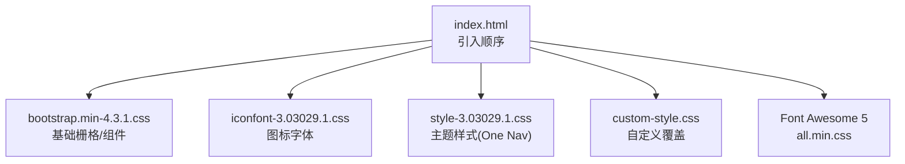
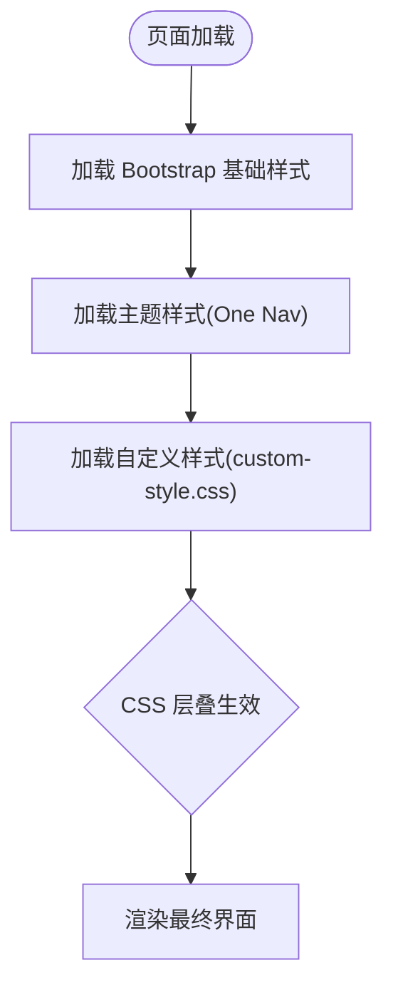

# CSS架构设计

<cite>
**本文引用的文件**
- [index.html](file://index.html)
- [custom-style.css](file://assets/css/custom-style.css)
- [style-3.03029.1.css](file://assets/css/style-3.03029.1.css)
- [iconfont-3.03029.1.css](file://assets/css/iconfont-3.03029.1.css)
- [bootstrap.min-4.3.1.css](file://assets/css/bootstrap.min-4.3.1.css)
- [README.md](file://README.md)
</cite>

## 目录
1. [简介](#简介)
2. [项目结构](#项目结构)
3. [核心组件](#核心组件)
4. [架构总览](#架构总览)
5. [详细组件分析](#详细组件分析)
6. [依赖关系与加载顺序](#依赖关系与加载顺序)
7. [性能考量](#性能考量)
8. [故障排查指南](#故障排查指南)
9. [结论](#结论)
10. [附录](#附录)

## 简介
本文件面向本项目（基于 HTML + CSS + JavaScript 的在线网址导航）的样式架构，系统性说明样式文件的组织方式、Bootstrap 框架集成策略、主题与自定义样式的职责边界、优先级管理与冲突规避方法，以及模块化的最佳实践。文档同时提供重构示例与常见问题解决方案，帮助团队在保持可维护性的前提下高效扩展样式能力。

## 项目结构
项目的样式资源集中在 assets/css 目录，按“第三方库/基础样式/主题样式/自定义样式”分层组织：
- 第三方库
  - Bootstrap 4 栅格与组件基础样式：bootstrap.min-4.3.1.css
  - 图标字体：iconfont-3.03029.1.css
  - Font Awesome 5（通过 all.min.css 引入）
- 主题样式
  - 主题 One Nav 样式：style-3.03029.1.css
- 自定义样式
  - 业务定制覆盖：custom-style.css

页面入口 index.html 中按固定顺序引入上述样式，确保“基础 → 主题 → 自定义”的层叠顺序，便于通过后加载覆盖前加载的规则。



图表来源
- [index.html:17-29](file://index.html#L17-L29)

章节来源
- [index.html:17-29](file://index.html#L17-L29)
- [README.md:277-283](file://README.md#L277-L283)

## 核心组件
- Bootstrap 4 栅格系统
  - 使用 .row、.col-* 等类构建响应式布局；主题在 style-3.03029.1.css 中扩展了 row-lg/row-md/row-sm/row-xs 等间距变体，适配不同屏幕密度下的卡片网格。
- 主题样式（One Nav）
  - 定义全局排版、侧边栏、头部导航、URL 卡片、搜索区域等 UI 组件样式；提供暗色模式、粘性定位、动画过渡等交互增强。
- 图标体系
  - iconfont 自定义图标集与 Font Awesome 5 并存，分别承担业务图标与通用图标场景。
- 自定义覆盖（custom-style.css）
  - 针对具体业务需求进行局部覆盖：如全局字号、左侧导航宽度、滚动条隐藏、搜索热词下拉、页脚链接颜色、网格背景等。

章节来源
- [style-3.03029.1.css:1-200](file://assets/css/style-3.03029.1.css#L1-L200)
- [style-3.03029.1.css:373-399](file://assets/css/style-3.03029.1.css#L373-L399)
- [iconfont-3.03029.1.css:1-200](file://assets/css/iconfont-3.03029.1.css#L1-L200)
- [custom-style.css:1-126](file://assets/css/custom-style.css#L1-L126)

## 架构总览
下图展示样式加载与覆盖关系：Bootstrap 提供基础能力，主题样式在其之上构建完整 UI，自定义样式在末尾进行最小化覆盖，避免直接修改第三方或主题源码。



图表来源
- [index.html:17-29](file://index.html#L17-L29)

## 详细组件分析

### Bootstrap 栅格系统与主题扩展
- 栅格使用
  - 页面主体内容区采用 .row 与 .col-* 组合实现多列卡片布局，配合主题提供的 row-* 间距类在不同断点下调整内边距与外边距，保证卡片对齐与留白一致。
- 主题扩展
  - 在 style-3.03029.1.css 中定义了 row-lg/row-md/row-sm/row-xs 等容器间距变体，用于精细控制不同屏幕下的网格行为。
- 建议
  - 优先使用 Bootstrap 原生栅格语义类；如需更细粒度间距，复用主题提供的 row-* 类，避免新增全局样式。

章节来源
- [style-3.03029.1.css:373-399](file://assets/css/style-3.03029.1.css#L373-L399)

### 主题样式（One Nav）职责
- 全局与排版
  - 设置全局字体族、行高、颜色、背景过渡等；统一文本溢出处理与图片自适应。
- 侧边栏与导航
  - 定义侧边栏固定定位、折叠态、弹出菜单、移动端抽屉式导航；提供 hover/active 状态与动画。
- URL 卡片与搜索区
  - 卡片悬停阴影、跳转按钮、标题截断；搜索热词下拉、激活指示器、深色模式适配。
- 建议
  - 新增组件时尽量遵循现有命名约定与结构；对交互效果优先使用主题已有的 class 组合，减少重复样式。

章节来源
- [style-3.03029.1.css:1-200](file://assets/css/style-3.03029.1.css#L1-L200)

### 图标体系与使用
- iconfont
  - 通过 @font-face 声明字体并映射多个业务图标类名；适用于品牌、功能图标。
- Font Awesome 5
  - 通过 all.min.css 引入，提供丰富的通用图标；在页面中以 <i class="fa ..."> 形式使用。
- 建议
  - 业务图标优先使用 iconfont 以保持一致性；通用图标使用 Font Awesome；避免混用导致体积膨胀。

章节来源
- [iconfont-3.03029.1.css:1-200](file://assets/css/iconfont-3.03029.1.css#L1-L200)
- [index.html:29](file://index.html#L29)

### 自定义样式（custom-style.css）与优先级管理
- 作用范围
  - 全局字号、左侧导航宽度、滚动条隐藏、搜索热词下拉样式、页脚链接颜色、网格背景等。
- 优先级策略
  - 由于 custom-style.css 最后加载，其规则将覆盖前面已加载的基础与主题样式；建议仅在此文件中做最小必要覆盖，避免破坏主题一致性。
- 建议
  - 为每个覆盖增加注释说明原因；必要时使用更具体的选择器提升特异性，但避免滥用 !important。

章节来源
- [custom-style.css:1-126](file://assets/css/custom-style.css#L1-L126)

### 样式模块化与命名规范
- 文件拆分原则
  - 第三方库（Bootstrap、FontAwesome）、主题样式（One Nav）、自定义样式（业务覆盖）分文件管理，职责清晰。
- 命名约定
  - 组件级类名采用 BEM 风格或主题一致的命名；业务覆盖类名加前缀（如 io-、site-）降低冲突概率。
- 复用机制
  - 通过组合 Bootstrap 与主题已有类实现布局与交互；新增样式尽量复用已有原子类，减少重复。

章节来源
- [style-3.03029.1.css:1-200](file://assets/css/style-3.03029.1.css#L1-L200)
- [custom-style.css:1-126](file://assets/css/custom-style.css#L1-L126)

### 样式重构示例
- 目标：将分散的全局字号与主题默认字号统一到一处，便于后续切换主题或升级 Bootstrap。
- 步骤
  - 在 custom-style.css 中保留全局字号覆盖；在主题样式中确认默认字号变量或基础规则位置；若未来迁移至 SCSS，可将全局字号抽离为变量。
- 预期收益
  - 减少多处重复设置；升级主题时只需调整一处。

章节来源
- [custom-style.css:1-5](file://assets/css/custom-style.css#L1-L5)
- [style-3.03029.1.css:8-15](file://assets/css/style-3.03029.1.css#L8-L15)

### 常见问题与解决方案
- 问题：自定义样式未生效或被覆盖
  - 检查加载顺序是否正确（Bootstrap → 主题 → 自定义）；提高选择器特异性或使用更精确的父级限定。
- 问题：移动端布局错乱
  - 确认是否误覆盖了 Bootstrap 栅格或主题提供的 row-* 间距；优先使用主题提供的间距类。
- 问题：图标显示异常
  - 检查 iconfont 与 FontAwesome 是否都正确引入；确认类名拼写与版本匹配。

章节来源
- [index.html:17-29](file://index.html#L17-L29)
- [style-3.03029.1.css:373-399](file://assets/css/style-3.03029.1.css#L373-L399)
- [iconfont-3.03029.1.css:1-200](file://assets/css/iconfont-3.03029.1.css#L1-L200)

## 依赖关系与加载顺序
- 加载顺序
  - 页面 head 中按以下顺序引入：Block Library → Iconfont → Bootstrap → Fancybox → 主题样式 → 自定义样式 → FontAwesome。
- 依赖关系
  - 主题样式依赖 Bootstrap 栅格与基础组件；自定义样式依赖主题样式提供的类名；图标体系独立但需与主题配色协调。
- 变更影响
  - 调整 Bootstrap 版本时需验证栅格与组件兼容性；主题升级可能改变类名或变量，需在自定义样式中评估覆盖项是否需要更新。

```mermaid
sequenceDiagram
participant H as "HTML"
participant B as "Bootstrap"
participant T as "主题样式"
participant C as "自定义样式"
participant I as "图标体系"
H->>B : 引入基础样式
H->>I : 引入图标字体
H->>T : 引入主题样式
H->>C : 引入自定义样式
Note over B,T,C : 层叠顺序决定最终样式
```

图表来源
- [index.html:17-29](file://index.html#L17-L29)

章节来源
- [index.html:17-29](file://index.html#L17-L29)

## 性能考量
- 样式体积
  - 使用压缩版 Bootstrap 与 FontAwesome；按需引入图标集以减少体积。
- 渲染性能
  - 避免过度复杂的选择器与大量 !important；合理使用媒体查询与硬件加速属性（transform、opacity）。
- 缓存策略
  - 静态资源开启长期缓存；版本号或哈希命名避免浏览器缓存旧样式。

[本节为通用指导，不直接分析具体文件]

## 故障排查指南
- 样式未生效
  - 检查是否在自定义样式之后引入了新的第三方样式；使用浏览器开发者工具查看计算样式与层叠来源。
- 布局错位
  - 检查是否覆盖了 Bootstrap 栅格或主题 row-* 间距；恢复默认或改用主题提供的间距类。
- 图标不显示
  - 确认 font-family 与 @font-face 路径正确；检查类名是否存在于对应图标库。
- 主题升级冲突
  - 对比新旧主题差异，逐步回滚自定义覆盖；必要时将覆盖逻辑迁移到变量或配置层。

章节来源
- [style-3.03029.1.css:1-200](file://assets/css/style-3.03029.1.css#L1-L200)
- [custom-style.css:1-126](file://assets/css/custom-style.css#L1-L126)

## 结论
本项目采用“第三方基础 → 主题样式 → 自定义覆盖”的分层架构，通过明确的加载顺序与职责划分，实现了良好的可维护性与可扩展性。建议在后续迭代中继续坚持最小覆盖原则、统一命名规范与复用已有类，结合版本化管理与缓存策略，持续提升样式质量与性能。

[本节为总结性内容，不直接分析具体文件]

## 附录
- 快速参考
  - 栅格：使用 Bootstrap .row/.col-* 与主题 row-* 间距类
  - 主题：遵循 One Nav 的组件结构与交互约定
  - 图标：业务图标用 iconfont，通用图标用 FontAwesome
  - 覆盖：仅在 custom-style.css 中进行最小必要覆盖

[本节为补充信息，不直接分析具体文件]