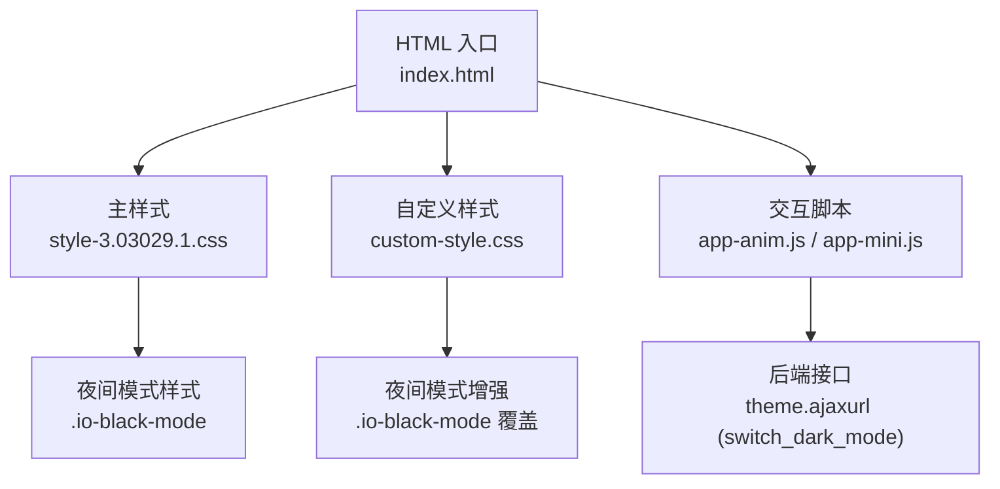
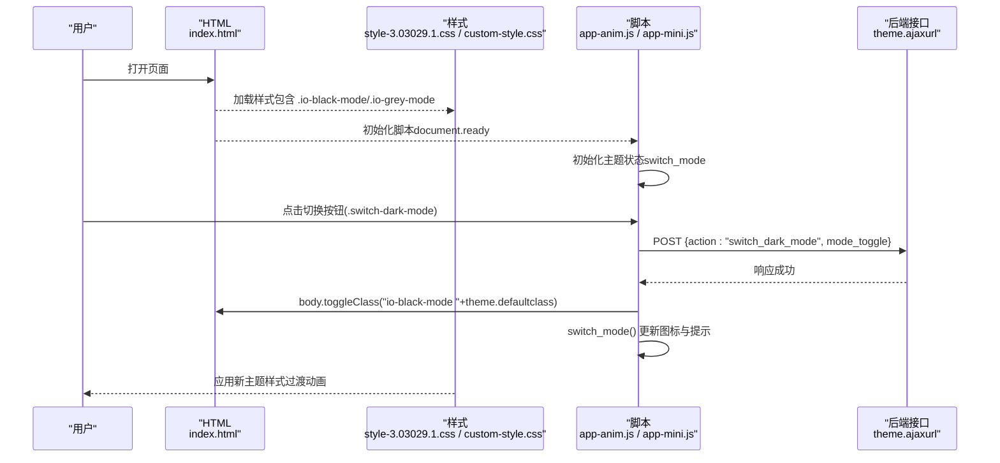
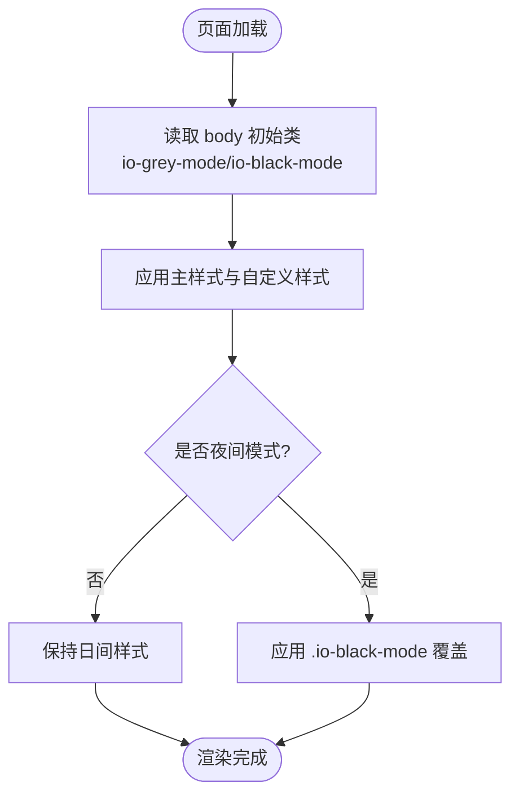
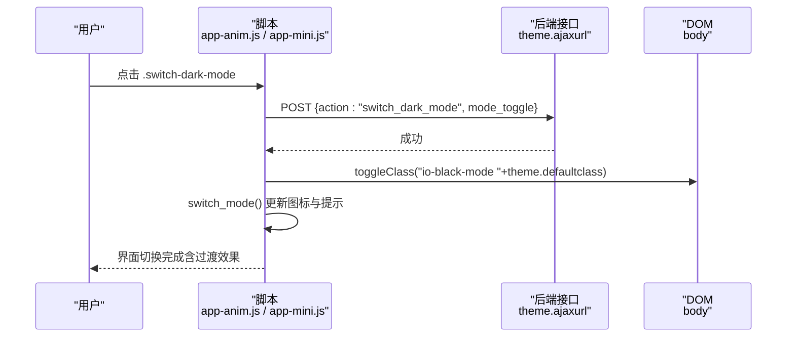
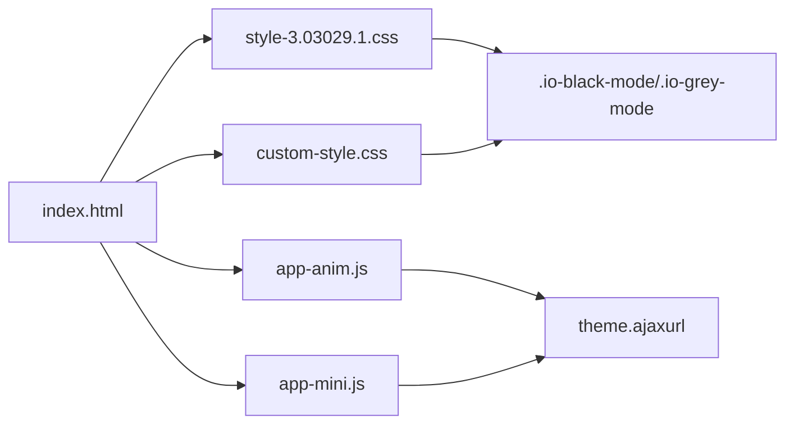

# 主题系统

<cite>
**本文引用的文件**
- [index.html](file://index.html)
- [style-3.03029.1.css](file://assets/css/style-3.03029.1.css)
- [custom-style.css](file://assets/css/custom-style.css)
- [app-anim.js](file://assets/js/app-anim.js)
- [app-mini.js](file://assets/js/app-mini.js)
</cite>

## 目录
1. [简介](#简介)
2. [项目结构](#项目结构)
3. [核心组件](#核心组件)
4. [架构总览](#架构总览)
5. [详细组件分析](#详细组件分析)
6. [依赖关系分析](#依赖关系分析)
7. [性能考虑](#性能考虑)
8. [故障排除指南](#故障排除指南)
9. [结论](#结论)
10. [附录：定制与最佳实践](#附录定制与最佳实践)

## 简介
本主题系统通过“类名切换 + CSS 样式覆盖”的方式实现日间/夜间模式。页面加载时根据默认配置或后端返回的类名，为 body 添加对应主题类；用户点击切换按钮后，前端发起 AJAX 请求通知后端保存偏好，随后在本地 DOM 上切换主题类并更新图标文案，从而实现平滑的主题切换体验。

## 项目结构
- HTML 入口负责引入样式与脚本，并在 body 上设置初始主题类（如 io-grey-mode）。
- 主样式文件提供两套主题的基础样式，并通过 .io-black-mode、.io-grey-mode 等类名区分不同模式下的颜色、背景、边框等视觉表现。
- 自定义样式用于微调局部 UI（搜索框、热门词列表、网格背景等），并对夜间模式做针对性适配。
- 交互脚本监听切换按钮点击事件，调用后端接口并切换主题类，同时更新图标与提示文案。

图表来源
- [index.html:1-35](file://index.html#L1-L35)
- [style-3.03029.1.css:1013-1058](file://assets/css/style-3.03029.1.css#L1013-L1058)
- [custom-style.css:24-68](file://assets/css/custom-style.css#L24-L68)
- [app-anim.js:201-237](file://assets/js/app-anim.js#L201-L237)

章节来源
- [index.html:1-35](file://index.html#L1-L35)
- [style-3.03029.1.css:1013-1058](file://assets/css/style-3.03029.1.css#L1013-L1058)
- [custom-style.css:24-68](file://assets/css/custom-style.css#L24-L68)
- [app-anim.js:201-237](file://assets/js/app-anim.js#L201-L237)

## 核心组件
- 主题类体系
  - 日间模式：body 默认使用浅色类（如 io-grey-mode），主样式中定义了对应的侧边栏、导航、卡片等样式。
  - 夜间模式：通过 .io-black-mode 类覆盖全局背景、文字、边框、阴影等，形成深色主题。
- 切换逻辑
  - 绑定 .switch-dark-mode 点击事件，发送 AJAX 请求到 theme.ajaxurl，携带 mode_toggle 与 action=switch_dark_mode。
  - 成功后对 body 执行 toggleClass('io-black-mode '+theme.defaultclass)，并调用 switch_mode() 更新图标与提示文案。
- 样式覆盖策略
  - 主样式集中定义两套模式的规则，确保一致性。
  - 自定义样式针对特定区域（搜索框、热门词、网格背景）进行补充覆盖，保证夜间模式下可读性与美观性。

章节来源
- [style-3.03029.1.css:1013-1058](file://assets/css/style-3.03029.1.css#L1013-L1058)
- [custom-style.css:24-68](file://assets/css/custom-style.css#L24-L68)
- [app-anim.js:201-237](file://assets/js/app-anim.js#L201-L237)
- [app-mini.js:201-237](file://assets/js/app-mini.js#L201-L237)

## 架构总览
主题切换的整体流程如下：

图表来源
- [index.html:1-35](file://index.html#L1-L35)
- [style-3.03029.1.css:1013-1058](file://assets/css/style-3.03029.1.css#L1013-L1058)
- [custom-style.css:24-68](file://assets/css/custom-style.css#L24-L68)
- [app-anim.js:201-237](file://assets/js/app-anim.js#L201-L237)

## 详细组件分析

### 主题类与样式覆盖
- 夜间模式基础样式集中在主样式文件中，通过 .io-black-mode 选择器覆盖背景、文字、边框、阴影、下拉菜单等元素的颜色与透明度，确保整体一致。
- 自定义样式对搜索框、热门词列表、网格背景等进行细化调整，尤其在夜间模式下提升对比度与可读性。
- 页面初始主题由 HTML 的 body 类决定（例如 io-grey-mode），也可由后端注入默认类（如 theme.defaultclass）。

图表来源
- [index.html:39-39](file://index.html#L39-L39)
- [style-3.03029.1.css:1013-1058](file://assets/css/style-3.03029.1.css#L1013-L1058)
- [custom-style.css:24-68](file://assets/css/custom-style.css#L24-L68)

章节来源
- [style-3.03029.1.css:1013-1058](file://assets/css/style-3.03029.1.css#L1013-L1058)
- [custom-style.css:24-68](file://assets/css/custom-style.css#L24-L68)
- [index.html:39-39](file://index.html#L39-L39)

### 切换按钮与交互流程
- 事件绑定：监听 .switch-dark-mode 的点击事件，阻止默认行为。
- 状态同步：发送 AJAX 请求到 theme.ajaxurl，参数包括 action=switch_dark_mode 与 mode_toggle（根据当前 body 是否包含 io-black-mode 计算）。
- 本地切换：请求成功后，对 body 执行 toggleClass('io-black-mode '+theme.defaultclass)，并调用 switch_mode() 更新图标与提示文案。
- 图标与文案：根据当前模式切换 mode-ico 的图标类（icon-light/icon-night），并更新切换按钮的 title/data-original-title。

图表来源
- [app-anim.js:201-237](file://assets/js/app-anim.js#L201-L237)
- [app-mini.js:201-237](file://assets/js/app-mini.js#L201-L237)

章节来源
- [app-anim.js:201-237](file://assets/js/app-anim.js#L201-L237)
- [app-mini.js:201-237](file://assets/js/app-mini.js#L201-L237)

### 平滑过渡与视觉效果
- 主样式中对 body、page-header、sidebar-nav 等关键元素设置了 transition（如 background-color、color、left），使主题切换过程具备平滑过渡效果。
- 自定义样式对搜索框、热门词列表等区域也做了过渡优化，避免切换时的闪烁或突兀变化。

章节来源
- [style-3.03029.1.css:9-10](file://assets/css/style-3.03029.1.css#L9-L10)
- [style-3.03029.1.css:57-63](file://assets/css/style-3.03029.1.css#L57-L63)
- [style-3.03029.1.css:125-125](file://assets/css/style-3.03029.1.css#L125-L125)
- [custom-style.css:16-19](file://assets/css/custom-style.css#L16-L19)

### 配置管理与持久化
- 前端通过 theme.ajaxurl 与后端通信，将用户的主题偏好保存到服务端（具体存储方式由后端实现）。
- 页面初始化时，由后端注入默认类（theme.defaultclass）或根据用户历史偏好返回初始主题类，从而保证刷新后主题保持一致。
- 当前仓库未直接发现 localStorage/sessionStorage 的使用，主题状态主要依赖后端持久化与初始类注入。

章节来源
- [app-anim.js:201-237](file://assets/js/app-anim.js#L201-L237)
- [app-mini.js:201-237](file://assets/js/app-mini.js#L201-L237)

## 依赖关系分析
- HTML 依赖样式与脚本：
  - index.html 引入 style-3.03029.1.css、custom-style.css 以及 app-anim.js、app-mini.js。
- 脚本依赖后端接口：
  - app-anim.js 与 app-mini.js 均通过 theme.ajaxurl 调用后端接口以保存主题偏好。
- 样式依赖主题类：
  - style-3.03029.1.css 与 custom-style.css 通过 .io-black-mode、.io-grey-mode 控制不同模式的视觉表现。

图表来源
- [index.html:17-29](file://index.html#L17-L29)
- [app-anim.js:201-237](file://assets/js/app-anim.js#L201-L237)
- [app-mini.js:201-237](file://assets/js/app-mini.js#L201-L237)
- [style-3.03029.1.css:1013-1058](file://assets/css/style-3.03029.1.css#L1013-L1058)
- [custom-style.css:24-68](file://assets/css/custom-style.css#L24-L68)

章节来源
- [index.html:17-29](file://index.html#L17-L29)
- [app-anim.js:201-237](file://assets/js/app-anim.js#L201-L237)
- [app-mini.js:201-237](file://assets/js/app-mini.js#L201-L237)
- [style-3.03029.1.css:1013-1058](file://assets/css/style-3.03029.1.css#L1013-L1058)
- [custom-style.css:24-68](file://assets/css/custom-style.css#L24-L68)

## 性能考虑
- 使用 CSS 类切换而非动态内联样式，减少重排与重绘开销。
- 关键元素的 transition 属性已预设，切换时浏览器可高效合成动画。
- 避免在切换过程中频繁操作 DOM，仅在请求成功后统一切换类与更新图标。
- 若未来扩展更多主题，建议将颜色变量集中管理，便于维护与复用。

[本节为通用指导，不直接分析具体文件]

## 故障排除指南
- 切换无效
  - 检查 .switch-dark-mode 是否正确绑定点击事件。
  - 确认 theme.ajaxurl 是否可用，网络请求是否成功。
  - 验证 body 是否被正确添加/移除 .io-black-mode 类。
- 样式未生效
  - 确认主样式与自定义样式已正确加载。
  - 检查是否存在更高优先级的样式覆盖了主题类。
- 图标与文案未更新
  - 确认 switch_mode() 函数被执行。
  - 检查 mode-ico 的图标类是否正确切换（icon-light/icon-night）。
- 刷新后主题丢失
  - 确认后端是否正确保存并返回用户主题偏好。
  - 检查页面初始化时是否注入了正确的默认类（theme.defaultclass）。

章节来源
- [app-anim.js:201-237](file://assets/js/app-anim.js#L201-L237)
- [app-mini.js:201-237](file://assets/js/app-mini.js#L201-L237)
- [style-3.03029.1.css:1013-1058](file://assets/css/style-3.03029.1.css#L1013-L1058)
- [custom-style.css:24-68](file://assets/css/custom-style.css#L24-L68)

## 结论
该主题系统采用简洁可靠的“类名切换 + 样式覆盖”方案，结合后端持久化与平滑过渡，实现了良好的用户体验。通过合理组织样式与脚本，开发者可以方便地扩展新的主题或定制局部样式。建议在后续迭代中引入 CSS 变量统一管理颜色，进一步提升可维护性与扩展性。

[本节为总结，不直接分析具体文件]

## 附录：定制与最佳实践
- 新增主题
  - 在主样式中新增主题类（如 .io-blue-mode），定义背景、文字、边框等颜色。
  - 在自定义样式中补充特定区域的覆盖规则，确保一致性。
  - 如需支持多主题切换，可在脚本中扩展切换逻辑，增加对应的类名切换与图标更新。
- 颜色变量管理
  - 建议将常用颜色提取为 CSS 变量，便于统一修改与主题扩展。
- 版本管理
  - 对样式与脚本进行版本化命名（如 style-vX.css），配合缓存策略避免样式冲突。
- 兼容性处理
  - 使用现代 CSS 特性时注意浏览器兼容，必要时提供降级方案。
  - 对于不支持 CSS 变量的旧浏览器，可通过类名切换保证基本功能。
- 示例路径参考
  - 夜间模式样式覆盖：[style-3.03029.1.css:1013-1058](file://assets/css/style-3.03029.1.css#L1013-L1058)
  - 自定义样式覆盖：[custom-style.css:24-68](file://assets/css/custom-style.css#L24-L68)
  - 切换逻辑实现：[app-anim.js:201-237](file://assets/js/app-anim.js#L201-L237)、[app-mini.js:201-237](file://assets/js/app-mini.js#L201-L237)

章节来源
- [style-3.03029.1.css:1013-1058](file://assets/css/style-3.03029.1.css#L1013-L1058)
- [custom-style.css:24-68](file://assets/css/custom-style.css#L24-L68)
- [app-anim.js:201-237](file://assets/js/app-anim.js#L201-L237)
- [app-mini.js:201-237](file://assets/js/app-mini.js#L201-L237)