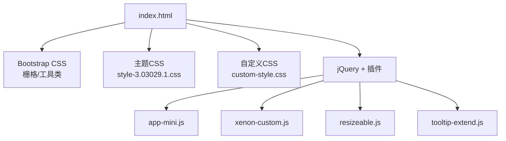
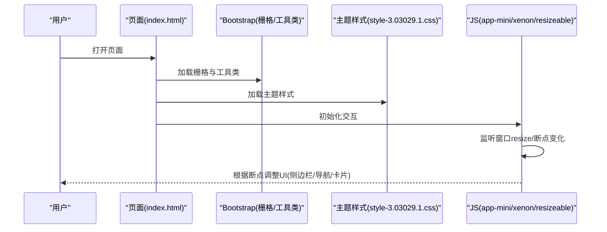
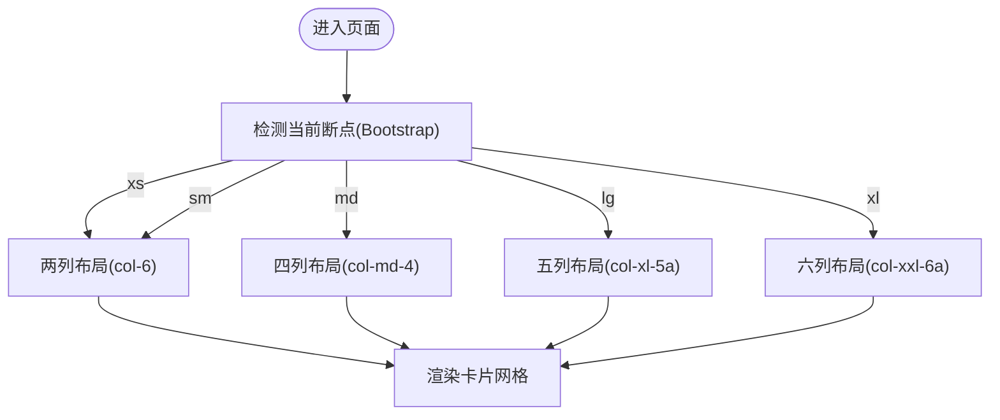
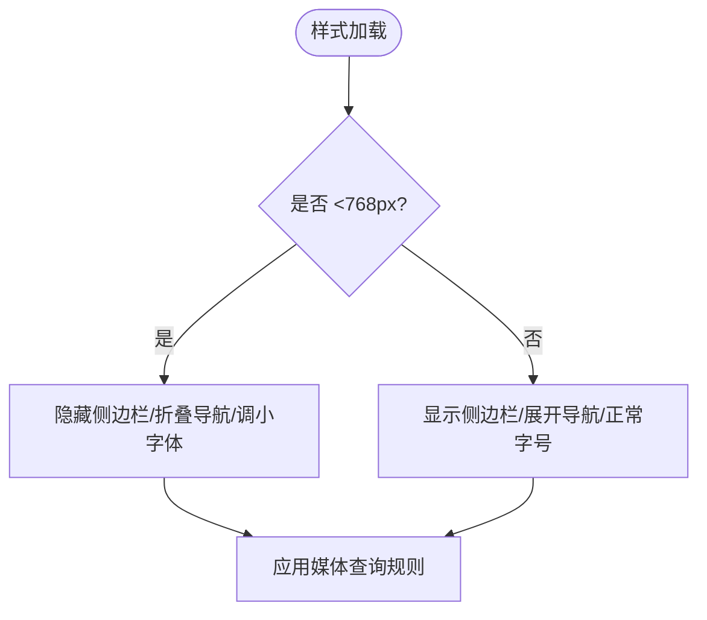
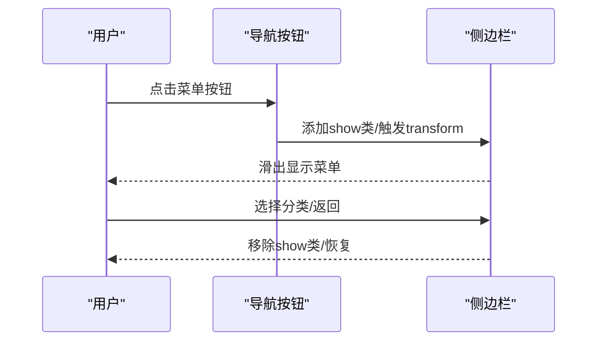
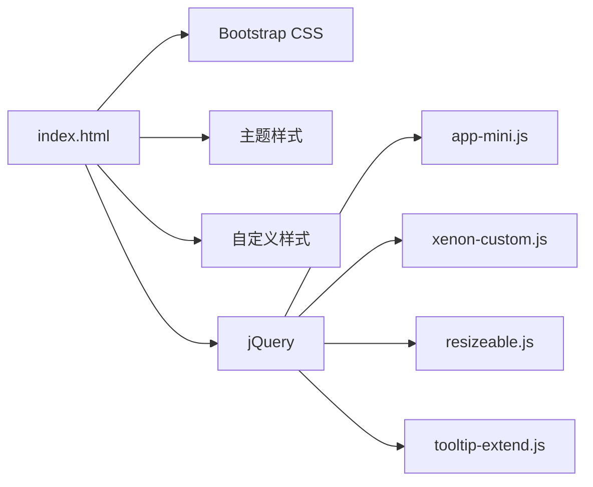

# 响应式设计

<cite>
**本文引用的文件**
- [index.html](file://index.html)
- [custom-style.css](file://assets/css/custom-style.css)
- [style-3.03029.1.css](file://assets/css/style-3.03029.1.css)
- [bootstrap.min-4.3.1.css](file://assets/css/bootstrap.min-4.3.1.css)
- [app-mini.js](file://assets/js/app-mini.js)
- [xenon-custom.js](file://assets/js/xenon-custom.js)
- [resizeable.js](file://assets/js/resizeable.js)
- [tooltip-extend.js](file://assets/js/tooltip-extend.js)
- [README.md](file://README.md)
</cite>

## 目录
1. [简介](#简介)
2. [项目结构](#项目结构)
3. [核心组件](#核心组件)
4. [架构总览](#架构总览)
5. [详细组件分析](#详细组件分析)
6. [依赖关系分析](#依赖关系分析)
7. [性能考虑](#性能考虑)
8. [故障排查指南](#故障排查指南)
9. [结论](#结论)
10. [附录](#附录)

## 简介
本项目是一个基于 HTML/CSS/JS 的在线网址导航站点，采用 Bootstrap 栅格系统实现响应式布局，并通过自定义样式与 JavaScript 增强移动端体验。页面通过 viewport 设置、媒体查询、Bootstrap 断点以及 JS 断点检测，实现了在不同屏幕尺寸下的自适应布局、导航折叠、卡片网格调整、字体缩放与触摸交互优化。

## 项目结构
- 入口页面：index.html 引入 Bootstrap、主题样式、自定义样式与交互脚本
- 样式层：
  - Bootstrap 4 基础样式（含栅格系统与响应式工具类）
  - 主题样式 style-3.03029.1.css（包含大量媒体查询与布局适配）
  - 自定义样式 custom-style.css（覆盖与微调）
- 交互层：
  - app-mini.js（初始化侧边栏、粘性页脚、提示、滑块等）
  - xenon-custom.js（主题核心交互逻辑）
  - resizeable.js / tooltip-extend.js（断点检测与事件触发）

图表来源
- [index.html:17-31](file://index.html#L17-L31)
- [style-3.03029.1.css:1-200](file://assets/css/style-3.03029.1.css#L1-L200)
- [custom-style.css:1-126](file://assets/css/custom-style.css#L1-L126)
- [app-mini.js:1-45](file://assets/js/app-mini.js#L1-L45)
- [xenon-custom.js:1-200](file://assets/js/xenon-custom.js#L1-L200)
- [resizeable.js:1-122](file://assets/js/resizeable.js#L1-L122)
- [tooltip-extend.js:57-86](file://assets/js/tooltip-extend.js#L57-L86)

章节来源
- [index.html:17-31](file://index.html#L17-L31)
- [README.md:277-314](file://README.md#L277-L314)

## 核心组件
- 视口与容器
  - 使用 viewport 控制移动端缩放与禁止用户缩放，确保首屏渲染一致
  - 内容区使用 Bootstrap 的 container 与 row/col 栅格进行布局
- 导航与侧边栏
  - 桌面端固定侧边栏；移动端通过模态/滑出菜单展示
  - 顶部导航在移动端折叠为汉堡按钮，点击切换侧边栏显示
- 卡片网格
  - 使用 Bootstrap 列类在不同断点下控制每行卡片数量
  - 自定义行间距与内边距以适配不同屏幕密度
- 字体与排版
  - 通过主题样式中的媒体查询在小屏下调小字号，提升可读性
- 交互与触摸
  - 使用 jQuery 与插件处理滚动、粘性定位、懒加载、提示框等
  - 针对移动端禁用或调整 hover 行为，优先使用点击/触摸

章节来源
- [index.html:9-11](file://index.html#L9-L11)
- [index.html:219-330](file://index.html#L219-L330)
- [index.html:590-800](file://index.html#L590-L800)
- [style-3.03029.1.css:157-163](file://assets/css/style-3.03029.1.css#L157-L163)
- [style-3.03029.1.css:175-178](file://assets/css/style-3.03029.1.css#L175-L178)
- [app-mini.js:1-45](file://assets/js/app-mini.js#L1-L45)

## 架构总览
整体采用“HTML 结构 + Bootstrap 栅格 + 主题样式 + JS 交互”的分层架构：
- HTML 负责结构与语义化标记，并引入必要的资源
- CSS 通过 Bootstrap 提供的基础能力与主题样式完成响应式布局
- JS 负责在断点变化时执行特定逻辑（如侧边栏状态、滚动、提示等）

图表来源
- [index.html:17-31](file://index.html#L17-L31)
- [style-3.03029.1.css:157-163](file://assets/css/style-3.03029.1.css#L157-L163)
- [resizeable.js:1-122](file://assets/js/resizeable.js#L1-L122)
- [app-mini.js:1-45](file://assets/js/app-mini.js#L1-L45)

## 详细组件分析

### Bootstrap 栅格系统与断点
- 断点策略
  - 使用 Bootstrap 4 内置断点（xs/sm/md/lg/xl），通过 col-* 类控制不同屏幕下的列数
  - 示例中卡片容器使用多段 col 类，实现在手机/平板/桌面等不同宽度下的列数变化
- 网格布局
  - 外层使用 row 包裹多个 url-card，每个卡片作为列元素
  - 通过 col-6 col-sm-6 col-md-4 col-xl-5a col-xxl-6a 等组合，实现从双列到多列的平滑过渡
- 容器适配
  - 内容区域使用 Bootstrap 的 container 与 padding 控制左右留白
  - 主题样式中对 content-site 在不同断点下设置最大宽度与内边距

图表来源
- [index.html:590-800](file://index.html#L590-L800)
- [style-3.03029.1.css:373-399](file://assets/css/style-3.03029.1.css#L373-L399)

章节来源
- [index.html:590-800](file://index.html#L590-L800)
- [style-3.03029.1.css:373-399](file://assets/css/style-3.03029.1.css#L373-L399)

### 自定义响应式样式与媒体查询
- 全局字体与行高
  - 通过主题样式定义 text-xs/text-sm/text-lg 等工具类，并在小屏下调小大字号以提升可读性
- 侧边栏与导航
  - 在小于 768px 时将侧边栏隐藏并以全屏滑出方式呈现，同时调整背景与层级
  - 顶部导航在移动端折叠，通过按钮切换显示
- 搜索与热词
  - 针对小屏调整搜索区域位置与热词列表样式，保证触控友好
- 网格背景与页脚
  - 小屏下页脚文本居中，避免溢出

图表来源
- [style-3.03029.1.css:157-163](file://assets/css/style-3.03029.1.css#L157-L163)
- [style-3.03029.1.css:175-178](file://assets/css/style-3.03029.1.css#L175-L178)
- [custom-style.css:1-126](file://assets/css/custom-style.css#L1-L126)

章节来源
- [style-3.03029.1.css:157-163](file://assets/css/style-3.03029.1.css#L157-L163)
- [style-3.03029.1.css:175-178](file://assets/css/style-3.03029.1.css#L175-L178)
- [custom-style.css:1-126](file://assets/css/custom-style.css#L1-L126)

### 移动端特定优化与触摸交互
- 视口与缩放
  - 设置 viewport 为设备宽度，初始缩放为 1，禁止用户缩放，确保布局稳定
- 侧边栏滑出
  - 移动端通过添加 show 类与 transform 动画将侧边栏从左侧滑入
- 提示与悬浮
  - 在 PC 上启用 hover 提示，在移动端仅对必要元素启用 tooltip，避免误触
- 滚动与粘性定位
  - 使用 sticky 定位保持头部可见，配合粘性页脚避免内容被遮挡

图表来源
- [index.html:219-330](file://index.html#L219-L330)
- [style-3.03029.1.css:157-163](file://assets/css/style-3.03029.1.css#L157-L163)
- [app-mini.js:1-45](file://assets/js/app-mini.js#L1-L45)

章节来源
- [index.html:9-11](file://index.html#L9-L11)
- [index.html:219-330](file://index.html#L219-L330)
- [style-3.03029.1.css:157-163](file://assets/css/style-3.03029.1.css#L157-L163)
- [app-mini.js:1-45](file://assets/js/app-mini.js#L1-L45)

### 不同屏幕尺寸下的布局调整策略
- 导航菜单
  - 桌面端：水平导航+固定侧边栏
  - 平板/手机：折叠导航+滑出侧边栏
- 卡片布局
  - 手机：双列
  - 平板：四列
  - 桌面：五列/六列
- 字体大小
  - 小屏下调大字号，避免拥挤
- 行间距与内边距
  - 针对不同断点调整 row 的 margin/padding，使卡片更紧凑或宽松

章节来源
- [index.html:590-800](file://index.html#L590-L800)
- [style-3.03029.1.css:373-399](file://assets/css/style-3.03029.1.css#L373-L399)
- [style-3.03029.1.css:175-178](file://assets/css/style-3.03029.1.css#L175-L178)

### 性能优化考虑
- 资源加载
  - 使用压缩后的 CSS/JS 版本（bootstrap.min、fontawesome.min 等）
  - 静态资源缓存与 gzip 压缩（参考部署配置）
- 渲染性能
  - 合理使用 sticky 定位与 transform 动画，减少重排重绘
  - 图片懒加载与占位图，降低首屏压力
- 内存使用
  - 仅在必要时初始化插件（如 tooltip、滚动条），避免全局绑定过多事件
  - 使用防抖/节流处理 resize 事件，减少频繁计算

章节来源
- [index.html:17-31](file://index.html#L17-L31)
- [README.md:96-116](file://README.md#L96-L116)
- [app-mini.js:35-45](file://assets/js/app-mini.js#L35-L45)

### 响应式测试方法与调试技巧
- 浏览器开发者工具
  - 使用设备模拟模式切换不同断点，检查布局与交互
  - 查看网络面板确认资源加载顺序与体积
- 多设备测试策略
  - 真机测试：iOS/Android 主流机型
  - 横竖屏切换：验证布局稳定性
  - 触摸操作：验证点击/滑动反馈
- 断点一致性
  - 对比 Bootstrap 断点与主题媒体查询，确保行为一致
  - 使用 JS 断点检测函数辅助验证（isxs/ismdxl）

章节来源
- [resizeable.js:1-122](file://assets/js/resizeable.js#L1-L122)
- [tooltip-extend.js:57-86](file://assets/js/tooltip-extend.js#L57-L86)
- [app-mini.js:35-45](file://assets/js/app-mini.js#L35-L45)

## 依赖关系分析
- 样式依赖
  - index.html 引入 Bootstrap 与主题样式，主题样式覆盖 Bootstrap 默认行为
  - 自定义样式位于最后，优先级最高，用于微调
- 脚本依赖
  - jQuery 为基础库，app-mini/xenon/resizeable/tooltip 等脚本在其之上工作
  - resizeable 提供断点检测与事件触发，供其他脚本订阅

图表来源
- [index.html:17-31](file://index.html#L17-L31)
- [style-3.03029.1.css:1-200](file://assets/css/style-3.03029.1.css#L1-L200)
- [custom-style.css:1-126](file://assets/css/custom-style.css#L1-L126)
- [app-mini.js:1-45](file://assets/js/app-mini.js#L1-L45)
- [xenon-custom.js:1-200](file://assets/js/xenon-custom.js#L1-L200)
- [resizeable.js:1-122](file://assets/js/resizeable.js#L1-L122)
- [tooltip-extend.js:57-86](file://assets/js/tooltip-extend.js#L57-L86)

章节来源
- [index.html:17-31](file://index.html#L17-L31)
- [style-3.03029.1.css:1-200](file://assets/css/style-3.03029.1.css#L1-L200)
- [custom-style.css:1-126](file://assets/css/custom-style.css#L1-L126)
- [app-mini.js:1-45](file://assets/js/app-mini.js#L1-L45)
- [xenon-custom.js:1-200](file://assets/js/xenon-custom.js#L1-L200)
- [resizeable.js:1-122](file://assets/js/resizeable.js#L1-L122)
- [tooltip-extend.js:57-86](file://assets/js/tooltip-extend.js#L57-L86)

## 性能考虑
- 资源优化
  - 使用 min 版本样式与脚本，减少体积
  - 静态资源缓存与 gzip 压缩，提升加载速度
- 渲染优化
  - 合理使用 transform 与 opacity 动画，避免强制同步布局
  - 图片懒加载与占位图，降低首屏渲染压力
- 内存与事件
  - 仅在需要时初始化插件，避免全局绑定过多事件
  - 对 resize 事件使用防抖/节流，减少计算开销

[本节为通用指导，不直接分析具体文件]

## 故障排查指南
- 样式未生效
  - 检查样式引入顺序，确保自定义样式在最后
  - 核对媒体查询断点是否与预期一致
- 导航不折叠
  - 检查移动端是否添加了 show 类与 transform 样式
  - 确认按钮点击事件是否正确绑定
- 卡片错位
  - 检查 col 类组合是否符合预期
  - 核对 row 的 margin/padding 在不同断点下的值
- 提示框异常
  - 在移动端仅对必要元素启用 tooltip
  - 检查触发方式是否为 click/touch

章节来源
- [style-3.03029.1.css:157-163](file://assets/css/style-3.03029.1.css#L157-L163)
- [index.html:219-330](file://index.html#L219-L330)
- [index.html:590-800](file://index.html#L590-L800)
- [app-mini.js:1-45](file://assets/js/app-mini.js#L1-L45)

## 结论
本项目通过 Bootstrap 栅格系统与主题样式的媒体查询，结合 JavaScript 的断点检测与交互逻辑，实现了良好的移动端适配与响应式体验。建议在后续迭代中继续优化图片懒加载、减少不必要的 DOM 操作，并加强多设备真机测试，以确保在不同平台上的表现一致性与性能稳定。

[本节为总结，不直接分析具体文件]

## 附录
- 关键断点参考
  - xs：<576px
  - sm：≥576px
  - md：≥768px
  - lg：≥992px
  - xl：≥1200px
  - xxl：≥1400px
- 常用工具类
  - 列宽：col-*, col-sm-*, col-md-*, col-lg-*, col-xl-*, col-xxl-*
  - 间距：m-*, p-*, mx-auto, text-center
  - 显示：d-none, d-md-block, d-lg-none 等

[本节为概念性说明，不直接分析具体文件]