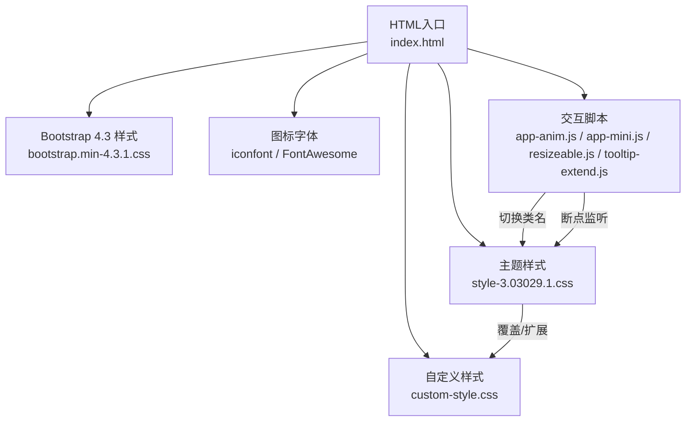
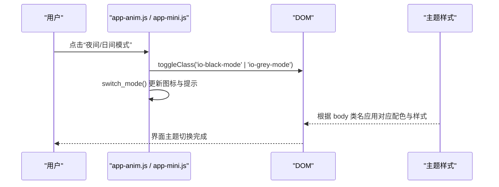
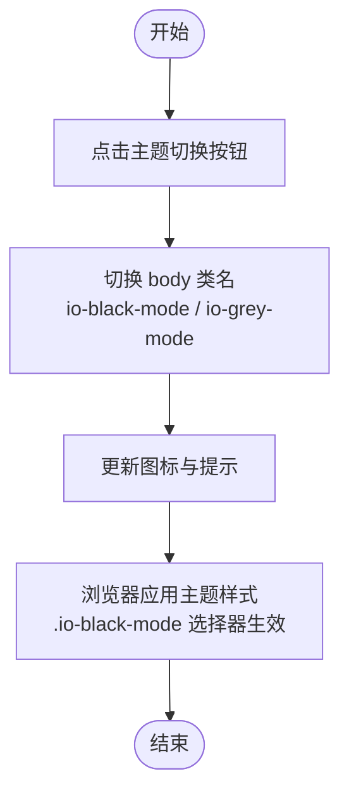
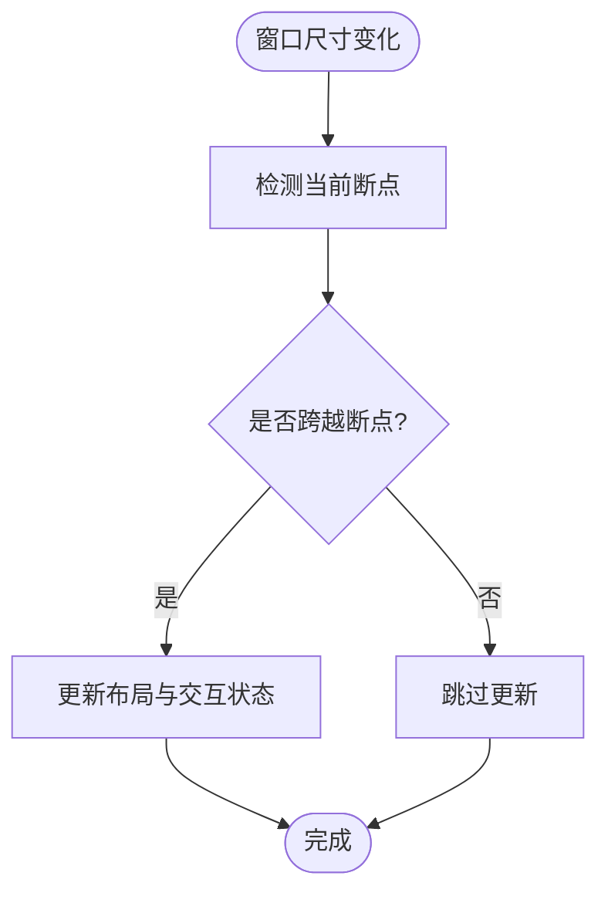
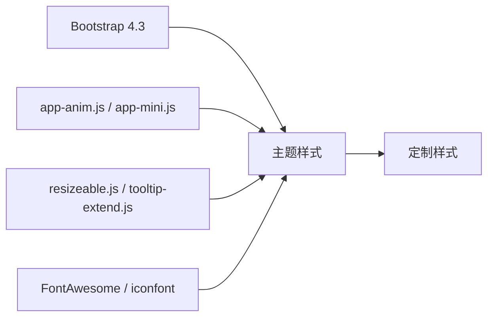

# 样式系统

<cite>
**本文引用的文件**
- [index.html](file://index.html)
- [custom-style.css](file://assets/css/custom-style.css)
- [style-3.03029.1.css](file://assets/css/style-3.03029.1.css)
- [bootstrap.min-4.3.1.css](file://assets/css/bootstrap.min-4.3.1.css)
- [app-anim.js](file://assets/js/app-anim.js)
- [app-mini.js](file://assets/js/app-mini.js)
- [resizeable.js](file://assets/js/resizeable.js)
- [tooltip-extend.js](file://assets/js/tooltip-extend.js)
</cite>

## 目录
1. [简介](#简介)
2. [项目结构](#项目结构)
3. [核心组件](#核心组件)
4. [架构总览](#架构总览)
5. [详细组件分析](#详细组件分析)
6. [依赖关系分析](#依赖关系分析)
7. [性能考虑](#性能考虑)
8. [故障排查指南](#故障排查指南)
9. [结论](#结论)
10. [附录：最佳实践与示例](#附录最佳实践与示例)

## 简介
本样式系统基于 Bootstrap 4.3 栅格与组件体系，结合主题样式与自定义样式实现响应式布局、多端适配与主题切换。整体采用“基础框架 + 主题层 + 业务定制层”的分层组织方式：Bootstrap 提供通用栅格与组件基线；主题样式负责全局视觉、布局与交互；自定义样式用于局部微调与业务特性增强。主题切换通过为 body 添加/移除类名驱动，配合媒体查询与选择器覆盖实现亮/暗模式。

## 项目结构
样式资源按职责分层组织：
- 基础框架层：Bootstrap 4.3 的 CSS（栅格、组件、工具类）
- 主题层：主题样式（布局、配色、组件扩展、响应式断点）
- 定制层：业务定制样式（搜索框、侧边栏、页脚等局部优化）
- 图标与字体：FontAwesome 与自有 iconfont
- 交互脚本：主题切换、断点监听、移动端菜单等

图表来源
- [index.html:17-29](file://index.html#L17-L29)
- [style-3.03029.1.css:1-200](file://assets/css/style-3.03029.1.css#L1-L200)
- [custom-style.css:1-126](file://assets/css/custom-style.css#L1-L126)

章节来源
- [index.html:17-29](file://index.html#L17-L29)

## 核心组件
- 栅格系统与容器
  - 使用 Bootstrap 的 .container/.row/.col-* 构建响应式卡片网格，页面中可见 col-6、col-sm-6、col-md-4、col-xl-5a、col-xxl-6a 等多断点列宽组合，确保在手机、平板、桌面及超大屏上均有良好展示。
  - 主题样式对行间距、内边距做了细化，如 row-lg/row-md/row-sm/row-xs 等辅助类，便于在不同屏幕下调整密度。
- 导航与侧边栏
  - 顶部导航使用 Bootstrap navbar 组件，支持折叠与展开；侧边栏在桌面端固定宽度，移动端以全屏抽屉形式呈现，并通过媒体查询控制显示与动画。
- 搜索区域
  - 首页大搜索区包含分类标签、输入框与热词建议列表，主题样式统一了高亮、阴影与悬停效果，并在暗黑模式下调整文字与背景对比度。
- 卡片网格
  - URL 卡片采用悬浮提升与阴影效果，hover 时上浮并显示快捷操作按钮，提升可发现性与交互反馈。

章节来源
- [index.html:590-623](file://index.html#L590-L623)
- [style-3.03029.1.css:189-200](file://assets/css/style-3.03029.1.css#L189-L200)
- [style-3.03029.1.css:373-399](file://assets/css/style-3.03029.1.css#L373-L399)

## 架构总览
样式加载顺序遵循“框架 → 主题 → 定制”的原则，确保定制样式能正确覆盖主题与框架默认值。主题切换通过为 <body> 切换类名 io-black-mode 或 io-grey-mode 驱动，所有需要随主题变化的元素均通过该选择器前缀进行覆盖。

图表来源
- [app-anim.js:201-237](file://assets/js/app-anim.js#L201-L237)
- [app-mini.js:201-237](file://assets/js/app-mini.js#L201-L237)
- [style-3.03029.1.css:1037-1059](file://assets/css/style-3.03029.1.css#L1037-L1059)

## 详细组件分析

### Bootstrap 集成与栅格系统
- 引入方式：在 HTML 头部按顺序引入 Bootstrap 样式，随后引入主题与定制样式，保证覆盖优先级。
- 栅格断点：页面广泛使用 Bootstrap 的响应式列类，如 col-6、col-sm-6、col-md-4、col-xl-5a、col-xxl-6a，实现从手机到超宽的自适应布局。
- 容器与间距：主题样式对 .content-site、.row-* 系列进行了间距与最大宽度优化，提升不同屏幕下的阅读体验。

章节来源
- [index.html:17-29](file://index.html#L17-L29)
- [index.html:590-623](file://index.html#L590-L623)
- [style-3.03029.1.css:373-399](file://assets/css/style-3.03029.1.css#L373-L399)

### 主题样式与覆盖策略
- 全局基础：主题样式定义了全局字体、颜色、背景与过渡，确保一致的视觉基线。
- 组件扩展：对导航、侧边栏、搜索区、卡片等进行扩展与美化，包括阴影、圆角、动效等。
- 暗黑模式：通过 .io-black-mode 选择器批量覆盖关键元素的背景、边框、文字与阴影，形成完整的暗色主题。
- 覆盖原则：定制样式位于主题之后，优先处理局部细节；主题样式通过选择器前缀管理主题状态，避免硬编码颜色。

章节来源
- [style-3.03029.1.css:1-200](file://assets/css/style-3.03029.1.css#L1-L200)
- [style-3.03029.1.css:1037-1059](file://assets/css/style-3.03029.1.css#L1037-L1059)
- [custom-style.css:1-126](file://assets/css/custom-style.css#L1-L126)

### 自定义样式职责分工
- custom-style.css：聚焦局部微调与业务特性，例如左侧导航宽度、滚动条隐藏、搜索框图标颜色、热词下拉样式、页脚链接样式、网格背景等。
- style-3.03029.1.css：承担全局布局、组件主题、响应式断点与主题切换的样式主体。
- 协作方式：定制样式尽量保持轻量与针对性，复杂逻辑与主题相关样式放在主题层，便于维护与复用。

章节来源
- [custom-style.css:1-126](file://assets/css/custom-style.css#L1-L126)
- [style-3.03029.1.css:1-200](file://assets/css/style-3.03029.1.css#L1-L200)

### 主题切换机制
- 触发方式：点击“夜间/日间模式”按钮，JS 通过 AJAX 通知后端（可选），并在前端切换 body 的类名 io-black-mode 与 theme.defaultclass。
- 样式联动：主题样式通过 .io-black-mode 前缀覆盖各组件的颜色、背景与阴影，实现一键切换。
- 图标与提示：切换后更新图标与标题提示，提升用户体验。

图表来源
- [app-anim.js:201-237](file://assets/js/app-anim.js#L201-L237)
- [app-mini.js:201-237](file://assets/js/app-mini.js#L201-L237)
- [style-3.03029.1.css:1037-1059](file://assets/css/style-3.03029.1.css#L1037-L1059)

章节来源
- [app-anim.js:201-237](file://assets/js/app-anim.js#L201-L237)
- [app-mini.js:201-237](file://assets/js/app-mini.js#L201-L237)
- [style-3.03029.1.css:1037-1059](file://assets/css/style-3.03029.1.css#L1037-L1059)

### 响应式设计实现
- 断点定义：主题样式中使用 @media (min-width/max-width) 针对 768px、992px、1200px、1400px、1680px、1920px 等断点进行布局与字号调整。
- 移动端适配：侧边栏在小屏下以全屏抽屉形式出现，导航折叠，内容区自动调整内边距与字号，保证可读性。
- 断点监听：JS 中定义 breakpoints 常量与 resizable 函数，监听窗口尺寸变化并触发相应逻辑（如侧边栏状态、滚动条初始化等）。
- 触摸交互：移动端启用触摸事件与滑动效果，优化手势体验。

图表来源
- [resizeable.js:1-122](file://assets/js/resizeable.js#L1-L122)
- [tooltip-extend.js:57-86](file://assets/js/tooltip-extend.js#L57-L86)
- [style-3.03029.1.css:143-163](file://assets/css/style-3.03029.1.css#L143-L163)

章节来源
- [style-3.03029.1.css:143-163](file://assets/css/style-3.03029.1.css#L143-L163)
- [style-3.03029.1.css:373-399](file://assets/css/style-3.03029.1.css#L373-L399)
- [resizeable.js:1-122](file://assets/js/resizeable.js#L1-L122)
- [tooltip-extend.js:57-86](file://assets/js/tooltip-extend.js#L57-L86)

## 依赖关系分析
- 样式加载顺序：Bootstrap → 主题样式 → 定制样式，确保覆盖优先级正确。
- 脚本与样式耦合：主题切换脚本通过切换 body 类名驱动样式变化；断点监听脚本与主题样式中的媒体查询协同工作。
- 图标与字体：FontAwesome 与 iconfont 作为视觉补充，不影响布局但影响视觉一致性。

图表来源
- [index.html:17-29](file://index.html#L17-L29)
- [style-3.03029.1.css:1-200](file://assets/css/style-3.03029.1.css#L1-L200)
- [custom-style.css:1-126](file://assets/css/custom-style.css#L1-L126)
- [app-anim.js:201-237](file://assets/js/app-anim.js#L201-L237)
- [resizeable.js:1-122](file://assets/js/resizeable.js#L1-L122)

章节来源
- [index.html:17-29](file://index.html#L17-L29)

## 性能考虑
- 样式文件体积：Bootstrap 与主题样式已压缩，减少网络请求与解析时间。
- 选择器效率：避免过深嵌套与低效选择器，主题样式使用类名前缀与媒体查询，提高匹配效率。
- 动画与过渡：合理使用 transition 与 transform，避免重排重绘；移动端尽量减少复杂动画。
- 懒加载与按需渲染：图片与模块按需加载，减少首屏压力。
- 断点监听节流：窗口 resize 事件应做节流或防抖，避免频繁计算。

[本节为通用指导，不直接分析具体文件]

## 故障排查指南
- 主题切换无效
  - 检查是否正确切换 body 类名 io-black-mode / io-grey-mode。
  - 确认主题样式中存在对应选择器覆盖。
  - 查看控制台是否有 JS 错误阻止切换流程。
- 移动端布局错乱
  - 检查媒体查询断点是否与预期一致。
  - 确认侧边栏在小屏下是否正确显示为抽屉。
  - 验证栅格列类是否正确使用。
- 搜索热词样式异常
  - 检查热词列表容器的定位与 z-index。
  - 确认暗黑模式下文字与背景对比度。
- 侧边栏滚动条问题
  - 检查是否隐藏了滚动条导致无法滚动。
  - 确认滚动区域高度与 overflow 设置。

章节来源
- [app-anim.js:201-237](file://assets/js/app-anim.js#L201-L237)
- [style-3.03029.1.css:143-163](file://assets/css/style-3.03029.1.css#L143-L163)
- [custom-style.css:1-126](file://assets/css/custom-style.css#L1-L126)

## 结论
本项目样式系统以 Bootstrap 为基础，通过主题层与定制层的清晰分工，实现了良好的响应式布局与主题切换能力。主题切换基于 body 类名驱动，配合媒体查询与选择器覆盖，保证了亮/暗模式的完整体验。移动端通过媒体查询与 JS 断点监听，提供了流畅的交互与布局适配。遵循模块化组织与命名规范，有助于长期维护与扩展。

[本节为总结性内容，不直接分析具体文件]

## 附录：最佳实践与示例

### 命名规范
- 类名语义化：使用描述性类名，如 sidebar-nav、url-card、search-hot-text。
- 主题前缀：主题相关样式使用选择器前缀（如 .io-black-mode）统一管理。
- 组件隔离：每个组件样式集中在对应块内，避免交叉污染。

章节来源
- [custom-style.css:1-126](file://assets/css/custom-style.css#L1-L126)
- [style-3.03029.1.css:1037-1059](file://assets/css/style-3.03029.1.css#L1037-L1059)

### 模块化组织
- 分层明确：框架层、主题层、定制层分离，便于独立维护。
- 文件拆分：将不同功能区域的样式拆分为独立文件，降低耦合。
- 变量与复用：提取常用颜色、字号、间距为变量或工具类，提升一致性。

章节来源
- [index.html:17-29](file://index.html#L17-L29)
- [style-3.03029.1.css:1-200](file://assets/css/style-3.03029.1.css#L1-L200)

### 性能优化
- 压缩与缓存：生产环境启用 CSS 压缩与浏览器缓存。
- 减少重排：使用 transform 与 opacity 实现动画，避免 layout thrashing。
- 按需加载：图片和第三方库按需引入，减少首屏负担。

[本节为通用指导，不直接分析具体文件]

### 样式修改示例与常见问题
- 修改搜索热词样式
  - 目标：调整热词列表的背景、阴影与选中态颜色。
  - 方法：在定制样式中覆盖 .search-hot-text 相关选择器，注意暗黑模式下的对比度。
  - 参考路径：[custom-style.css:45-89](file://assets/css/custom-style.css#L45-L89)
- 调整侧边栏宽度
  - 目标：在桌面端缩小侧边栏宽度以提升内容区空间。
  - 方法：覆盖 .sidebar-nav 与 .sidebar-menu-inner 的宽度与内边距。
  - 参考路径：[style-3.03029.1.css:56-87](file://assets/css/style-3.03029.1.css#L56-L87)
- 修复暗黑模式下链接不可见
  - 目标：确保暗黑模式下链接与文本有足够对比度。
  - 方法：在 .io-black-mode 选择器下覆盖 a 与 p 的颜色。
  - 参考路径：[style-3.03029.1.css:1037-1059](file://assets/css/style-3.03029.1.css#L1037-L1059)

章节来源
- [custom-style.css:45-89](file://assets/css/custom-style.css#L45-L89)
- [style-3.03029.1.css:56-87](file://assets/css/style-3.03029.1.css#L56-L87)
- [style-3.03029.1.css:1037-1059](file://assets/css/style-3.03029.1.css#L1037-L1059)