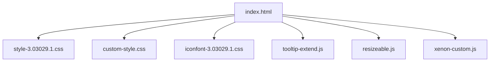
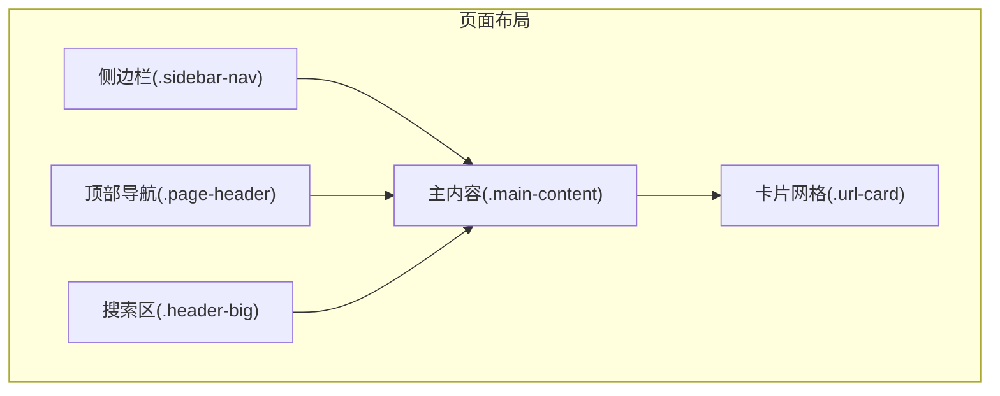
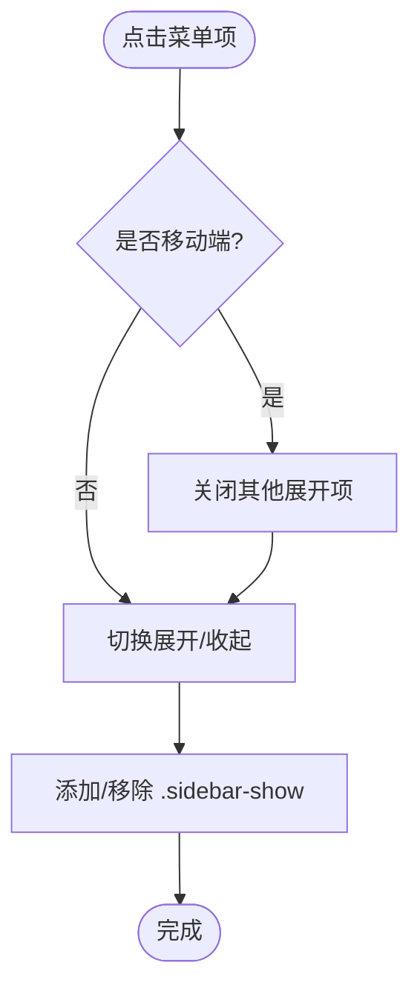
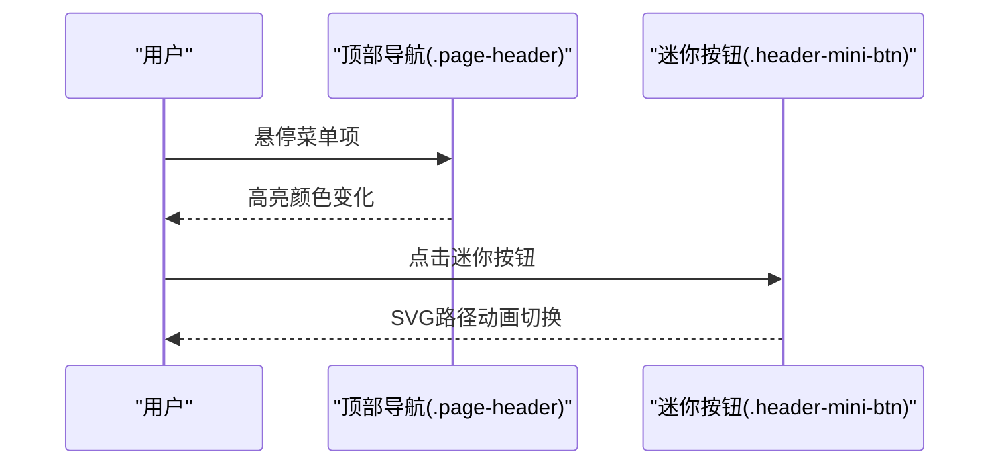
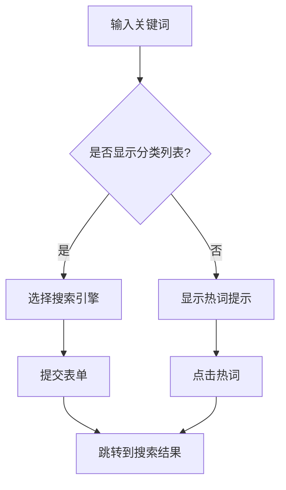
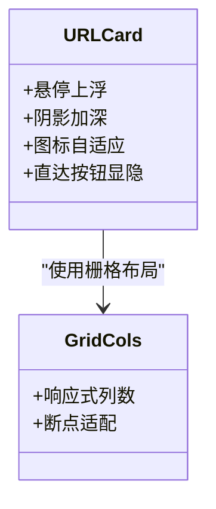
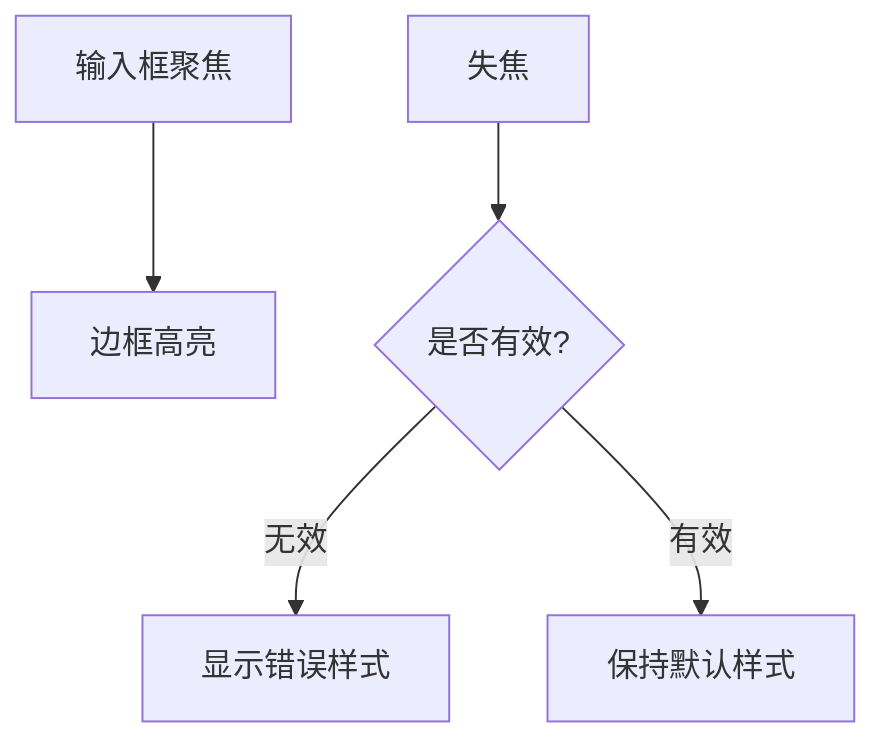
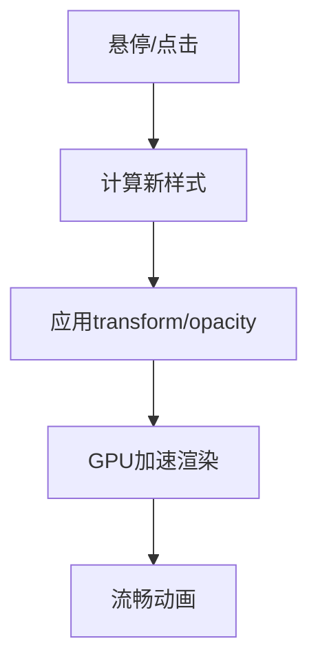
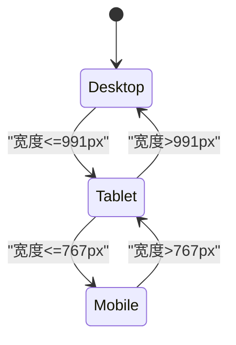
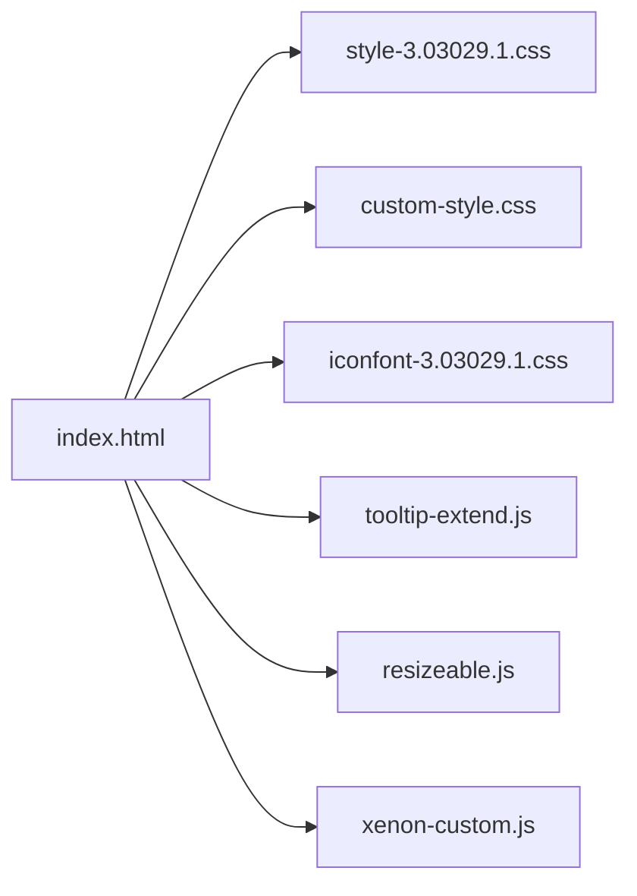

# 组件样式

<cite>
**本文引用的文件**
- [index.html](file://index.html)
- [custom-style.css](file://assets/css/custom-style.css)
- [style-3.03029.1.css](file://assets/css/style-3.03029.1.css)
- [iconfont-3.03029.1.css](file://assets/css/iconfont-3.03029.1.css)
- [README.md](file://README.md)
- [tooltip-extend.js](file://assets/js/tooltip-extend.js)
- [resizeable.js](file://assets/js/resizeable.js)
- [xenon-custom.js](file://assets/js/xenon-custom.js)
</cite>

## 目录
1. [简介](#简介)
2. [项目结构](#项目结构)
3. [核心组件](#核心组件)
4. [架构总览](#架构总览)
5. [详细组件分析](#详细组件分析)
6. [依赖关系分析](#依赖关系分析)
7. [性能与优化](#性能与优化)
8. [故障排查](#故障排查)
9. [结论](#结论)
10. [附录：样式定制示例与最佳实践](#附录样式定制示例与最佳实践)

## 简介
本文件面向“在线网址导航”项目的UI组件样式，系统性说明侧边栏菜单、顶部导航栏、搜索框、卡片网格、表单元素、动画与响应式适配的实现方式，并提供可操作的定制方法与常见问题解决方案。目标是帮助开发者在不破坏整体风格的前提下，快速定位并修改样式，同时保证跨设备一致体验。

## 项目结构
- 入口页面 index.html 组织页面骨架与主要模块（侧边栏、头部导航、搜索区、内容卡片网格）。
- 主题样式 style-3.03029.1.css 提供基础布局、侧边栏、导航、搜索、卡片、表单等全局样式。
- 自定义样式 custom-style.css 用于覆盖或增强主题样式，如字体大小、导航悬浮宽度、滚动条隐藏、搜索图标颜色、顶部导航颜色、搜索热词下拉等。
- 图标资源 iconfont-3.03029.1.css 定义项目内使用的图标字体及类名。
- 交互脚本 tooltip-extend.js、resizeable.js、xenon-custom.js 负责断点检测、侧边栏展开收起、水平菜单、表单验证等。

图表来源
- [index.html:1-35](file://index.html#L1-L35)
- [style-3.03029.1.css:1-161](file://assets/css/style-3.03029.1.css#L1-L161)
- [custom-style.css:1-126](file://assets/css/custom-style.css#L1-L126)
- [iconfont-3.03029.1.css:1-502](file://assets/css/iconfont-3.03029.1.css#L1-L502)
- [tooltip-extend.js:1-86](file://assets/js/tooltip-extend.js#L1-L86)
- [resizeable.js:1-122](file://assets/js/resizeable.js#L1-L122)
- [xenon-custom.js:223-626](file://assets/js/xenon-custom.js#L223-L626)

章节来源
- [index.html:1-35](file://index.html#L1-L35)
- [README.md:277-283](file://README.md#L277-L283)

## 核心组件
- 侧边栏菜单：固定定位、可折叠、二级菜单弹出、移动端全屏抽屉。
- 顶部导航栏：吸顶、透明背景过渡、天气插件、迷你按钮动画。
- 搜索框：多搜索引擎切换、分类标签、热词提示、模态搜索。
- 卡片网格：网站卡片布局、悬停上浮与阴影、响应式列数、懒加载图片。
- 表单组件：输入框、按钮、下拉菜单、开关控件、校验反馈。
- 动画效果：过渡动画、交互动画、背景渐变、旋转与位移。
- 响应式适配：断点控制、移动端菜单、栅格调整。

章节来源
- [style-3.03029.1.css:53-161](file://assets/css/style-3.03029.1.css#L53-L161)
- [custom-style.css:1-126](file://assets/css/custom-style.css#L1-L126)
- [style-3.03029.1.css:417-559](file://assets/css/style-3.03029.1.css#L417-L559)
- [style-3.03029.1.css:189-229](file://assets/css/style-3.03029.1.css#L189-L229)
- [style-3.03029.1.css:283-331](file://assets/css/style-3.03029.1.css#L283-L331)
- [style-3.03029.1.css:503-559](file://assets/css/style-3.03029.1.css#L503-L559)
- [tooltip-extend.js:1-86](file://assets/js/tooltip-extend.js#L1-L86)
- [resizeable.js:1-122](file://assets/js/resizeable.js#L1-L122)

## 架构总览
页面由左侧固定侧边栏与右侧主内容组成；顶部导航在宽屏下随侧边栏偏移，窄屏下以抽屉形式出现。搜索区域位于头部下方，支持多引擎与热词提示。内容区采用栅格布局展示卡片，卡片具备悬停动效与懒加载。

图表来源
- [index.html:42-331](file://index.html#L42-L331)
- [style-3.03029.1.css:53-161](file://assets/css/style-3.03029.1.css#L53-L161)
- [style-3.03029.1.css:417-559](file://assets/css/style-3.03029.1.css#L417-L559)
- [style-3.03029.1.css:189-229](file://assets/css/style-3.03029.1.css#L189-L229)

## 详细组件分析

### 侧边栏菜单
- 结构与类名：容器 .sidebar-nav，内部 .sidebar-nav-inner，菜单项 .sidebar-item，子菜单 ul，展开状态 .sidebar-show。
- 样式要点：
  - 固定定位与高度占满视口，z-index 较高确保层级。
  - 一级菜单行高与间距统一，二级菜单缩进与背景区分。
  - 展开箭头通过 transform 旋转实现。
  - 弹出菜单 .sidebar-popup 绝对定位，带三角指示器。
- 交互逻辑：
  - 点击展开/收起子菜单，移动端自动关闭兄弟项。
  - 断点变化时根据屏幕尺寸切换折叠状态。

图表来源
- [style-3.03029.1.css:53-109](file://assets/css/style-3.03029.1.css#L53-L109)
- [tooltip-extend.js:561-614](file://assets/js/tooltip-extend.js#L561-L614)
- [xenon-custom.js:1261-1322](file://assets/js/xenon-custom.js#L1261-L1322)

章节来源
- [style-3.03029.1.css:53-109](file://assets/css/style-3.03029.1.css#L53-L109)
- [custom-style.css:4-10](file://assets/css/custom-style.css#L4-L10)
- [tooltip-extend.js:561-614](file://assets/js/tooltip-extend.js#L561-L614)
- [xenon-custom.js:1261-1322](file://assets/js/xenon-custom.js#L1261-L1322)

### 顶部导航栏
- 结构与类名：.page-header 吸顶，.navbar 使用 Bootstrap 栅格，.navbar-menu 放置工具项。
- 样式要点：
  - 默认透明背景，滚动后或特定模式下可变为毛玻璃/半透明白色。
  - 菜单项 hover 变色，迷你按钮路径 stroke 动态变化。
  - 天气插件容器 .weather 与导航对齐。
- 交互逻辑：
  - 迷你按钮通过 checkbox + SVG 路径动画切换状态。
  - 移动端显示汉堡菜单，点击打开侧边栏。

图表来源
- [style-3.03029.1.css:113-140](file://assets/css/style-3.03029.1.css#L113-L140)
- [custom-style.css:15-20](file://assets/css/custom-style.css#L15-L20)
- [index.html:219-331](file://index.html#L219-L331)

章节来源
- [style-3.03029.1.css:113-140](file://assets/css/style-3.03029.1.css#L113-L140)
- [custom-style.css:15-20](file://assets/css/custom-style.css#L15-L20)
- [index.html:219-331](file://index.html#L219-L331)

### 搜索框
- 结构与类名：.header-big 包裹搜索区，#search 为搜索容器，#search-text 输入框，#search-list 分类列表，.search-type 单选组，.search-smart-tips 热词提示。
- 样式要点：
  - 输入框圆角、边框、占位符颜色统一。
  - 分类标签选中态通过伪元素三角形指示。
  - 热词下拉绝对定位，带阴影与圆角。
- 交互逻辑：
  - 选择不同搜索引擎，提交到对应URL。
  - 输入关键词时显示热词建议，点击跳转。

图表来源
- [style-3.03029.1.css:417-468](file://assets/css/style-3.03029.1.css#L417-L468)
- [custom-style.css:12-34](file://assets/css/custom-style.css#L12-L34)
- [index.html:334-572](file://index.html#L334-L572)

章节来源
- [style-3.03029.1.css:417-468](file://assets/css/style-3.03029.1.css#L417-L468)
- [custom-style.css:12-34](file://assets/css/custom-style.css#L12-L34)
- [index.html:334-572](file://index.html#L334-L572)

### 卡片组件（网站卡片）
- 结构与类名：.url-card 卡片容器，.url-body 主体，.url-img 图标，.url-info 信息区，.togo 直达链接。
- 样式要点：
  - 悬停上浮 transform translateY(-6px)，阴影加深。
  - 图标尺寸自适应，文本溢出省略。
  - 直达按钮默认半透明，悬停显示。
- 响应式：
  - 栅格类 col-6/col-sm-6/col-md-4/col-xl-5a/col-xxl-6a 控制列数。
  - 大屏幕上每行更多卡片，小屏幕减少列数以提升可读性。

图表来源
- [style-3.03029.1.css:189-229](file://assets/css/style-3.03029.1.css#L189-L229)
- [style-3.03029.1.css:340-374](file://assets/css/style-3.03029.1.css#L340-L374)
- [index.html:590-800](file://index.html#L590-L800)

章节来源
- [style-3.03029.1.css:189-229](file://assets/css/style-3.03029.1.css#L189-L229)
- [style-3.03029.1.css:340-374](file://assets/css/style-3.03029.1.css#L340-L374)
- [index.html:590-800](file://index.html#L590-L800)

### 表单组件
- 输入框：.form-control 统一边框、背景、占位符颜色，禁用态样式。
- 按钮：.btn-danger/.btn-dark/.btn-outline-danger 提供多种变体，hover/focus/active 状态明确。
- 下拉菜单：.dropdown-menu 无边框阴影，.dropdown-item hover/active 背景色。
- 开关控件：.custom-switch 滑块样式，checked 状态位置移动。
- 校验反馈：错误类 .validate-has-error，错误消息插入位置可控。

图表来源
- [style-3.03029.1.css:283-331](file://assets/css/style-3.03029.1.css#L283-L331)
- [xenon-custom.js:578-626](file://assets/js/xenon-custom.js#L578-L626)

章节来源
- [style-3.03029.1.css:283-331](file://assets/css/style-3.03029.1.css#L283-L331)
- [xenon-custom.js:578-626](file://assets/js/xenon-custom.js#L578-L626)

### 动画效果
- 过渡动画：导航、卡片、按钮等使用 transition 平滑变化。
- 交互动画：迷你按钮SVG路径动画、侧边栏箭头旋转、卡片悬停上浮。
- 背景动画：首页搜索区渐变背景 animation gradient。
- 性能优化：使用 transform 与 opacity 触发GPU加速，避免重排重绘。

图表来源
- [style-3.03029.1.css:113-140](file://assets/css/style-3.03029.1.css#L113-L140)
- [style-3.03029.1.css:189-229](file://assets/css/style-3.03029.1.css#L189-L229)
- [style-3.03029.1.css:503-559](file://assets/css/style-3.03029.1.css#L503-L559)

章节来源
- [style-3.03029.1.css:113-140](file://assets/css/style-3.03029.1.css#L113-L140)
- [style-3.03029.1.css:189-229](file://assets/css/style-3.03029.1.css#L189-L229)
- [style-3.03029.1.css:503-559](file://assets/css/style-3.03029.1.css#L503-L559)

### 响应式适配
- 断点：largescreen/tabletscreen/devicescreen/sdevicescreen。
- 行为：移动端侧边栏全屏抽屉，导航菜单折叠，栅格列数调整。
- 脚本：resizeable.js 与 tooltip-extend.js 监听窗口尺寸变化，切换样式与交互。

图表来源
- [tooltip-extend.js:1-86](file://assets/js/tooltip-extend.js#L1-L86)
- [resizeable.js:1-122](file://assets/js/resizeable.js#L1-L122)
- [style-3.03029.1.css:151-163](file://assets/css/style-3.03029.1.css#L151-L163)

章节来源
- [tooltip-extend.js:1-86](file://assets/js/tooltip-extend.js#L1-L86)
- [resizeable.js:1-122](file://assets/js/resizeable.js#L1-L122)
- [style-3.03029.1.css:151-163](file://assets/css/style-3.03029.1.css#L151-L163)

## 依赖关系分析
- CSS层：style-3.03029.1.css 为基础，custom-style.css 覆盖增强，iconfont-3.03029.1.css 提供图标。
- JS层：tooltip-extend.js 与 resizeable.js 处理断点与菜单交互，xenon-custom.js 扩展表单与下拉。
- HTML层：index.html 引用上述资源并组织DOM结构。

图表来源
- [index.html:1-35](file://index.html#L1-L35)
- [style-3.03029.1.css:1-161](file://assets/css/style-3.03029.1.css#L1-L161)
- [custom-style.css:1-126](file://assets/css/custom-style.css#L1-L126)
- [iconfont-3.03029.1.css:1-502](file://assets/css/iconfont-3.03029.1.css#L1-L502)
- [tooltip-extend.js:1-86](file://assets/js/tooltip-extend.js#L1-L86)
- [resizeable.js:1-122](file://assets/js/resizeable.js#L1-L122)
- [xenon-custom.js:223-626](file://assets/js/xenon-custom.js#L223-L626)

章节来源
- [index.html:1-35](file://index.html#L1-L35)
- [style-3.03029.1.css:1-161](file://assets/css/style-3.03029.1.css#L1-L161)
- [custom-style.css:1-126](file://assets/css/custom-style.css#L1-L126)
- [iconfont-3.03029.1.css:1-502](file://assets/css/iconfont-3.03029.1.css#L1-L502)
- [tooltip-extend.js:1-86](file://assets/js/tooltip-extend.js#L1-L86)
- [resizeable.js:1-122](file://assets/js/resizeable.js#L1-L122)
- [xenon-custom.js:223-626](file://assets/js/xenon-custom.js#L223-L626)

## 性能与优化
- 使用 transform 与 opacity 进行动画，减少重排重绘，提升流畅度。
- 图片懒加载：卡片图标使用 data-src 与 lazy 类，降低首屏负载。
- 背景渐变与模糊：合理使用 backdrop-filter 与 background-size，避免过度计算。
- 滚动条隐藏：侧边栏滚动条隐藏提升视觉整洁。
- 断点优化：根据屏幕尺寸切换布局与交互，减少不必要的DOM操作。

章节来源
- [style-3.03029.1.css:189-229](file://assets/css/style-3.03029.1.css#L189-L229)
- [custom-style.css:9-10](file://assets/css/custom-style.css#L9-L10)
- [style-3.03029.1.css:503-559](file://assets/css/style-3.03029.1.css#L503-L559)
- [index.html:590-800](file://index.html#L590-L800)

## 故障排查
- 图片或样式加载失败：检查相对路径是否正确，确认资源文件存在且引用无误。
- 侧边栏无法展开：确认 .sidebar-show 类是否正确切换，检查JS事件绑定。
- 搜索热词不显示：确认 #search-list 与 .search-smart-tips 的显示逻辑，检查网络请求。
- 表单校验不生效：确认 validate 属性与错误类 .validate-has-error 的使用。
- 移动端菜单异常：检查断点判断与 .sidebar-nav.show 类切换。

章节来源
- [README.md:318-327](file://README.md#L318-L327)
- [tooltip-extend.js:561-614](file://assets/js/tooltip-extend.js#L561-L614)
- [xenon-custom.js:578-626](file://assets/js/xenon-custom.js#L578-L626)
- [style-3.03029.1.css:151-163](file://assets/css/style-3.03029.1.css#L151-L163)

## 结论
本项目通过主题样式与自定义样式的分层管理，结合脚本交互，实现了完整的导航、搜索、卡片与表单组件体系。遵循响应式设计原则与性能优化策略，确保了跨设备的一致体验。开发者可通过覆盖 custom-style.css 中的关键类名，快速定制外观与行为，同时保持代码的可维护性与可扩展性。

## 附录：样式定制示例与最佳实践
- 修改全局字体大小：在 custom-style.css 中调整 body,html 的 font-size。
- 调整侧边栏悬浮宽度：修改 .sidebar-popup.sidebar-menu-inner 相关宽度值。
- 隐藏侧边栏滚动条：使用 ::-webkit-scrollbar 隐藏。
- 顶部导航颜色：覆盖 .big-header-banner .page-header 的颜色与背景。
- 搜索热词样式：调整 .search-hot-text 的背景、阴影与列表项样式。
- 卡片悬停效果：修改 .url-card .url-body 的 transform 与 box-shadow。
- 表单输入框样式：覆盖 .form-control 的边框、背景与占位符颜色。
- 按钮变体：使用 .btn-danger/.btn-dark/.btn-outline-danger 并自定义 hover/focus 状态。
- 下拉菜单样式：调整 .dropdown-menu 与 .dropdown-item 的背景与阴影。
- 动画性能：优先使用 transform 与 opacity，避免频繁改变 layout 属性。
- 主题适配：利用 .io-black-mode 类切换深色模式下的颜色与背景。
- 命名规范：使用语义化类名，按组件划分CSS文件，便于维护。
- 模块化：将通用样式抽离为独立文件，按需引入。
- 常见问题：
  - 样式不生效：检查优先级与 !important 的使用，避免冲突。
  - 移动端错位：确认媒体查询断点与栅格类组合。
  - 图标不显示：确认 iconfont 字体文件路径正确。

章节来源
- [custom-style.css:1-126](file://assets/css/custom-style.css#L1-L126)
- [style-3.03029.1.css:189-229](file://assets/css/style-3.03029.1.css#L189-L229)
- [style-3.03029.1.css:283-331](file://assets/css/style-3.03029.1.css#L283-L331)
- [iconfont-3.03029.1.css:1-502](file://assets/css/iconfont-3.03029.1.css#L1-L502)
- [README.md:277-283](file://README.md#L277-L283)