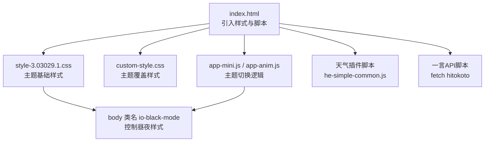
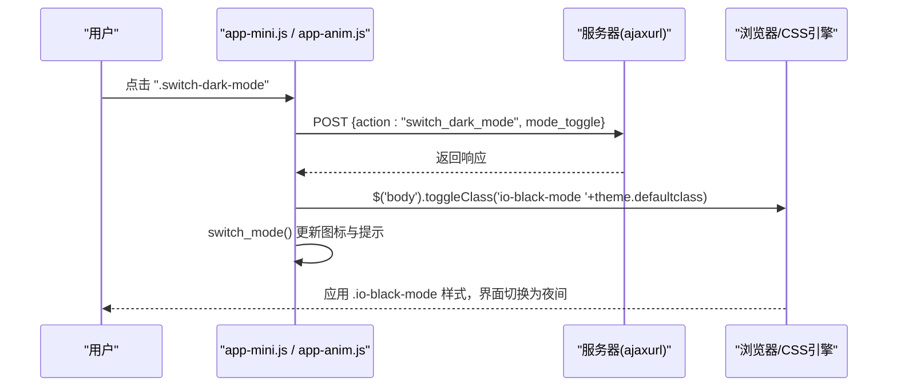
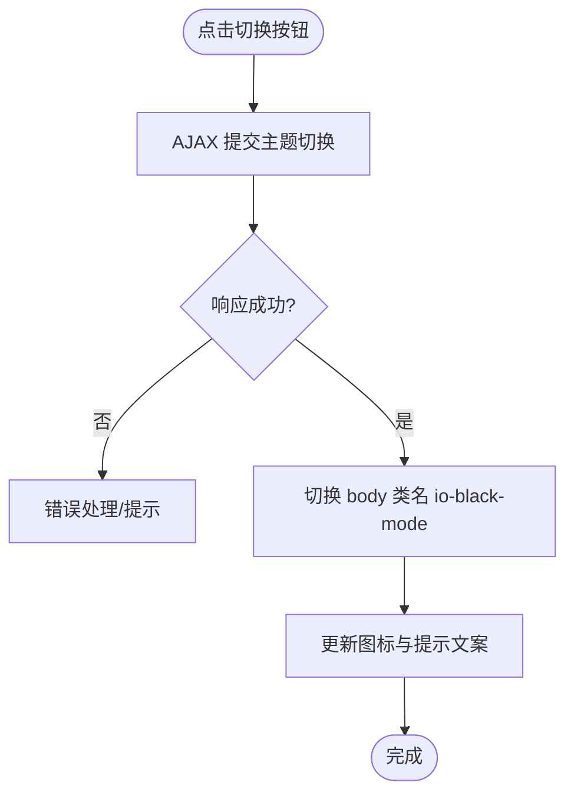
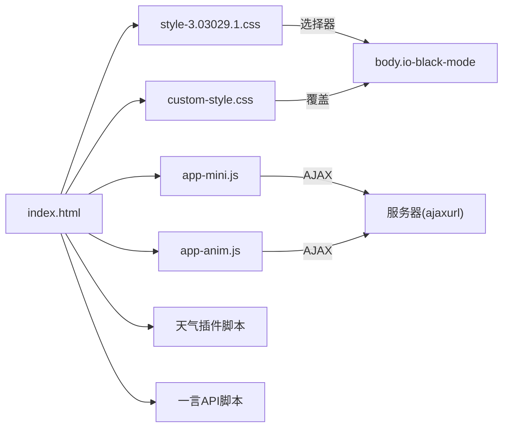

# 主题系统

<cite>
**本文引用的文件**
- [index.html](file://index.html)
- [custom-style.css](file://assets/css/custom-style.css)
- [style-3.03029.1.css](file://assets/css/style-3.03029.1.css)
- [app-mini.js](file://assets/js/app-mini.js)
- [app-anim.js](file://assets/js/app-anim.js)
</cite>

## 目录
1. [简介](#简介)
2. [项目结构](#项目结构)
3. [核心组件](#核心组件)
4. [架构总览](#架构总览)
5. [详细组件分析](#详细组件分析)
6. [依赖关系分析](#依赖关系分析)
7. [性能考量](#性能考量)
8. [故障排查指南](#故障排查指南)
9. [结论](#结论)
10. [附录：配置与自定义开发指南](#附录配置与自定义开发指南)

## 简介
本主题系统通过“类名切换 + CSS 覆盖”的方式实现日间/夜间模式，核心思路是在页面根节点（body）上切换一个特定类名以触发不同样式集合。同时，站点集成了天气插件与一言 API，二者在主题切换时通过预设颜色或默认文本样式保持视觉一致性。当前实现未使用 localStorage 持久化主题偏好，也未使用 CSS 变量作为主题主方案；主题切换由后端 AJAX 回调驱动并配合前端类名切换完成。

## 项目结构
- HTML 入口负责加载主题相关样式、图标库与第三方脚本（天气、一言），并在 body 上设置初始类名。
- 样式层分为基础主题样式与自定义覆盖样式：
  - 基础主题样式定义白天与黑夜两套配色，通过 .io-black-mode 选择器进行覆盖。
  - 自定义样式对搜索框、热榜、网格背景等进行局部增强。
- 交互逻辑集中在两个 JS 文件中，提供点击切换、图标更新、滚动行为等。

图表来源
- [index.html:17-31](file://index.html#L17-L31)
- [style-3.03029.1.css:1013-1058](file://assets/css/style-3.03029.1.css#L1013-L1058)
- [custom-style.css:1-126](file://assets/css/custom-style.css#L1-L126)
- [app-mini.js:201-237](file://assets/js/app-mini.js#L201-L237)
- [app-anim.js:201-237](file://assets/js/app-anim.js#L201-L237)

章节来源
- [index.html:17-31](file://index.html#L17-L31)
- [style-3.03029.1.css:1013-1058](file://assets/css/style-3.03029.1.css#L1013-L1058)
- [custom-style.css:1-126](file://assets/css/custom-style.css#L1-L126)
- [app-mini.js:201-237](file://assets/js/app-mini.js#L201-L237)
- [app-anim.js:201-237](file://assets/js/app-anim.js#L201-L237)

## 核心组件
- 主题状态载体：body 元素上的类名 io-grey-mode（初始）与 io-black-mode（夜间）。
- 主题切换控制器：监听 .switch-dark-mode 的点击事件，发起 AJAX 请求，成功后切换 body 类名并更新图标提示。
- 主题样式覆盖：通过 .io-black-mode 前缀的选择器覆盖白天样式，形成夜间主题。
- 第三方集成：
  - 天气插件：通过 WIDGET.CONFIG 中的颜色参数与尺寸参数适配主题。
  - 一言 API：动态插入文字，继承全局文本颜色，无需额外处理即可跟随主题。

章节来源
- [index.html:39-31](file://index.html#L39-L31)
- [app-mini.js:201-237](file://assets/js/app-mini.js#L201-L237)
- [style-3.03029.1.css:1013-1058](file://assets/css/style-3.03029.1.css#L1013-L1058)
- [index.html:270-296](file://index.html#L270-L296)
- [index.html:304-315](file://index.html#L304-L315)

## 架构总览
主题切换采用“事件 -> AJAX -> 响应 -> DOM 类名切换 -> CSS 覆盖生效”的流程。JS 负责交互与状态同步，CSS 负责视觉呈现，HTML 负责资源加载与第三方集成点。

图表来源
- [app-mini.js:201-237](file://assets/js/app-mini.js#L201-L237)
- [app-anim.js:201-237](file://assets/js/app-anim.js#L201-L237)
- [style-3.03029.1.css:1013-1058](file://assets/css/style-3.03029.1.css#L1013-L1058)

## 详细组件分析

### 主题切换逻辑（JavaScript）
- 事件绑定：监听 .switch-dark-mode 的点击事件。
- 服务端交互：发送 AJAX 请求，携带 action 与 mode_toggle 参数。
- 状态切换：成功回调中切换 body 的类名，并调用 switch_mode 更新图标与提示文案。
- 滚动行为：滚动超过阈值时显示返回顶部按钮并调整头部背景。

图表来源
- [app-mini.js:201-237](file://assets/js/app-mini.js#L201-L237)
- [app-anim.js:201-237](file://assets/js/app-anim.js#L201-L237)

章节来源
- [app-mini.js:201-237](file://assets/js/app-mini.js#L201-L237)
- [app-anim.js:201-237](file://assets/js/app-anim.js#L201-L237)

### CSS 变量管理系统（现状与建议）
- 现状：未使用 CSS 变量作为主题主方案；主题通过 .io-black-mode 前缀的全量覆盖实现。
- 影响：新增主题需维护两套或多套样式覆盖，扩展性一般。
- 建议：可逐步引入 CSS 变量集中管理颜色与阴影，减少重复覆盖，提升可维护性。

章节来源
- [style-3.03029.1.css:1013-1058](file://assets/css/style-3.03029.1.css#L1013-L1058)
- [custom-style.css:1-126](file://assets/css/custom-style.css#L1-L126)

### 用户偏好存储机制（现状与建议）
- 现状：未发现使用 localStorage/sessionStorage/cookie 保存主题偏好的代码；主题切换依赖服务端 AJAX 回调与前端类名切换。
- 影响：刷新后主题可能回退到默认状态（取决于服务端渲染或默认类名）。
- 建议：可在切换成功后将主题写入 localStorage，并在页面初始化时读取并应用，提升用户体验。

章节来源
- [app-mini.js:201-237](file://assets/js/app-mini.js#L201-L237)
- [app-anim.js:201-237](file://assets/js/app-anim.js#L201-L237)

### 图标适配方案（Font Awesome 与自定义图标）
- Font Awesome：通过 all.min.css 引入，图标类名不受主题类名影响；切换时仅改变颜色与背景。
- 自定义图标：部分图标使用 iconfont 类名，切换时通过 JS 切换具体图标类（如从夜间图标切换到日间图标）。
- 切换效果：switch_mode 函数根据当前模式切换图标类与提示文案。

章节来源
- [index.html:29](file://index.html#L29)
- [app-mini.js:220-237](file://assets/js/app-mini.js#L220-L237)
- [app-anim.js:220-237](file://assets/js/app-anim.js#L220-L237)

### 天气插件的主题集成（和风天气）
- 集成方式：通过 WIDGET.CONFIG 配置颜色与尺寸，嵌入到导航栏区域。
- 主题适配：颜色参数（温度、城市、AQI 等）设置为固定色值；在夜间模式下可通过 CSS 进一步覆盖其内部元素颜色以实现一致体验。
- 注意：由于插件由外部脚本注入，建议在夜间模式下增加针对其容器类的样式覆盖以保证可读性。

章节来源
- [index.html:270-296](file://index.html#L270-L296)
- [style-3.03029.1.css:1013-1058](file://assets/css/style-3.03029.1.css#L1013-L1058)

### 一言 API 展示的主题兼容性
- 集成方式：通过 fetch 获取一言数据并插入到指定节点，文本颜色继承全局样式。
- 主题兼容：由于未设置独立颜色，文本会随主题切换自动变化，无需额外处理。

章节来源
- [index.html:304-315](file://index.html#L304-L315)
- [style-3.03029.1.css:1022-1023](file://assets/css/style-3.03029.1.css#L1022-L1023)

## 依赖关系分析
- HTML 依赖：
  - 样式：bootstrap、fancybox、主题基础样式、自定义样式、Font Awesome。
  - 脚本：jQuery、内容搜索、天气插件、一言 API。
- JS 依赖：
  - 主题切换逻辑依赖 jQuery 与 theme.ajaxurl（由服务端注入）。
  - 滚动与 UI 动画依赖 jQuery。
- CSS 依赖：
  - 主题覆盖依赖 .io-black-mode 选择器与基础样式类名。

图表来源
- [index.html:17-31](file://index.html#L17-L31)
- [app-mini.js:201-237](file://assets/js/app-mini.js#L201-L237)
- [app-anim.js:201-237](file://assets/js/app-anim.js#L201-L237)
- [style-3.03029.1.css:1013-1058](file://assets/css/style-3.03029.1.css#L1013-L1058)
- [custom-style.css:1-126](file://assets/css/custom-style.css#L1-L126)

章节来源
- [index.html:17-31](file://index.html#L17-L31)
- [app-mini.js:201-237](file://assets/js/app-mini.js#L201-L237)
- [app-anim.js:201-237](file://assets/js/app-anim.js#L201-L237)
- [style-3.03029.1.css:1013-1058](file://assets/css/style-3.03029.1.css#L1013-L1058)
- [custom-style.css:1-126](file://assets/css/custom-style.css#L1-L126)

## 性能考量
- 样式覆盖策略：大量使用 .io-black-mode 前缀选择器，可能导致样式计算开销增加；建议合并同类规则、减少冗余。
- 第三方脚本：天气插件与一言 API 均为外部请求，可能影响首屏性能；可考虑延迟加载或缓存策略。
- DOM 操作：切换类名与图标更新属于轻量操作，性能影响较小。

[本节为通用指导，不直接分析具体文件]

## 故障排查指南
- 主题切换无效：
  - 检查是否成功添加/移除 .io-black-mode 类名。
  - 确认 AJAX 请求是否成功返回，以及 theme.ajaxurl 是否正确。
- 图标未更新：
  - 检查 switch_mode 函数是否被调用，图标类名是否正确切换。
- 天气插件颜色异常：
  - 检查 WIDGET.CONFIG 的颜色参数；必要时在夜间模式下追加覆盖样式。
- 一言文字不可见：
  - 检查全局文本颜色是否在夜间模式下正确设置。

章节来源
- [app-mini.js:201-237](file://assets/js/app-mini.js#L201-L237)
- [app-anim.js:201-237](file://assets/js/app-anim.js#L201-L237)
- [style-3.03029.1.css:1022-1023](file://assets/css/style-3.03029.1.css#L1022-L1023)
- [index.html:270-296](file://index.html#L270-L296)
- [index.html:304-315](file://index.html#L304-L315)

## 结论
该主题系统通过简洁的类名切换与 CSS 覆盖实现了日间/夜间模式，集成了一言与天气插件，满足基本主题需求。当前实现未使用 localStorage 持久化主题偏好，也未采用 CSS 变量作为主题主方案。建议后续引入本地存储与 CSS 变量以提升可维护性与用户体验。

[本节为总结，不直接分析具体文件]

## 附录：配置与自定义开发指南

### 快速配置
- 启用/禁用夜间模式：确保存在 .switch-dark-mode 元素并绑定点击事件；服务端需提供对应的 AJAX 接口。
- 调整主题颜色：在 style-3.03029.1.css 中查找 .io-black-mode 相关规则进行修改；或在 custom-style.css 中追加覆盖。
- 天气插件颜色：修改 index.html 中 WIDGET.CONFIG 的颜色参数；如需夜间适配，可在 CSS 中追加针对其容器的覆盖。
- 一言文字颜色：无需额外设置，继承全局文本颜色；如需强调，可在夜间模式下追加样式。

章节来源
- [app-mini.js:201-237](file://assets/js/app-mini.js#L201-L237)
- [style-3.03029.1.css:1013-1058](file://assets/css/style-3.03029.1.css#L1013-L1058)
- [custom-style.css:1-126](file://assets/css/custom-style.css#L1-L126)
- [index.html:270-296](file://index.html#L270-L296)
- [index.html:304-315](file://index.html#L304-L315)

### 创建新主题风格（步骤）
1. 定义主题类名：例如 .theme-blue，在 body 上切换该类名。
2. 编写样式覆盖：基于现有 .io-black-mode 模式，复制并改写颜色与背景规则，形成新主题。
3. 接入切换逻辑：在切换事件中同时切换主题类名；如需持久化，写入 localStorage 并在初始化时读取。
4. 测试第三方集成：验证天气插件与一言在新主题下的可读性与一致性。
5. 优化与清理：合并重复规则，减少选择器层级，提升性能。

[本节为通用指导，不直接分析具体文件]