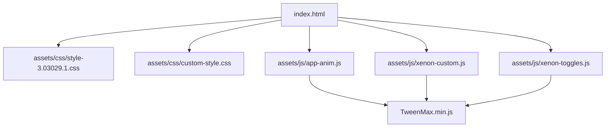
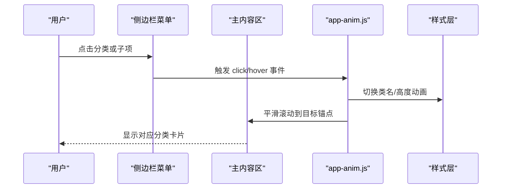
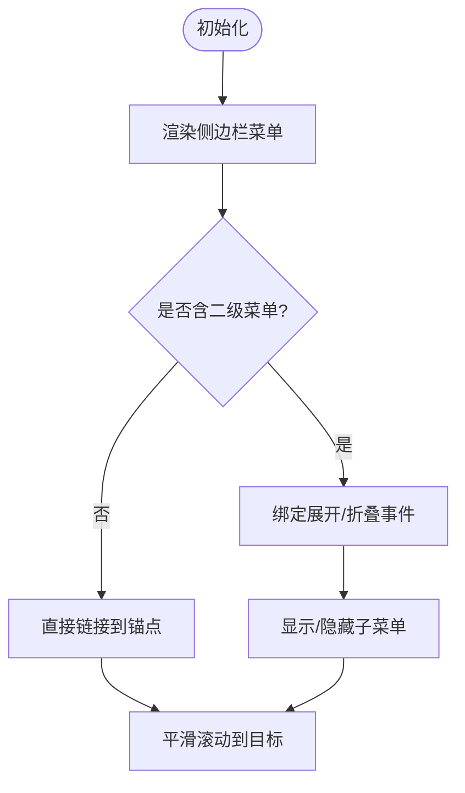
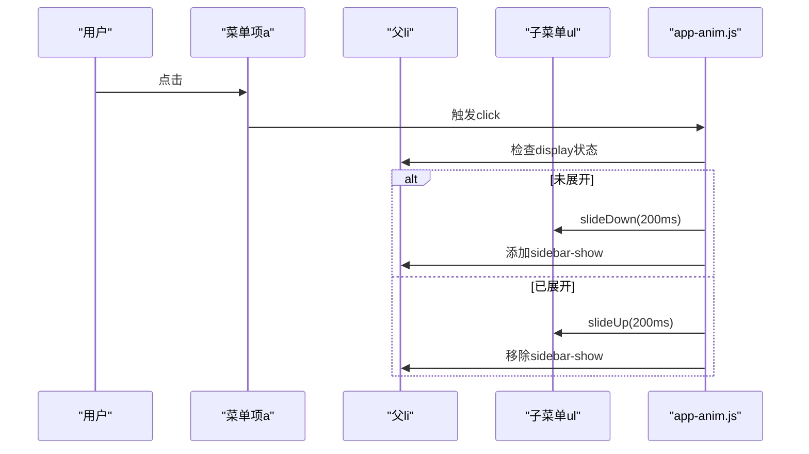
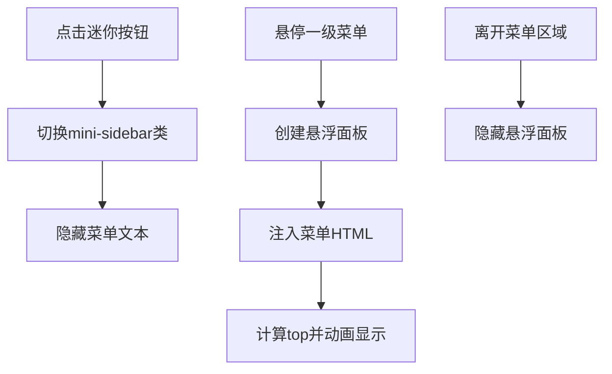
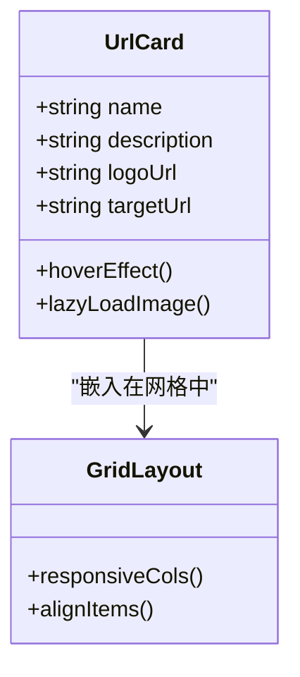
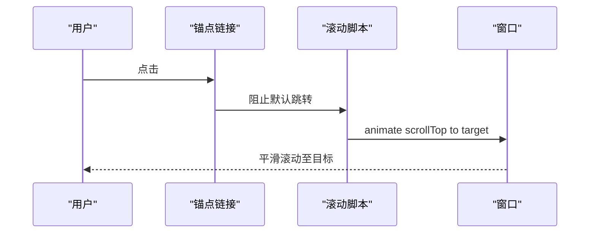
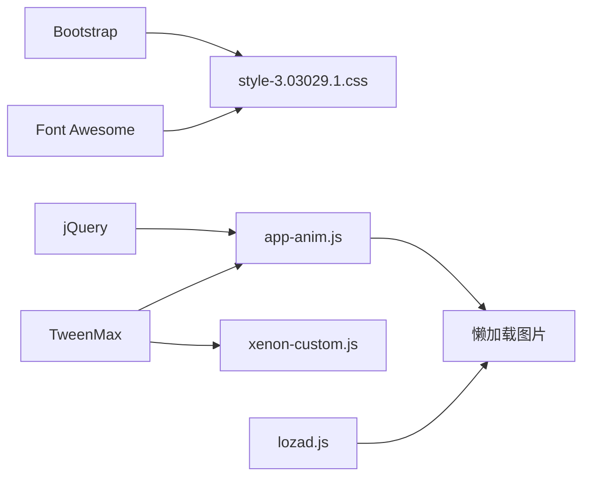

# 导航系统

<cite>
**本文引用的文件**
- [index.html](file://index.html)
- [custom-style.css](file://assets/css/custom-style.css)
- [style-3.03029.1.css](file://assets/css/style-3.03029.1.css)
- [app-anim.js](file://assets/js/app-anim.js)
- [xenon-custom.js](file://assets/js/xenon-custom.js)
- [xenon-toggles.js](file://assets/js/xenon-toggles.js)
- [README.md](file://README.md)
</cite>

## 目录
1. [简介](#简介)
2. [项目结构](#项目结构)
3. [核心组件](#核心组件)
4. [架构总览](#架构总览)
5. [详细组件分析](#详细组件分析)
6. [依赖关系分析](#依赖关系分析)
7. [性能考量](#性能考量)
8. [故障排查指南](#故障排查指南)
9. [结论](#结论)
10. [附录：配置与示例](#附录：配置与示例)

## 简介
本导航系统是一个基于 HTML + CSS + JavaScript（jQuery）构建的静态网址导航站点，提供多级分类侧边栏、卡片式网站展示、响应式网格布局、悬停动效、懒加载图片以及平滑滚动锚点导航等能力。整体设计强调简洁易用、可维护性强，适合个人或团队快速部署与二次开发。

## 项目结构
- 入口页面 index.html 包含左侧固定侧边栏、顶部导航与搜索区、右侧内容区（按分类展示卡片）。
- 样式集中在 assets/css 下，其中 custom-style.css 为自定义主题覆盖，style-3.03029.1.css 为主题基础样式。
- 交互逻辑集中在 assets/js 下，app-anim.js 负责侧边栏展开/折叠、迷你模式切换、粘性页脚、滚动行为等；xenon-custom.js 与 xenon-toggles.js 提供通用 UI 交互与动画支持。

图表来源
- [index.html:1-35](file://index.html#L1-L35)
- [style-3.03029.1.css:56-150](file://assets/css/style-3.03029.1.css#L56-L150)
- [custom-style.css:1-126](file://assets/css/custom-style.css#L1-L126)
- [app-anim.js:1-40](file://assets/js/app-anim.js#L1-L40)
- [xenon-custom.js:1-80](file://assets/js/xenon-custom.js#L1-L80)
- [xenon-toggles.js:1-30](file://assets/js/xenon-toggles.js#L1-L30)

章节来源
- [index.html:1-35](file://index.html#L1-L35)
- [README.md:298-314](file://README.md#L298-L314)

## 核心组件
- 侧边栏菜单：包含六大分类（常用工具、科研办公、悠闲娱乐、素材资源、开发设计、资讯学习），部分分类具备二级子菜单。
- 主内容区：以卡片形式展示各分类下的网站链接，采用响应式网格布局。
- 顶部导航与搜索：支持多引擎搜索、天气插件、快捷跳转。
- 交互脚本：侧边栏展开/折叠、迷你模式切换、平滑滚动、粘性页脚、懒加载图片等。

章节来源
- [index.html:44-216](file://index.html#L44-L216)
- [index.html:580-800](file://index.html#L580-L800)
- [app-anim.js:16-25](file://assets/js/app-anim.js#L16-L25)
- [app-anim.js:318-407](file://assets/js/app-anim.js#L318-L407)

## 架构总览
导航系统由“视图层（HTML/CSS）+ 交互层（JS）”组成：
- 视图层通过 Bootstrap 栅格与主题样式实现响应式布局与视觉风格。
- 交互层通过 jQuery 事件绑定与 TweenMax 动画库完成菜单展开/折叠、滚动定位、懒加载等。
- 数据层为静态 HTML，无需后端即可运行，便于部署与维护。

图表来源
- [index.html:71-181](file://index.html#L71-L181)
- [app-anim.js:349-367](file://assets/js/app-anim.js#L349-L367)
- [style-3.03029.1.css:66-78](file://assets/css/style-3.03029.1.css#L66-L78)

## 详细组件分析

### 侧边栏菜单结构与组织方式
- 一级分类：常用工具、科研办公、悠闲娱乐、素材资源、开发设计、资讯学习。
- 二级子菜单：如“科研办公”下有“生物信息”“云服务器”“办公学习”等；“素材资源”下含“网盘资源”“图标素材”“平面素材”等。
- 每个分类项带有 smooth 类用于平滑滚动，部分项带 change-href 与 data-change 属性用于迷你模式下恢复 href。

图表来源
- [index.html:71-181](file://index.html#L71-L181)
- [app-anim.js:349-367](file://assets/js/app-anim.js#L349-L367)

章节来源
- [index.html:71-181](file://index.html#L71-L181)
- [custom-style.css:36-37](file://assets/css/custom-style.css#L36-L37)
- [style-3.03029.1.css:66-78](file://assets/css/style-3.03029.1.css#L66-L78)

### 二级子菜单展开/折叠机制
- 事件处理：在 app-anim.js 中监听 .sidebar-menu-inner a 的 click 事件，判断当前菜单是否已展开，执行 slideDown/slideUp 动画并切换 sidebar-show 类。
- DOM 操作：通过 next('ul') 获取子菜单节点，控制其显示/隐藏；同时更新父 li 的 sidebar-show 状态。
- 动画效果：使用 jQuery 的 slideDown/slideUp 实现平滑过渡，配合 CSS transition 提升体验。

图表来源
- [app-anim.js:349-367](file://assets/js/app-anim.js#L349-L367)
- [style-3.03029.1.css:66-78](file://assets/css/style-3.03029.1.css#L66-L78)

章节来源
- [app-anim.js:349-367](file://assets/js/app-anim.js#L349-L367)
- [style-3.03029.1.css:66-78](file://assets/css/style-3.03029.1.css#L66-L78)

### 迷你模式与悬浮二级菜单
- 迷你模式开关：通过 header-mini-btn 的 checkbox 控制 mini-sidebar 类切换，改变侧边栏宽度并隐藏文本，仅保留图标。
- 悬浮面板：在迷你模式下，鼠标悬停于一级菜单时，动态创建 .sidebar-popup.second 容器，将当前菜单 HTML 注入并定位显示，离开时隐藏。
- 动画与定位：使用 stop().animate 调整 top 位置，避免溢出视口。

图表来源
- [app-anim.js:368-430](file://assets/js/app-anim.js#L368-L430)
- [style-3.03029.1.css:81-108](file://assets/css/style-3.03029.1.css#L81-L108)

章节来源
- [app-anim.js:368-430](file://assets/js/app-anim.js#L368-L430)
- [style-3.03029.1.css:81-108](file://assets/css/style-3.03029.1.css#L81-L108)

### 卡片式网站展示与响应式网格
- 网格布局：使用 Bootstrap 的 col-* 类实现响应式列数变化（col-6, col-sm-6, col-md-4, col-xl-5a, col-xxl-6a）。
- 卡片结构：每个 url-card 包含 url-body、url-img（logo）、url-info（名称与描述）、直达链接。
- 悬停效果：hover 时 translateY(-6px) 并增加阴影，提升视觉层次。
- 懒加载图片：img.lazy 结合 lozad.js 实现按需加载，减少首屏压力。

图表来源
- [index.html:590-800](file://index.html#L590-L800)
- [style-3.03029.1.css:195-200](file://assets/css/style-3.03029.1.css#L195-L200)

章节来源
- [index.html:590-800](file://index.html#L590-L800)
- [style-3.03029.1.css:195-200](file://assets/css/style-3.03029.1.css#L195-L200)

### 平滑滚动导航机制
- 锚点链接：分类标题与侧边栏链接均使用 id 锚点（如 #3e90c5...），并通过 smooth 类标识。
- 滚动优化：在 xenon-custom.js 中实现 go-top 平滑滚动；在 app-anim.js 中通过 $('body,html').animate({scrollTop:0},500) 实现返回顶部。
- 用户体验增强：结合 sticky 头部与背景渐变，滚动时自动添加 header-bg 类以提升可读性。

图表来源
- [index.html:71-181](file://index.html#L71-L181)
- [xenon-custom.js:170-181](file://assets/js/xenon-custom.js#L170-L181)
- [app-anim.js:238-253](file://assets/js/app-anim.js#L238-L253)

章节来源
- [index.html:71-181](file://index.html#L71-L181)
- [xenon-custom.js:170-181](file://assets/js/xenon-custom.js#L170-L181)
- [app-anim.js:238-253](file://assets/js/app-anim.js#L238-L253)

## 依赖关系分析
- 外部库：Bootstrap 4（栅格与组件）、Font Awesome（图标）、Fancybox（图片灯箱）、lozad.js（懒加载）、jQuery（DOM操作）、TweenMax（动画）。
- 内部模块：app-anim.js 为核心交互逻辑，xenon-custom.js 与 xenon-toggles.js 提供通用 UI 功能。
- 样式依赖：style-3.03029.1.css 定义基础布局与侧边栏样式，custom-style.css 进行主题定制。

图表来源
- [index.html:17-31](file://index.html#L17-L31)
- [app-anim.js:1-40](file://assets/js/app-anim.js#L1-L40)
- [xenon-custom.js:1-80](file://assets/js/xenon-custom.js#L1-L80)

章节来源
- [index.html:17-31](file://index.html#L17-L31)
- [app-anim.js:1-40](file://assets/js/app-anim.js#L1-L40)
- [xenon-custom.js:1-80](file://assets/js/xenon-custom.js#L1-L80)

## 性能考量
- 懒加载：使用 lozad.js 延迟加载图片，降低首屏带宽占用。
- 动画优化：使用 TweenMax 与 CSS transition 实现流畅动画，避免重排重绘。
- 响应式：通过媒体查询与 Bootstrap 栅格适配不同屏幕尺寸。
- 缓存策略：静态资源建议启用浏览器缓存与 gzip 压缩（参考 README 部署指南）。

[本节为通用指导，不直接分析具体文件]

## 故障排查指南
- 侧边栏无法展开：检查 .sidebar-menu-inner a 的 click 事件是否被其他脚本拦截；确认 sidebar-show 类是否正确切换。
- 迷你模式异常：确认 header-mini-btn 的 checkbox 状态与 mini-sidebar 类同步；检查悬浮面板定位逻辑。
- 平滑滚动失效：验证锚点 id 是否存在；检查是否有 preventDefault 冲突。
- 图片加载失败：检查 lazy 图片的 data-src 路径；确保 onerror 回退图正确设置。

章节来源
- [app-anim.js:349-430](file://assets/js/app-anim.js#L349-L430)
- [index.html:590-800](file://index.html#L590-L800)

## 结论
该导航系统以简洁的静态结构为基础，通过合理的分层设计与丰富的交互细节，实现了高效易用的多级分类导航。开发者可基于现有架构快速扩展新分类、优化交互体验或集成后端服务以实现动态内容管理。

[本节为总结，不直接分析具体文件]

## 附录：配置与示例

### 新增分类与子菜单
- 在 index.html 的侧边栏 ul 中添加新的 li.sidebar-item，并设置 href 指向对应内容区的 id。
- 如需二级子菜单，在 li 内嵌套 ul 并添加 li 子项。
- 确保内容区存在对应的 id 区块，以便平滑滚动定位。

章节来源
- [index.html:71-181](file://index.html#L71-L181)
- [index.html:580-586](file://index.html#L580-L586)

### 调整卡片样式与布局
- 修改 style-3.03029.1.css 中的 .url-card 相关样式以调整悬停效果、阴影与间距。
- 通过 Bootstrap 的 col-* 类调整响应式列数，适应不同屏幕。

章节来源
- [style-3.03029.1.css:195-200](file://assets/css/style-3.03029.1.css#L195-L200)
- [index.html:590-800](file://index.html#L590-L800)

### 自定义主题颜色与字体
- 在 custom-style.css 中覆盖全局字体大小、导航颜色、搜索框样式等。
- 利用主题变量与 CSS 变量统一管理视觉风格。

章节来源
- [custom-style.css:1-126](file://assets/css/custom-style.css#L1-L126)

### 启用/禁用懒加载
- 确保 img.lazy 元素包含 data-src 属性。
- 引入 lozad.js 并在页面初始化时调用懒加载逻辑。

章节来源
- [index.html:604-605](file://index.html#L604-L605)
- [app-anim.js:26-33](file://assets/js/app-anim.js#L26-L33)

### 平滑滚动配置
- 为所有需要平滑滚动的链接添加 smooth 类。
- 确保目标元素存在对应 id。

章节来源
- [index.html:71-181](file://index.html#L71-L181)
- [xenon-custom.js:170-181](file://assets/js/xenon-custom.js#L170-L181)