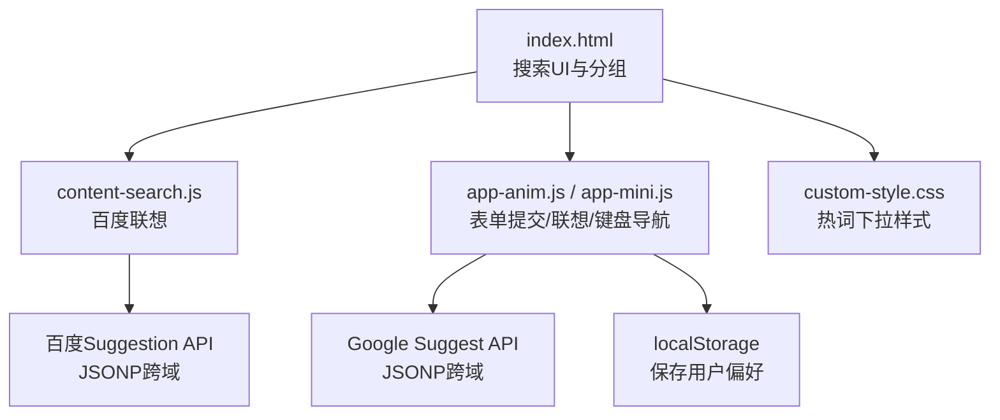
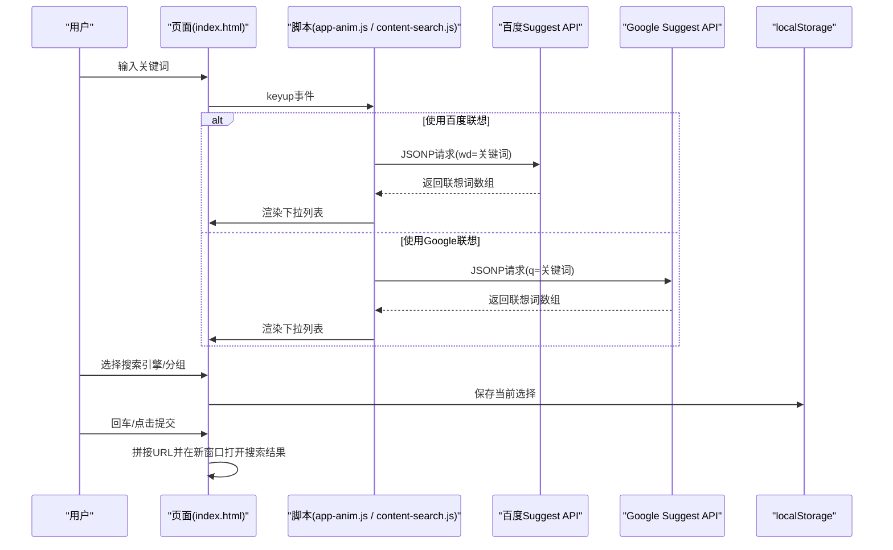
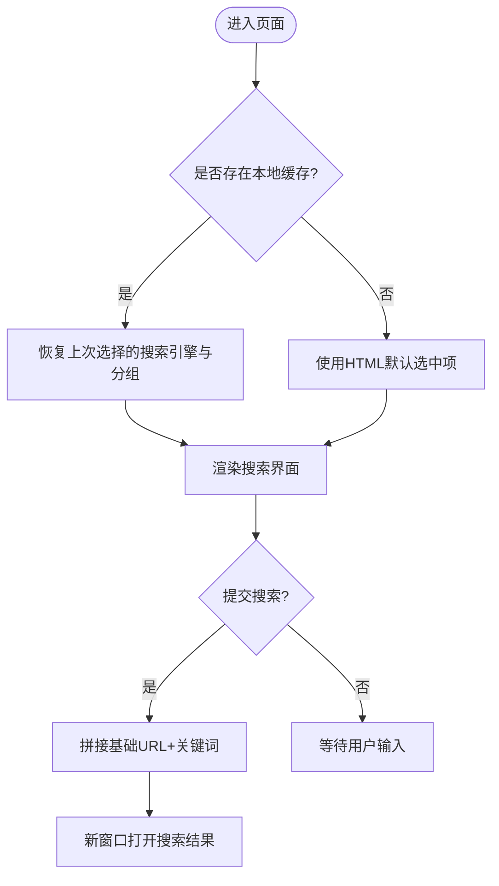
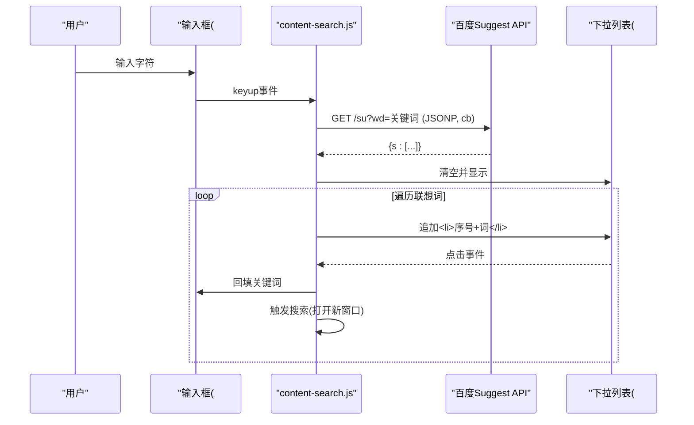
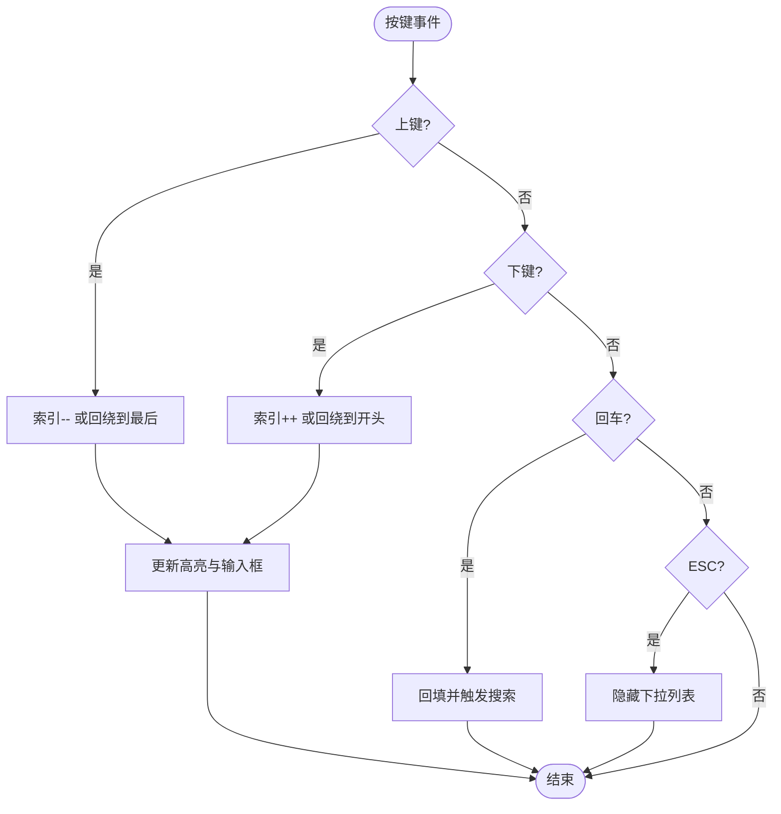
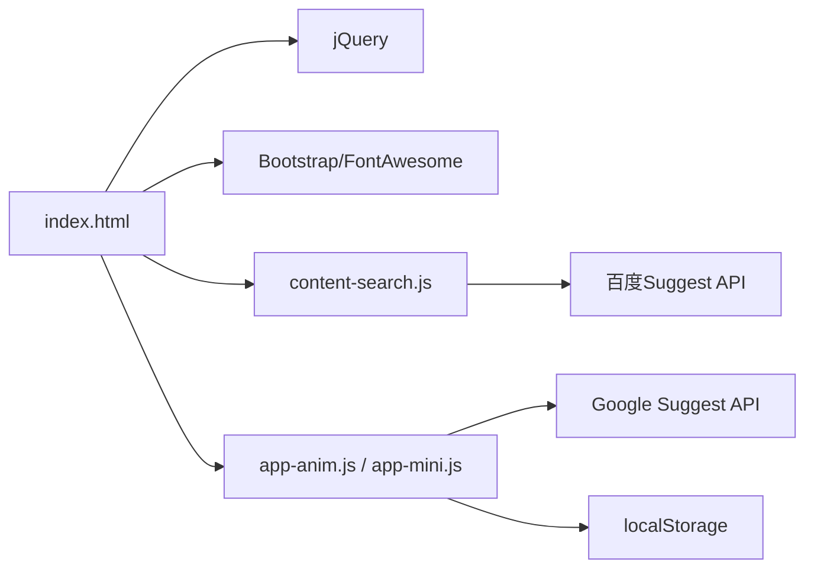

# 搜索功能

<cite>
**本文引用的文件**
- [index.html](file://index.html)
- [content-search.js](file://assets/js/content-search.js)
- [app-anim.js](file://assets/js/app-anim.js)
- [app-mini.js](file://assets/js/app-mini.js)
- [custom-style.css](file://assets/css/custom-style.css)
</cite>

## 目录
1. [简介](#简介)
2. [项目结构](#项目结构)
3. [核心组件](#核心组件)
4. [架构总览](#架构总览)
5. [详细组件分析](#详细组件分析)
6. [依赖关系分析](#依赖关系分析)
7. [性能考量](#性能考量)
8. [故障排查指南](#故障排查指南)
9. [结论](#结论)
10. [附录：配置参数与使用示例](#附录配置参数与使用示例)

## 简介
本文件面向开发者，系统化说明该站点“智能搜索”功能的实现原理与使用方式。内容涵盖多搜索引擎集成、实时搜索建议（百度/谷歌）、搜索分类组织、键盘导航、以及用户偏好与历史管理的本地化实现。文档同时提供可操作的配置要点与使用示例，帮助定制和优化搜索体验。

## 项目结构
搜索功能由页面结构与交互脚本共同构成：
- 页面入口 index.html 定义了搜索框、搜索类型分组（常用/搜索/工具/社区/生活/求职）及表单提交逻辑。
- assets/js/content-search.js 实现了基于百度搜索API的关键词联想下拉提示。
- assets/js/app-anim.js 与 assets/js/app-mini.js 提供了移动端/动画版搜索行为：表单提交、Google/百度联想、键盘上下选择、回车确认等。
- assets/css/custom-style.css 对搜索热词下拉面板、激活态样式等进行美化。

图表来源
- [index.html:334-571](file://index.html#L334-L571)
- [content-search.js:1-91](file://assets/js/content-search.js#L1-L91)
- [app-anim.js:856-991](file://assets/js/app-anim.js#L856-L991)
- [app-mini.js:812-822](file://assets/js/app-mini.js#L812-L822)
- [custom-style.css:45-89](file://assets/css/custom-style.css#L45-L89)

章节来源
- [index.html:334-571](file://index.html#L334-L571)
- [content-search.js:1-91](file://assets/js/content-search.js#L1-L91)
- [app-anim.js:856-991](file://assets/js/app-anim.js#L856-L991)
- [app-mini.js:812-822](file://assets/js/app-mini.js#L812-L822)
- [custom-style.css:45-89](file://assets/css/custom-style.css#L45-L89)

## 核心组件
- 搜索表单与分组：通过 radio 按钮切换不同搜索引擎，每个引擎对应一个基础URL模板，提交时拼接关键词跳转。
- 实时联想：监听输入事件，调用百度或Google的suggest接口，返回数据后动态渲染下拉列表。
- 键盘导航：支持上下键在联想列表中移动、回车选中并触发搜索、ESC关闭列表。
- 用户偏好：将当前选中的搜索引擎与分组状态持久化到 localStorage，下次打开页面恢复。

章节来源
- [index.html:334-571](file://index.html#L334-L571)
- [content-search.js:1-91](file://assets/js/content-search.js#L1-L91)
- [app-anim.js:856-991](file://assets/js/app-anim.js#L856-L991)
- [app-mini.js:812-822](file://assets/js/app-mini.js#L812-L822)

## 架构总览
搜索系统采用“前端轻量控制 + 外部API服务”的架构：
- 页面负责UI与交互（分组切换、表单提交、键盘事件）。
- 联想能力来自第三方搜索引擎的公开suggest接口，通过JSONP跨域获取。
- 用户偏好通过浏览器本地存储（localStorage）维护。

图表来源
- [content-search.js:5-73](file://assets/js/content-search.js#L5-L73)
- [app-anim.js:868-923](file://assets/js/app-anim.js#L868-L923)
- [app-mini.js:863-918](file://assets/js/app-mini.js#L863-L918)
- [app-anim.js:817-827](file://assets/js/app-anim.js#L817-L827)
- [app-mini.js:812-822](file://assets/js/app-mini.js#L812-L822)

## 详细组件分析

### 多搜索引擎集成与分组管理
- 分组划分：页面内以六个组组织搜索引擎，分别对应“常用、搜索、工具、社区、生活、求职”。每组包含若干radio项，value为搜索引擎的基础URL模板（如 https://www.baidu.com/s?wd=）。
- 默认选中：首次加载时，若存在本地缓存则恢复上次选择的搜索引擎与分组；否则按HTML中checked属性确定默认值。
- 提交逻辑：表单提交时读取当前选中的radio value，将用户输入的关键词进行编码后拼接到基础URL，并在新窗口打开结果页。

图表来源
- [index.html:357-567](file://index.html#L357-L567)
- [app-anim.js:856-867](file://assets/js/app-anim.js#L856-L867)
- [app-mini.js:812-822](file://assets/js/app-mini.js#L812-L822)

章节来源
- [index.html:357-567](file://index.html#L357-L567)
- [app-anim.js:856-867](file://assets/js/app-anim.js#L856-L867)
- [app-mini.js:812-822](file://assets/js/app-mini.js#L812-L822)

### 实时搜索建议（百度/谷歌）
- 百度联想：监听输入框keyup事件，发起JSONP请求至百度suggest接口，回调函数名固定为cb，返回数据结构中包含s数组用于渲染。
- 谷歌联想：在动画/迷你版本中，通过Google suggest接口（callback=iowenHot）获取联想词，渲染到search-smart-tips区域。
- 渲染与交互：将返回的联想词逐项追加到ul li中，并为每项绑定点击事件，点击后将关键词回填到输入框并触发搜索。

图表来源
- [content-search.js:5-73](file://assets/js/content-search.js#L5-L73)
- [content-search.js:75-83](file://assets/js/content-search.js#L75-L83)

章节来源
- [content-search.js:5-73](file://assets/js/content-search.js#L5-L73)
- [content-search.js:75-83](file://assets/js/content-search.js#L75-L83)
- [app-anim.js:868-923](file://assets/js/app-anim.js#L868-L923)
- [app-mini.js:863-918](file://assets/js/app-mini.js#L863-L918)

### 键盘导航支持
- 上下键：在联想列表可见时，按下下键将高亮下一项并回填输入框；按下上键循环回到最后一项。
- 回车：在联想列表高亮状态下，回车将选中当前项并触发搜索。
- ESC：关闭联想下拉列表（在相关脚本中处理隐藏逻辑）。

图表来源
- [app-anim.js:976-991](file://assets/js/app-anim.js#L976-L991)
- [app-mini.js:971-986](file://assets/js/app-mini.js#L971-L986)

章节来源
- [app-anim.js:976-991](file://assets/js/app-anim.js#L976-L991)
- [app-mini.js:971-986](file://assets/js/app-mini.js#L971-L986)

### 搜索历史管理与用户偏好设置
- 偏好存储：将当前选中的搜索引擎ID与分组data-id保存到localStorage，以便下次打开页面时自动恢复。
- 恢复逻辑：页面初始化时读取localStorage，勾选对应的radio项并高亮对应分组标签。
- 注意：当前实现主要保存“最近一次使用的搜索引擎与分组”，未实现完整的“搜索历史”列表（即多次搜索记录的持久化与展示）。如需扩展，可在现有基础上增加历史记录数组与展示UI。

章节来源
- [app-anim.js:817-827](file://assets/js/app-anim.js#L817-L827)
- [app-mini.js:812-822](file://assets/js/app-mini.js#L812-L822)

### 搜索分类系统的组织方式
- 分组定义：页面中以六个search-group（group-a至group-f）组织搜索引擎，分别对应“常用、搜索、工具、社区、生活、求职”。
- 交互：顶部标签栏（s-type-list.big）用于切换分组，点击后滚动到对应分组并高亮当前分组。
- 默认行为：首次加载时根据本地缓存或HTML默认选中项确定初始分组。

章节来源
- [index.html:337-567](file://index.html#L337-L567)

## 依赖关系分析
- jQuery：用于DOM操作与AJAX（jsonp）请求。
- Bootstrap/Fancybox/FontAwesome：提供UI框架与图标资源。
- 第三方API：百度suggest、Google suggest，均通过JSONP跨域访问。
- 本地存储：localStorage用于保存用户偏好。

图表来源
- [index.html:30-31](file://index.html#L30-L31)
- [content-search.js:8-12](file://assets/js/content-search.js#L8-L12)
- [app-anim.js:868-923](file://assets/js/app-anim.js#L868-L923)
- [app-mini.js:812-822](file://assets/js/app-mini.js#L812-L822)

章节来源
- [index.html:30-31](file://index.html#L30-L31)
- [content-search.js:8-12](file://assets/js/content-search.js#L8-L12)
- [app-anim.js:868-923](file://assets/js/app-anim.js#L868-L923)
- [app-mini.js:812-822](file://assets/js/app-mini.js#L812-L822)

## 性能考量
- 联想请求频率：建议在输入防抖（如300ms）后再发起请求，减少不必要的网络开销。
- JSONP限制：JSONP仅支持GET请求，且需服务端支持回调函数；确保接口稳定可用。
- DOM操作优化：批量构建DOM片段再一次性插入，避免频繁重排。
- 错误处理：网络异常或接口无数据时，及时隐藏下拉列表并给出友好提示。

[本节为通用指导，不直接分析具体文件]

## 故障排查指南
- 联想列表不显示：
  - 检查是否成功发起JSONP请求（控制台Network查看请求与响应）。
  - 确认回调函数名与接口要求一致（百度为cb，Google为iowenHot）。
  - 检查返回数据结构是否正确解析（百度为res.s，Google为res[1]）。
- 键盘导航无效：
  - 确认联想列表已显示且存在li元素。
  - 检查keydown事件是否被其他元素拦截。
- 偏好未恢复：
  - 检查localStorage中是否存在searchlist与searchlistmenu键值。
  - 确认页面初始化时正确读取并勾选对应radio项。

章节来源
- [content-search.js:16-71](file://assets/js/content-search.js#L16-L71)
- [app-anim.js:868-923](file://assets/js/app-anim.js#L868-L923)
- [app-mini.js:812-822](file://assets/js/app-mini.js#L812-L822)

## 结论
该搜索功能以简洁的前端逻辑整合多个搜索引擎，并通过JSONP实现跨域联想，配合键盘导航与本地偏好存储，提供了良好的用户体验。未来可在此基础上扩展更多搜索引擎、完善搜索历史管理、增加输入防抖与错误重试机制，进一步提升性能与健壮性。

[本节为总结性内容，不直接分析具体文件]

## 附录：配置参数与使用示例

- 搜索引擎配置
  - 位置：index.html 中各search-group内的radio项value字段，值为搜索引擎基础URL模板。
  - 示例：
    - 百度：https://www.baidu.com/s?wd=
    - 必应：https://cn.bing.com/search?q=
    - 谷歌：https://www.google.com/search?q=
    - 360：https://www.so.com/s?q=
    - 搜狗：https://www.sogou.com/web?query=
  - 使用：提交时将用户输入关键词编码后拼接至上述模板，在新窗口打开搜索结果。

- 实时联想配置
  - 百度联想：
    - 接口：https://suggestion.baidu.com/su?wd=关键词
    - 数据类型：JSONP
    - 回调参数：cb
    - 数据来源：content-search.js
  - 谷歌联想：
    - 接口：//suggestqueries.google.com/complete/search?client=firefox&callback=iowenHot&q=关键词
    - 数据类型：JSONP
    - 回调参数：iowenHot
    - 数据来源：app-anim.js / app-mini.js

- 键盘快捷键
  - 上/下键：在联想列表中移动高亮项并回填输入框。
  - 回车：选中当前高亮项并触发搜索。
  - ESC：关闭联想下拉列表。
  - 数据来源：app-anim.js / app-mini.js

- 用户偏好与历史
  - 偏好存储键：
    - searchlist：当前选中的搜索引擎ID
    - searchlistmenu：当前选中的分组data-id
  - 数据来源：app-anim.js / app-mini.js

- 样式定制
  - 热词下拉面板样式：custom-style.css 中 .search-hot-text 相关类
  - 激活态指示器：custom-style.css 中 .search-type input:checked+label:before

章节来源
- [index.html:357-567](file://index.html#L357-L567)
- [content-search.js:8-12](file://assets/js/content-search.js#L8-L12)
- [app-anim.js:868-923](file://assets/js/app-anim.js#L868-L923)
- [app-mini.js:812-822](file://assets/js/app-mini.js#L812-L822)
- [custom-style.css:45-89](file://assets/css/custom-style.css#L45-L89)