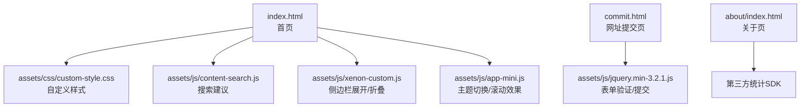
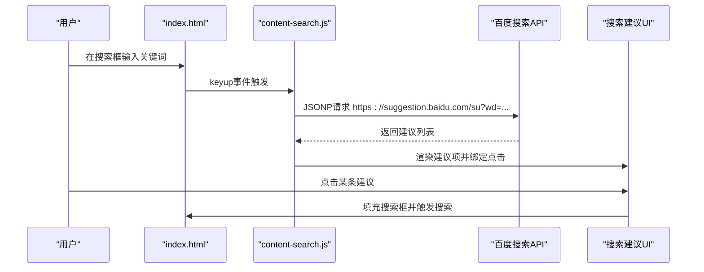
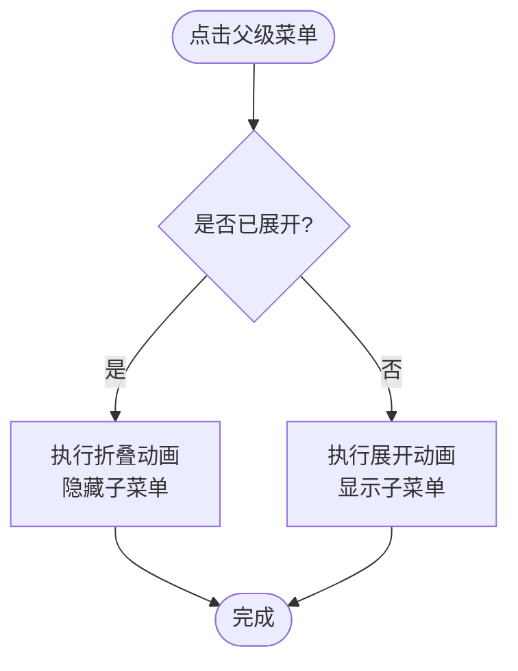
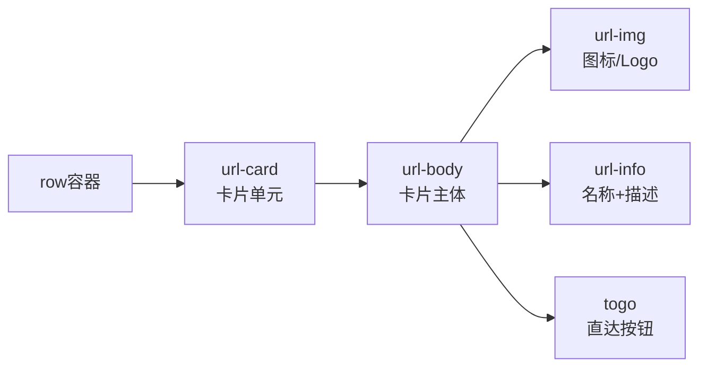
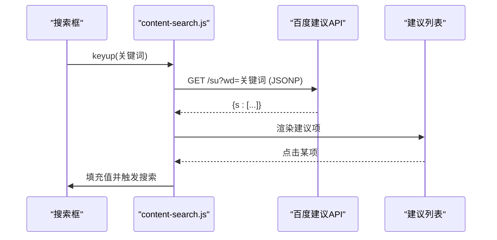
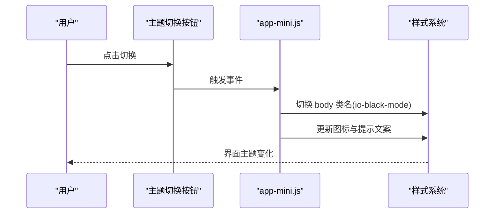
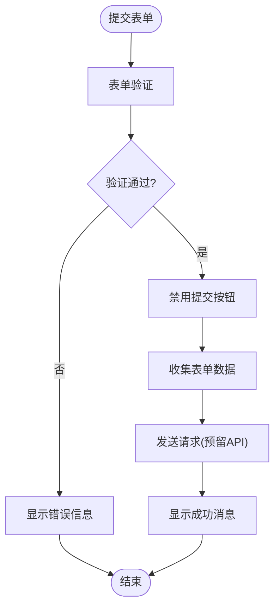
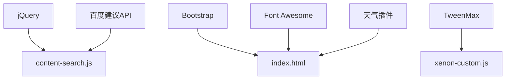

# 核心功能

<cite>
**本文引用的文件**
- [index.html](file://index.html)
- [content-search.js](file://assets/js/content-search.js)
- [custom-style.css](file://assets/css/custom-style.css)
- [commit.html](file://commit.html)
- [about/index.html](file://about/index.html)
- [README.md](file://README.md)
- [app-mini.js](file://assets/js/app-mini.js)
- [xenon-custom.js](file://assets/js/xenon-custom.js)
</cite>

## 目录
1. [简介](#简介)
2. [项目结构](#项目结构)
3. [核心组件](#核心组件)
4. [架构总览](#架构总览)
5. [详细组件分析](#详细组件分析)
6. [依赖关系分析](#依赖关系分析)
7. [性能考虑](#性能考虑)
8. [故障排查指南](#故障排查指南)
9. [结论](#结论)
10. [附录：使用示例与配置选项](#附录使用示例与配置选项)

## 简介
本项目是一个纯静态的在线网址导航工具，提供分类导航、卡片式展示、智能搜索（集成百度搜索建议）、主题切换（日间/夜间模式）以及网址提交等功能。整体采用 HTML + CSS + JavaScript（jQuery）构建，无需后端即可运行，支持响应式布局，适合个人或团队快速部署和使用。

## 项目结构
- 入口页面 index.html 包含左侧分类导航、顶部搜索区、内容卡片区域等
- 样式集中在 assets/css/custom-style.css 及第三方样式库
- 交互逻辑由 assets/js 下的脚本驱动，如 content-search.js 负责搜索建议
- 提交页 commit.html 提供表单验证与提交流程
- about/index.html 为关于页面
- README.md 提供部署与二次开发说明

图表来源
- [index.html:1-120](file://index.html#L1-L120)
- [custom-style.css:1-126](file://assets/css/custom-style.css#L1-L126)
- [content-search.js:1-91](file://assets/js/content-search.js#L1-L91)
- [xenon-custom.js:1152-1322](file://assets/js/xenon-custom.js#L1152-L1322)
- [app-mini.js:201-253](file://assets/js/app-mini.js#L201-L253)
- [commit.html:185-382](file://commit.html#L185-L382)
- [about/index.html:239-241](file://about/index.html#L239-L241)

章节来源
- [index.html:1-120](file://index.html#L1-L120)
- [README.md:242-314](file://README.md#L242-L314)

## 核心组件
- 分类导航系统：左侧多级菜单，支持展开/折叠、移动端适配
- 卡片式布局：网格化展示网站卡片，支持懒加载与响应式列数
- 智能搜索：输入联想、多搜索引擎选择、键盘导航与点击跳转
- 主题切换：日间/夜间模式切换，样式变量与类名控制
- 网址提交：表单校验、错误提示、数据收集与提交流程

章节来源
- [index.html:44-216](file://index.html#L44-L216)
- [index.html:318-571](file://index.html#L318-L571)
- [index.html:577-800](file://index.html#L577-L800)
- [content-search.js:1-91](file://assets/js/content-search.js#L1-L91)
- [app-mini.js:201-253](file://assets/js/app-mini.js#L201-L253)
- [commit.html:185-382](file://commit.html#L185-L382)

## 架构总览
整体为前端静态站点架构，通过 jQuery 绑定事件与 DOM 操作实现交互；搜索建议通过 JSONP 调用百度接口；主题切换通过切换 body 类名并更新图标状态；侧边栏多级菜单通过动画库 TweenMax 实现平滑展开/折叠。

图表来源
- [content-search.js:5-83](file://assets/js/content-search.js#L5-L83)
- [index.html:351-355](file://index.html#L351-L355)

章节来源
- [content-search.js:1-91](file://assets/js/content-search.js#L1-L91)
- [index.html:318-571](file://index.html#L318-L571)

## 详细组件分析

### 分类导航系统（多级菜单展开/折叠）
- 结构：左侧 sidebar 内 ul/li 嵌套表示多级菜单，父级带有箭头图标标识可展开
- 交互：点击父级链接时，通过 xenon-custom.js 中的函数进行展开/折叠，使用 TweenMax 做高度动画，确保子项逐项显示
- 移动端：在小屏设备下自动处理点击行为，避免误触，同时关闭兄弟节点以保持界面整洁
- 样式：custom-style.css 调整了二级菜单宽度、间距与滚动条隐藏等细节

图表来源
- [xenon-custom.js:1152-1322](file://assets/js/xenon-custom.js#L1152-L1322)
- [custom-style.css:4-10](file://assets/css/custom-style.css#L4-L10)

章节来源
- [index.html:68-184](file://index.html#L68-L184)
- [xenon-custom.js:1152-1322](file://assets/js/xenon-custom.js#L1152-L1322)
- [custom-style.css:4-10](file://assets/css/custom-style.css#L4-L10)

### 卡片式布局与响应式适配
- 布局：使用 Bootstrap 栅格系统，卡片容器按 col-6/col-sm-6/col-md-4/col-xl-5a/col-xxl-6a 自适应列数
- 内容：每个卡片包含图标、名称、描述与直达按钮，图片支持懒加载以提升首屏性能
- 样式：custom-style.css 对字体大小、背景网格、搜索热词下拉等进行了定制

图表来源
- [index.html:590-800](file://index.html#L590-L800)
- [custom-style.css:1-2](file://assets/css/custom-style.css#L1-L2)

章节来源
- [index.html:590-800](file://index.html#L590-L800)
- [custom-style.css:1-2](file://assets/css/custom-style.css#L1-L2)

### 智能搜索功能（百度搜索API集成、实时建议、键盘导航）
- 输入监听：监听搜索框 keyup 事件，获取关键词后发起 JSONP 请求到百度建议接口
- 结果渲染：将返回的建议列表渲染为下拉项，并为每项绑定点击事件以填充搜索框并触发搜索
- 键盘导航：当前实现中未显式实现上下键导航，但可通过扩展添加键盘事件处理
- 错误处理：网络错误或无结果时隐藏建议列表

图表来源
- [content-search.js:5-83](file://assets/js/content-search.js#L5-L83)
- [index.html:351-355](file://index.html#L351-L355)

章节来源
- [content-search.js:1-91](file://assets/js/content-search.js#L1-L91)
- [index.html:318-571](file://index.html#L318-L571)

### 主题切换系统（日间/夜间模式、样式变量管理、用户偏好存储）
- 切换机制：点击主题切换按钮时，切换 body 的 io-black-mode 类名，并更新图标与标题文案
- 样式变量：通过 custom-style.css 与主题样式共同控制不同模式的视觉表现（如搜索框颜色、热词列表颜色）
- 用户偏好：当前实现通过 AJAX 调用后端接口保存偏好（theme.ajaxurl），若需本地持久化可扩展为 localStorage 存储

图表来源
- [app-mini.js:201-253](file://assets/js/app-mini.js#L201-L253)
- [custom-style.css:22-24](file://assets/css/custom-style.css#L22-L24)
- [custom-style.css:66-68](file://assets/css/custom-style.css#L66-L68)

章节来源
- [app-mini.js:201-253](file://assets/js/app-mini.js#L201-L253)
- [custom-style.css:22-24](file://assets/css/custom-style.css#L22-L24)
- [custom-style.css:66-68](file://assets/css/custom-style.css#L66-L68)

### 网址提交功能（表单验证、数据提交、错误处理）
- 表单字段：网站名称、地址、分类、描述、关键词、邮箱、联系方式
- 验证规则：必填校验、URL 格式校验、邮箱格式校验、描述字数统计
- 错误处理：输入错误时高亮字段并显示错误信息；提交过程中禁用按钮并显示加载状态
- 提交逻辑：当前收集数据并预留 API 调用位置，可按需接入后端或第三方服务

图表来源
- [commit.html:287-382](file://commit.html#L287-L382)

章节来源
- [commit.html:185-382](file://commit.html#L185-L382)

## 依赖关系分析
- jQuery：用于 DOM 操作、事件绑定与 AJAX 请求
- Bootstrap：栅格系统与基础样式
- Font Awesome：图标资源
- TweenMax：侧边栏展开/折叠动画
- 百度建议API：搜索联想数据源
- 天气插件：头部天气信息显示

图表来源
- [index.html:17-31](file://index.html#L17-L31)
- [content-search.js:8-12](file://assets/js/content-search.js#L8-L12)
- [xenon-custom.js:1199-1201](file://assets/js/xenon-custom.js#L1199-L1201)

章节来源
- [index.html:17-31](file://index.html#L17-L31)
- [content-search.js:8-12](file://assets/js/content-search.js#L8-L12)
- [xenon-custom.js:1199-1201](file://assets/js/xenon-custom.js#L1199-L1201)

## 性能考虑
- 图片懒加载：使用 lozad.js 或原生 lazy 属性减少首屏压力
- 静态资源缓存：Nginx 配置中对静态资源设置长期缓存头
- 动画优化：侧边栏展开/折叠使用 TweenMax 控制过渡时间与延迟，避免重排重绘
- 搜索节流：建议在 content-search.js 中添加防抖/节流以减少频繁请求

[本节为通用指导，不直接分析具体文件]

## 故障排查指南
- 图片或样式加载失败：检查相对路径是否正确，确保资源存在且未被拦截
- 搜索建议不显示：确认网络可达、JSONP 回调参数正确、跨域策略允许
- 主题切换无效：检查 body 类名是否正确切换、CSS 是否覆盖生效
- 表单提交无响应：确认验证逻辑无误、API 地址可用、控制台无报错

章节来源
- [README.md:316-341](file://README.md#L316-L341)
- [content-search.js:67-71](file://assets/js/content-search.js#L67-L71)
- [commit.html:294-345](file://commit.html#L294-L345)

## 结论
本项目以简洁的前端技术栈实现了完整的网址导航体验，具备分类导航、卡片展示、智能搜索、主题切换与网址提交等核心能力。代码结构清晰、易于扩展，适合个人与团队快速部署与二次开发。

[本节为总结性内容，不直接分析具体文件]

## 附录：使用示例与配置选项

### 分类导航
- 新增分类：在 index.html 的侧边栏 ul 中添加新的 li 与对应子菜单
- 配置示例：参考现有分类结构，复制并修改 id、href 与文本内容
- 参考路径：[index.html:68-184](file://index.html#L68-L184)

### 卡片式布局
- 新增卡片：在对应分类区块内复制 url-card 结构，修改 href、img、title 与描述
- 响应式列数：根据屏幕尺寸调整 col-* 类名以控制每行列数
- 参考路径：[index.html:590-800](file://index.html#L590-L800)

### 智能搜索
- 搜索引擎选择：在搜索组中选择不同 radio 以切换目标搜索引擎
- 建议词点击：点击建议项会自动填充搜索框并触发搜索
- 参考路径：[index.html:351-571](file://index.html#L351-L571), [content-search.js:5-83](file://assets/js/content-search.js#L5-L83)

### 主题切换
- 切换按钮：点击主题切换按钮可在日间/夜间模式间切换
- 样式变量：通过 custom-style.css 中的类名控制不同模式的视觉效果
- 参考路径：[app-mini.js:201-253](file://assets/js/app-mini.js#L201-L253), [custom-style.css:22-24](file://assets/css/custom-style.css#L22-L24)

### 网址提交
- 表单字段：填写网站名称、地址、分类、描述、关键词、邮箱与联系方式
- 验证规则：必填字段与格式校验，错误时即时提示
- 提交流程：提交后禁用按钮并显示加载状态，预留 API 调用位置
- 参考路径：[commit.html:185-382](file://commit.html#L185-L382)

章节来源
- [index.html:68-184](file://index.html#L68-L184)
- [index.html:590-800](file://index.html#L590-L800)
- [index.html:351-571](file://index.html#L351-L571)
- [content-search.js:5-83](file://assets/js/content-search.js#L5-L83)
- [app-mini.js:201-253](file://assets/js/app-mini.js#L201-L253)
- [custom-style.css:22-24](file://assets/css/custom-style.css#L22-L24)
- [commit.html:185-382](file://commit.html#L185-L382)