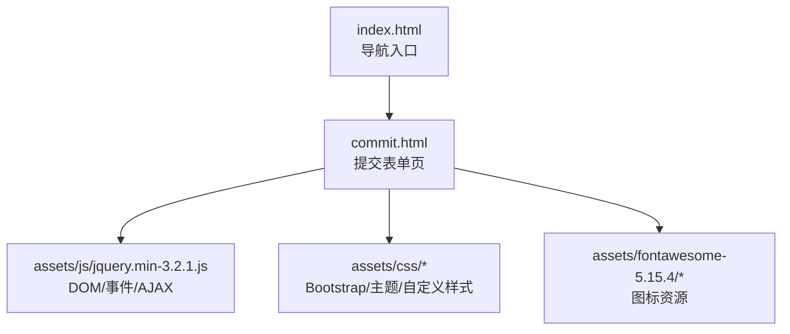
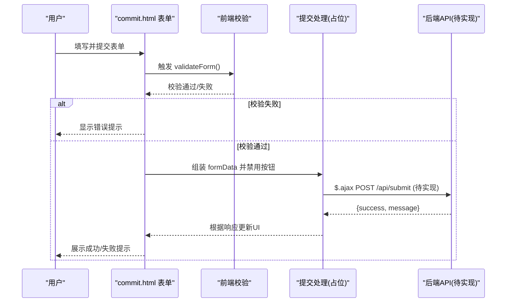
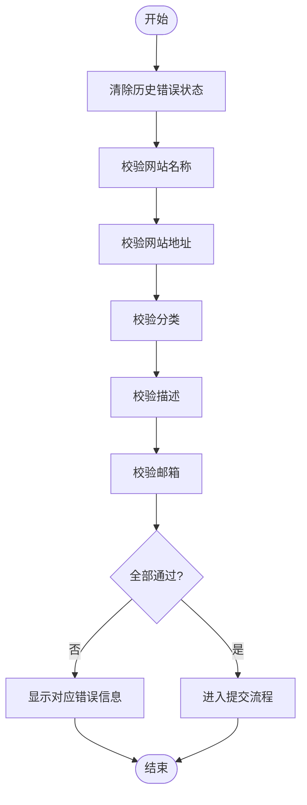
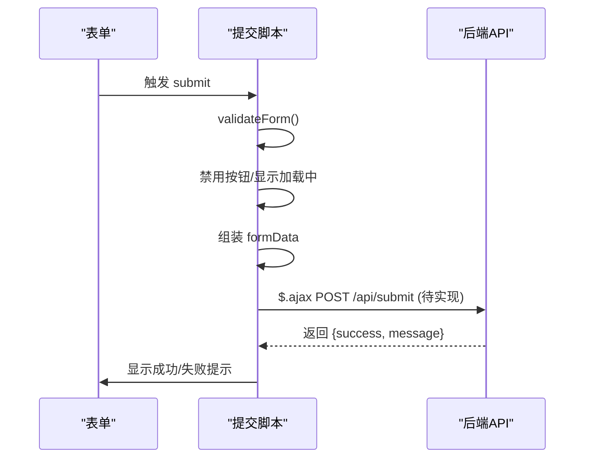
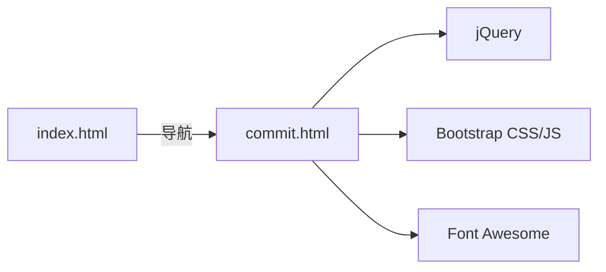

# 网址提交

<cite>
**本文引用的文件**
- [commit.html](file://commit.html)
- [index.html](file://index.html)
- [README.md](file://README.md)
- [content-search.js](file://assets/js/content-search.js)
</cite>

## 目录
1. [简介](#简介)
2. [项目结构](#项目结构)
3. [核心组件](#核心组件)
4. [架构总览](#架构总览)
5. [详细组件分析](#详细组件分析)
6. [依赖关系分析](#依赖关系分析)
7. [性能考虑](#性能考虑)
8. [故障排查指南](#故障排查指南)
9. [结论](#结论)
10. [附录：接口与配置扩展](#附录接口与配置扩展)

## 简介
本文件为“网址提交”功能的完整技术文档，面向开发者与运维人员。内容覆盖表单结构设计、字段验证规则、前端交互流程、安全性建议、后端接口约定以及可配置的集成方案。该项目为纯静态站点，提交页面位于 commit.html，主导航入口在 index.html 中提供跳转链接。

## 项目结构
- 首页 index.html：包含侧边栏导航，其中“网站提交”菜单项指向 commit.html。
- 提交页 commit.html：实现表单 UI、前端校验、数据收集与占位提交逻辑（当前未接入后端）。
- 资源 assets：样式与脚本资源，如 Bootstrap、jQuery、Font Awesome 等。
- 文档 README.md：说明二次开发方式，包括如何替换提交逻辑到后端 API。

图表来源
- [index.html:190-196](file://index.html#L190-L196)
- [commit.html:178-283](file://commit.html#L178-L283)

章节来源
- [index.html:190-196](file://index.html#L190-L196)
- [commit.html:178-283](file://commit.html#L178-L283)

## 核心组件
- 表单结构与字段
  - 网站名称：必填，文本输入，最大长度限制。
  - 网站地址：必填，URL 格式校验。
  - 网站分类：必填，下拉选择，内置常用分类。
  - 网站描述：必填，多行文本，带字数统计与上限。
  - 关键词：选填，逗号分隔的标签。
  - 联系邮箱：必填，邮箱格式校验。
  - 联系方式：选填，用于审核沟通。
- 前端校验
  - 必填检查、URL 正则、邮箱正则、实时错误提示与清除。
- 提交流程
  - 阻止默认提交、禁用按钮并显示加载状态、组装 JSON 数据对象（含提交时间戳），当前为占位逻辑，未发起网络请求。
- 成功反馈
  - 预留成功消息区域，可在后端返回成功后展示。

章节来源
- [commit.html:199-278](file://commit.html#L199-L278)
- [commit.html:287-378](file://commit.html#L287-L378)

## 架构总览
提交功能采用“前端表单 + 可选后端 API”的轻量架构。当前版本为纯前端实现，便于静态部署；后续可通过替换占位逻辑接入任意后端服务或第三方表单服务。

图表来源
- [commit.html:294-371](file://commit.html#L294-L371)
- [README.md:261-275](file://README.md#L261-L275)

章节来源
- [commit.html:294-371](file://commit.html#L294-L371)
- [README.md:261-275](file://README.md#L261-L275)

## 详细组件分析

### 表单设计与字段规范
- 网站名称
  - 类型：文本
  - 必填：是
  - 长度：最大 50 字符
  - 用途：展示标题
- 网站地址
  - 类型：URL
  - 必填：是
  - 格式：以 http(s) 开头，且包含域名后缀
  - 用途：收录目标链接
- 网站分类
  - 类型：下拉选择
  - 必填：是
  - 选项：常用工具、科研办公、开发设计、效率办公、社交媒体、资源下载、生活服务、学习教育、其他
  - 用途：归类管理
- 网站描述
  - 类型：多行文本
  - 必填：是
  - 长度：最大 200 字符，实时计数
  - 用途：简要介绍功能特点
- 关键词
  - 类型：文本
  - 必填：否
  - 格式：逗号分隔的标签
  - 用途：检索与推荐
- 联系邮箱
  - 类型：邮箱
  - 必填：是
  - 格式：标准邮箱正则
  - 用途：审核结果通知
- 联系方式
  - 类型：文本
  - 必填：否
  - 长度：最大 50 字符
  - 用途：备用沟通渠道

章节来源
- [commit.html:200-273](file://commit.html#L200-L273)

### 前端验证机制
- 必填字段检查：对名称、地址、分类、描述、邮箱进行非空校验。
- URL 格式校验：使用正则匹配 http(s) 协议与域名结构。
- 邮箱格式校验：使用正则匹配常见邮箱模式。
- 实时反馈：输入时移除错误样式与提示，提交前统一校验并高亮错误字段。
- 用户体验：提交按钮禁用与加载动画，防止重复提交。

图表来源
- [commit.html:294-345](file://commit.html#L294-L345)

章节来源
- [commit.html:294-345](file://commit.html#L294-L345)

### 数据提交流程
- 事件绑定：监听表单 submit，阻止默认行为。
- 数据收集：构建包含 siteName、siteUrl、category、description、keywords、email、contact、submitTime 的对象。
- 占位实现：当前仅组装数据，未发起 AJAX 请求；需在占位处接入后端 API。
- 成功反馈：预留成功消息容器，可在后端返回成功后显示。

图表来源
- [commit.html:347-371](file://commit.html#L347-L371)
- [README.md:261-275](file://README.md#L261-L275)

章节来源
- [commit.html:347-371](file://commit.html#L347-L371)
- [README.md:261-275](file://README.md#L261-L275)

### 安全性考虑
- 输入过滤与转义
  - 前端已做基础格式校验；建议在服务端再次校验并对输出进行 HTML 转义，避免 XSS。
- CSRF 保护
  - 若后端启用会话或令牌，请在 AJAX 请求中携带 CSRF Token（如 Cookie 或自定义 Header）。
- 传输安全
  - 全站启用 HTTPS，避免中间人攻击。
- 速率限制与防刷
  - 后端对同一 IP/邮箱短时间内的提交进行限流，防止滥用。
- 敏感信息最小化
  - 仅收集必要字段；联系方式与邮箱仅用于审核通知。

[本节为通用安全建议，不直接引用具体代码]

### 与后端的接口设计
- 请求
  - 方法：POST
  - 路径：/api/submit（示例）
  - Content-Type：application/json
  - 请求体字段：
    - siteName：string，必填
    - siteUrl：string，必填，URL 格式
    - category：string，必填，枚举值见上节
    - description：string，必填，长度上限
    - keywords：string，可选，逗号分隔
    - email：string，必填，邮箱格式
    - contact：string，可选
    - submitTime：string，ISO 时间戳
- 响应
  - 成功：{ success: true, message: "提交成功" }
  - 失败：{ success: false, message: "错误原因" }
  - 状态码：HTTP 200/4xx/5xx 由后端定义
- 鉴权与防护
  - 如需鉴权，可在请求头添加 Authorization 或携带 CSRF Token。
  - 建议后端对重复 URL 进行去重检测，并返回相应提示。

[本节为接口约定建议，便于后续集成不同后端服务]

## 依赖关系分析
- 运行时依赖
  - jQuery：用于 DOM 操作、事件绑定与 AJAX。
  - Bootstrap 4：栅格与基础样式。
  - Font Awesome：图标资源。
- 页面间关系
  - index.html 提供“网站提交”入口，跳转到 commit.html。
  - commit.html 依赖上述资源完成表单渲染与交互。

图表来源
- [index.html:190-196](file://index.html#L190-L196)
- [commit.html:15-25](file://commit.html#L15-L25)
- [commit.html:285-286](file://commit.html#L285-L286)

章节来源
- [index.html:190-196](file://index.html#L190-L196)
- [commit.html:15-25](file://commit.html#L15-L25)
- [commit.html:285-286](file://commit.html#L285-L286)

## 性能考虑
- 资源加载
  - 使用 CDN 或本地缓存静态资源，减少首屏时间。
  - 按需引入 jQuery 与插件，避免冗余。
- 表单交互
  - 使用防抖优化搜索建议（参考 content-search.js 的实现思路）。
  - 提交时禁用按钮，避免重复请求。
- 图片与图标
  - 使用 WebP/矢量图标，减小体积。
- 缓存策略
  - 静态资源设置长期缓存，HTML 短缓存或无缓存。

[本节为通用性能建议]

## 故障排查指南
- 表单无法提交
  - 检查是否阻止了默认提交但未调用后端接口；确认占位逻辑已替换为实际 AJAX。
  - 查看浏览器控制台是否有 JS 报错。
- 校验不生效
  - 确认 jQuery 已正确加载，表单元素 ID/name 未被修改。
  - 检查正则表达式是否符合预期。
- 样式错乱
  - 确认 Bootstrap 与自定义样式路径正确。
- 成功消息未显示
  - 确认后端返回结构与前端期望一致，并在成功回调中显示提示。

章节来源
- [commit.html:294-378](file://commit.html#L294-L378)

## 结论
该网址提交功能提供了完整的表单结构与前端校验，具备清晰的扩展点以便接入后端服务。当前为纯前端占位实现，适合静态部署与快速原型；在生产环境中建议补充服务端校验、安全防护与持久化存储。

[本节为总结性内容，不直接引用具体代码]

## 附录：接口与配置扩展

### 字段与校验规则汇总
- 网站名称：必填，最大 50 字符
- 网站地址：必填，http(s) 协议与域名格式
- 网站分类：必填，从预设选项中选取
- 网站描述：必填，最大 200 字符，实时计数
- 关键词：选填，逗号分隔
- 联系邮箱：必填，邮箱格式
- 联系方式：选填，最大 50 字符

章节来源
- [commit.html:200-273](file://commit.html#L200-L273)

### 前端验证要点
- 必填与非空
- URL 与邮箱的正则校验
- 输入时清除错误状态，提升体验
- 提交时禁用按钮，防止重复提交

章节来源
- [commit.html:294-345](file://commit.html#L294-L345)
- [commit.html:347-371](file://commit.html#L347-L371)

### 后端集成步骤
- 在 commit.html 的提交占位处替换为 $.ajax 调用，发送 JSON 数据至 /api/submit。
- 后端需实现：
  - 参数校验与清洗
  - 重复 URL 检测
  - 数据存储（数据库/文件/第三方服务）
  - 返回统一 JSON 结构
- 前端根据响应显示成功或失败提示。

章节来源
- [README.md:261-275](file://README.md#L261-L275)
- [commit.html:347-371](file://commit.html#L347-L371)

### 可选扩展
- 验证码/人机校验：接入图形验证码或滑块验证，降低恶意提交。
- 邮件通知：提交成功后发送邮件给管理员或提交者。
- 审核工作流：增加审核状态与后台管理界面。
- 统计埋点：记录提交转化率与失败原因。

[本节为扩展建议，不直接引用具体代码]