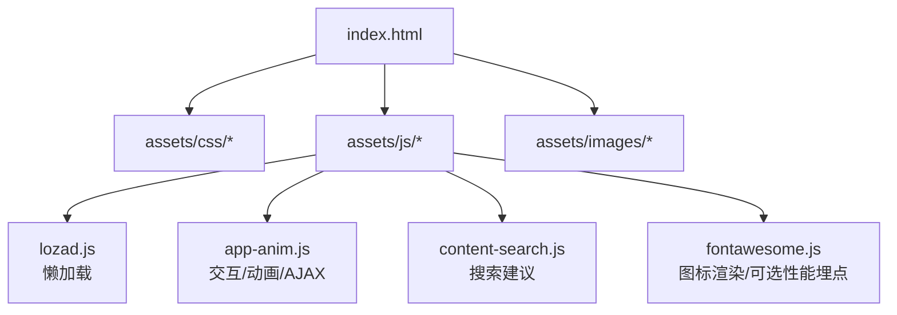
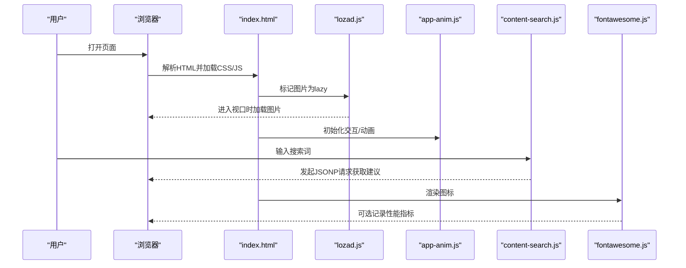
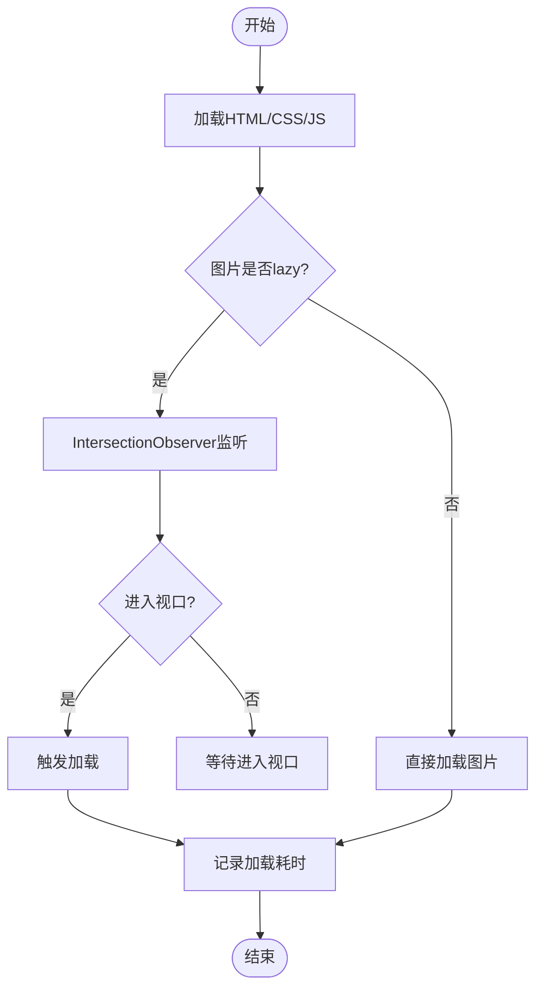
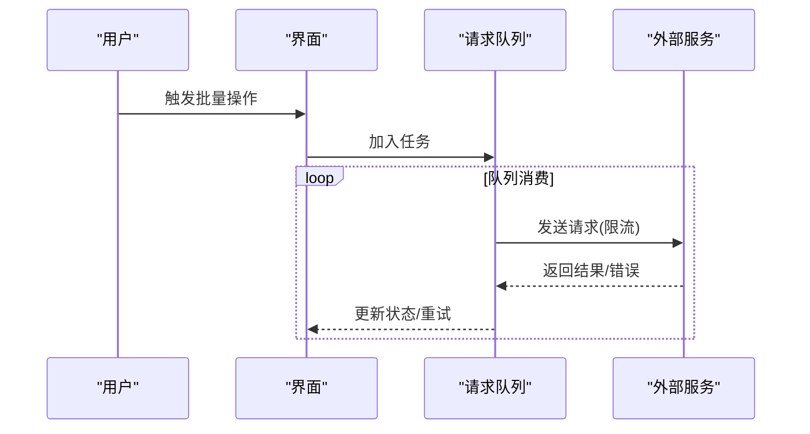
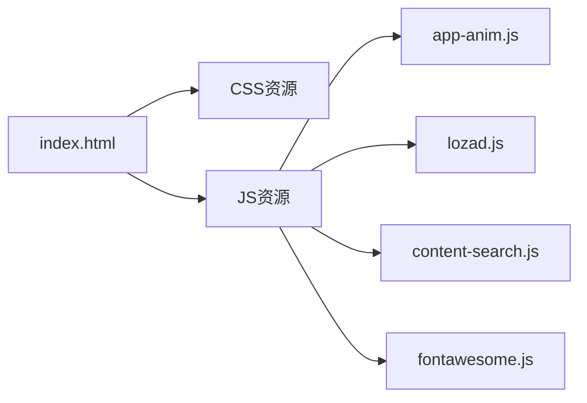

# 性能测试与优化

<cite>
**本文引用的文件**
- [index.html](file://index.html)
- [README.md](file://README.md)
- [lozad.js](file://assets/js/lozad.js)
- [app-anim.js](file://assets/js/app-anim.js)
- [content-search.js](file://assets/js/content-search.js)
- [fontawesome.js](file://assets/fontawesome-5.15.4/js/fontawesome.js)
</cite>

## 目录
1. [简介](#简介)
2. [项目结构](#项目结构)
3. [核心组件](#核心组件)
4. [架构总览](#架构总览)
5. [详细组件分析](#详细组件分析)
6. [依赖关系分析](#依赖关系分析)
7. [性能考量](#性能考量)
8. [故障排查指南](#故障排查指南)
9. [结论](#结论)
10. [附录](#附录)

## 简介
本文件面向“在线网址导航”项目的性能测试与优化，覆盖加载性能、内存管理、并发请求、优化实践与监控工具集成。文档基于仓库中的实际代码与配置进行分析，提供可操作的测试方法与优化建议，帮助团队建立稳定的性能基线与持续改进机制。

## 项目结构
本项目为纯静态站点，主要资源包括：
- 页面入口与骨架：index.html（首页）、about/index.html（关于页）、commit.html（提交页）、404.html
- 样式与图标：assets/css/*、assets/fontawesome-5.15.4/*
- 脚本与交互：assets/js/*（含懒加载、动画、搜索等）
- 图片资源：assets/images/*

图表来源
- [index.html:1-35](file://index.html#L1-L35)
- [lozad.js:117-169](file://assets/js/lozad.js#L117-L169)
- [app-anim.js:1-25](file://assets/js/app-anim.js#L1-L25)
- [content-search.js:1-91](file://assets/js/content-search.js#L1-L91)
- [fontawesome.js:138-163](file://assets/fontawesome-5.15.4/js/fontawesome.js#L138-L163)

章节来源
- [index.html:1-35](file://index.html#L1-L35)
- [README.md:298-314](file://README.md#L298-L314)

## 核心组件
- 懒加载模块：lozad.js，基于 IntersectionObserver 实现图片/背景图按需加载，减少首屏资源体积与阻塞。
- 交互与动画：app-anim.js，负责侧边栏、滚动、AJAX 内容加载、本地存储读写等。
- 搜索建议：content-search.js，通过 JSONP 获取关键词建议，提升搜索体验。
- 图标库：fontawesome.js，支持可选的性能测量能力（measurePerformance）。

章节来源
- [lozad.js:117-169](file://assets/js/lozad.js#L117-L169)
- [app-anim.js:1-25](file://assets/js/app-anim.js#L1-L25)
- [content-search.js:1-91](file://assets/js/content-search.js#L1-L91)
- [fontawesome.js:138-163](file://assets/fontawesome-5.15.4/js/fontawesome.js#L138-L163)

## 架构总览
页面加载与渲染的关键路径如下：
- 浏览器解析 HTML，按顺序加载 CSS/JS
- 首屏图片使用 lozad 的 lazy 类进行懒加载，仅当进入视口时触发加载
- 交互逻辑由 app-anim.js 初始化，包含菜单、滚动、AJAX 内容加载
- 搜索框输入触发 content-search.js 的异步请求，展示热词建议
- 图标渲染由 fontawesome.js 处理，可开启性能测量以辅助分析

图表来源
- [index.html:17-31](file://index.html#L17-L31)
- [lozad.js:117-169](file://assets/js/lozad.js#L117-L169)
- [app-anim.js:1-25](file://assets/js/app-anim.js#L1-L25)
- [content-search.js:1-91](file://assets/js/content-search.js#L1-L91)
- [fontawesome.js:138-163](file://assets/fontawesome-5.15.4/js/fontawesome.js#L138-L163)

## 详细组件分析

### 加载性能测试
目标：测量首屏加载时间、资源加载优化效果、懒加载有效性。

- 首屏加载时间测量
  - 使用浏览器开发者工具的 Network 面板与 Performance 面板，记录关键指标：
    - TTFB（首次字节时间）
    - DOMContentLoaded、Load
    - 首屏可交互时间（TTI）
    - 最大绘制时间（LCP）
  - 在 CI 或本地压测中，结合 WebPageTest/Lighthouse 生成报告，对比优化前后变化。

- 资源加载优化
  - 启用服务器端压缩（如 Nginx gzip），参考 README 中的 Nginx 配置片段，对文本类资源启用压缩。
  - 静态资源缓存策略：为图片、CSS、JS 设置长期缓存头（expires 与 Cache-Control immutable），减少重复请求。
  - 资源拆分与延迟加载：将非关键 JS/CSS 延迟加载；图片统一使用懒加载。

- 懒加载效果验证
  - 确认图片元素带有 lazy 类，并由 lozad 接管加载逻辑。
  - 在 Performance 面板观察网络瀑布流，验证不在视口的图片不会立即请求。
  - 使用 IntersectionObserver 事件监听，统计触发加载次数与耗时。

图表来源
- [lozad.js:117-169](file://assets/js/lozad.js#L117-L169)
- [index.html:604-605](file://index.html#L604-L605)

章节来源
- [README.md:88-116](file://README.md#L88-L116)
- [lozad.js:117-169](file://assets/js/lozad.js#L117-L169)
- [index.html:604-605](file://index.html#L604-L605)

### 内存管理测试
目标：检测内存泄漏、监控垃圾回收、评估大对象影响。

- 内存泄漏检测
  - 使用 Chrome DevTools Memory 面板的 Heap Snapshot 与 Allocation Timeline，对比操作前后快照，定位未释放引用。
  - 重点检查：
    - 频繁创建的 DOM 节点与事件监听器是否正确移除
    - AJAX 回调中是否存在闭包导致的引用保留
    - 第三方库（如 jQuery 插件）初始化后是否清理

- 垃圾回收监控
  - 在 Performance 面板录制 GC 事件，关注 GC 频率与停顿时长。
  - 避免长时间持有大数组/大字符串；及时释放不再使用的变量。

- 大对象处理
  - 对大图/长列表采用分页、虚拟滚动或分块渲染。
  - 使用 Blob/ArrayBuffer 处理二进制数据，避免一次性创建超大对象。

章节来源
- [app-anim.js:600-604](file://assets/js/app-anim.js#L600-L604)
- [content-search.js:1-91](file://assets/js/content-search.js#L1-L91)

### 并发请求测试
目标：评估多任务并行执行、异步请求优化、请求队列管理。

- 多任务并行执行
  - 使用 Promise.all/async-await 组合多个独立请求，注意错误隔离与超时控制。
  - 在 Network 面板观察并发度，避免超过浏览器限制导致排队。

- 异步请求优化
  - 对搜索建议等高频请求增加防抖/节流，降低无效请求。
  - 合理设置缓存策略（HTTP 缓存、内存缓存），减少重复请求。

- 请求队列管理
  - 对批量请求使用队列限流，避免瞬时峰值造成抖动。
  - 失败重试与退避策略，提高鲁棒性。

章节来源
- [content-search.js:1-91](file://assets/js/content-search.js#L1-L91)
- [app-anim.js:432-510](file://assets/js/app-anim.js#L432-L510)

### 性能优化实践
- 代码压缩
  - 构建阶段对 JS/CSS 进行压缩与合并，减少体积与请求数。
  - 使用 Tree Shaking 移除未使用代码。

- 资源缓存
  - 服务端配置静态资源强缓存（expires + Cache-Control immutable）。
  - 版本化文件名（如 style-v1.css）配合缓存失效策略。

- CDN 加速
  - 将静态资源托管至 CDN，就近分发，降低延迟。
  - 启用 HTTP/2 与 Brotli/Gzip 压缩。

- 图片优化
  - 使用现代格式（WebP/AVIF），按需尺寸与响应式 srcset。
  - 懒加载与占位图，减少首屏压力。

章节来源
- [README.md:88-116](file://README.md#L88-L116)
- [lozad.js:117-169](file://assets/js/lozad.js#L117-L169)

### 性能监控工具集成
- Lighthouse
  - 在 CI 中运行 Lighthouse，生成性能评分与优化建议，作为质量门禁。
  - 关注指标：FCP、LCP、CLS、TTI、Total Blocking Time。

- WebPageTest
  - 使用 WebPageTest 进行跨地域、多设备测试，分析瀑布流与关键渲染路径。
  - 对比不同优化策略的效果，指导迭代。

- 前端埋点
  - 利用 performance.mark/measure 记录自定义指标（如模块加载耗时）。
  - 结合 fontawesome.js 的 measurePerformance 开关，评估图标渲染开销。

章节来源
- [fontawesome.js:138-163](file://assets/fontawesome-5.15.4/js/fontawesome.js#L138-L163)
- [README.md:329-341](file://README.md#L329-L341)

## 依赖关系分析
- index.html 引入 CSS/JS 资源，形成首屏依赖链。
- app-anim.js 依赖 jQuery 与第三方插件，承担主要交互逻辑。
- lozad.js 依赖 IntersectionObserver，提供懒加载能力。
- content-search.js 依赖外部搜索接口（JSONP）。
- fontawesome.js 提供图标渲染，可选性能测量。

图表来源
- [index.html:17-31](file://index.html#L17-L31)
- [app-anim.js:1-25](file://assets/js/app-anim.js#L1-L25)
- [lozad.js:117-169](file://assets/js/lozad.js#L117-L169)
- [content-search.js:1-91](file://assets/js/content-search.js#L1-L91)
- [fontawesome.js:138-163](file://assets/fontawesome-5.15.4/js/fontawesome.js#L138-L163)

章节来源
- [index.html:17-31](file://index.html#L17-L31)

## 性能考量
- 首屏优化
  - 优先加载关键 CSS/JS，非关键资源延迟加载。
  - 图片懒加载与响应式图片，减少首屏带宽占用。

- 内存与计算
  - 避免在高频事件中执行重计算，使用 requestAnimationFrame 优化动画。
  - 及时移除事件监听与定时器，防止内存泄漏。

- 网络与缓存
  - 启用 HTTP 缓存与 CDN，减少重复请求与延迟。
  - 对 API 请求实施缓存与去重，提升用户体验。

[本节为通用指导，不直接分析具体文件]

## 故障排查指南
- 图片加载失败
  - 检查懒加载配置与 data-src 属性是否正确。
  - 查看 Network 面板确认资源路径与状态码。

- 搜索建议无响应
  - 检查 JSONP 回调与跨域策略。
  - 在网络面板观察请求是否被拦截或超时。

- 动画卡顿
  - 使用 Performance 面板分析主线程阻塞点。
  - 减少布局抖动，合并样式变更。

章节来源
- [lozad.js:117-169](file://assets/js/lozad.js#L117-L169)
- [content-search.js:1-91](file://assets/js/content-search.js#L1-L91)
- [app-anim.js:432-510](file://assets/js/app-anim.js#L432-L510)

## 结论
本项目已具备基础的性能优化能力（懒加载、Nginx 压缩与缓存配置）。建议在此基础上：
- 建立自动化性能测试流程（Lighthouse/WebPageTest），纳入 CI 质量门禁。
- 完善前端性能埋点，持续追踪关键指标。
- 针对大对象与高频请求进行专项优化，确保稳定体验。

[本节为总结，不直接分析具体文件]

## 附录
- 部署与缓存配置参考：见 README 中 Nginx 示例。
- 懒加载使用方式：为图片添加 lazy 类，并确保 lozad 正确初始化。
- 搜索建议接口：content-search.js 调用外部 JSONP 接口。

章节来源
- [README.md:88-116](file://README.md#L88-L116)
- [lozad.js:117-169](file://assets/js/lozad.js#L117-L169)
- [content-search.js:1-91](file://assets/js/content-search.js#L1-L91)