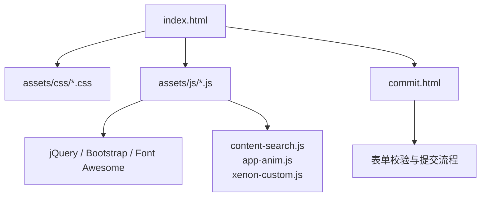
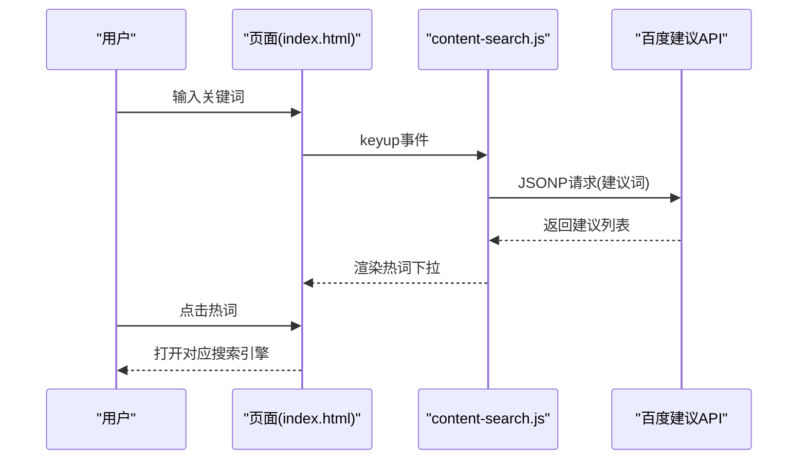
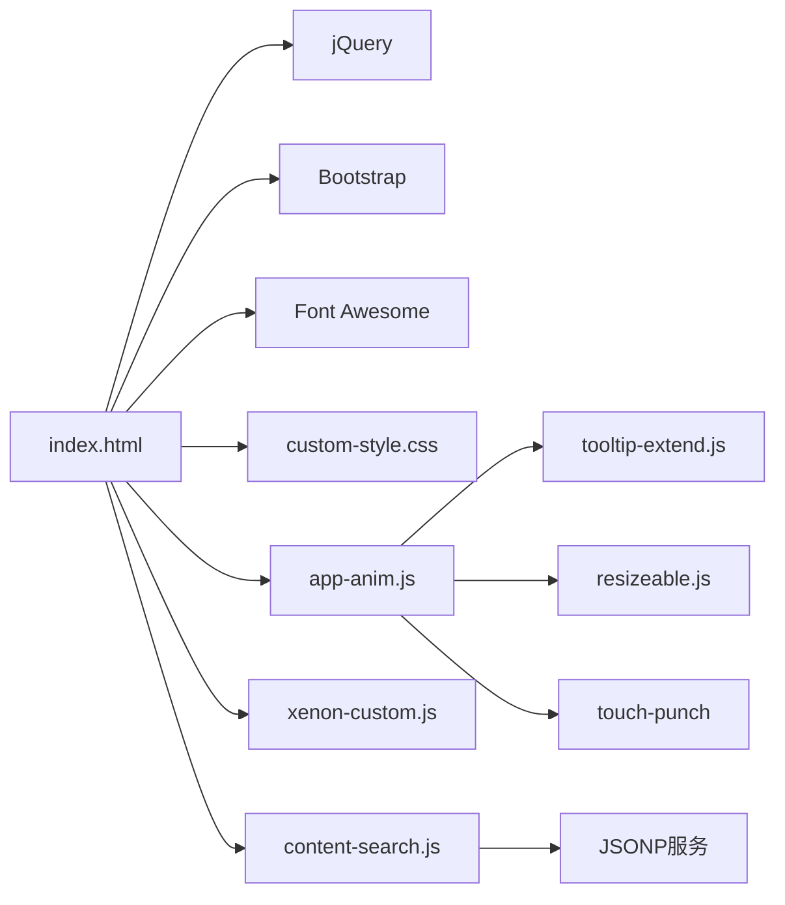

# 测试与调试

<cite>
**本文引用的文件**
- [index.html](file://index.html)
- [commit.html](file://commit.html)
- [README.md](file://README.md)
- [assets/js/app-anim.js](file://assets/js/app-anim.js)
- [assets/js/xenon-custom.js](file://assets/js/xenon-custom.js)
- [assets/js/content-search.js](file://assets/js/content-search.js)
- [assets/js/resizeable.js](file://assets/js/resizeable.js)
- [assets/js/tooltip-extend.js](file://assets/js/tooltip-extend.js)
- [assets/js/jquery.ui.touch-punch.min-0.2.2.js](file://assets/js/jquery.ui.touch-punch.min-0.2.2.js)
- [assets/css/custom-style.css](file://assets/css/custom-style.css)
</cite>

## 目录
1. [简介](#简介)
2. [项目结构](#项目结构)
3. [核心组件](#核心组件)
4. [架构总览](#架构总览)
5. [详细组件分析](#详细组件分析)
6. [依赖关系分析](#依赖关系分析)
7. [性能考虑](#性能考虑)
8. [故障排查指南](#故障排查指南)
9. [结论](#结论)
10. [附录](#附录)

## 简介
本文件面向“在线网址导航”项目的测试与调试，覆盖浏览器兼容性测试、移动端适配测试、调试工具与技巧、单元与集成测试方案、性能与压力测试方法，并提供可操作的用例与排错清单。内容基于仓库中的实际代码结构与实现进行归纳与扩展，确保建议与现有实现一致且可落地。

## 项目结构
本项目为纯静态站点，主要入口为 index.html，提交页为 commit.html；交互逻辑集中在 assets/js 下的多个脚本；样式在 assets/css 下；图标与第三方库位于 assets/fontawesome-5.15.4 等目录。页面通过 Bootstrap 4、jQuery、Font Awesome 等构建响应式界面，并通过自定义脚本实现搜索建议、侧边栏、夜间模式、粘性布局等功能。

图表来源
- [index.html:1-35](file://index.html#L1-L35)
- [commit.html:1-25](file://commit.html#L1-L25)

章节来源
- [README.md:298-314](file://README.md#L298-L314)
- [index.html:1-35](file://index.html#L1-L35)

## 核心组件
- 首页与导航：index.html 提供分类导航、搜索框、天气插件、外链卡片等。
- 搜索建议：content-search.js 调用百度建议接口，展示热词下拉并支持点击跳转。
- 交互与动画：app-anim.js 负责侧边栏、夜间模式、滚动行为、AJAX 加载、拖拽排序等。
- 主题与通用UI：xenon-custom.js 提供滚动条、日期选择器、表单验证、向导等通用能力。
- 响应式与断点：resizeable.js、tooltip-extend.js 提供断点检测与触发事件。
- 移动端触摸兼容：jquery.ui.touch-punch.min-0.2.2.js 将触摸事件转换为鼠标事件以兼容 jQuery UI。
- 样式定制：custom-style.css 调整字体、导航宽度、搜索热词样式等。

章节来源
- [assets/js/content-search.js:1-91](file://assets/js/content-search.js#L1-L91)
- [assets/js/app-anim.js:1-120](file://assets/js/app-anim.js#L1-L120)
- [assets/js/xenon-custom.js:1-120](file://assets/js/xenon-custom.js#L1-L120)
- [assets/js/resizeable.js:86-122](file://assets/js/resizeable.js#L86-L122)
- [assets/js/tooltip-extend.js:57-86](file://assets/js/tooltip-extend.js#L57-L86)
- [assets/js/jquery.ui.touch-punch.min-0.2.2.js:1-11](file://assets/js/jquery.ui.touch-punch.min-0.2.2.js#L1-L11)
- [assets/css/custom-style.css:1-126](file://assets/css/custom-style.css#L1-L126)

## 架构总览
页面加载后，jQuery 就绪，初始化搜索建议、侧边栏、粘性页脚、提示框、滑块等。用户交互（如搜索、切换主题、点击链接）会触发 AJAX 请求或本地状态更新。移动端通过 touch-punch 将触摸事件映射为鼠标事件，保证 jQuery UI 功能可用。

图表来源
- [index.html:335-355](file://index.html#L335-L355)
- [assets/js/content-search.js:1-91](file://assets/js/content-search.js#L1-L91)

## 详细组件分析

### 浏览器兼容性测试策略
- 目标浏览器
  - Chrome/Edge（最新两个版本）
  - Firefox（最新两个版本）
  - Safari（macOS/iOS 最新两个版本）
  - IE11（仅做降级验证，若需支持）
- 兼容性检测要点
  - 视口与缩放：viewport 设置是否生效，最小/最大缩放限制是否符合预期。
  - CSS 特性：Flexbox、Grid、渐变、阴影、圆角等在目标浏览器表现一致。
  - JS API：fetch、Promise、localStorage、MutationObserver、performance 等可用性。
  - 第三方库：Bootstrap 4、jQuery、Font Awesome 的兼容层与 polyfill。
- 降级方案
  - 使用 jQuery 封装 AJAX，降低 fetch 差异影响。
  - 使用 touch-punch 将触摸事件转为鼠标事件，兼容 jQuery UI。
  - 对不支持的特性提供回退样式或禁用相关交互。
- 自动化与工具
  - 使用 BrowserStack/Sauce Labs 进行多端真机/虚拟机测试。
  - 使用 Lighthouse 进行性能与可访问性基线检查。
  - 使用 caniuse.com 核对 CSS/JS 特性支持度。

章节来源
- [assets/js/jquery.ui.touch-punch.min-0.2.2.js:1-11](file://assets/js/jquery.ui.touch-punch.min-0.2.2.js#L1-L11)
- [assets/fontawesome-5.15.4/js/conflict-detection.js:668-687](file://assets/fontawesome-5.15.4/js/conflict-detection.js#L668-L687)
- [assets/fontawesome-5.15.4/js/fontawesome.js:138-163](file://assets/fontawesome-5.15.4/js/fontawesome.js#L138-L163)

### 移动端适配测试
- 响应式断点
  - 使用 resizeable.js 与 tooltip-extend.js 提供的断点检测函数，监听窗口尺寸变化并触发相应逻辑。
  - 重点验证 xs/s/md/large 等断点的布局切换、菜单折叠、侧边栏行为。
- 触摸交互验证
  - 使用 touch-punch 确保 jQuery UI 的拖拽、滑动等交互在移动端可用。
  - 验证手势（点击、长按、滑动）在不同设备上的体验一致性。
- 性能基准
  - 首屏加载时间、资源体积、图片懒加载效果。
  - 滚动流畅度、重绘重排次数、内存占用。
- 测试用例示例
  - 断点切换：从桌面到平板再到手机，逐项检查导航、卡片网格、搜索框布局。
  - 触摸操作：在移动端尝试拖拽排序、展开二级菜单、关闭弹窗。
  - 性能测量：使用 Performance 面板记录关键指标（FCP、LCP、TBT）。

章节来源
- [assets/js/resizeable.js:86-122](file://assets/js/resizeable.js#L86-L122)
- [assets/js/tooltip-extend.js:57-86](file://assets/js/tooltip-extend.js#L57-L86)
- [assets/js/jquery.ui.touch-punch.min-0.2.2.js:1-11](file://assets/js/jquery.ui.touch-punch.min-0.2.2.js#L1-L11)
- [assets/js/app-anim.js:318-407](file://assets/js/app-anim.js#L318-L407)

### 调试工具与技巧
- Chrome DevTools
  - Elements：检查 DOM 结构、CSS 规则、响应式断点。
  - Console：查看错误日志、执行表达式、模拟网络条件。
  - Network：监控请求/响应、缓存命中、资源大小与耗时。
  - Performance：录制性能快照，分析长任务、主线程阻塞。
  - Memory：堆快照、Allocation instrumentation on JS allocation，定位内存泄漏。
- JavaScript 调试
  - 使用断点、条件断点、异步栈跟踪定位问题。
  - 利用 console.table、console.time/timeEnd 统计耗时。
- 网络请求调试
  - 针对 content-search.js 的 JSONP 请求，检查跨域、回调参数、错误分支。
  - 针对 app-anim.js 的 AJAX 请求，检查 URL、数据格式、成功/失败回调。
- 常见陷阱
  - 第三方脚本冲突：Font Awesome 冲突检测脚本会在 iframe 中运行诊断，注意隔离环境。
  - 事件冒泡与阻止默认行为：搜索热词点击时避免重复提交。

章节来源
- [assets/js/content-search.js:1-91](file://assets/js/content-search.js#L1-L91)
- [assets/js/app-anim.js:432-510](file://assets/js/app-anim.js#L432-L510)
- [assets/fontawesome-5.15.4/js/conflict-detection.js:668-687](file://assets/fontawesome-5.15.4/js/conflict-detection.js#L668-L687)

### 单元测试与集成测试方案
- 测试框架选择
  - 单元测试：Jest 或 Mocha + Chai，适合独立函数与模块验证。
  - 端到端测试：Cypress 或 Playwright，模拟用户操作与页面交互。
- 测试范围
  - 搜索建议：输入关键词，验证热词列表渲染与点击跳转。
  - 主题切换：点击夜间模式按钮，验证 body 类名与图标切换。
  - 侧边栏：断点切换时菜单展开/收起、最小化模式行为。
  - 表单提交：commit.html 的字段校验、提交反馈。
- 自动化测试
  - CI 流水线集成：GitHub Actions 或 Vercel Preview，每次提交自动运行测试。
  - 截图对比：对关键页面在不同断点进行视觉回归测试。
- 用例示例
  - 搜索热词：输入“工具”，断言热词列表非空且包含至少一项。
  - 主题切换：点击夜间模式，断言 body 包含 io-black-mode 类。
  - 移动端菜单：缩小窗口至 xs 断点，断言侧边栏折叠且可展开。

章节来源
- [assets/js/content-search.js:1-91](file://assets/js/content-search.js#L1-L91)
- [assets/js/app-anim.js:201-237](file://assets/js/app-anim.js#L201-L237)
- [assets/js/app-anim.js:318-407](file://assets/js/app-anim.js#L318-L407)
- [commit.html:178-200](file://commit.html#L178-L200)

### 性能测试与压力测试
- 加载时间测试
  - 使用 Lighthouse 评估 FCP、LCP、CLS、TBT 等指标。
  - 优化资源：压缩图片、启用 gzip/br、缓存静态资源。
- 内存泄漏检测
  - 使用 Memory 面板进行堆快照对比，关注未释放的事件监听器、闭包引用。
  - 检查 AJAX 回调中是否存在全局变量累积。
- 并发请求测试
  - 模拟多用户同时提交表单（commit.html），观察服务端或前端队列处理。
  - 使用 k6 或 Artillery 发起并发请求，评估前端资源与后端接口负载。
- 优化建议
  - 图片懒加载：lozad.js 已引入，确保 lazy 属性正确配置。
  - 减少重排：批量更新 DOM、避免频繁读取布局属性。
  - 防抖节流：窗口 resize 与搜索输入使用节流，降低计算开销。

章节来源
- [assets/js/app-anim.js:36-45](file://assets/js/app-anim.js#L36-L45)
- [assets/js/content-search.js:1-91](file://assets/js/content-search.js#L1-L91)
- [README.md:96-116](file://README.md#L96-L116)

## 依赖关系分析
- 页面依赖
  - index.html 引入 Bootstrap、jQuery、Font Awesome、自定义样式与脚本。
  - commit.html 复用相同资源，增加表单样式与交互。
- 脚本依赖
  - content-search.js 依赖 jQuery 与外部 JSONP 服务。
  - app-anim.js 依赖 jQuery、jQuery UI、第三方插件（theiaStickySidebar、fancybox）。
  - xenon-custom.js 提供通用 UI 能力，被其他脚本间接使用。
  - resizeable.js、tooltip-extend.js 提供断点检测与事件触发。
  - touch-punch 桥接触摸与鼠标事件，保障 jQuery UI 在移动端可用。
- 样式依赖
  - custom-style.css 覆盖默认样式，统一视觉风格。

图表来源
- [index.html:17-31](file://index.html#L17-L31)
- [assets/js/app-anim.js:1-25](file://assets/js/app-anim.js#L1-L25)
- [assets/js/content-search.js:1-20](file://assets/js/content-search.js#L1-L20)

章节来源
- [index.html:17-31](file://index.html#L17-L31)
- [assets/js/app-anim.js:1-25](file://assets/js/app-anim.js#L1-L25)
- [assets/js/content-search.js:1-20](file://assets/js/content-search.js#L1-L20)

## 性能考虑
- 资源加载
  - 静态资源缓存：Nginx 配置中对静态资源设置长期缓存与压缩。
  - 按需加载：图片懒加载、第三方脚本延迟加载。
- 运行时优化
  - 事件节流：窗口 resize 与搜索输入使用节流，避免频繁计算。
  - DOM 操作：批量更新、避免在循环中频繁读写布局属性。
- 监控与度量
  - 使用 performance.mark/measure 标记关键阶段。
  - 定期运行 Lighthouse 报告，跟踪趋势变化。

章节来源
- [README.md:96-116](file://README.md#L96-L116)
- [assets/js/app-anim.js:36-45](file://assets/js/app-anim.js#L36-L45)
- [assets/fontawesome-5.15.4/js/fontawesome.js:138-163](file://assets/fontawesome-5.15.4/js/fontawesome.js#L138-L163)

## 故障排查指南
- 常见问题
  - 图片或样式加载失败：检查路径、相对路径是否正确，CDN 是否可达。
  - 搜索建议不显示：确认 JSONP 回调参数、网络请求是否成功、错误分支是否隐藏列表。
  - 移动端拖拽无效：确认 touch-punch 已加载，jQuery UI 是否初始化。
  - 主题切换异常：检查 body 类名切换逻辑、图标类名更新。
- 调试步骤
  - 打开控制台查看错误信息，定位具体脚本与行号。
  - 使用 Network 面板检查请求状态码、响应体、缓存情况。
  - 使用 Performance 面板录制关键操作，分析长任务与阻塞。
  - 使用 Memory 面板进行堆快照对比，查找未释放对象。
- 修复建议
  - 为外部依赖添加 fallback 与错误处理。
  - 对敏感操作（如提交表单）增加重试与用户提示。
  - 对第三方脚本冲突，使用沙箱或隔离环境运行。

章节来源
- [assets/js/content-search.js:67-72](file://assets/js/content-search.js#L67-L72)
- [assets/js/app-anim.js:201-237](file://assets/js/app-anim.js#L201-L237)
- [assets/js/app-anim.js:432-510](file://assets/js/app-anim.js#L432-L510)
- [assets/js/jquery.ui.touch-punch.min-0.2.2.js:1-11](file://assets/js/jquery.ui.touch-punch.min-0.2.2.js#L1-L11)

## 结论
本项目采用纯静态架构，结合 jQuery、Bootstrap 与自定义脚本实现丰富的交互与响应式体验。测试与调试应围绕浏览器兼容性、移动端适配、性能优化与自动化测试展开。通过合理的断点检测、触摸兼容、资源缓存与监控手段，可确保在多端多浏览器环境下获得稳定一致的体验。建议在 CI 中集成自动化测试与性能基线检查，持续改进质量。

## 附录
- 快速开始与部署参考：README 中提供了本地预览与多种部署方式，便于搭建测试环境。
- 常用命令
  - 本地预览：python -m http.server 8000 或 npx http-server -p 8000。
  - 性能审计：Lighthouse CLI 或 Chrome DevTools。
  - 并发测试：k6 或 Artillery 脚本编写与执行。

章节来源
- [README.md:22-44](file://README.md#L22-L44)
- [README.md:45-147](file://README.md#L45-L147)