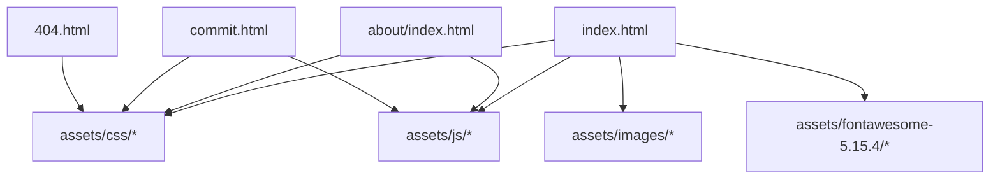
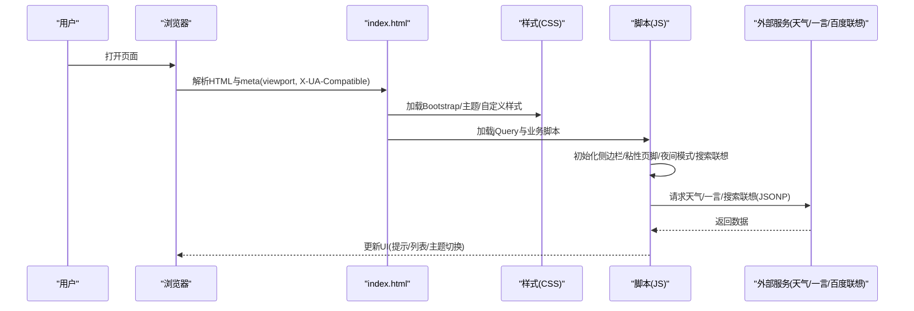
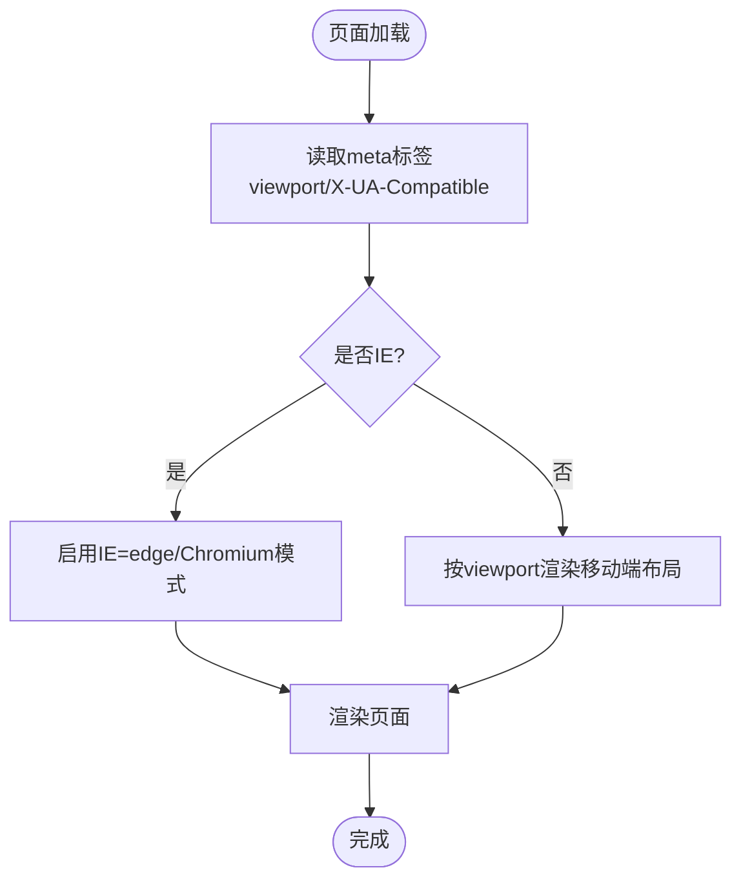
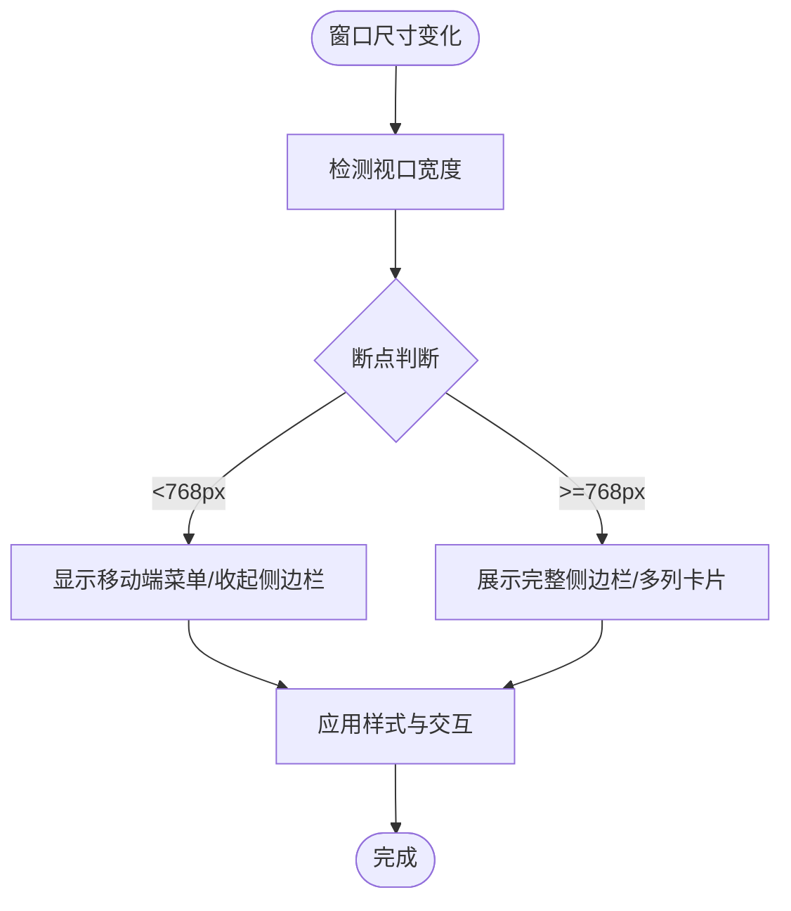
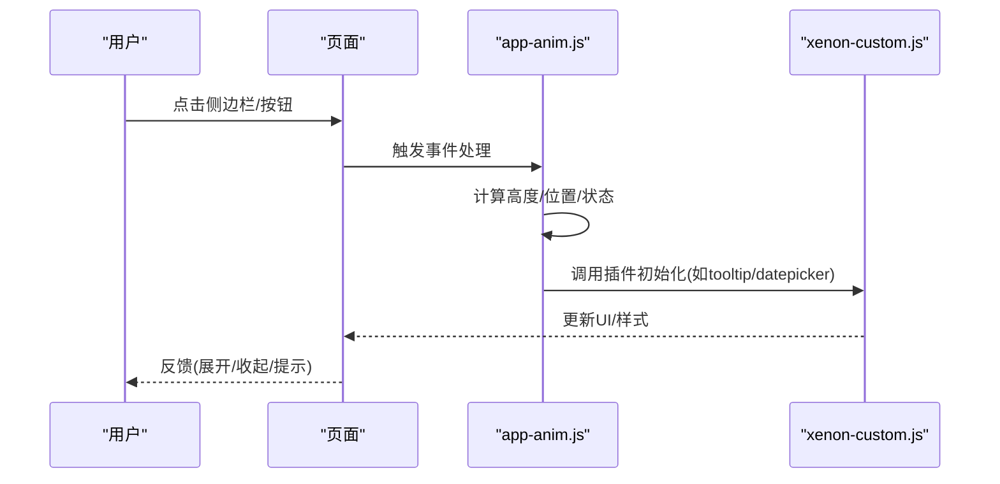
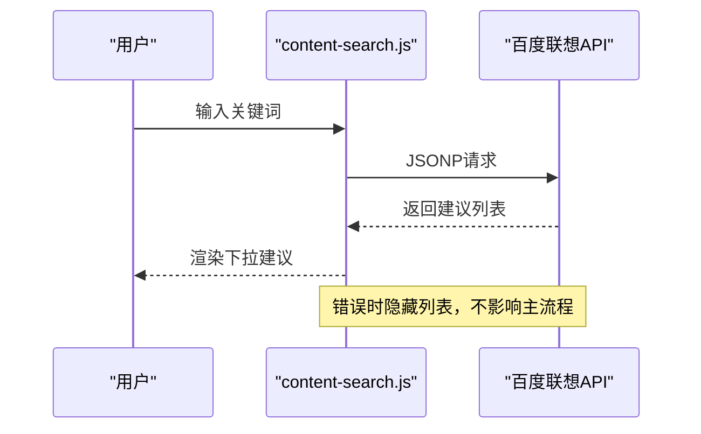
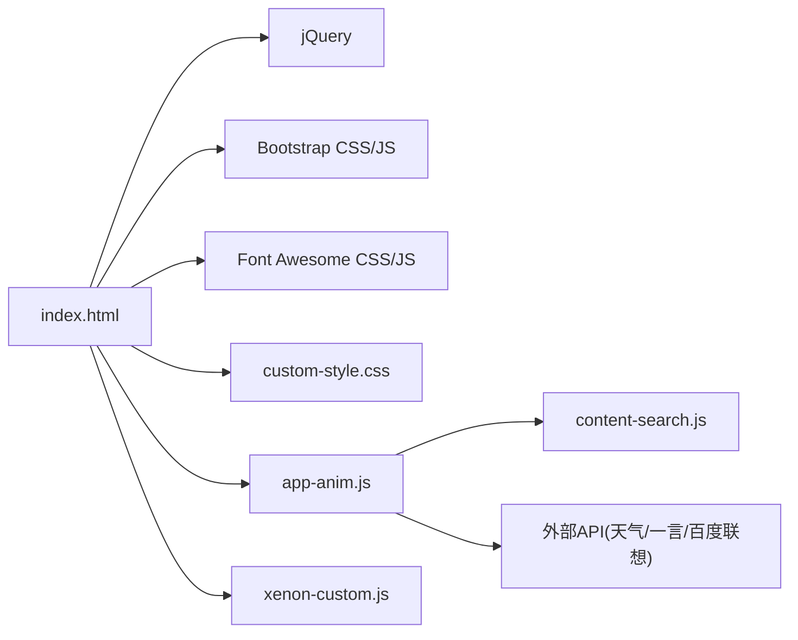

# 浏览器兼容性测试

<cite>
**本文引用的文件**
- [index.html](file://index.html)
- [about/index.html](file://about/index.html)
- [commit.html](file://commit.html)
- [404.html](file://404.html)
- [assets/css/custom-style.css](file://assets/css/custom-style.css)
- [assets/js/app-anim.js](file://assets/js/app-anim.js)
- [assets/js/xenon-custom.js](file://assets/js/xenon-custom.js)
- [assets/js/content-search.js](file://assets/js/content-search.js)
- [assets/fontawesome-5.15.4/js/conflict-detection.js](file://assets/fontawesome-5.15.4/js/conflict-detection.js)
- [assets/fontawesome-5.15.4/js/v4-shims.js](file://assets/fontawesome-5.15.4/js/v4-shims.js)
- [assets/fontawesome-5.15.4/js/fontawesome.js](file://assets/fontawesome-5.15.4/js/fontawesome.js)
</cite>

## 目录
1. [简介](#简介)
2. [项目结构](#项目结构)
3. [核心组件](#核心组件)
4. [架构总览](#架构总览)
5. [详细组件分析](#详细组件分析)
6. [依赖关系分析](#依赖关系分析)
7. [性能考量](#性能考量)
8. [故障排查指南](#故障排查指南)
9. [结论](#结论)
10. [附录](#附录)

## 简介
本文件面向“在线网址导航”项目的浏览器兼容性测试与降级方案，覆盖主流桌面与移动端浏览器（Chrome、Firefox、Safari、Edge、IE）的兼容现状、CSS/JS特性支持、响应式适配策略，以及基于现有代码实现的降级机制（如特性检测、条件加载、第三方库内置兼容）。同时提供本地与在线测试环境的搭建建议、典型用例与最佳实践，帮助在开发与发布前系统化验证跨浏览器表现。

## 项目结构
本项目为纯静态站点，主要资源位于 assets 目录：
- CSS：主题样式、自定义样式、图标字体等
- JS：交互逻辑、动画、搜索、第三方插件封装等
- HTML：入口页面、关于页、提交页、404 页



图表来源
- [index.html:1-35](file://index.html#L1-L35)
- [about/index.html:1-20](file://about/index.html#L1-L20)
- [commit.html:1-20](file://commit.html#L1-L20)
- [404.html:1-3](file://404.html#L1-L3)

章节来源
- [index.html:1-35](file://index.html#L1-L35)
- [README.md:298-314](file://README.md#L298-L314)

## 核心组件
- 页面元信息与渲染模式
  - 使用 viewport 控制移动端缩放与布局宽度
  - 使用 X-UA-Compatible 指定 IE 渲染模式
- 样式层
  - Bootstrap 栅格与基础样式
  - 自定义主题与图标字体
  - 网格背景、滚动条隐藏等细节优化
- 脚本层
  - jQuery 驱动的事件绑定与 DOM 操作
  - 侧边栏伸缩、粘性页脚、夜间模式切换、搜索联想等
  - 第三方插件初始化（轮播、日期选择、颜色选择器等）
- 外部服务
  - 天气小部件、一言 API、百度搜索联想（JSONP）

章节来源
- [index.html:7-31](file://index.html#L7-L31)
- [assets/css/custom-style.css:1-126](file://assets/css/custom-style.css#L1-L126)
- [assets/js/app-anim.js:1-120](file://assets/js/app-anim.js#L1-L120)
- [assets/js/xenon-custom.js:1-120](file://assets/js/xenon-custom.js#L1-L120)
- [assets/js/content-search.js:1-91](file://assets/js/content-search.js#L1-L91)

## 架构总览
整体采用“HTML + CSS + jQuery + 第三方插件”的轻量前端架构，通过条件判断与特性检测实现渐进增强与降级。



图表来源
- [index.html:7-31](file://index.html#L7-L31)
- [assets/js/app-anim.js:1-25](file://assets/js/app-anim.js#L1-L25)
- [assets/js/content-search.js:1-91](file://assets/js/content-search.js#L1-L91)

## 详细组件分析

### 1) 页面元信息与IE兼容
- 使用 meta http-equiv="X-UA-Compatible" content="IE=edge, chrome=1" 强制IE使用最新引擎或Chromium内核
- 使用 viewport 设置移动端缩放与禁止用户缩放，确保响应式布局一致



图表来源
- [index.html:7-10](file://index.html#L7-L10)
- [about/index.html:6-9](file://about/index.html#L6-L9)
- [commit.html:6-9](file://commit.html#L6-L9)

章节来源
- [index.html:7-10](file://index.html#L7-L10)
- [about/index.html:6-9](file://about/index.html#L6-L9)
- [commit.html:6-9](file://commit.html#L6-L9)

### 2) 响应式布局与移动端适配
- 基于 Bootstrap 栅格系统，通过不同断点类名实现多列布局
- 自定义样式中针对移动端滚动条、搜索热词下拉、头部导航等进行微调
- 侧边栏在小屏下自动收起/展开，避免遮挡内容



图表来源
- [assets/js/app-anim.js:318-348](file://assets/js/app-anim.js#L318-L348)
- [assets/css/custom-style.css:1-126](file://assets/css/custom-style.css#L1-L126)

章节来源
- [assets/js/app-anim.js:318-348](file://assets/js/app-anim.js#L318-L348)
- [assets/css/custom-style.css:1-126](file://assets/css/custom-style.css#L1-L126)

### 3) 交互与动画（jQuery + 第三方插件）
- 侧边栏伸缩、二级菜单悬浮、粘性页脚、夜间模式切换
- 图片懒加载、Fancybox 灯箱、Tooltip 提示
- 表单校验、日期/时间选择器、颜色选择器等按需初始化



图表来源
- [assets/js/app-anim.js:1-120](file://assets/js/app-anim.js#L1-L120)
- [assets/js/xenon-custom.js:1-120](file://assets/js/xenon-custom.js#L1-L120)

章节来源
- [assets/js/app-anim.js:1-120](file://assets/js/app-anim.js#L1-L120)
- [assets/js/xenon-custom.js:1-120](file://assets/js/xenon-custom.js#L1-L120)

### 4) 搜索联想与外部API
- 使用 JSONP 调用百度搜索联想接口，兼容旧版浏览器的跨域限制
- 失败时隐藏建议列表，保证基本可用性



图表来源
- [assets/js/content-search.js:1-91](file://assets/js/content-search.js#L1-L91)

章节来源
- [assets/js/content-search.js:1-91](file://assets/js/content-search.js#L1-L91)

### 5) 第三方库的兼容与降级
- Font Awesome 冲突检测与 v4 shims：内置 UA 检测与 IE 识别，提供向后兼容
- 安全捕获 window/document/MutationObserver/performance 等全局对象，避免在非浏览器环境报错
- 通过 try/catch 包裹关键特性访问，提升鲁棒性

```mermaid
classDiagram
class FA_ConflictDetection {
+IS_BROWSER
+IS_DOM
+IS_IE
+bunker(fn)
}
class FA_Shims {
+shims[]
+hooks[]
+styles{}
}
class FA_Core {
+MUTATION_OBSERVER
+PERFORMANCE
+window/document检测
}
FA_ConflictDetection --> FA_Core : "共用UA/环境检测"
FA_Shims --> FA_Core : "兼容v4 API"
```

图表来源
- [assets/fontawesome-5.15.4/js/conflict-detection.js:45-92](file://assets/fontawesome-5.15.4/js/conflict-detection.js#L45-L92)
- [assets/fontawesome-5.15.4/js/v4-shims.js:38-53](file://assets/fontawesome-5.15.4/js/v4-shims.js#L38-L53)
- [assets/fontawesome-5.15.4/js/fontawesome.js:138-163](file://assets/fontawesome-5.15.4/js/fontawesome.js#L138-L163)

章节来源
- [assets/fontawesome-5.15.4/js/conflict-detection.js:45-92](file://assets/fontawesome-5.15.4/js/conflict-detection.js#L45-L92)
- [assets/fontawesome-5.15.4/js/v4-shims.js:38-53](file://assets/fontawesome-5.15.4/js/v4-shims.js#L38-L53)
- [assets/fontawesome-5.15.4/js/fontawesome.js:138-163](file://assets/fontawesome-5.15.4/js/fontawesome.js#L138-L163)

## 依赖关系分析
- 页面依赖 jQuery、Bootstrap、Font Awesome、自定义样式与脚本
- 脚本之间通过 jQuery 事件总线与插件方法协作
- 外部服务以异步方式注入内容，失败不阻塞主流程



图表来源
- [index.html:17-31](file://index.html#L17-L31)
- [assets/js/app-anim.js:1-25](file://assets/js/app-anim.js#L1-L25)
- [assets/js/content-search.js:1-91](file://assets/js/content-search.js#L1-L91)

章节来源
- [index.html:17-31](file://index.html#L17-L31)
- [assets/js/app-anim.js:1-25](file://assets/js/app-anim.js#L1-L25)
- [assets/js/content-search.js:1-91](file://assets/js/content-search.js#L1-L91)

## 性能考量
- 首屏资源：仅引入必要样式与脚本，减少阻塞
- 动画与交互：使用节流/防抖（如窗口 resize 延迟执行），避免频繁重排
- 网络请求：外部 API 失败静默降级，不影响核心功能
- 缓存策略：静态资源可配置强缓存（部署层面）

[本节为通用指导，无需具体文件引用]

## 故障排查指南
- 页面空白或样式错乱
  - 检查 meta viewport 与 X-UA-Compatible 是否正确设置
  - 确认 CSS/JS 路径与加载顺序
- 搜索联想不显示
  - 检查 JSONP 回调与网络请求是否成功
  - 查看控制台是否有跨域或语法错误
- 第三方插件未生效
  - 确认插件已正确引入并初始化
  - 检查是否存在命名冲突或版本不匹配
- 404 页面
  - 确认路由与静态资源路径

章节来源
- [index.html:7-31](file://index.html#L7-L31)
- [assets/js/content-search.js:1-91](file://assets/js/content-search.js#L1-L91)
- [404.html:1-3](file://404.html#L1-L3)

## 结论
本项目通过合理的元信息设置、响应式布局、jQuery 驱动的交互与第三方库的内置兼容能力，实现了较好的跨浏览器体验。对于现代浏览器，功能完整；对于旧版 IE，通过 X-UA-Compatible 与第三方库的兼容层获得基本可用。建议在持续迭代中：
- 逐步引入特性检测与 polyfill，对缺失 API 进行补齐
- 建立自动化跨浏览器测试流程（本地+云端）
- 关注移动端手势与触摸事件的差异，完善交互体验

[本节为总结性内容，无需具体文件引用]

## 附录

### 兼容性测试方法与工具
- 本地测试
  - 使用 Chrome/Firefox/Safari/Edge 开发者工具的设备模拟，验证响应式与交互
  - 使用 IE 虚拟机或 Microsoft Edge 的 IE 模式，验证 X-UA-Compatible 效果
- 在线平台
  - BrowserStack、Sauce Labs、CrossBrowserTesting：覆盖真实设备与浏览器矩阵
  - 结合 Lighthouse、WebPageTest 评估性能与可访问性
- 自动化
  - 使用 Selenium/Puppeteer/Cypress 编写回归用例，覆盖关键流程（搜索、导航、主题切换）

[本节为通用指导，无需具体文件引用]

### 典型兼容性用例与最佳实践
- 搜索联想
  - 使用 JSONP 兼容旧浏览器跨域；失败时隐藏建议列表
  - 建议增加超时与重试机制，提升稳定性
- 夜间模式
  - 通过切换 body 类名实现主题切换；注意样式优先级与变量一致性
- 侧边栏与粘性页脚
  - 监听窗口尺寸变化，动态调整布局；避免在低端设备上过度计算
- 外部 API
  - 统一错误处理与降级策略；记录日志便于定位问题
- 移动端特殊处理
  - 禁用用户缩放，避免误触放大；优化触摸区域大小
  - 使用 touchstart/touchend 替代 click，降低延迟

[本节为通用指导，无需具体文件引用]