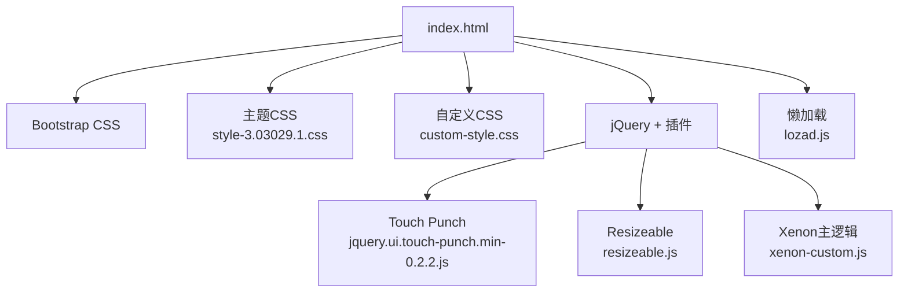
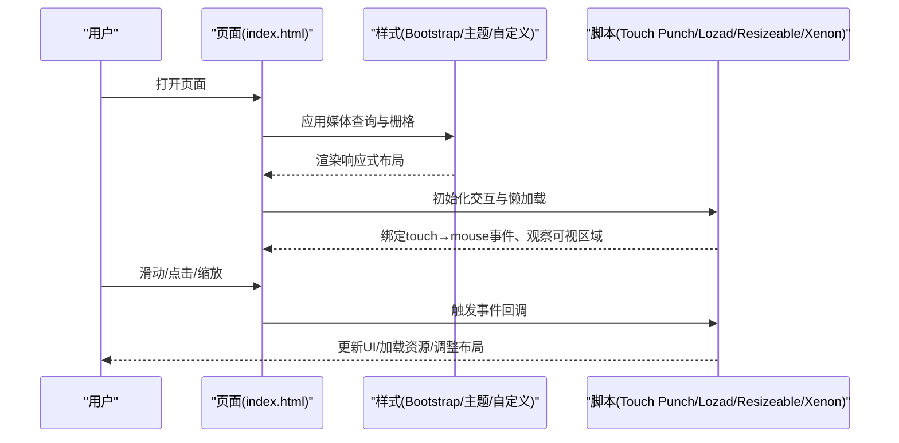
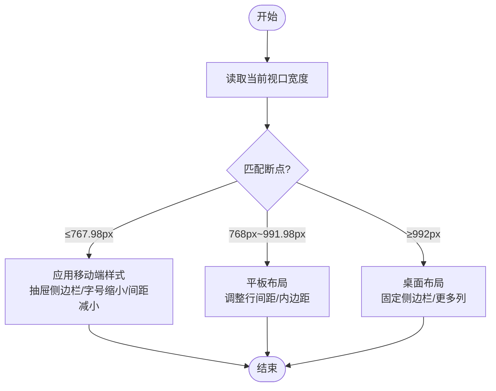
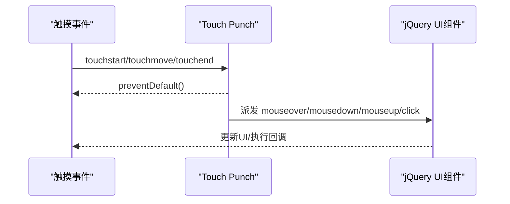
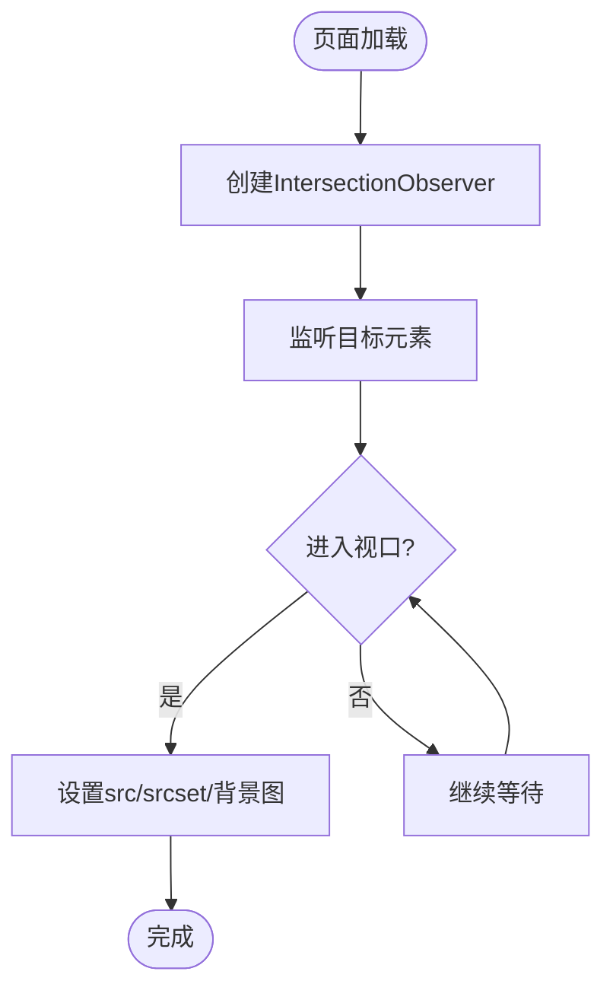
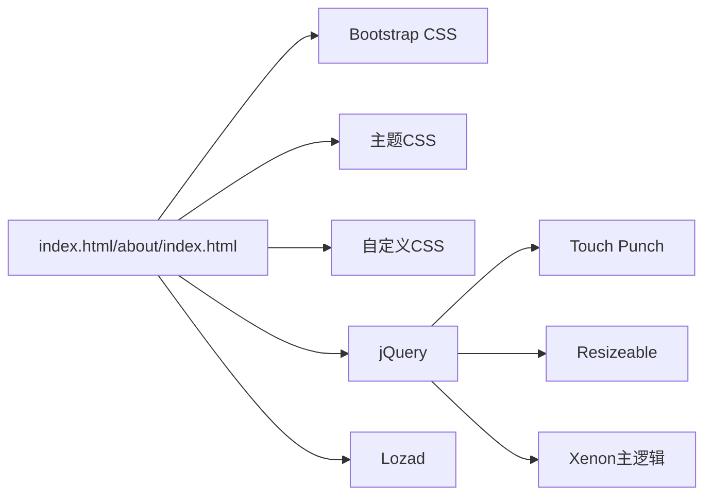

# 移动端适配测试

<cite>
**本文引用的文件**
- [index.html](file://index.html)
- [about/index.html](file://about/index.html)
- [assets/css/bootstrap.min-4.3.1.css](file://assets/css/bootstrap.min-4.3.1.css)
- [assets/css/style-3.03029.1.css](file://assets/css/style-3.03029.1.css)
- [assets/css/custom-style.css](file://assets/css/custom-style.css)
- [assets/js/jquery.ui.touch-punch.min-0.2.2.js](file://assets/js/jquery.ui.touch-punch.min-0.2.2.js)
- [assets/js/lozad.js](file://assets/js/lozad.js)
- [assets/js/resizeable.js](file://assets/js/resizeable.js)
- [assets/js/xenon-custom.js](file://assets/js/xenon-custom.js)
- [README.md](file://README.md)
</cite>

## 目录
1. [简介](#简介)
2. [项目结构](#项目结构)
3. [核心组件](#核心组件)
4. [架构总览](#架构总览)
5. [详细组件分析](#详细组件分析)
6. [依赖关系分析](#依赖关系分析)
7. [性能考量](#性能考量)
8. [故障排查指南](#故障排查指南)
9. [结论](#结论)
10. [附录](#附录)

## 简介
本文件面向“在线网址导航”项目的移动端适配与测试，系统性地梳理响应式断点、Bootstrap栅格适配、触摸交互验证、性能基准测试方法以及常用工具与兼容性方案。文档基于仓库中的HTML/CSS/JS实现进行说明，并提供可操作的测试步骤与检查清单，帮助在真实设备与模拟器中完成端到端的适配验证。

## 项目结构
- 入口页面：index.html（首页）、about/index.html（关于页）
- 样式层：Bootstrap 4.3.1、主题样式 style-3.03029.1.css、自定义样式 custom-style.css
- 脚本层：jQuery UI Touch Punch（触摸转鼠标事件）、Lozad（懒加载）、Resizeable（断点检测）、Xenon主逻辑等
- 资源层：图片、图标字体、第三方库

图表来源
- [index.html:1-35](file://index.html#L1-L35)
- [assets/css/bootstrap.min-4.3.1.css](file://assets/css/bootstrap.min-4.3.1.css)
- [assets/css/style-3.03029.1.css:150-163](file://assets/css/style-3.03029.1.css#L150-L163)
- [assets/js/jquery.ui.touch-punch.min-0.2.2.js:1-11](file://assets/js/jquery.ui.touch-punch.min-0.2.2.js#L1-L11)
- [assets/js/lozad.js:117-168](file://assets/js/lozad.js#L117-L168)
- [assets/js/resizeable.js:7-17](file://assets/js/resizeable.js#L7-L17)
- [assets/js/xenon-custom.js:13-64](file://assets/js/xenon-custom.js#L13-L64)

章节来源
- [index.html:1-35](file://index.html#L1-L35)
- [README.md:298-314](file://README.md#L298-L314)

## 核心组件
- 视口与缩放控制：通过 viewport meta 设置 width=device-width、initial-scale=1.0、maximum-scale=1.0、user-scalable=no，确保移动端布局稳定且禁止用户缩放，避免误触放大导致的布局错乱。
- Bootstrap栅格：使用 col-6、col-sm-6、col-md-4、col-xl-5a、col-xxl-6a 等类名在不同断点下控制卡片列数与间距，形成从手机到超宽屏的自适应网格。
- 主题响应式：style-3.03029.1.css 定义了多档媒体查询（如 768px、992px、1200px、1400px、1680px），调整侧边栏、头部、内容区宽度与内边距；并在小屏隐藏部分元素或切换为抽屉式侧边栏。
- 触摸交互：通过 jquery.ui.touch-punch.min-0.2.2.js 将 touchstart/touchmove/touchend 转换为 mouseover/mousedown/mouseup/click 等事件，使 jQuery UI 组件在移动端可用。
- 懒加载：lozad.js 利用 IntersectionObserver 监听元素进入视口后再加载图片/背景图，降低首屏带宽与内存占用，提升滚动流畅度。
- 断点检测：resizeable.js 定义 breakpoints（largescreen/tabletscreen/devicescreen/sdevicescreen），在窗口尺寸变化时触发统一处理逻辑，便于按设备类型执行差异化逻辑。

章节来源
- [index.html:7-11](file://index.html#L7-L11)
- [index.html:590-623](file://index.html#L590-L623)
- [assets/css/style-3.03029.1.css:143-163](file://assets/css/style-3.03029.1.css#L143-L163)
- [assets/css/style-3.03029.1.css:340-399](file://assets/css/style-3.03029.1.css#L340-L399)
- [assets/js/jquery.ui.touch-punch.min-0.2.2.js:1-11](file://assets/js/jquery.ui.touch-punch.min-0.2.2.js#L1-L11)
- [assets/js/lozad.js:117-168](file://assets/js/lozad.js#L117-L168)
- [assets/js/resizeable.js:7-17](file://assets/js/resizeable.js#L7-L17)

## 架构总览
下图展示移动端适配的关键路径：页面加载后，CSS媒体查询与Bootstrap栅格决定布局；JS负责触摸事件转换、懒加载与断点响应；主题样式在小屏切换为抽屉式侧边栏并优化字号与间距。

图表来源
- [index.html:1-35](file://index.html#L1-L35)
- [assets/css/style-3.03029.1.css:150-163](file://assets/css/style-3.03029.1.css#L150-L163)
- [assets/js/jquery.ui.touch-punch.min-0.2.2.js:1-11](file://assets/js/jquery.ui.touch-punch.min-0.2.2.js#L1-L11)
- [assets/js/lozad.js:117-168](file://assets/js/lozad.js#L117-L168)
- [assets/js/resizeable.js:7-17](file://assets/js/resizeable.js#L7-L17)

## 详细组件分析

### 响应式断点与Bootstrap栅格适配
- 断点策略
  - 主题样式包含多个媒体查询：768px、992px、1200px、1400px、1680px，用于控制内容区最大宽度、内边距、行间距等。
  - 小屏（≤767.98px）启用抽屉式侧边栏，隐藏桌面端菜单项，调整字号与间距以提升可读性与触控体验。
- 栅格使用
  - 卡片容器采用 Bootstrap 栅格类：col-6（手机两列）、col-sm-6（平板两列）、col-md-4（桌面三列）、col-xl-5a、col-xxl-6a（超大屏多列）。
  - 不同断点下自动调整每行列数与间距，保证信息密度与触控目标大小合理。
- 测试要点
  - 在 320px、375px、390px、414px、768px、1024px、1200px、1440px、1920px 等典型宽度下验证布局是否错位、文字是否溢出、按钮是否可点击。
  - 重点检查搜索框、分类标签、卡片列表、侧边栏展开/收起状态。

图表来源
- [assets/css/style-3.03029.1.css:150-163](file://assets/css/style-3.03029.1.css#L150-L163)
- [assets/css/style-3.03029.1.css:340-399](file://assets/css/style-3.03029.1.css#L340-L399)
- [index.html:590-623](file://index.html#L590-L623)

章节来源
- [assets/css/style-3.03029.1.css:143-163](file://assets/css/style-3.03029.1.css#L143-L163)
- [assets/css/style-3.03029.1.css:340-399](file://assets/css/style-3.03029.1.css#L340-L399)
- [index.html:590-623](file://index.html#L590-L623)

### 触摸交互验证
- 实现机制
  - jquery.ui.touch-punch.min-0.2.2.js 将 touchstart/touchmove/touchend 映射为 mouseover/mousedown/mouseup/click 等事件，使 jQuery UI 组件（如拖拽、手风琴、模态等）在移动端正常工作。
  - 注意：该插件会阻止默认行为并派发合成鼠标事件，需确保业务逻辑不重复绑定 touch 事件导致双重触发。
- 测试要点
  - 手势识别：点击、长按、双击、滑动、拖拽是否被正确识别。
  - 点击反馈：按钮高亮、下拉菜单弹出、模态框打开/关闭是否正常。
  - 冲突检测：是否存在 touch 与 mouse 事件同时触发导致的异常。
- 建议用例
  - 在真机与模拟器上分别测试：侧边栏抽屉开关、搜索框输入与提交、卡片点击跳转、弹窗与提示框。

图表来源
- [assets/js/jquery.ui.touch-punch.min-0.2.2.js:1-11](file://assets/js/jquery.ui.touch-punch.min-0.2.2.js#L1-L11)

章节来源
- [assets/js/jquery.ui.touch-punch.min-0.2.2.js:1-11](file://assets/js/jquery.ui.touch-punch.min-0.2.2.js#L1-L11)

### 懒加载与首屏性能
- 实现机制
  - lozad.js 使用 IntersectionObserver 监听元素进入视口，再动态设置 src/srcset/background-image，减少首屏请求与内存占用。
  - 支持 picture/video 与背景图集合，兼容旧浏览器回退到立即加载。
- 测试要点
  - 首屏图片是否按需加载，滚动时是否及时触发加载。
  - 图片占位与加载后的尺寸变化是否引起重排抖动。
  - 在弱网与低端设备上验证加载延迟与卡顿情况。
- 优化建议
  - 合理使用 data-src/data-srcset，避免过早加载非关键资源。
  - 对大图使用合适格式（WebP/AVIF）与尺寸，结合 CDN 缓存。

图表来源
- [assets/js/lozad.js:117-168](file://assets/js/lozad.js#L117-L168)

章节来源
- [assets/js/lozad.js:117-168](file://assets/js/lozad.js#L117-L168)

### 断点检测与差异化逻辑
- 实现机制
  - resizeable.js 定义 breakpoints（largescreen/tabletscreen/devicescreen/sdevicescreen），在窗口尺寸变化时计算当前断点并触发统一处理函数。
  - 提供 isxs()/ismdxl() 等便捷判断，便于针对不同设备执行差异化逻辑（如折叠菜单、滚动条初始化等）。
- 测试要点
  - 横竖屏切换、窗口缩放时布局与交互是否正确。
  - 断点切换时是否触发必要的事件（如 xenon.resized）。
- 建议用例
  - 在 320px~414px、768px、1024px、1200px+ 等多档位验证菜单、滚动条、布局对齐。

章节来源
- [assets/js/resizeable.js:7-17](file://assets/js/resizeable.js#L7-L17)
- [assets/js/resizeable.js:66-122](file://assets/js/resizeable.js#L66-L122)

### 主题与自定义样式对移动端的影响
- 主题样式
  - 小屏隐藏桌面菜单、调整侧边栏为全屏抽屉、优化字号与行高，提升可读性。
  - 针对搜索区、轮播、封面图等在不同断点下调整高度与内边距。
- 自定义样式
  - 调整全局字体大小、左侧导航悬浮宽度、隐藏滚动条、搜索热词样式等，影响移动端视觉与交互。
- 测试要点
  - 颜色对比度、文字可读性、按钮触控面积是否符合移动端规范。
  - 深色模式/浅色模式切换是否影响可读性与一致性。

章节来源
- [assets/css/style-3.03029.1.css:150-163](file://assets/css/style-3.03029.1.css#L150-L163)
- [assets/css/style-3.03029.1.css:340-399](file://assets/css/style-3.03029.1.css#L340-L399)
- [assets/css/custom-style.css:1-126](file://assets/css/custom-style.css#L1-L126)

## 依赖关系分析
- 页面依赖
  - index.html 引入 Bootstrap、主题样式、自定义样式、FontAwesome、jQuery 及内容搜索脚本。
  - about/index.html 同样引入上述资源，保持风格一致。
- 脚本依赖
  - Touch Punch 依赖 jQuery UI（widget/mouse），用于将触摸事件转为鼠标事件。
  - Lozad 独立模块，依赖 IntersectionObserver（现代浏览器）。
  - Resizeable 与 Xenon 主逻辑配合，处理断点与界面初始化。
- 潜在耦合
  - Touch Punch 与业务 touch 事件可能冲突，需避免重复绑定。
  - 懒加载与图片占位样式需协调，防止重排抖动。

图表来源
- [index.html:1-35](file://index.html#L1-L35)
- [assets/js/jquery.ui.touch-punch.min-0.2.2.js:1-11](file://assets/js/jquery.ui.touch-punch.min-0.2.2.js#L1-L11)
- [assets/js/lozad.js:117-168](file://assets/js/lozad.js#L117-L168)
- [assets/js/resizeable.js:7-17](file://assets/js/resizeable.js#L7-L17)
- [assets/js/xenon-custom.js:13-64](file://assets/js/xenon-custom.js#L13-L64)

章节来源
- [index.html:1-35](file://index.html#L1-L35)
- [about/index.html:1-25](file://about/index.html#L1-L25)

## 性能考量
- 首屏加载
  - 使用懒加载减少首屏图片请求，结合 CDN 与缓存策略提升加载速度。
  - 压缩静态资源（CSS/JS/图片），启用 gzip/brotli 压缩。
- 内存与渲染
  - 避免大量 DOM 操作与频繁重排，使用 requestAnimationFrame 优化动画。
  - 图片使用合适尺寸与格式，避免过大图片导致内存峰值。
- 网络与弱网
  - 对关键资源设置合理的缓存头，减少重复请求。
  - 在弱网环境下测试加载时间与卡顿情况，必要时降级功能。
- 监控指标
  - 页面加载时间（FCP/LCP）、内存使用峰值、FPS、滚动帧率。
  - 使用浏览器性能面板记录关键路径，定位瓶颈。

[本节为通用指导，不直接分析具体文件]

## 故障排查指南
- 常见问题
  - 触摸事件无效：确认是否已引入 Touch Punch，且未重复绑定 touch 事件导致冲突。
  - 图片不加载：检查懒加载是否生效，IntersectionObserver 是否被支持，data-src 是否正确。
  - 布局错乱：核对媒体查询断点与栅格类是否匹配，检查小屏隐藏/显示逻辑。
  - 滚动卡顿：检查是否有大型图片/视频阻塞渲染，考虑懒加载与虚拟滚动。
- 调试技巧
  - 使用 Chrome DevTools 的设备模拟与网络节流，复现移动端问题。
  - 在真机上开启远程调试，查看控制台日志与性能面板。
  - 逐步禁用脚本/样式，定位问题来源。

章节来源
- [assets/js/jquery.ui.touch-punch.min-0.2.2.js:1-11](file://assets/js/jquery.ui.touch-punch.min-0.2.2.js#L1-L11)
- [assets/js/lozad.js:117-168](file://assets/js/lozad.js#L117-L168)
- [assets/css/style-3.03029.1.css:150-163](file://assets/css/style-3.03029.1.css#L150-L163)

## 结论
本项目通过 Bootstrap 栅格、主题媒体查询与自定义样式实现了良好的移动端适配；借助 Touch Punch 与 Lozad 提升了交互与性能；Resizeable 提供了统一的断点处理能力。建议在开发与测试阶段，围绕断点覆盖、触摸交互、懒加载与性能指标开展系统化验证，确保在多设备与网络环境下获得稳定体验。

[本节为总结性内容，不直接分析具体文件]

## 附录

### 移动端测试策略与断点矩阵
- 推荐断点
  - 320px、360px、375px、390px、414px（常见手机宽度）
  - 768px、1024px（平板与笔记本）
  - 1200px、1440px、1920px（桌面与大屏）
- 测试维度
  - 布局：栅格列数、内边距、文字换行与截断
  - 交互：侧边栏抽屉、搜索框、卡片点击、弹窗
  - 性能：首屏加载、滚动帧率、内存峰值
  - 兼容：iOS Safari、Android Chrome、微信内置浏览器

### 触摸交互验证清单
- 点击：按钮/链接高亮与跳转
- 长按：上下文菜单或预览
- 滑动：轮播/列表滑动
- 拖拽：可拖拽组件是否工作
- 反馈：加载状态、错误提示、成功反馈

### 性能基准测试方法
- 页面加载时间：使用 Performance API 或 Lighthouse 测量 FCP/LCP
- 内存使用：Chrome Memory 面板观察堆快照与分配
- 渲染性能：Performance 面板录制帧序列，关注长任务与掉帧
- 网络：Network 面板统计请求数量、大小与缓存命中

### 工具与技巧
- Chrome DevTools 移动设备模拟：切换设备、网络节流、GPS/传感器模拟
- 真机测试：USB 连接调试、远程调试、抓包分析
- 自动化测试：使用 Puppeteer/Playwright 编写跨设备脚本，批量验证断点与交互

[本节为通用指导，不直接分析具体文件]