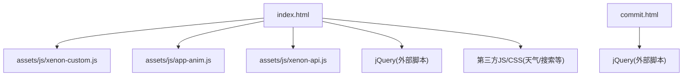
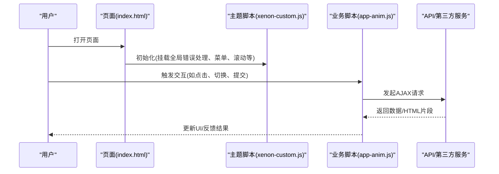
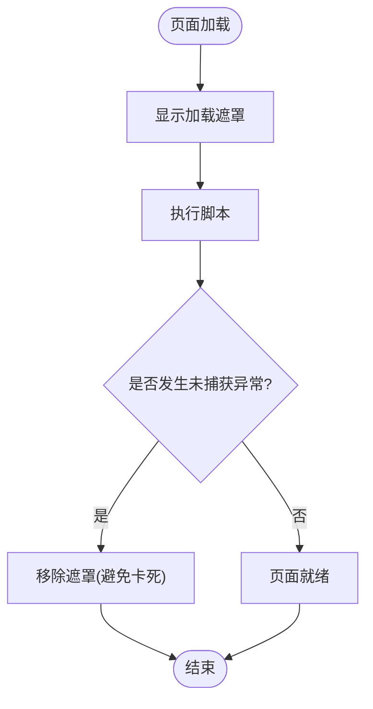
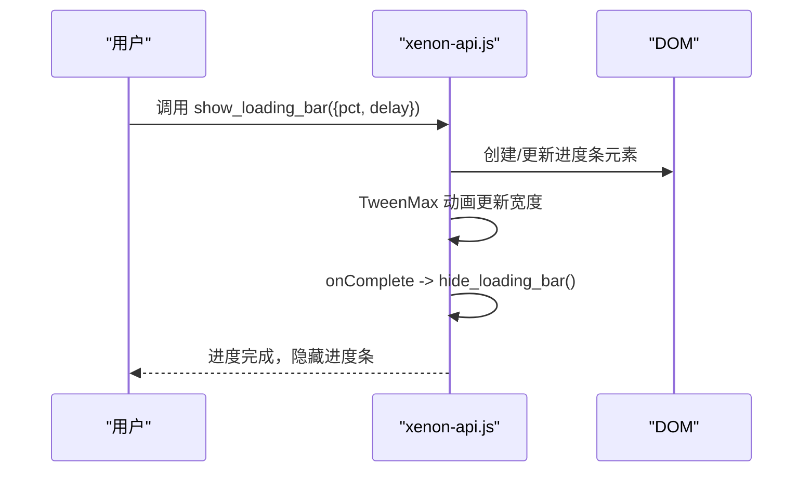
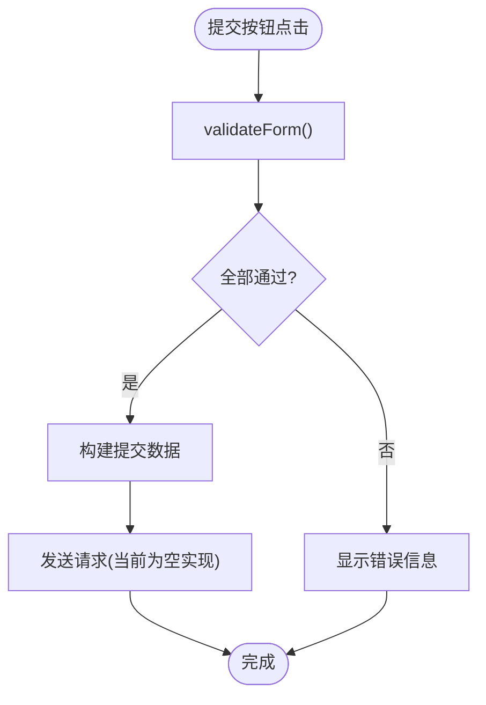
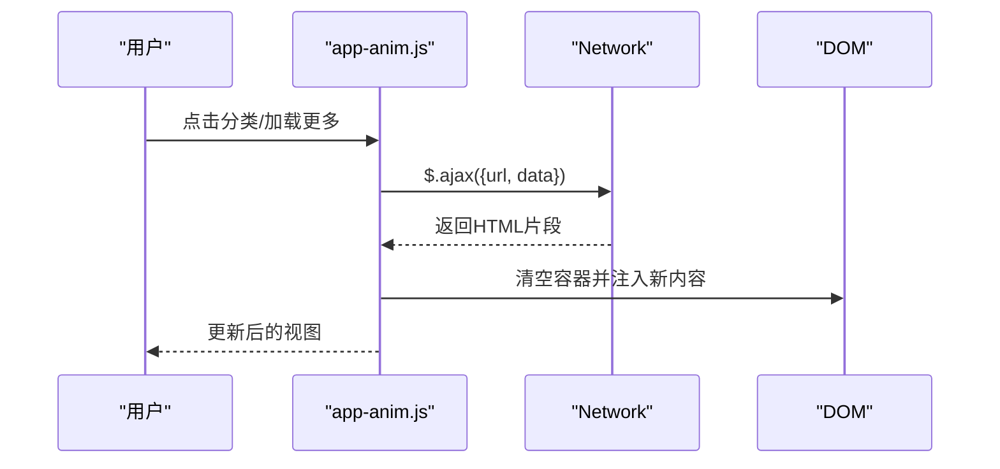
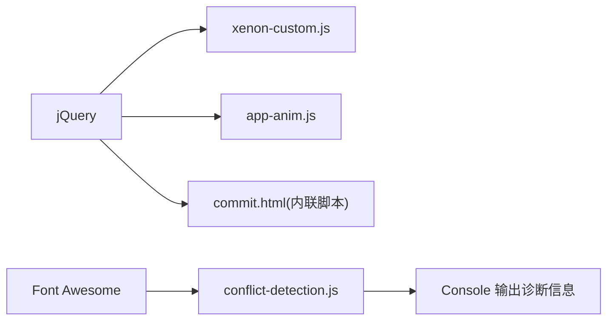

# 调试工具与技巧

<cite>
**本文引用的文件**
- [README.md](file://README.md)
- [index.html](file://index.html)
- [commit.html](file://commit.html)
- [assets/js/xenon-api.js](file://assets/js/xenon-api.js)
- [assets/js/xenon-custom.js](file://assets/js/xenon-custom.js)
- [assets/js/app-anim.js](file://assets/js/app-anim.js)
</cite>

## 目录
1. [简介](#简介)
2. [项目结构](#项目结构)
3. [核心组件](#核心组件)
4. [架构总览](#架构总览)
5. [详细组件分析](#详细组件分析)
6. [依赖关系分析](#依赖关系分析)
7. [性能考虑](#性能考虑)
8. [故障排查指南](#故障排查指南)
9. [结论](#结论)
10. [附录](#附录)

## 简介
本文件面向开发与测试人员，系统梳理本项目在浏览器端可用的调试工具与方法，结合代码中的实际实现，给出基于 Chrome DevTools 的实操建议：DOM 检查、网络请求调试、JavaScript 断点调试、性能分析（内存、CPU、渲染）等。同时总结错误捕获、日志记录、变量监视、调用栈分析等最佳实践，并覆盖跨域问题排查、API 接口测试、常见场景实战流程。

## 项目结构
本项目为纯静态站点，主要入口为 index.html；提交页面为 commit.html；交互逻辑集中在 assets/js 下的多个脚本中，包括主题初始化、动画与交互、表单与 AJAX 等。样式资源位于 assets/css，图标库使用 Font Awesome。

图表来源
- [index.html:1-35](file://index.html#L1-L35)
- [commit.html:1-30](file://commit.html#L1-L30)

章节来源
- [README.md:298-314](file://README.md#L298-L314)
- [index.html:1-35](file://index.html#L1-L35)

## 核心组件
- 页面加载与全局错误处理：在主题主脚本中注册 window.onerror，用于在出错时移除加载遮罩，避免界面卡死。
- 进度条与加载状态：提供 show_loading_bar / hide_loading_bar 控制顶部进度条，便于感知异步操作。
- 交互与动画：app-anim.js 负责侧边栏、夜间模式、滚动、AJAX 内容加载、本地存储等。
- 表单与验证：commit.html 内嵌表单校验与提交逻辑，包含输入提示与错误信息展示。

章节来源
- [assets/js/xenon-custom.js:43-56](file://assets/js/xenon-custom.js#L43-L56)
- [assets/js/xenon-api.js:20-91](file://assets/js/xenon-api.js#L20-L91)
- [assets/js/app-anim.js:1-25](file://assets/js/app-anim.js#L1-L25)
- [commit.html:286-378](file://commit.html#L286-L378)

## 架构总览
前端以 jQuery 为基础，通过事件绑定驱动 UI 行为，使用 AJAX 与后端或第三方服务通信；主题脚本负责初始化与全局状态，业务脚本负责具体功能模块。

图表来源
- [assets/js/xenon-custom.js:43-56](file://assets/js/xenon-custom.js#L43-L56)
- [assets/js/app-anim.js:432-510](file://assets/js/app-anim.js#L432-L510)
- [commit.html:347-371](file://commit.html#L347-L371)

## 详细组件分析

### 全局错误处理与加载遮罩
- 作用：在页面加载过程中显示遮罩，并在发生未捕获异常时确保遮罩被移除，防止界面“假死”。
- 调试要点：
  - 在 Sources 面板设置全局 Uncaught Exception 断点，定位抛出位置。
  - 在 Network 面板观察是否有资源加载失败导致后续脚本中断。
  - 使用 Console 查看错误堆栈，必要时添加临时 console.log 辅助定位。

图表来源
- [assets/js/xenon-custom.js:43-56](file://assets/js/xenon-custom.js#L43-L56)

章节来源
- [assets/js/xenon-custom.js:43-56](file://assets/js/xenon-custom.js#L43-L56)

### 进度条与异步反馈
- 作用：在长耗时操作中显示进度条，提升用户体验。
- 调试要点：
  - 在调用 show_loading_bar 处设置断点，确认参数是否正确（百分比、延迟）。
  - 使用 Performance 面板录制关键路径，观察动画帧是否卡顿。
  - 若进度条不消失，检查 onComplete 回调与 hide_loading_bar 调用时机。

图表来源
- [assets/js/xenon-api.js:20-91](file://assets/js/xenon-api.js#L20-L91)

章节来源
- [assets/js/xenon-api.js:20-91](file://assets/js/xenon-api.js#L20-L91)

### 表单验证与提交（commit.html）
- 作用：对网站提交表单进行前端校验，收集数据并准备提交。
- 调试要点：
  - 在 validateForm 函数内部设置断点，逐步检查各字段校验逻辑。
  - 在 Network 面板查看提交请求（若接入后端），核对请求体与响应。
  - 使用 Storage 面板检查 localStorage 是否按预期写入（如需持久化）。

图表来源
- [commit.html:286-378](file://commit.html#L286-L378)

章节来源
- [commit.html:286-378](file://commit.html#L286-L378)

### 动态内容加载与交互（app-anim.js）
- 作用：处理侧边栏、夜间模式、滚动、AJAX 内容加载、本地存储等。
- 调试要点：
  - 在 loadAjax 函数中设置断点，观察请求 URL、参数与响应。
  - 使用 Elements 面板检查动态插入的 DOM 节点是否正确。
  - 使用 Performance 面板录制交互过程，识别重排/重绘热点。

图表来源
- [assets/js/app-anim.js:432-510](file://assets/js/app-anim.js#L432-L510)

章节来源
- [assets/js/app-anim.js:432-510](file://assets/js/app-anim.js#L432-L510)

## 依赖关系分析
- 脚本加载顺序：index.html 先引入 jQuery，再引入业务脚本；主题脚本在文档就绪后初始化。
- 第三方依赖：Font Awesome、Bootstrap、Fancybox、天气小部件等。
- 潜在风险：若第三方脚本加载失败或版本冲突，可能导致功能异常。可使用 Conflict Detection 输出到控制台进行诊断。

图表来源
- [index.html:17-31](file://index.html#L17-L31)
- [commit.html:285-286](file://commit.html#L285-L286)

章节来源
- [index.html:17-31](file://index.html#L17-L31)
- [commit.html:285-286](file://commit.html#L285-L286)

## 性能考虑
- 首屏性能：
  - 使用 Coverage 面板检查未使用的 JS/CSS，按需裁剪。
  - 使用 Lighthouse 评估性能指标（FCP、LCP、CLS 等）。
- 运行时性能：
  - 在 Performance 面板录制交互过程，关注长任务与掉帧。
  - 在 Memory 面板拍摄 Heap Snapshot，对比两次快照查找内存泄漏。
- 渲染优化：
  - 减少不必要的重排/重绘，合并 DOM 操作。
  - 图片懒加载与合适的尺寸，避免阻塞渲染。

[本节为通用指导，无需特定文件引用]

## 故障排查指南

### 常见问题与定位步骤
- 页面白屏或遮罩不消失
  - 检查 window.onerror 是否生效，确认遮罩类名是否正确移除。
  - 在 Sources 面板设置 Uncaught Exception 断点，定位抛错位置。
  - 在 Network 面板查看是否有资源 404 或 CORS 错误。
- 表单提交无响应
  - 在 commit.html 的提交处理处设置断点，确认是否进入提交逻辑。
  - 在 Network 面板查看是否发出请求，核对请求方法与参数。
  - 若后端未接入，需补充服务端或改用第三方表单服务。
- 动态内容不更新
  - 在 app-anim.js 的 loadAjax 中设置断点，检查 URL 与返回数据。
  - 在 Elements 面板确认目标容器是否存在且可写入。
  - 使用 Console 打印中间变量，验证数据流。

章节来源
- [assets/js/xenon-custom.js:43-56](file://assets/js/xenon-custom.js#L43-L56)
- [commit.html:347-371](file://commit.html#L347-L371)
- [assets/js/app-anim.js:432-510](file://assets/js/app-anim.js#L432-L510)

### Chrome DevTools 高级技巧清单
- DOM 检查
  - 使用 Elements 面板实时修改 CSS/HTML 快速验证效果。
  - 右键元素选择“复制”生成选择器，便于在 Console 中定位。
- 网络请求调试
  - Network 面板过滤 XHR/Fetch，查看请求头、响应体与时间线。
  - 使用“Preserve log”保留跨页请求日志，便于追踪多步流程。
  - 对慢请求启用“Throttling”模拟弱网环境。
- JavaScript 断点调试
  - 条件断点：在行号上右键设置条件表达式，精准命中目标。
  - 异常断点：勾选“Pause on exceptions”，自动停在出错位置。
  - 事件监听断点：在 Event Listener Breakpoints 中针对 click/input 等事件暂停。
- 性能分析
  - Performance 面板录制关键路径，分析长任务与掉帧原因。
  - Memory 面板拍摄快照，比较差异查找泄漏对象。
  - 使用 Rendering 面板的 Paint Flashing 定位重绘区域。
- 变量监视与调用栈
  - Watch 面板添加常用变量，实时观察变化。
  - 在 Call Stack 中回溯函数调用链，定位问题源头。

[本节为通用指导，无需特定文件引用]

### 网络请求调试方法
- API 接口测试
  - 在 Network 面板直接查看请求与响应，必要时使用 Copy as cURL 在终端复现。
  - 对于 JSON 响应，使用 Pretty Print 格式化查看。
- 跨域问题排查
  - 检查请求头 Origin、Access-Control-Allow-Origin 等 CORS 相关字段。
  - 在 Console 查看具体的 CORS 错误信息，定位服务端配置问题。
- 请求响应分析
  - 使用 Timing 子面板分析 DNS、连接、等待与接收时间，定位瓶颈。
  - 对大响应体使用 Decompress 查看原始内容。

[本节为通用指导，无需特定文件引用]

### 性能调试的工具与技巧
- 内存泄漏检测
  - 在 Memory 面板使用 Allocation instrumentation on timeline 录制分配过程，观察增长趋势。
  - 对比两次 Heap Snapshot，查找未被释放的对象。
- CPU 性能分析
  - 在 Performance 面板录制，聚焦 Long Tasks 与 Scripting 阶段。
  - 使用 Flame Chart 分析函数调用开销。
- 渲染性能优化
  - 减少布局抖动，批量 DOM 操作，避免强制同步布局。
  - 合理使用 will-change、transform 等 GPU 加速属性。

[本节为通用指导，无需特定文件引用]

### 常见调试场景实战案例
- 场景一：点击“加载更多”无反应
  - 在 app-anim.js 的 loadAjax 设置断点，确认 URL 与参数。
  - 在 Network 面板查看请求是否发出及响应内容。
  - 在 Elements 面板确认目标容器存在并可写入。
- 场景二：提交表单后无反馈
  - 在 commit.html 的提交处理处设置断点，检查校验逻辑。
  - 在 Network 面板查看是否发出请求，核对响应码与消息。
  - 若后端未接入，暂时改为本地存储或 mock 响应。
- 场景三：页面加载后遮罩不消失
  - 检查 window.onerror 是否触发，确认遮罩类名。
  - 在 Sources 面板设置 Uncaught Exception 断点，定位抛错位置。
  - 在 Console 查看错误堆栈，修复对应逻辑。

[本节为通用指导，无需特定文件引用]

## 结论
本项目采用纯静态架构，前端交互集中于若干脚本文件中。借助 Chrome DevTools 的断点、网络、性能等能力，可以高效定位 DOM、网络与性能问题。建议在开发中建立规范的调试流程：先复现问题，再用断点缩小范围，最后通过性能与内存工具验证优化效果。对于网络与跨域问题，优先从 Network 面板入手，结合控制台错误信息进行排查。

[本节为总结性内容，无需特定文件引用]

## 附录
- 快速开始与部署参考：见 README 中的本地预览与部署指南。
- 二次开发建议：根据 README 指引修改导航内容与样式，按需扩展功能。

章节来源
- [README.md:22-44](file://README.md#L22-L44)
- [README.md:242-296](file://README.md#L242-L296)