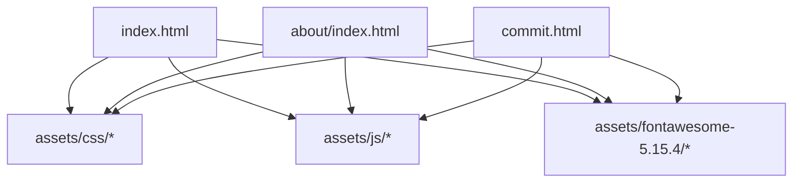
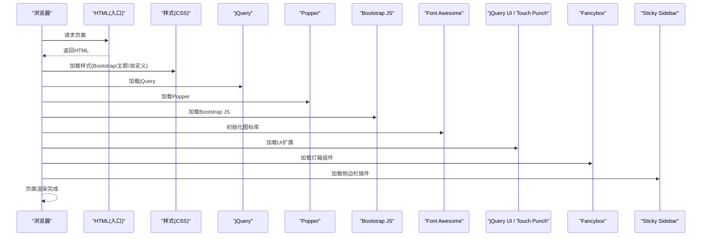
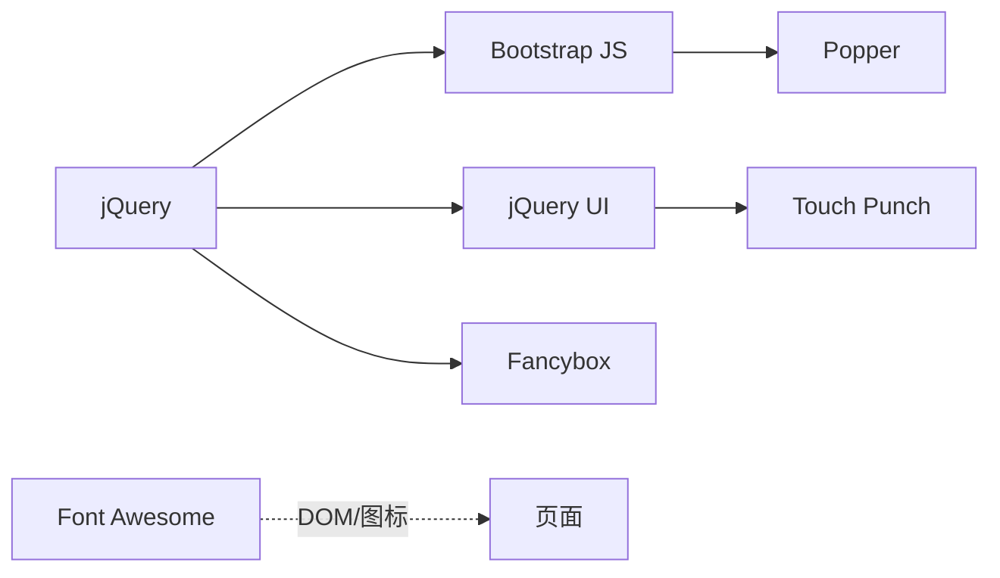

# 依赖更新

<cite>
**本文引用的文件**
- [index.html](file://index.html)
- [about/index.html](file://about/index.html)
- [commit.html](file://commit.html)
- [README.md](file://README.md)
- [assets/css/bootstrap.min-4.3.1.css](file://assets/css/bootstrap.min-4.3.1.css)
- [assets/js/jquery.min-3.2.1.js](file://assets/js/jquery.min-3.2.1.js)
- [assets/js/bootstrap.min-4.3.1.js](file://assets/js/bootstrap.min-4.3.1.js)
- [assets/js/popper.min.js](file://assets/js/popper.min.js)
- [assets/js/fancybox.min-3.5.7.js](file://assets/js/fancybox.min-3.5.7.js)
- [assets/js/jquery-ui.min.1.12.1.js](file://assets/js/jquery-ui.min.1.12.1.js)
- [assets/js/jquery.ui.touch-punch.min-0.2.2.js](file://assets/js/jquery.ui.touch-punch.min-0.2.2.js)
- [assets/js/theia-sticky-sidebar-1.5.0.js](file://assets/js/theia-sticky-sidebar-1.5.0.js)
- [assets/fontawesome-5.15.4/js/conflict-detection.js](file://assets/fontawesome-5.15.4/js/conflict-detection.js)
- [assets/fontawesome-5.15.4/js/fontawesome.js](file://assets/fontawesome-5.15.4/js/fontawesome.js)
</cite>

## 目录
1. [简介](#简介)
2. [项目结构](#项目结构)
3. [核心组件](#核心组件)
4. [架构总览](#架构总览)
5. [详细组件分析](#详细组件分析)
6. [依赖关系分析](#依赖关系分析)
7. [性能考虑](#性能考虑)
8. [故障排查指南](#故障排查指南)
9. [结论](#结论)
10. [附录](#附录)

## 简介
本文件面向本项目的前端静态资源与第三方库的依赖更新管理，目标是建立一套可执行、可回滚、可审计的更新流程。项目当前采用“本地化静态资源 + 少量外部CDN”的方式引入依赖，包括 Bootstrap、jQuery、Font Awesome、Fancybox、jQuery UI、Popper 等。文档将覆盖：
- 依赖清单与版本现状
- 安全更新策略（漏洞检测、补丁应用、兼容性测试）
- CDN 与本地资源的更新策略（版本锁定、回滚机制、缓存策略）
- 最佳实践（备份、灰度/渐进式更新、回归测试）
- 自动化更新方案与脚本思路（以步骤和配置为主，不直接粘贴代码内容）

## 项目结构
项目为纯静态站点，主要入口为 index.html，其他页面引用相同的静态资源目录 assets。依赖以本地文件形式存放于 assets/css、assets/js、assets/fontawesome-5.15.4，并在 HTML 中通过相对路径引入；同时存在少量外部 CDN 引用（如天气组件）。

图表来源
- [index.html:17-31](file://index.html#L17-L31)
- [about/index.html:17-25](file://about/index.html#L17-L25)
- [commit.html:17-25](file://commit.html#L17-L25)

章节来源
- [index.html:17-31](file://index.html#L17-L31)
- [about/index.html:17-25](file://about/index.html#L17-L25)
- [commit.html:17-25](file://commit.html#L17-L25)
- [README.md:298-314](file://README.md#L298-L314)

## 核心组件
- 样式框架：Bootstrap 4（CSS 与 JS），配套 Popper.js
- 图标库：Font Awesome 5（本地化）
- 交互库：jQuery、jQuery UI、Touch Punch
- 增强组件：Fancybox（图片灯箱）、Theia Sticky Sidebar（侧边栏粘性）
- 业务脚本：content-search、tooltip-extend、xenon-* 等

这些依赖在多个页面中被统一引用，因此任何升级都需要进行跨页面验证。

章节来源
- [index.html:17-31](file://index.html#L17-L31)
- [assets/js/jquery.min-3.2.1.js](file://assets/js/jquery.min-3.2.1.js)
- [assets/css/bootstrap.min-4.3.1.css](file://assets/css/bootstrap.min-4.3.1.css)
- [assets/js/bootstrap.min-4.3.1.js](file://assets/js/bootstrap.min-4.3.1.js)
- [assets/js/popper.min.js](file://assets/js/popper.min.js)
- [assets/js/fancybox.min-3.5.7.js](file://assets/js/fancybox.min-3.5.7.js)
- [assets/js/jquery-ui.min.1.12.1.js](file://assets/js/jquery-ui.min.1.12.1.js)
- [assets/js/jquery.ui.touch-punch.min-0.2.2.js](file://assets/js/jquery.ui.touch-punch.min-0.2.2.js)
- [assets/js/theia-sticky-sidebar-1.5.0.js](file://assets/js/theia-sticky-sidebar-1.5.0.js)

## 架构总览
下图展示了页面加载时关键依赖的引入顺序与依赖关系，便于理解升级时的影响面。

图表来源
- [index.html:17-31](file://index.html#L17-L31)
- [assets/js/jquery.min-3.2.1.js](file://assets/js/jquery.min-3.2.1.js)
- [assets/js/popper.min.js](file://assets/js/popper.min.js)
- [assets/js/bootstrap.min-4.3.1.js](file://assets/js/bootstrap.min-4.3.1.js)
- [assets/js/fancybox.min-3.5.7.js](file://assets/js/fancybox.min-3.5.7.js)
- [assets/js/jquery-ui.min.1.12.1.js](file://assets/js/jquery-ui.min.1.12.1.js)
- [assets/js/jquery.ui.touch-punch.min-0.2.2.js](file://assets/js/jquery.ui.touch-punch.min-0.2.2.js)
- [assets/js/theia-sticky-sidebar-1.5.0.js](file://assets/js/theia-sticky-sidebar-1.5.0.js)

## 详细组件分析

### jQuery
- 作用：DOM 操作、事件处理、AJAX、动画等基础能力
- 版本现状：本地化 v3.2.1
- 升级要点：
  - 检查是否使用已废弃 API（如 .load/.unload/.error 事件绑定方式）
  - 与 jQuery UI、Touch Punch 的兼容性
  - 若升级到 v3.x 大版本，需确认所有插件基于 jQuery 3 构建
- 风险点：部分旧插件可能仅支持 jQuery 2.x

章节来源
- [index.html:30](file://index.html#L30)
- [assets/js/jquery.min-3.2.1.js](file://assets/js/jquery.min-3.2.1.js)

### Bootstrap 4
- 作用：栅格布局、组件样式与 JS 插件
- 版本现状：CSS/JS 均为 v4.3.1
- 升级要点：
  - 若升级到 v5，需移除对 jQuery 的依赖并替换相关插件实现
  - 检查类名变更（如 .form-control 行为变化、颜色/间距系统调整）
  - 与 Popper 的版本匹配（v4 需要特定版本的 Popper）
- 风险点：v4→v5 是破坏性升级，需全量回归测试

章节来源
- [index.html:21-22](file://index.html#L21-L22)
- [assets/css/bootstrap.min-4.3.1.css](file://assets/css/bootstrap.min-4.3.1.css)
- [assets/js/bootstrap.min-4.3.1.js](file://assets/js/bootstrap.min-4.3.1.js)
- [assets/js/popper.min.js](file://assets/js/popper.min.js)

### Font Awesome 5
- 作用：矢量图标库
- 版本现状：本地化 v5.15.4
- 升级要点：
  - 注意 SVG/JS 模式差异与冲突检测逻辑
  - 图标命名空间与 class 前缀（fas/far/fa）保持一致
  - 若启用冲突检测，关注控制台输出与超时配置
- 风险点：新版本可能弃用某些图标或改变默认行为

章节来源
- [index.html:29](file://index.html#L29)
- [assets/fontawesome-5.15.4/js/conflict-detection.js:867-998](file://assets/fontawesome-5.15.4/js/conflict-detection.js#L867-L998)
- [assets/fontawesome-5.15.4/js/fontawesome.js:204-233](file://assets/fontawesome-5.15.4/js/fontawesome.js#L204-L233)

### Fancybox
- 作用：图片/视频灯箱展示
- 版本现状：v3.5.7
- 升级要点：
  - 检查 API 变更（如实例创建、回调函数）
  - 与 jQuery 的集成方式
- 风险点：低版本 jQuery 与新版 Fancybox 的兼容性问题

章节来源
- [index.html:23](file://index.html#L23)
- [assets/js/fancybox.min-3.5.7.js](file://assets/js/fancybox.min-3.5.7.js)

### jQuery UI 与 Touch Punch
- 作用：拖拽、选择、日期选择器等交互；移动端触摸支持
- 版本现状：jQuery UI 1.12.1，Touch Punch 0.2.2
- 升级要点：
  - jQuery UI 升级后检查 widget 初始化与事件绑定
  - Touch Punch 用于让 jQuery UI 支持触摸设备，需确保与 jQuery UI 版本匹配
- 风险点：移动端手势行为变化

章节来源
- [assets/js/jquery-ui.min.1.12.1.js](file://assets/js/jquery-ui.min.1.12.1.js)
- [assets/js/jquery.ui.touch-punch.min-0.2.2.js](file://assets/js/jquery.ui.touch-punch.min-0.2.2.js)

### Theia Sticky Sidebar
- 作用：侧边栏粘性定位
- 版本现状：1.5.0
- 升级要点：
  - 检查容器高度计算与滚动事件监听
  - 与响应式布局的适配
- 风险点：页面结构变化可能导致粘性失效

章节来源
- [assets/js/theia-sticky-sidebar-1.5.0.js](file://assets/js/theia-sticky-sidebar-1.5.0.js)

## 依赖关系分析
- 强依赖链：jQuery → Bootstrap JS（v4）→ Popper；jQuery → jQuery UI → Touch Punch
- 弱依赖：Fancybox 依赖 jQuery；Font Awesome 独立但可能与 DOM 操作冲突
- 外部依赖：天气组件通过 CDN 引入，需关注可用性

图表来源
- [index.html:17-31](file://index.html#L17-L31)
- [assets/js/jquery.min-3.2.1.js](file://assets/js/jquery.min-3.2.1.js)
- [assets/js/bootstrap.min-4.3.1.js](file://assets/js/bootstrap.min-4.3.1.js)
- [assets/js/popper.min.js](file://assets/js/popper.min.js)
- [assets/js/fancybox.min-3.5.7.js](file://assets/js/fancybox.min-3.5.7.js)
- [assets/js/jquery-ui.min.1.12.1.js](file://assets/js/jquery-ui.min.1.12.1.js)
- [assets/js/jquery.ui.touch-punch.min-0.2.2.js](file://assets/js/jquery.ui.touch-punch.min-0.2.2.js)

章节来源
- [index.html:17-31](file://index.html#L17-L31)

## 性能考虑
- 资源体积：优先使用 minified 版本，按需引入（例如只引入需要的 Font Awesome 子集）
- 缓存策略：静态资源建议设置长期缓存（如 Nginx 的 expires 与 immutable），配合版本号或文件名哈希避免缓存污染
- 加载顺序：jQuery 必须在 Bootstrap 之前；Popper 需在 Bootstrap JS 之前；避免阻塞首屏的关键资源
- 压缩与合并：生产环境开启 Gzip/Brotli，减少请求数量（合并需谨慎，避免回滚困难）

[本节为通用指导，不直接分析具体文件]

## 故障排查指南
- 图标不显示或冲突：检查 Font Awesome 冲突检测日志与超时配置，确认未重复加载不同版本
- 弹窗/灯箱异常：检查 Fancybox 初始化时机与 jQuery 版本兼容性
- 移动端拖拽无效：确认 Touch Punch 正确加载且 jQuery UI 版本匹配
- 侧边栏粘性失效：检查容器结构与滚动事件，必要时重置 sticky 实例
- 外部 CDN 不可用：为关键依赖准备本地副本作为降级方案

章节来源
- [assets/fontawesome-5.15.4/js/conflict-detection.js:867-998](file://assets/fontawesome-5.15.4/js/conflict-detection.js#L867-L998)

## 结论
本项目采用本地化静态资源为主、少量 CDN 为辅的依赖管理模式。为确保稳定与安全，建议：
- 建立统一的依赖清单与版本锁定机制
- 制定分阶段升级计划与回归测试用例
- 完善回滚与发布流程，确保快速恢复
- 定期扫描安全漏洞并及时修补

[本节为总结性内容，不直接分析具体文件]

## 附录

### 一、当前依赖清单与版本现状
- Bootstrap 4.3.1（CSS/JS）
- jQuery 3.2.1
- Popper（与 Bootstrap 4 配套）
- Font Awesome 5.15.4（本地化）
- Fancybox 3.5.7
- jQuery UI 1.12.1
- jQuery Touch Punch 0.2.2
- Theia Sticky Sidebar 1.5.0
- 天气组件（CDN）

章节来源
- [index.html:17-31](file://index.html#L17-L31)
- [assets/js/jquery.min-3.2.1.js](file://assets/js/jquery.min-3.2.1.js)
- [assets/css/bootstrap.min-4.3.1.css](file://assets/css/bootstrap.min-4.3.1.css)
- [assets/js/bootstrap.min-4.3.1.js](file://assets/js/bootstrap.min-4.3.1.js)
- [assets/js/popper.min.js](file://assets/js/popper.min.js)
- [assets/js/fancybox.min-3.5.7.js](file://assets/js/fancybox.min-3.5.7.js)
- [assets/js/jquery-ui.min.1.12.1.js](file://assets/js/jquery-ui.min.1.12.1.js)
- [assets/js/jquery.ui.touch-punch.min-0.2.2.js](file://assets/js/jquery.ui.touch-punch.min-0.2.2.js)
- [assets/js/theia-sticky-sidebar-1.5.0.js](file://assets/js/theia-sticky-sidebar-1.5.0.js)

### 二、依赖更新策略与管理方法
- 版本锁定
  - 所有依赖以固定版本号下载至 assets 目录，禁止使用 latest 标签
  - 在提交记录中明确标注依赖版本变更原因（功能/安全/修复）
- 更新流程
  - 评估：查阅官方变更日志与安全公告，评估影响范围
  - 备份：更新前对 assets 与 HTML 引用处做快照（Git 分支或标签）
  - 替换：按依赖顺序替换文件，保持命名一致以便回滚
  - 测试：在本地与预发环境进行功能与兼容性测试
  - 发布：灰度发布（先小流量或内部用户），观察指标后再全量
  - 回滚：若发现问题，立即切换回上一版本并复盘
- 安全更新
  - 定期扫描已知漏洞（可使用开源工具或平台服务）
  - 对高危漏洞优先处理，必要时临时回退到安全版本
  - 记录漏洞编号与修复版本，形成审计追踪
- CDN 与本地资源
  - 关键依赖必须提供本地副本，CDN 仅作为加速或备用
  - 对 CDN 资源增加 fallback 机制（如加载失败时切换到本地）
  - 合理设置缓存头（长期缓存 + 版本化文件名），避免缓存污染
- 兼容性测试
  - 多浏览器/多设备矩阵测试（重点：移动端触控、IE 兼容需求）
  - 针对 jQuery 升级，检查插件 API 兼容性与事件绑定方式
  - 针对 Bootstrap 升级，检查类名与组件行为变化
- 渐进式更新
  - 先升级非关键依赖（如图标库），再升级核心依赖（jQuery/Bootstrap）
  - 分模块验证（如先验证表单与搜索，再验证灯箱与侧边栏）

[本节为通用指导，不直接分析具体文件]

### 三、自动化更新方案（思路与步骤）
- 依赖清单管理
  - 维护一个依赖清单文件，记录名称、版本、来源（本地/CDN）、校验值（如 SHA）
- 自动下载与校验
  - 从官方源或可信镜像下载指定版本
  - 校验文件完整性（SHA/MD5），失败则中止
- 自动替换与引用更新
  - 根据清单自动替换 assets 中的文件
  - 若使用模板生成 HTML，可在构建阶段注入正确的资源路径与版本参数
- 自动化测试
  - 运行冒烟测试（页面加载、关键交互）
  - 截图对比或视觉回归测试（可选）
- 发布与回滚
  - 构建产物打标签并推送
  - 一键回滚到上一个稳定版本

[本节为通用指导，不直接分析具体文件]

### 四、更新前后检查清单
- 更新前
  - 备份当前版本（Git 分支/标签）
  - 记录当前依赖版本与关键行为基线
- 更新后
  - 页面加载无报错（控制台无 JS/CSS 错误）
  - 核心功能可用（导航、搜索、灯箱、侧边栏、移动端触控）
  - 性能指标正常（首屏时间、资源大小）
  - 兼容性通过（主流浏览器与设备）

[本节为通用指导，不直接分析具体文件]