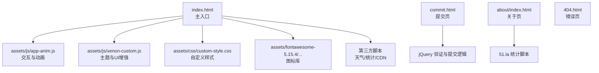
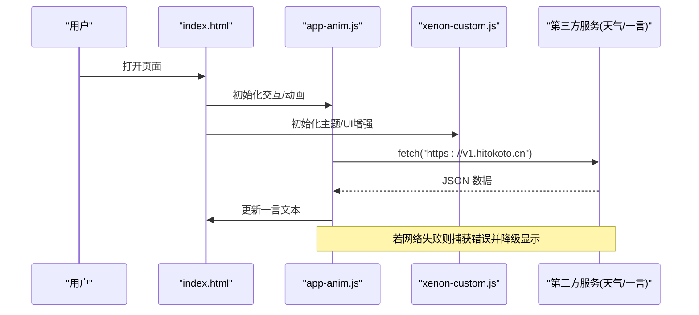
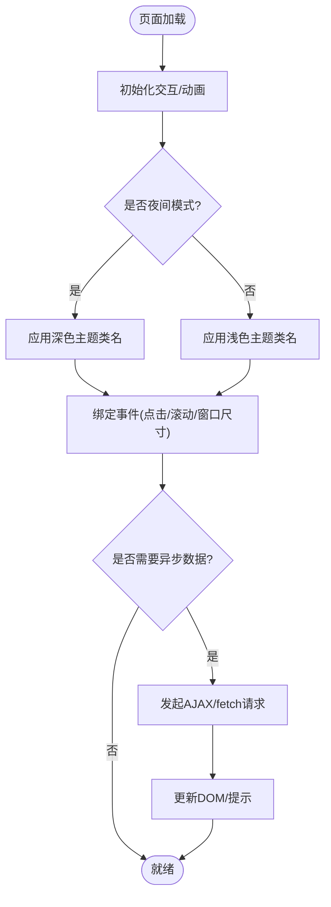
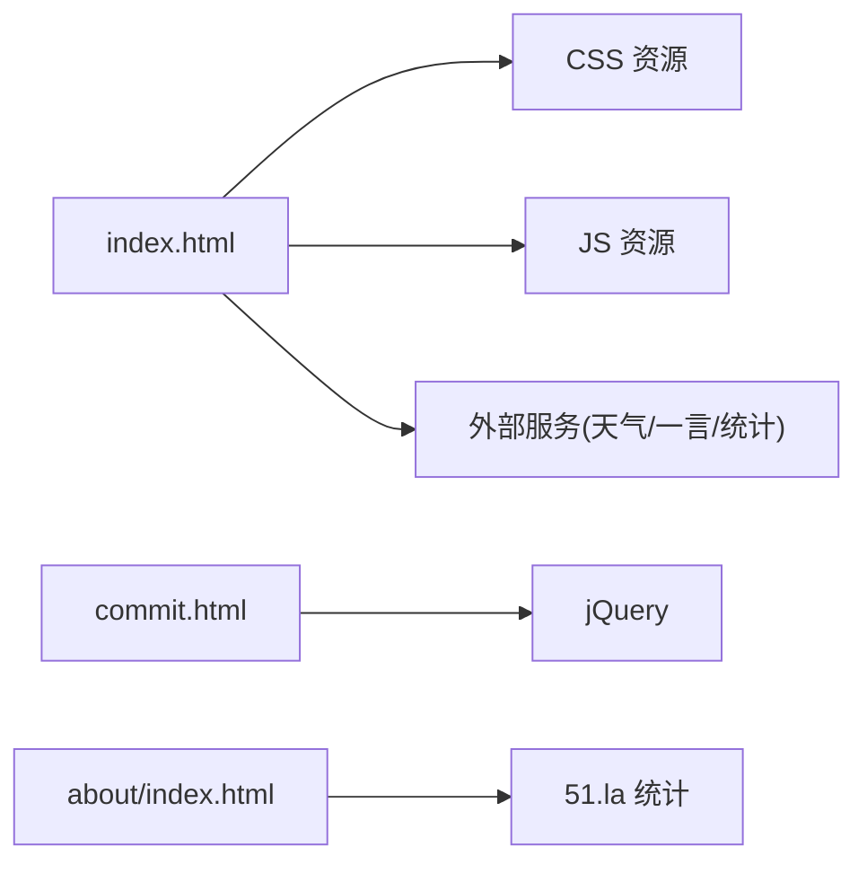

# 故障排查与恢复

<cite>
**本文引用的文件**
- [index.html](file://index.html)
- [commit.html](file://commit.html)
- [about/index.html](file://about/index.html)
- [404.html](file://404.html)
- [README.md](file://README.md)
- [assets/js/app-anim.js](file://assets/js/app-anim.js)
- [assets/js/xenon-custom.js](file://assets/js/xenon-custom.js)
- [assets/css/custom-style.css](file://assets/css/custom-style.css)
</cite>

## 目录
1. [简介](#简介)
2. [项目结构](#项目结构)
3. [核心组件](#核心组件)
4. [架构总览](#架构总览)
5. [详细组件分析](#详细组件分析)
6. [依赖关系分析](#依赖关系分析)
7. [性能考虑](#性能考虑)
8. [故障排查指南](#故障排查指南)
9. [结论](#结论)
10. [附录](#附录)

## 简介
本文件面向在线网址导航项目的运维与开发者，提供系统化的故障排查与恢复指南。内容覆盖：
- 浏览器兼容性问题（CSS样式异常、JavaScript执行错误、API调用失败）
- 部署相关问题（静态资源加载失败、跨域问题、HTTPS配置）
- 数据恢复流程（本地存储备份、用户配置恢复、缓存清理）
- 性能诊断与优化（内存泄漏检测、渲染性能优化、网络请求优化）
- 典型故障案例与解决步骤

## 项目结构
本项目为纯静态站点，主要入口为首页 index.html，包含侧边栏导航、搜索模块、天气小部件、外部 API 调用等；提交页面 commit.html 提供表单校验与提交流程；关于页面 about/index.html 展示作者信息并集成统计脚本；404.html 用于未找到页面提示。

图表来源
- [index.html:1-35](file://index.html#L1-L35)
- [assets/js/app-anim.js:1-25](file://assets/js/app-anim.js#L1-L25)
- [assets/js/xenon-custom.js:13-56](file://assets/js/xenon-custom.js#L13-L56)
- [assets/css/custom-style.css:1-126](file://assets/css/custom-style.css#L1-L126)
- [commit.html:285-379](file://commit.html#L285-L379)
- [about/index.html:239-241](file://about/index.html#L239-L241)
- [404.html:1-3](file://404.html#L1-L3)

章节来源
- [index.html:1-35](file://index.html#L1-L35)
- [README.md:298-314](file://README.md#L298-L314)

## 核心组件
- 首页交互与动画：app-anim.js 负责侧边栏、主题切换、搜索、粘性页脚、AJAX 动态加载、本地存储读写等。
- 主题与UI增强：xenon-custom.js 提供滚动条、下拉菜单、日期选择器、表单验证等通用 UI 能力。
- 自定义样式：custom-style.css 调整字体、导航宽度、搜索框颜色、网格背景等。
- 提交页：commit.html 实现表单校验、字符计数、提交禁用状态与成功反馈。
- 关于页：about/index.html 集成 51.la 统计脚本。
- 错误页：404.html 提供简单提示。

章节来源
- [assets/js/app-anim.js:1-25](file://assets/js/app-anim.js#L1-L25)
- [assets/js/xenon-custom.js:13-56](file://assets/js/xenon-custom.js#L13-L56)
- [assets/css/custom-style.css:1-126](file://assets/css/custom-style.css#L1-L126)
- [commit.html:285-379](file://commit.html#L285-L379)
- [about/index.html:239-241](file://about/index.html#L239-L241)
- [404.html:1-3](file://404.html#L1-L3)

## 架构总览
首页通过引入 jQuery、Bootstrap、Font Awesome、自定义样式与脚本，构建响应式布局与交互。页面内嵌第三方脚本（如天气小部件、一言接口），并通过 fetch/AJAX 进行数据获取。提交页使用 jQuery 完成前端校验与提交准备。关于页嵌入统计脚本以收集访问数据。

图表来源
- [index.html:304-313](file://index.html#L304-L313)
- [assets/js/app-anim.js:1-25](file://assets/js/app-anim.js#L1-L25)
- [assets/js/xenon-custom.js:13-56](file://assets/js/xenon-custom.js#L13-L56)

## 详细组件分析

### 首页交互与动画（app-anim.js）
- 功能要点
  - 文档就绪后初始化侧边栏、主题模式、搜索模块、粘性页脚、工具提示、滑块等。
  - 窗口尺寸变化时重新计算布局与侧边栏状态。
  - 数字动画、点击链接加载指示器、点赞与收藏 AJAX 回调、下载统计、夜间模式切换、返回顶部、二级悬浮菜单、Tab 内容异步加载、本地存储读写（myLinks/livelists）。
- 关键路径参考
  - 初始化流程：[assets/js/app-anim.js:1-25](file://assets/js/app-anim.js#L1-L25)
  - 夜间模式切换：[assets/js/app-anim.js:201-237](file://assets/js/app-anim.js#L201-L237)
  - 本地存储读取/写入：[assets/js/app-anim.js:599-605](file://assets/js/app-anim.js#L599-L605)
  - Tab 异步加载：[assets/js/app-anim.js:476-510](file://assets/js/app-anim.js#L476-L510)
  - 点赞/收藏 AJAX：[assets/js/app-anim.js:66-138](file://assets/js/app-anim.js#L66-L138)

图表来源
- [assets/js/app-anim.js:1-25](file://assets/js/app-anim.js#L1-L25)
- [assets/js/app-anim.js:201-237](file://assets/js/app-anim.js#L201-L237)
- [assets/js/app-anim.js:476-510](file://assets/js/app-anim.js#L476-L510)

章节来源
- [assets/js/app-anim.js:1-25](file://assets/js/app-anim.js#L1-L25)
- [assets/js/app-anim.js:201-237](file://assets/js/app-anim.js#L201-L237)
- [assets/js/app-anim.js:476-510](file://assets/js/app-anim.js#L476-L510)
- [assets/js/app-anim.js:599-605](file://assets/js/app-anim.js#L599-L605)

### 主题与UI增强（xenon-custom.js）
- 功能要点
  - 全局变量与 DOM 引用初始化。
  - 页面加载遮罩处理、错误兜底移除遮罩。
  - 侧边栏与水平菜单设置、粘性页脚、滚动条插件、下拉菜单、自动高度、面包屑自适应、模态关闭、输入掩码、表单验证、日期/时间选择器等。
- 关键路径参考
  - 初始化与错误兜底：[assets/js/xenon-custom.js:13-56](file://assets/js/xenon-custom.js#L13-L56)
  - 滚动条与下拉更新：[assets/js/xenon-custom.js:75-132](file://assets/js/xenon-custom.js#L75-L132)
  - 表单验证与输入掩码：[assets/js/xenon-custom.js:578-742](file://assets/js/xenon-custom.js#L578-L742)

章节来源
- [assets/js/xenon-custom.js:13-56](file://assets/js/xenon-custom.js#L13-L56)
- [assets/js/xenon-custom.js:75-132](file://assets/js/xenon-custom.js#L75-L132)
- [assets/js/xenon-custom.js:578-742](file://assets/js/xenon-custom.js#L578-L742)

### 自定义样式（custom-style.css）
- 作用范围
  - 全局字体大小、左侧导航悬浮宽度、隐藏滚动条、搜索框图标颜色、顶部导航颜色、搜索热词样式、网格背景等。
- 关键路径参考
  - 导航与搜索样式：[assets/css/custom-style.css:1-126](file://assets/css/custom-style.css#L1-L126)

章节来源
- [assets/css/custom-style.css:1-126](file://assets/css/custom-style.css#L1-L126)

### 提交页（commit.html）
- 功能要点
  - 表单字段：名称、地址、分类、描述、关键词、邮箱、联系方式。
  - 前端校验：必填项检查、URL/邮箱格式正则、字符计数、错误提示显示/隐藏。
  - 提交行为：禁用按钮、收集数据、预留后端对接点。
- 关键路径参考
  - 表单结构与样式：[commit.html:178-283](file://commit.html#L178-L283)
  - 校验与提交逻辑：[commit.html:285-379](file://commit.html#L285-L379)

章节来源
- [commit.html:178-283](file://commit.html#L178-L283)
- [commit.html:285-379](file://commit.html#L285-L379)

### 关于页（about/index.html）
- 功能要点
  - 展示作者信息、技术栈、工作理念、联系方式。
  - 集成 51.la 统计脚本。
- 关键路径参考
  - 统计脚本注入：[about/index.html:239-241](file://about/index.html#L239-L241)

章节来源
- [about/index.html:239-241](file://about/index.html#L239-L241)

### 错误页（404.html）
- 作用
  - 当路由不存在时返回“找不到页面”的提示。
- 关键路径参考
  - 错误提示：[404.html:1-3](file://404.html#L1-L3)

章节来源
- [404.html:1-3](file://404.html#L1-L3)

## 依赖关系分析
- 静态资源依赖
  - CSS：block-library、iconfont、bootstrap、fancybox、style、custom-style、fontawesome。
  - JS：jQuery、content-search、app-anim、xenon-custom、第三方插件（popper、fancybox、lozad等）。
- 外部服务依赖
  - 天气小部件：qweather.net 脚本。
  - 一言接口：hitokoto.cn。
  - 统计：51.la。
- 潜在风险
  - 外部脚本加载失败或跨域限制会导致功能降级或不可用。
  - 相对路径引用错误将导致样式/脚本/图片无法加载。

图表来源
- [index.html:17-31](file://index.html#L17-L31)
- [commit.html:285-286](file://commit.html#L285-L286)
- [about/index.html:239-241](file://about/index.html#L239-L241)

章节来源
- [index.html:17-31](file://index.html#L17-L31)
- [commit.html:285-286](file://commit.html#L285-L286)
- [about/index.html:239-241](file://about/index.html#L239-L241)

## 性能考虑
- 资源加载
  - 建议启用 gzip/压缩与静态资源缓存策略（参考 README 中的 Nginx 示例）。
  - 使用 CDN 加速第三方脚本与字体。
- 渲染优化
  - 避免在窗口 resize 中执行重排重绘密集操作；当前 app-anim.js 对 resize 做了节流处理。
  - 合理使用懒加载（lozad）与按需加载（tab 异步内容）。
- 网络优化
  - 对外部 API 调用增加超时与重试机制，失败时提供降级体验。
  - 合并与压缩 JS/CSS，减少请求数量。
- 内存管理
  - 注意事件监听器的添加与移除，避免重复绑定造成内存泄漏。
  - 长列表或大量 DOM 节点建议使用虚拟滚动或分页加载。

章节来源
- [README.md:86-116](file://README.md#L86-L116)
- [assets/js/app-anim.js:36-45](file://assets/js/app-anim.js#L36-L45)
- [assets/js/app-anim.js:476-510](file://assets/js/app-anim.js#L476-L510)

## 故障排查指南

### 浏览器兼容性问题
- CSS 样式异常
  - 现象：布局错乱、颜色不正确、滚动条显示异常。
  - 排查步骤
    - 检查 custom-style.css 是否被正确加载（控制台 Network 确认 200）。
    - 核对媒体查询与浏览器特性支持（如 grid、flex）。
    - 清除浏览器缓存后重试。
  - 恢复策略
    - 回退到稳定版本样式；必要时添加兼容性前缀。
    - 针对特定浏览器使用条件注释或 polyfill。
- JavaScript 执行错误
  - 现象：控制台报错、功能无响应、弹窗不出现。
  - 排查步骤
    - 打开开发者工具 Console，定位具体错误行。
    - 检查 jQuery 与插件是否按顺序加载且版本兼容。
    - 检查 app-anim.js 与 xenon-custom.js 的初始化是否被阻塞。
  - 恢复策略
    - 修复语法错误或类型错误；确保 DOM 已就绪再绑定事件。
    - 对第三方脚本增加 try/catch 与降级逻辑。
- API 调用失败
  - 现象：一言/天气小部件无数据或报错。
  - 排查步骤
    - 检查 Network 面板中对应请求的状态码与响应体。
    - 确认域名白名单与 CORS 策略。
    - 检查 fetch/AJAX 的 error 分支是否触发。
  - 恢复策略
    - 增加超时与重试；失败时显示默认文案或本地缓存数据。
    - 对于关键功能提供离线降级方案。

章节来源
- [assets/css/custom-style.css:1-126](file://assets/css/custom-style.css#L1-L126)
- [assets/js/app-anim.js:1-25](file://assets/js/app-anim.js#L1-L25)
- [assets/js/app-anim.js:201-237](file://assets/js/app-anim.js#L201-L237)
- [index.html:304-313](file://index.html#L304-L313)

### 部署相关问题
- 静态资源加载失败
  - 现象：样式/脚本/图片 404。
  - 排查步骤
    - 检查相对路径是否正确（./assets/...）。
    - 确认服务器根目录与 index.html 位置一致。
    - 查看 Nginx/Apache 日志定位请求路径。
  - 恢复策略
    - 修正路径；确保静态资源目录可访问。
    - 配置 try_files 与缓存头（参考 README）。
- 跨域问题
  - 现象：fetch/AJAX 被浏览器拦截。
  - 排查步骤
    - 检查目标域是否允许跨域（CORS）。
    - 确认代理或反向代理配置。
  - 恢复策略
    - 在服务端设置 Access-Control-Allow-Origin。
    - 使用同源代理或统一域名。
- HTTPS 配置
  - 现象：混合内容警告、部分资源加载失败。
  - 排查步骤
    - 检查 HTTP 与 HTTPS 资源混用。
    - 确认证书有效且域名匹配。
  - 恢复策略
    - 将所有资源改为 HTTPS；配置自动续期（参考 README）。

章节来源
- [README.md:86-147](file://README.md#L86-L147)
- [index.html:17-31](file://index.html#L17-L31)

### 数据恢复流程
- 本地存储数据备份
  - 涉及键：myLinks、livelists（app-anim.js 中使用 localStorage）。
  - 操作步骤
    - 打开开发者工具 Application -> Local Storage，导出 JSON。
    - 或使用控制台批量导出：localStorage.getItem('myLinks')、localStorage.getItem('livelists')。
- 用户配置恢复
  - 操作步骤
    - 将导出的 JSON 粘贴回对应键。
    - 刷新页面以重新渲染用户自定义列表。
- 缓存清理
  - 操作步骤
    - 强制刷新（Ctrl+F5 / Cmd+Shift+R）。
    - 清除浏览器缓存与 Cookie。
    - 若使用 Service Worker，需注销并重新注册。

章节来源
- [assets/js/app-anim.js:599-605](file://assets/js/app-anim.js#L599-L605)
- [assets/js/app-anim.js:606-617](file://assets/js/app-anim.js#L606-L617)

### 性能问题诊断与优化
- 内存泄漏检测
  - 使用 Chrome DevTools Memory 面板录制堆快照，对比前后差异。
  - 检查是否存在未移除的事件监听器与闭包引用。
- 渲染性能优化
  - 减少重排重绘：批量修改 DOM、使用 transform 替代 top/left。
  - 优化动画：使用 requestAnimationFrame，避免阻塞主线程。
- 网络请求优化
  - 合并请求、启用缓存、压缩传输。
  - 对第三方脚本使用 defer/async 降低阻塞。

章节来源
- [assets/js/app-anim.js:36-45](file://assets/js/app-anim.js#L36-L45)
- [assets/js/app-anim.js:476-510](file://assets/js/app-anim.js#L476-L510)

### 典型故障案例与解决步骤
- 案例一：一言接口加载失败
  - 现象：首页一言文案不更新。
  - 排查
    - Network 面板检查 v1.hitokoto.cn 请求状态。
    - Console 查看 fetch 的 catch 分支是否触发。
  - 解决
    - 增加超时与重试；失败时保留默认文案。
    - 若网络受限，提供本地备用文案。
  - 参考路径
    - [index.html:304-313](file://index.html#L304-L313)
- 案例二：夜间模式切换无效
  - 现象：点击切换按钮无效果。
  - 排查
    - 检查事件绑定是否生效。
    - 查看 body 类名是否切换。
  - 解决
    - 确保 app-anim.js 初始化完成后再绑定事件。
    - 检查 CSS 中深色模式类名是否正确。
  - 参考路径
    - [assets/js/app-anim.js:201-237](file://assets/js/app-anim.js#L201-L237)
- 案例三：提交表单校验不生效
  - 现象：提交按钮可提交空数据。
  - 排查
    - 检查表单元素 ID 与选择器是否匹配。
    - 查看 validateForm 函数是否被调用。
  - 解决
    - 修正选择器；确保 DOM 就绪后绑定事件。
    - 增加防抖与错误提示。
  - 参考路径
    - [commit.html:285-379](file://commit.html#L285-L379)

章节来源
- [index.html:304-313](file://index.html#L304-L313)
- [assets/js/app-anim.js:201-237](file://assets/js/app-anim.js#L201-L237)
- [commit.html:285-379](file://commit.html#L285-L379)

## 结论
本项目为纯静态站点，依赖较多外部资源与脚本。故障排查应优先从资源加载、脚本初始化、外部 API 可用性入手；部署阶段需关注路径、跨域与 HTTPS；数据恢复可通过本地存储导出与导入实现；性能优化应从资源压缩、渲染与网络层面综合施策。建议在生产环境启用缓存、监控与告警，提升稳定性与可维护性。

## 附录
- 快速定位清单
  - 打开开发者工具：Console、Network、Elements、Performance、Memory。
  - 检查资源 200/404/4xx/5xx。
  - 核对相对路径与 CDN 地址。
  - 验证第三方脚本加载顺序与依赖。
- 常用命令
  - 本地预览：python -m http.server 8000 或 npx http-server -p 8000。
  - 重启服务：systemctl restart nginx。
  - 证书续期：certbot renew --dry-run。

章节来源
- [README.md:24-43](file://README.md#L24-L43)
- [README.md:118-147](file://README.md#L118-L147)