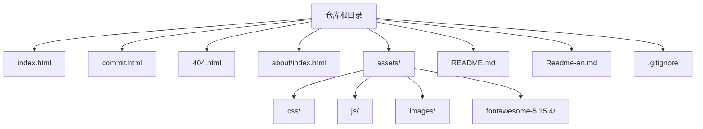
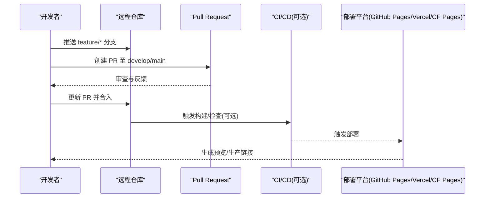
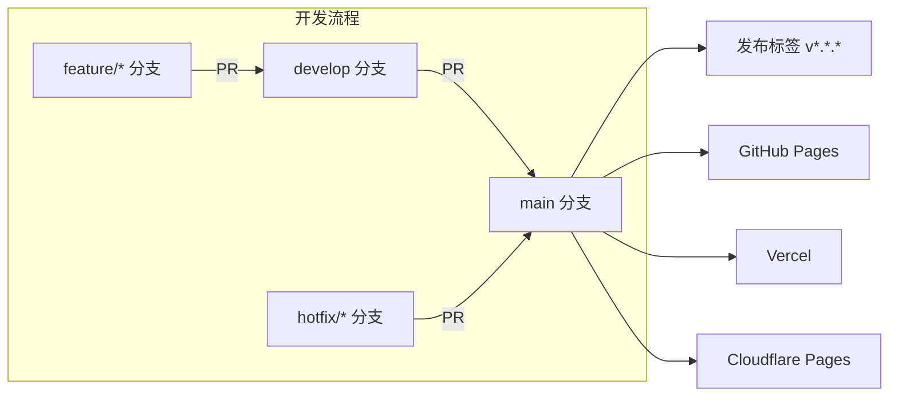

# 版本管理

<cite>
**本文引用的文件**
- [.gitignore](file://.gitignore)
- [README.md](file://README.md)
- [Readme-en.md](file://Readme-en.md)
</cite>

## 目录
1. [简介](#简介)
2. [项目结构](#项目结构)
3. [核心组件](#核心组件)
4. [架构总览](#架构总览)
5. [详细组件分析](#详细组件分析)
6. [依赖关系分析](#依赖关系分析)
7. [性能与效率建议](#性能与效率建议)
8. [故障排查指南](#故障排查指南)
9. [结论](#结论)
10. [附录：Git 操作示例与最佳实践](#附录git-操作示例与最佳实践)

## 简介
本文件为 web_tool 项目的版本管理文档，聚焦 Git 工作流、分支策略、提交规范、合并策略、标签管理与 .gitignore 配置。项目为纯静态网站（HTML/CSS/JS），无后端构建流程，适合通过 GitHub Pages、Vercel、Cloudflare Pages 等平台直接部署。文档旨在帮助开发者以统一、可追溯的方式协作与维护代码。

## 项目结构
仓库根目录包含站点页面、资源与说明文档；当前未包含构建脚本或包管理配置文件，因此版本管理重点在于分支与标签的治理以及忽略规则的配置。

图表来源
- [README.md:298-314](file://README.md#L298-L314)

章节来源
- [README.md:298-314](file://README.md#L298-L314)

## 核心组件
- 分支策略：主分支 main 用于生产发布；开发分支 develop 用于集成与测试；功能分支 feature/* 用于独立特性开发；修复分支 hotfix/* 用于紧急修复。
- 提交规范：采用约定式提交（Conventional Commits）格式，便于自动生成变更日志与版本。
- 合并策略：功能分支通过 Pull Request 合并至 develop，稳定后合并至 main；热修复走 hotfix 分支快速回滚与发布。
- 标签管理：使用语义化版本号（SemVer）vMAJOR.MINOR.PATCH，配合发布标签记录每次正式版本。
- 忽略规则：通过 .gitignore 排除本地编辑工具目录等不应纳入版本控制的文件与目录。

章节来源
- [.gitignore:1-2](file://.gitignore#L1-L2)
- [README.md:22-43](file://README.md#L22-L43)

## 架构总览
下图展示从开发到发布的典型 Git 工作流与平台部署关系。

图表来源
- [README.md:22-43](file://README.md#L22-L43)
- [README.md:149-240](file://README.md#L149-L240)

## 详细组件分析

### 分支管理策略
- 主分支 main
  - 用途：稳定可发布的代码基线，对应生产环境。
  - 保护建议：限制直接推送，仅允许通过 PR 合并。
- 开发分支 develop
  - 用途：集成各功能分支，进行联调与测试。
  - 维护方式：定期清理已合并的功能分支。
- 功能分支 feature/*
  - 命名：feature/<描述>，如 feature/add-search。
  - 生命周期：从 develop 切出，完成后通过 PR 合并回 develop。
- 修复分支 hotfix/*
  - 命名：hotfix/<问题描述>，如 hotfix/fix-404-link。
  - 生命周期：从 main 切出，修复后同时合并回 main 与 develop，并打标签。

章节来源
- [README.md:22-43](file://README.md#L22-L43)

### 提交规范（Commit Message）
- 格式：类型(范围): 描述
  - 类型：feat、fix、docs、style、refactor、test、chore 等
  - 范围：模块或文件路径，如 assets/css、index.html
  - 描述：简明扼要，动词开头，避免无意义信息
- 示例（不展示具体代码内容）
  - feat(index): 新增分类区块
  - fix(commit): 修复提交表单校验逻辑
  - docs(readme): 更新部署说明
- 好处：便于自动化生成变更日志、定位问题与回溯历史。

章节来源
- [README.md:242-296](file://README.md#L242-L296)

### 代码审查与合并策略
- 审查流程
  - 所有功能通过 Pull Request 进入 develop/main。
  - 至少一名成员审查通过后合并。
  - 必要时附加测试用例或截图验证。
- 合并策略
  - 功能分支：squash merge 或 rebase merge，保持历史整洁。
  - 热修复：fast-forward merge，确保线性历史。
- 分支保护
  - 启用分支保护规则，要求 PR 审查与状态检查通过。

章节来源
- [README.md:22-43](file://README.md#L22-L43)

### 标签管理（版本发布）
- 版本号规则：遵循 SemVer vMAJOR.MINOR.PATCH
  - MAJOR：破坏性更新
  - MINOR：向后兼容的新增功能
  - PATCH：向后兼容的问题修复
- 发布流程
  - 在 main 分支上创建标签：git tag -a v1.2.3 -m "发布说明"
  - 推送标签至远程：git push origin v1.2.3
  - 在部署平台选择对应标签进行发布
- 历史版本管理
  - 通过标签与分支切换回滚到任意历史版本
  - 结合 README 中的部署说明，在不同平台发布不同版本

章节来源
- [README.md:149-240](file://README.md#L149-L240)

### .gitignore 配置说明
- 当前忽略项：/edit_tool/
  - 作用：排除本地编辑工具生成的目录，避免污染仓库
- 建议补充（按需添加）
  - 系统临时文件：.DS_Store、Thumbs.db
  - 编辑器配置：.vscode、.idea
  - 构建产物：dist、build（如有）
  - 环境变量：*.env、.env.local
  - 第三方库：node_modules（如引入包管理）
- 注意事项
  - 若团队共用忽略规则，可将 .gitignore 作为模板纳入仓库
  - 谨慎忽略重要文件，避免误删导致丢失

章节来源
- [.gitignore:1-2](file://.gitignore#L1-L2)

## 依赖关系分析
本项目为静态站点，无运行时依赖与构建脚本，版本管理主要围绕 Git 分支、标签与平台部署。

图表来源
- [README.md:149-240](file://README.md#L149-L240)

章节来源
- [README.md:149-240](file://README.md#L149-L240)

## 性能与效率建议
- 小步提交：频繁提交小而清晰的变更，便于回滚与审查
- 分支隔离：每个功能独立分支，减少冲突
- 标签优先：发布前打标签，便于快速定位与回滚
- 忽略优化：完善 .gitignore，减小仓库体积与传输开销
- 平台缓存：利用 Vercel/CF Pages 的静态资源缓存策略提升加载速度

[本节为通用建议，无需特定文件引用]

## 故障排查指南
- 常见问题
  - 资源路径错误：检查相对路径与部署根目录设置
  - 提交失败：确认分支保护规则与权限
  - 部署失败：检查平台配置与分支/标签选择
- 处理步骤
  - 查看最近提交与标签，定位问题版本
  - 切换至已知稳定版本进行对比
  - 逐步回退提交，定位引入问题的变更
  - 修正后重新提交并打新标签

章节来源
- [README.md:316-341](file://README.md#L316-L341)

## 结论
通过规范的分支策略、提交约定、合并流程与标签管理，web_tool 项目可在多平台上实现稳定、可追溯的版本发布。配合完善的 .gitignore 与平台部署能力，团队协作与持续交付将更加高效可靠。

[本节为总结性内容，无需特定文件引用]

## 附录：Git 操作示例与最佳实践
- 克隆与初始化
  - git clone <仓库地址>
  - cd web_tool
- 分支操作
  - 新建功能分支：git checkout -b feature/<描述>
  - 同步 develop：git fetch origin && git rebase origin/develop
- 提交与推送
  - git add .
  - git commit -m "feat(scope): 描述"
  - git push origin feature/<描述>
- 合并与发布
  - 创建 PR 至 develop/main
  - 审查通过后合并
  - 打标签：git tag -a v1.2.3 -m "发布说明"
  - 推送标签：git push origin v1.2.3
- 回滚与恢复
  - 切换至稳定标签：git checkout v1.2.3
  - 基于标签创建修复分支：git checkout -b hotfix/fix-issue v1.2.3

[本节为通用操作指导，无需特定文件引用]