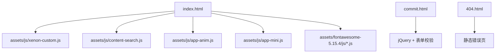
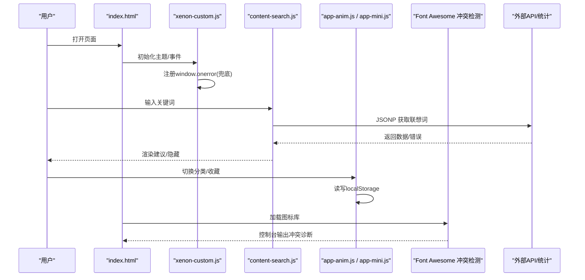
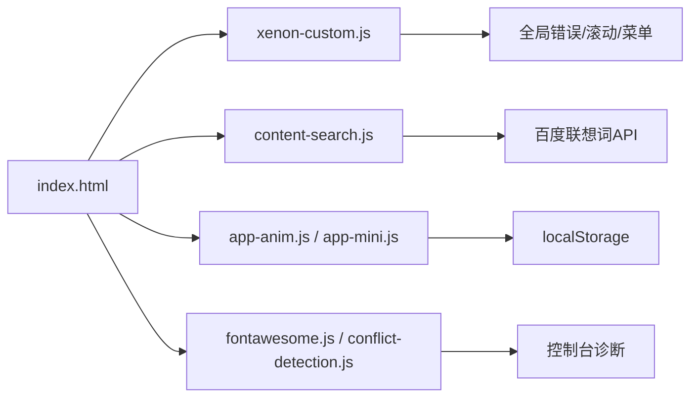
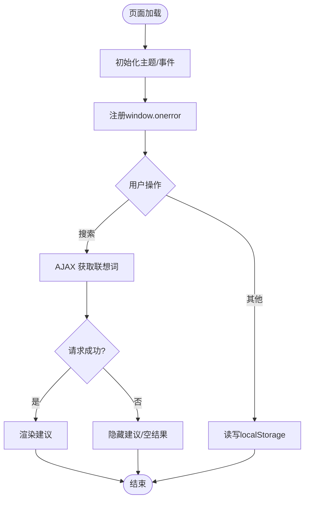

# 监控与维护

<cite>
**本文引用的文件**
- [index.html](file://index.html)
- [commit.html](file://commit.html)
- [404.html](file://404.html)
- [README.md](file://README.md)
- [assets/js/xenon-custom.js](file://assets/js/xenon-custom.js)
- [assets/js/content-search.js](file://assets/js/content-search.js)
- [assets/js/app-anim.js](file://assets/js/app-anim.js)
- [assets/js/app-mini.js](file://assets/js/app-mini.js)
- [assets/fontawesome-5.15.4/js/conflict-detection.js](file://assets/fontawesome-5.15.4/js/conflict-detection.js)
- [assets/fontawesome-5.15.4/js/fontawesome.js](file://assets/fontawesome-5.15.4/js/fontawesome.js)
</cite>

## 目录
1. [简介](#简介)
2. [项目结构](#项目结构)
3. [核心组件](#核心组件)
4. [架构总览](#架构总览)
5. [详细组件分析](#详细组件分析)
6. [依赖关系分析](#依赖关系分析)
7. [性能考虑](#性能考虑)
8. [故障排查指南](#故障排查指南)
9. [结论](#结论)
10. [附录](#附录)

## 简介
本文件面向运维与开发团队，提供该静态导航站点的“监控与维护”完整方案。内容覆盖：
- 错误日志收集：JavaScript 错误捕获、网络请求监控、用户行为埋点
- 性能监控：页面加载时间、资源使用率、用户体验指标
- 用户反馈处理：问题收集、优先级排序、修复跟踪
- 日常维护：文件备份、日志清理、缓存管理
- 监控仪表板配置示例与维护脚本建议

本项目为纯前端静态站点（HTML/CSS/JS），无后端服务，因此监控主要基于浏览器端能力与第三方统计/CDN/平台能力实现。

## 项目结构
- 入口页面 index.html 承载导航内容与外部资源引用
- 提交页 commit.html 提供用户提交表单（当前仅前端校验）
- 404.html 用于未命中路由时的友好提示
- assets/js 包含主题交互、动画、搜索等逻辑
- assets/fontawesome-5.15.4 提供图标库及冲突检测脚本
- README.md 提供部署与常见问题说明

图表来源
- [index.html:1-35](file://index.html#L1-L35)
- [commit.html:1-30](file://commit.html#L1-L30)
- [404.html:1-3](file://404.html#L1-L3)

章节来源
- [index.html:1-35](file://index.html#L1-L35)
- [README.md:298-314](file://README.md#L298-L314)

## 核心组件
- 全局错误兜底：在主题初始化时注册 window.onerror，确保异常时仍能移除加载遮罩，提升可用性
- 搜索建议：通过 JSONP 调用百度联想词接口，具备成功/失败分支处理
- 本地存储：使用 localStorage 保存用户偏好（如搜索分类、最近访问列表）
- 第三方库：Font Awesome 冲突检测脚本可输出控制台诊断信息，辅助定位资源冲突

章节来源
- [assets/js/xenon-custom.js:43-56](file://assets/js/xenon-custom.js#L43-L56)
- [assets/js/content-search.js:1-91](file://assets/js/content-search.js#L1-L91)
- [assets/js/app-anim.js:600-604](file://assets/js/app-anim.js#L600-L604)
- [assets/js/app-anim.js:816-847](file://assets/js/app-anim.js#L816-L847)
- [assets/fontawesome-5.15.4/js/conflict-detection.js:99-163](file://assets/fontawesome-5.15.4/js/conflict-detection.js#L99-L163)

## 架构总览
下图展示从页面加载到关键交互的监控链路：错误捕获、网络请求、用户行为、本地存储与第三方统计的集成点。

图表来源
- [assets/js/xenon-custom.js:43-56](file://assets/js/xenon-custom.js#L43-L56)
- [assets/js/content-search.js:1-91](file://assets/js/content-search.js#L1-L91)
- [assets/js/app-anim.js:600-604](file://assets/js/app-anim.js#L600-L604)
- [assets/js/app-anim.js:816-847](file://assets/js/app-anim.js#L816-L847)
- [assets/fontawesome-5.15.4/js/conflict-detection.js:99-163](file://assets/fontawesome-5.15.4/js/conflict-detection.js#L99-L163)

## 详细组件分析

### 错误日志收集
- JavaScript 错误捕获
  - 在主题初始化中设置 window.onerror，作为兜底保障，避免异常导致加载遮罩无法关闭
  - 建议在业务层增加 try/catch 包裹异步操作，并统一上报错误上下文（URL、堆栈、设备信息）
- 网络请求监控
  - 搜索建议通过 jQuery AJAX(JSONP) 发起，已包含 success/error 分支；可在 beforeSend/success/error 中记录耗时与状态码
  - 对 fetch 请求（如首页随机一言）已在 catch 中打印错误，建议统一封装并上报
- 用户行为分析
  - 可通过自定义事件或埋点函数记录关键交互（搜索、点击、分类切换）
  - 结合第三方统计（如百度统计、Google Analytics）进行页面访问与转化漏斗分析

章节来源
- [assets/js/xenon-custom.js:43-56](file://assets/js/xenon-custom.js#L43-L56)
- [assets/js/content-search.js:1-91](file://assets/js/content-search.js#L1-L91)
- [index.html:304-313](file://index.html#L304-L313)

### 性能监控
- 页面加载时间
  - 利用 Performance API（PerformanceObserver、performance.mark/measure）标记首屏、关键资源加载完成时间点
  - 在 Font Awesome 中已兼容 performance 对象，可作为参考接入
- 资源使用率
  - 监控内存占用（performance.memory，若可用）、长任务（Long Tasks API）、大图片懒加载（lozad.js）
- 用户体验指标
  - 采集 FCP/LCP/CLS 等指标，结合 CDN/平台面板（Vercel/Cloudflare/GitHub Pages）查看
  - 对第三方脚本（天气、一言）增加超时与降级策略，避免阻塞主线程

章节来源
- [assets/fontawesome-5.15.4/js/fontawesome.js:138-163](file://assets/fontawesome-5.15.4/js/fontawesome.js#L138-L163)
- [index.html:270-296](file://index.html#L270-L296)
- [index.html:304-313](file://index.html#L304-L313)

### 用户反馈处理流程
- 问题报告收集
  - 提交页 commit.html 提供表单校验与提交按钮禁用态，便于引导用户填写必要信息
  - 当前为纯前端校验，未对接后端；可接入 Serverless/表单服务（如 Vercel Functions、Formspree）
- 优先级排序
  - 根据影响面（全站/单功能）、严重性（崩溃/体验下降/轻微）、频率（高频/偶发）划分 P0-P3
- 修复跟踪
  - 使用 Issue/PR 追踪，关联版本标签与回滚策略；发布后回归验证

章节来源
- [commit.html:178-382](file://commit.html#L178-L382)
- [README.md:242-276](file://README.md#L242-L276)

### 日常维护任务
- 文件备份
  - 定期备份仓库与静态资源（images、fonts、css、js），建议使用 Git 版本控制与远端镜像
- 日志清理
  - 浏览器端无服务端日志；如需集中化日志，需引入前端日志上报服务并按策略归档
- 缓存管理
  - Nginx 静态资源开启 gzip 与长期缓存（见 README 示例）
  - 前端使用 localStorage 持久化用户偏好，注意容量限制与键名规范

章节来源
- [README.md:88-116](file://README.md#L88-L116)
- [assets/js/app-anim.js:600-604](file://assets/js/app-anim.js#L600-L604)
- [assets/js/app-anim.js:816-847](file://assets/js/app-anim.js#L816-L847)

### 监控仪表板配置示例
- 前端埋点
  - 接入百度统计/Google Analytics，在 index.html 头部注入统计代码
  - 自定义事件：搜索、分类切换、外链点击、表单提交
- CDN/平台面板
  - GitHub Pages/Vercel/Cloudflare Pages 均提供访问统计与错误日志
- 第三方服务
  - 天气/一言等外部接口增加超时与重试，失败时降级显示默认内容

章节来源
- [README.md:329-335](file://README.md#L329-L335)
- [index.html:270-296](file://index.html#L270-L296)
- [index.html:304-313](file://index.html#L304-L313)

### 维护脚本建议
- 构建与检查
  - HTML/CSS/JS 语法检查（ESLint/Prettier），资源压缩（terser/cssnano）
- 自动化测试
  - 关键交互用例（搜索、分类切换、表单校验）使用 Puppeteer/Cypress 编写端到端测试
- 发布与回滚
  - 通过 CI/CD 自动部署至多平台（GitHub Pages/Vercel/Cloudflare），失败自动回滚

[本节为通用实践建议，不直接分析具体文件]

## 依赖关系分析
- 主题与交互
  - xenon-custom.js 负责全局初始化与事件绑定
  - content-search.js 负责搜索联想词
  - app-anim.js / app-mini.js 负责动画与本地存储
- 第三方库
  - Font Awesome 冲突检测脚本可输出控制台诊断，帮助发现样式/脚本冲突
  - jQuery、Bootstrap、Popper、Fancybox 等 UI 库
- 外部接口
  - 天气小部件、一言接口、百度联想词

图表来源
- [assets/js/xenon-custom.js:43-56](file://assets/js/xenon-custom.js#L43-L56)
- [assets/js/content-search.js:1-91](file://assets/js/content-search.js#L1-L91)
- [assets/js/app-anim.js:600-604](file://assets/js/app-anim.js#L600-L604)
- [assets/fontawesome-5.15.4/js/conflict-detection.js:99-163](file://assets/fontawesome-5.15.4/js/conflict-detection.js#L99-L163)
- [index.html:1-35](file://index.html#L1-L35)

章节来源
- [assets/js/xenon-custom.js:43-56](file://assets/js/xenon-custom.js#L43-L56)
- [assets/js/content-search.js:1-91](file://assets/js/content-search.js#L1-L91)
- [assets/js/app-anim.js:600-604](file://assets/js/app-anim.js#L600-L604)
- [assets/fontawesome-5.15.4/js/conflict-detection.js:99-163](file://assets/fontawesome-5.15.4/js/conflict-detection.js#L99-L163)
- [index.html:1-35](file://index.html#L1-L35)

## 性能考虑
- 资源优化
  - 启用 gzip/HTTP 缓存，减少重复下载
  - 图片懒加载与 WebP 格式，降低带宽
- 脚本优化
  - 按需加载第三方脚本，避免阻塞首屏
  - 合并/压缩 JS/CSS，减少请求数
- 监控指标
  - 首屏时间、可交互时间、资源大小、错误率、外部接口成功率

[本节为通用指导，不直接分析具体文件]

## 故障排查指南
- 常见错误
  - 资源加载失败：检查路径、CORS、CDN 可用性
  - 第三方接口失败：增加超时与降级，记录错误日志
  - 样式/脚本冲突：借助 Font Awesome 冲突检测输出定位
- 定位方法
  - 浏览器开发者工具 Network/Console/Performance
  - 平台面板（Vercel/Cloudflare/GitHub Pages）的错误日志
- 恢复策略
  - 快速回滚到上一稳定版本
  - 临时下线问题模块，优先恢复可用性

章节来源
- [assets/fontawesome-5.15.4/js/conflict-detection.js:99-163](file://assets/fontawesome-5.15.4/js/conflict-detection.js#L99-L163)
- [README.md:318-341](file://README.md#L318-L341)

## 结论
该项目为纯前端静态站点，监控与维护应聚焦于浏览器端能力与平台/CDN 能力。通过完善错误捕获、网络监控、用户行为埋点与性能指标采集，并结合平台面板与第三方统计，可建立完整的运维体系。配合规范的发布与回滚流程，能有效保障站点稳定性与用户体验。

[本节为总结，不直接分析具体文件]

## 附录

### 错误处理流程图（基于现有实现）

图表来源
- [assets/js/xenon-custom.js:43-56](file://assets/js/xenon-custom.js#L43-L56)
- [assets/js/content-search.js:1-91](file://assets/js/content-search.js#L1-L91)
- [assets/js/app-anim.js:600-604](file://assets/js/app-anim.js#L600-L604)

### 404 页面
- 当前 404.html 为极简提示页，建议补充返回首页链接与错误原因说明

章节来源
- [404.html:1-3](file://404.html#L1-L3)