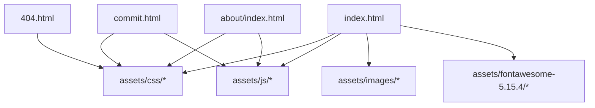
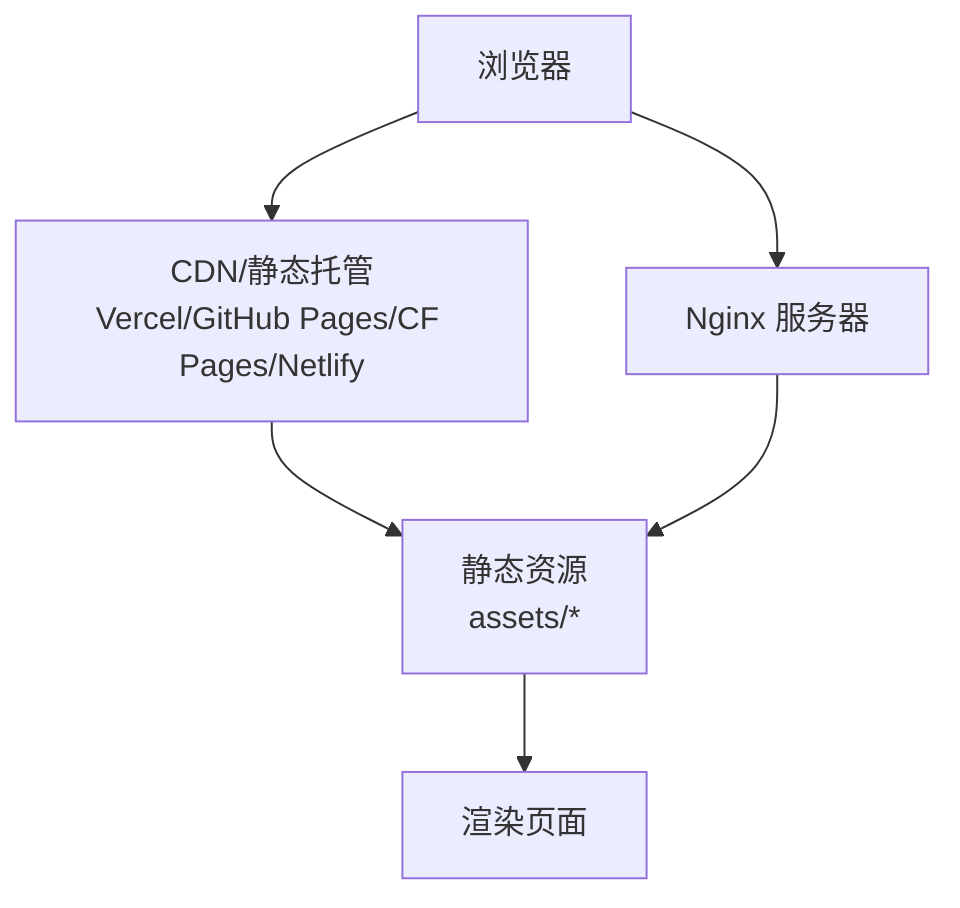
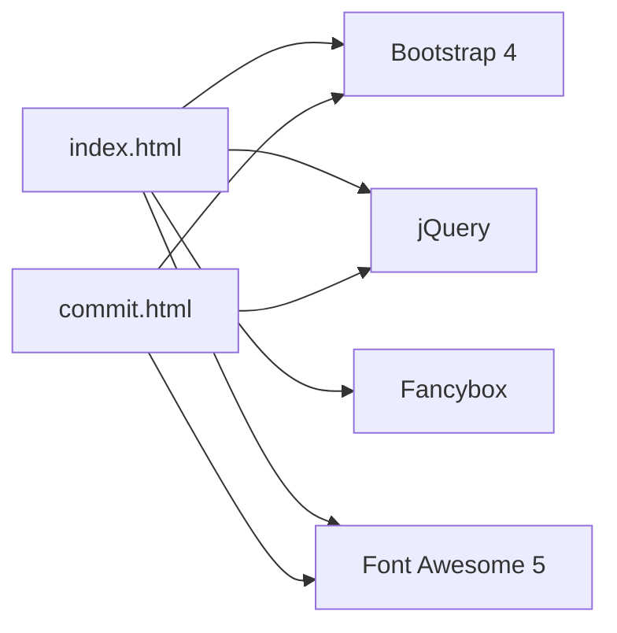
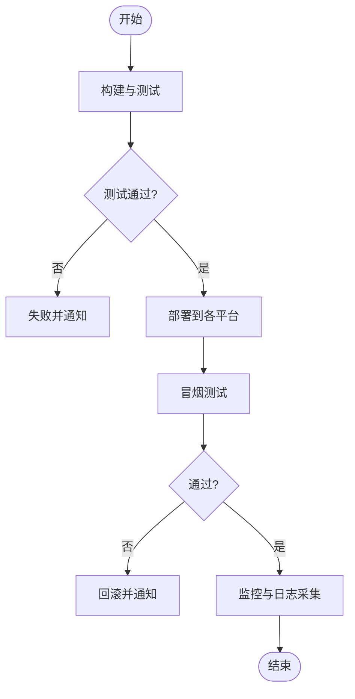

# 维护与更新

<cite>
**本文引用的文件**
- [README.md](file://README.md)
- [.gitignore](file://.gitignore)
- [index.html](file://index.html)
- [commit.html](file://commit.html)
- [404.html](file://404.html)
- [about/index.html](file://about/index.html)
</cite>

## 目录
1. [简介](#简介)
2. [项目结构](#项目结构)
3. [核心组件](#核心组件)
4. [架构总览](#架构总览)
5. [详细组件分析](#详细组件分析)
6. [依赖分析](#依赖分析)
7. [性能考虑](#性能考虑)
8. [故障排查指南](#故障排查指南)
9. [结论](#结论)
10. [附录](#附录)

## 简介
本文件面向“在线网址导航 - Web Tool”项目的维护与更新，提供版本管理、依赖更新、监控与维护工具、文档维护流程、故障排查与恢复以及自动化运维方案等完整实践。该项目为纯静态站点（HTML/CSS/JS），支持多种部署平台（Nginx、Vercel、GitHub Pages、Cloudflare Pages、Netlify），便于快速发布与回滚。

## 项目结构
仓库采用扁平化的静态站点结构，主要页面与资源分布如下：
- 根级页面：首页 index.html、提交页 commit.html、404 错误页 404.html
- 关于页：about/index.html
- 静态资源：assets/css、assets/js、assets/images、assets/fontawesome-5.15.4
- 配置与说明：README.md、Readme-en.md、.gitignore

图表来源
- [index.html:1-35](file://index.html#L1-L35)
- [commit.html:1-26](file://commit.html#L1-L26)

章节来源
- [README.md:298-314](file://README.md#L298-L314)

## 核心组件
- 首页 index.html：站点入口，引入样式与脚本，承载分类导航与内容展示。
- 提交页 commit.html：用户提交网站信息的表单页面，包含校验与成功提示逻辑。
- 404.html：自定义 404 错误页，配合 Nginx 配置实现友好错误体验。
- about/index.html：关于页面，用于展示站点信息与联系方式。
- README.md：部署指南、二次开发说明、常见问题与技术栈信息。

章节来源
- [index.html:1-35](file://index.html#L1-L35)
- [commit.html:1-26](file://commit.html#L1-L26)
- [README.md:242-314](file://README.md#L242-L314)

## 架构总览
作为纯静态站点，整体架构由浏览器直接请求 HTML/CSS/JS 资源构成，可部署在任意静态托管服务或 Nginx 服务器。

图表来源
- [README.md:47-147](file://README.md#L47-L147)
- [README.md:149-241](file://README.md#L149-L241)

## 详细组件分析

### 版本管理与 Git 工作流
- 分支策略建议
  - main：生产稳定分支，仅接受经过测试的变更。
  - develop：集成开发分支，日常功能合并目标。
  - feature/*：功能分支，从 develop 切出，完成后合并回 develop。
  - hotfix/*：紧急修复分支，从 main 切出，修复后同时合并到 main 和 develop。
- 提交规范
  - 使用语义化提交信息（如 feat、fix、docs、chore）。
  - 每次提交附带最小必要变更，避免大杂烩提交。
- 标签与发布
  - 使用语义化版本号（vX.Y.Z）对发布打 tag。
  - 通过 CI/CD 自动构建并部署到各平台。
- 回滚策略
  - 基于 tag 快速回滚到上一稳定版本。
  - 在托管平台（如 Vercel、GitHub Pages）按历史部署快照一键回滚。

章节来源
- [README.md:220-241](file://README.md#L220-L241)

### 发布流程（多平台）
- Nginx 部署
  - 上传静态文件至服务器指定目录。
  - 配置 server 块、启用 gzip、设置缓存与 404 页面。
  - 启用站点、测试配置、重启服务并设置开机自启。
  - 可选：使用 Let's Encrypt 配置 HTTPS 并设置自动续期。
- Vercel 部署（推荐）
  - 通过 Dashboard 导入 GitHub 仓库，选择 Other 框架，留空构建命令与输出目录。
  - 或通过 CLI 登录并执行 vercel 与 vercel --prod 完成部署。
  - 可在 Settings -> Domains 添加自定义域名并配置 DNS。
- 其他平台
  - GitHub Pages：启用 Pages，选择分支与目录。
  - Cloudflare Pages：连接仓库，留空构建设置后部署。
  - Netlify：Import existing project，留空构建命令与发布目录。

章节来源
- [README.md:47-147](file://README.md#L47-L147)
- [README.md:149-241](file://README.md#L149-L241)

### 依赖更新管理
- 第三方库识别
  - CSS：Bootstrap 4、Fancybox、自定义主题样式。
  - JS：jQuery、交互脚本（如 content-search.js、bootstrap.min.js 等）。
  - 图标库：Font Awesome 5.15.4。
- 更新策略
  - 安全优先：关注 CVE 与安全公告，及时升级受影响的库。
  - 兼容性检查：升级前在本地预览验证页面布局与交互；必要时进行渐进式灰度发布。
  - 锁定版本：在 assets 中保留明确版本号（如 bootstrap.min-4.3.1.css），便于追踪与回滚。
- 自动化建议
  - 使用 Dependabot 或 Renovate 监控依赖更新并生成 PR。
  - 在 CI 中运行基础回归测试（如截图对比或关键路径点击）。

章节来源
- [index.html:17-31](file://index.html#L17-L31)
- [commit.html:15-25](file://commit.html#L15-L25)
- [README.md:343-349](file://README.md#L343-L349)

### 监控与维护工具
- 错误日志收集
  - 前端：通过全局错误捕获与上报（例如 window.onerror、unhandledrejection）将错误发送至后端或日志服务。
  - 服务端：Nginx 访问与错误日志开启，集中采集与分析。
- 性能监控
  - 使用浏览器开发者工具 Performance 面板评估加载时间。
  - 利用 Lighthouse 进行 SEO、性能、可访问性审计。
  - 结合 CDN 与 Nginx 缓存策略提升首屏速度。
- 用户反馈处理
  - 在提交页完善表单校验与成功提示，减少无效提交。
  - 建立 Issue 模板与反馈渠道，定期整理与修复问题。

章节来源
- [commit.html:178-200](file://commit.html#L178-L200)
- [README.md:316-342](file://README.md#L316-L342)

### 文档维护流程
- 代码注释规范
  - 关键函数与复杂逻辑需添加行内注释，说明输入、输出与边界条件。
  - 对外暴露的 API（如有）需补充接口文档。
- 变更日志记录
  - 使用 CHANGELOG.md 记录每次发布的变更（新增、修复、破坏性变更）。
  - 与版本 tag 对应，便于回溯。
- 文档同步更新
  - 修改 README.md 中的部署指南、技术栈与常见问题。
  - 保持中英文文档一致（README.md 与 Readme-en.md）。

章节来源
- [README.md:242-314](file://README.md#L242-L314)

### 故障排查与恢复
- 常见问题诊断
  - 图片/样式加载失败：检查相对路径与资源是否存在。
  - 提交功能后端对接：根据 README 指引接入 Serverless Functions 或第三方表单服务。
  - 统计与 SEO：按需集成统计代码与完善 meta 标签。
- 数据备份与恢复
  - 静态站点以 Git 为主备份源，确保所有变更纳入版本控制。
  - 重要配置（如 Nginx 配置、域名证书）单独备份。
- 服务重启与回滚
  - Nginx：使用 systemctl restart nginx 重启服务。
  - 托管平台：按历史部署快照回滚到上一个稳定版本。

章节来源
- [README.md:316-342](file://README.md#L316-L342)
- [README.md:118-147](file://README.md#L118-L147)

## 依赖分析
项目依赖主要为前端静态资源，耦合度低、易于替换与升级。

图表来源
- [index.html:17-31](file://index.html#L17-L31)
- [commit.html:15-25](file://commit.html#L15-L25)

章节来源
- [index.html:17-31](file://index.html#L17-L31)
- [commit.html:15-25](file://commit.html#L15-L25)

## 性能考虑
- 启用 gzip 压缩与静态资源缓存，降低带宽与提升加载速度。
- 使用 CDN 分发静态资源，就近加速。
- 精简与合并资源，避免重复加载。
- 合理设置缓存头（如 immutable），减少不必要的请求。
- 使用懒加载与按需加载策略优化首屏。

章节来源
- [README.md:86-116](file://README.md#L86-L116)

## 故障排查指南
- 页面空白或样式丢失
  - 检查资源路径是否正确，确认 assets 目录结构与引用无误。
- 提交表单无响应
  - 检查表单校验逻辑与后端接口连通性，查看控制台错误。
- 404 页面未生效
  - 确认 Nginx error_page 配置与 404.html 存在且路径正确。
- HTTPS 证书问题
  - 使用 certbot 重新申请并配置自动续期。

章节来源
- [README.md:110-147](file://README.md#L110-L147)
- [commit.html:178-200](file://commit.html#L178-L200)

## 结论
本项目为纯静态站点，具备简单、易部署、易维护的特点。通过规范的版本管理、严格的依赖更新策略、完善的监控与维护流程，以及清晰的故障排查与恢复方案，可保障站点的稳定性与可演进性。建议结合 CI/CD 与托管平台的自动化能力，进一步提升发布效率与可靠性。

## 附录

### 维护脚本示例（概念性步骤）
- 本地构建与预览
  - 启动本地 HTTP 服务器预览站点。
- 自动化构建与部署
  - 在 CI 中安装依赖、执行构建（若需要）、运行测试、打包产物。
  - 调用平台 CLI（如 vercel）或推送至静态托管仓库触发部署。
- 健康检查与告警
  - 部署后执行冒烟测试（访问关键页面、检查状态码）。
  - 配置告警通知（邮件/IM）以便快速响应异常。

[本节为通用实践说明，不直接分析具体文件]

### 自动化运维方案（概念性流程图）

[本节为通用流程说明，不直接分析具体文件]