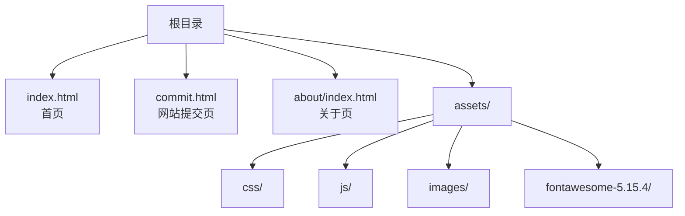
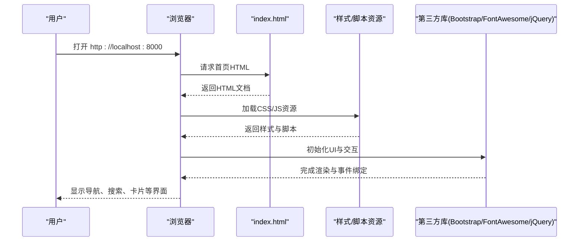
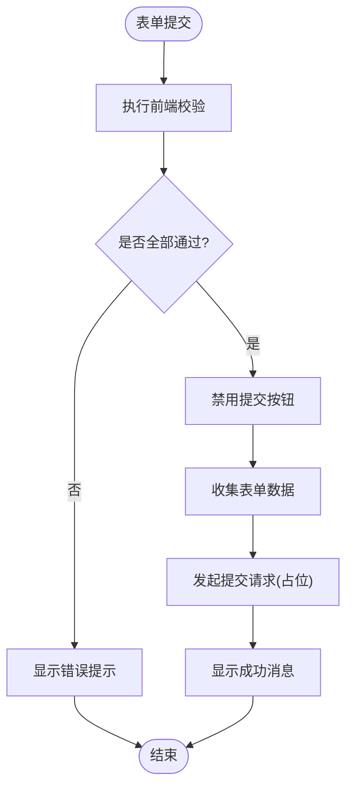
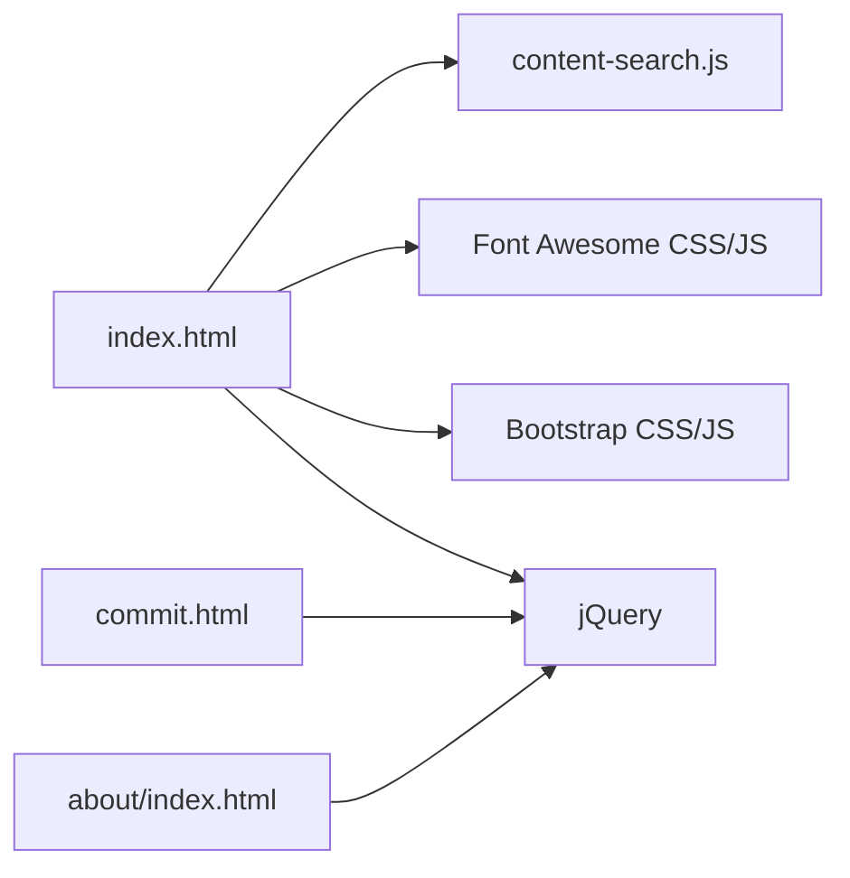

# 贡献指南

<cite>
**本文引用的文件**
- [README.md](file://README.md)
- [index.html](file://index.html)
- [commit.html](file://commit.html)
- [about/index.html](file://about/index.html)
- [assets/css/custom-style.css](file://assets/css/custom-style.css)
- [.gitignore](file://.gitignore)
</cite>

## 目录
1. [简介](#简介)
2. [项目结构](#项目结构)
3. [核心组件](#核心组件)
4. [架构总览](#架构总览)
5. [详细组件分析](#详细组件分析)
6. [依赖关系分析](#依赖关系分析)
7. [性能与可维护性建议](#性能与可维护性建议)
8. [测试与验证](#测试与验证)
9. [开发环境与工具](#开发环境与工具)
10. [代码规范与标准](#代码规范与标准)
11. [提交流程与分支管理](#提交流程与分支管理)
12. [功能开发与重构建议](#功能开发与重构建议)
13. [常见问题解答](#常见问题解答)
14. [结语](#结语)

## 简介
本项目是一个纯静态的在线网址导航工具，采用 HTML + CSS + JavaScript（jQuery）构建，支持响应式布局、日间/夜间模式切换、分类导航与快速搜索，并提供“网站提交”页面用于收集用户提交的链接。项目无需后端即可运行，适合个人或团队使用，并支持多种部署方式（Nginx、Vercel、GitHub Pages、Cloudflare Pages、Netlify）。

本贡献指南面向希望参与项目开发与维护的贡献者，涵盖环境搭建、代码规范、提交流程、功能开发、测试验证及常见问题等内容，帮助新贡献者快速上手。

## 项目结构
项目采用扁平化的静态站点结构，主要资源集中在 assets 目录下，页面以 HTML 为主，样式与脚本通过引入第三方库与自定义样式实现。

**图表来源**
- [README.md:298-314](file://README.md#L298-L314)

**章节来源**
- [README.md:298-314](file://README.md#L298-L314)

## 核心组件
- 首页（index.html）：包含侧边栏导航、顶部搜索、分类卡片展示等核心交互与内容组织。
- 提交页（commit.html）：提供表单收集网站信息，含前端校验与提交逻辑占位。
- 关于页（about/index.html）：展示作者信息与联系方式。
- 样式与脚本：通过 Bootstrap、Font Awesome、jQuery 等第三方库增强 UI 与交互；custom-style.css 承载项目定制样式。

**章节来源**
- [index.html:1-35](file://index.html#L1-L35)
- [commit.html:1-26](file://commit.html#L1-L26)
- [about/index.html:1-26](file://about/index.html#L1-L26)
- [assets/css/custom-style.css:1-126](file://assets/css/custom-style.css#L1-L126)

## 架构总览
从浏览器加载到渲染的核心流程如下：

**图表来源**
- [index.html:17-31](file://index.html#L17-L31)

**章节来源**
- [index.html:17-31](file://index.html#L17-L31)

## 详细组件分析

### 首页（index.html）
- 负责页面骨架、导航菜单、搜索区域与分类卡片展示。
- 通过引入 jQuery 与 content-search.js 实现搜索相关功能。
- 使用 Bootstrap 栅格与 Font Awesome 图标提升视觉体验。

关键要点
- 头部资源引用顺序合理，确保样式优先于脚本执行。
- 搜索框支持多引擎选择与热词提示。
- 分类卡片采用统一模板结构，便于扩展与维护。

**章节来源**
- [index.html:17-31](file://index.html#L17-L31)
- [index.html:318-567](file://index.html#L318-L567)
- [index.html:580-800](file://index.html#L580-L800)

### 提交页（commit.html）
- 提供表单字段：网站名称、地址、分类、描述、关键词、邮箱、联系方式。
- 内置前端校验：必填项检查、URL 格式校验、邮箱格式校验。
- 提交按钮在提交过程中禁用并显示加载状态，防止重复提交。

流程图（表单校验与提交）

**图表来源**
- [commit.html:286-379](file://commit.html#L286-L379)

**章节来源**
- [commit.html:199-379](file://commit.html#L199-L379)

### 关于页（about/index.html）
- 展示作者简介、技术栈、工作理念与联系方式。
- 使用内联样式与第三方图标库美化页面。
- 集成统计脚本（如 51.la），便于访问数据分析。

**章节来源**
- [about/index.html:24-26](file://about/index.html#L24-L26)
- [about/index.html:239-241](file://about/index.html#L239-L241)

### 样式系统（assets/css/custom-style.css）
- 覆盖全局字体大小、导航宽度、滚动条隐藏等基础样式。
- 定义搜索热词下拉、主题色、网格背景等视觉效果。
- 保持与主题样式（style-*.css）和框架样式（bootstrap.min.css）的兼容。

**章节来源**
- [assets/css/custom-style.css:1-126](file://assets/css/custom-style.css#L1-L126)

## 依赖关系分析
项目依赖的主要外部资源包括：
- Bootstrap 4：栅格系统与组件样式。
- Font Awesome 5：图标库。
- jQuery：DOM 操作与事件处理。
- 其他插件：fancybox、lozad、theia-sticky-sidebar 等（按需引入）。

**图表来源**
- [index.html:17-31](file://index.html#L17-L31)
- [commit.html:285-286](file://commit.html#L285-L286)
- [about/index.html:335-336](file://about/index.html#L335-L336)

**章节来源**
- [index.html:17-31](file://index.html#L17-L31)
- [commit.html:285-286](file://commit.html#L285-L286)
- [about/index.html:335-336](file://about/index.html#L335-L336)

## 性能与可维护性建议
- 资源压缩与缓存：利用 Nginx 或 Vercel 配置启用 gzip 与静态资源缓存策略，减少首屏加载时间。
- 图片优化：使用 WebP 格式与懒加载（lozad）降低带宽占用。
- 样式复用：将通用样式抽取为独立模块，避免重复定义。
- 脚本模块化：将业务逻辑拆分为小函数，提高可读性与可测试性。
- 无障碍与 SEO：完善 meta 标签、alt 属性与语义化标签，提升可访问性与搜索引擎友好度。

[本节为通用建议，不直接分析具体文件]

## 测试与验证
由于项目为纯静态站点，测试重点在于兼容性、功能正确性与性能表现：
- 本地预览：使用任意 HTTP 服务器（Python http.server 或 Node http-server）启动服务，验证页面渲染与交互。
- 兼容性测试：在主流浏览器（Chrome、Firefox、Edge、Safari）与移动端设备上验证布局与功能。
- 搜索功能：验证多引擎跳转、热词提示与输入校验。
- 提交表单：验证必填项、URL 与邮箱格式校验，以及提交按钮状态变化。
- 性能测试：使用浏览器开发者工具的 Lighthouse 或 Network 面板评估加载时间与资源体积。

参考步骤
- 克隆仓库后，进入项目目录，运行本地服务器并访问 localhost:8000。
- 打开控制台与网络面板，观察资源加载与错误日志。
- 对关键交互进行手动回归测试，记录问题与复现步骤。

**章节来源**
- [README.md:22-43](file://README.md#L22-L43)

## 开发环境与工具
- 版本控制：Git（推荐 VS Code 或 GitHub Desktop）。
- 本地服务器：Python 3 的 http.server 或 Node.js 的 http-server。
- 编辑器：VS Code（推荐安装 ESLint、Stylelint、Prettier 等插件以提升编码体验）。
- 部署平台：Vercel（推荐）、GitHub Pages、Cloudflare Pages、Netlify。

快速开始
- 克隆仓库并进入目录。
- 使用 Python 或 Node 启动本地服务器。
- 在浏览器中访问本地地址查看效果。

**章节来源**
- [README.md:22-43](file://README.md#L22-L43)

## 代码规范与标准
- HTML 语义化：
  - 使用合适的标题层级（h1-h6）与列表结构。
  - 为图片添加 alt 属性，确保可访问性。
  - 合理使用 section、article、nav、main 等语义标签。
- CSS 规范：
  - 遵循 BEM 命名约定或项目现有命名风格，保持类名清晰一致。
  - 避免内联样式，尽量集中到样式文件中。
  - 使用变量统一管理颜色、字号与间距，便于主题切换。
- JavaScript 规范：
  - 使用 const/let，避免全局变量污染。
  - 函数职责单一，命名明确，注释必要逻辑。
  - 事件绑定与 DOM 操作分离，便于维护与测试。
- 资源管理：
  - 静态资源路径相对化，避免硬编码绝对路径。
  - 第三方库版本锁定，避免升级导致的不兼容。

[本节为通用规范建议，不直接分析具体文件]

## 提交流程与分支管理
- 分支策略：
  - main：稳定发布分支。
  - develop：日常开发分支。
  - feature/*：新功能分支。
  - fix/*：缺陷修复分支。
- 提交信息格式：
  - 类型：feat、fix、docs、style、refactor、test、chore。
  - 示例：feat: 新增搜索热词提示功能。
- Pull Request 流程：
  - 从 feature/* 或 fix/* 分支创建 PR 至 develop。
  - 在 PR 描述中说明变更内容与影响范围。
  - 通过代码审查与自动化检查后合并。
- .gitignore：
  - 忽略编辑工具生成目录（如 /edit_tool/），避免污染仓库。

**章节来源**
- [.gitignore:1-2](file://.gitignore#L1-L2)

## 功能开发与重构建议
- 新功能开发：
  - 在 index.html 中添加新的分类区块，遵循现有卡片模板结构。
  - 在 commit.html 中扩展表单字段与校验逻辑，确保用户体验一致。
  - 在 custom-style.css 中新增样式，避免覆盖已有样式。
- 代码重构：
  - 将重复的卡片结构抽取为模板片段，减少冗余。
  - 将搜索逻辑封装为独立模块，便于单元测试。
  - 统一样式变量，简化主题切换与维护。
- 最佳实践：
  - 使用语义化标签与无障碍属性，提升可访问性。
  - 优化图片与脚本加载，减少首屏时间。
  - 保持向后兼容，谨慎升级第三方库版本。

**章节来源**
- [README.md:242-296](file://README.md#L242-L296)
- [index.html:580-800](file://index.html#L580-L800)
- [commit.html:199-379](file://commit.html#L199-L379)
- [assets/css/custom-style.css:1-126](file://assets/css/custom-style.css#L1-L126)

## 常见问题解答
- 图片或样式加载失败：
  - 检查资源路径是否正确，确保相对路径引用准确。
- 网站提交功能的后端实现：
  - 当前提交逻辑为前端占位，可接入 Vercel Serverless Functions 或第三方表单服务（如 Formspree、Typeform）。
- 如何添加网站统计：
  - 可集成 Google Analytics、百度统计或 51.la（已在 about 页面集成示例）。
- 如何优化 SEO：
  - 完善 meta 标签（title、description、keywords），添加 sitemap.xml，并提交到搜索引擎收录。

**章节来源**
- [README.md:316-341](file://README.md#L316-L341)
- [about/index.html:239-241](file://about/index.html#L239-L241)

## 结语
感谢你对项目的关注与支持！欢迎通过 Issue 与 Pull Request 参与改进。建议在提交前完成本地测试与兼容性验证，并在 PR 中附上变更说明与截图（如有界面改动）。期待你的贡献让项目变得更好。

[本节为总结性内容，不直接分析具体文件]