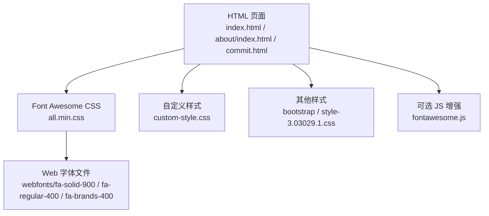
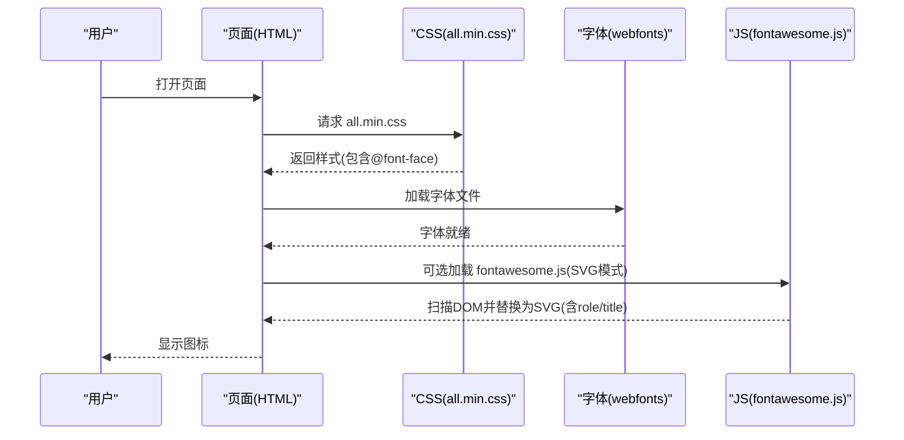
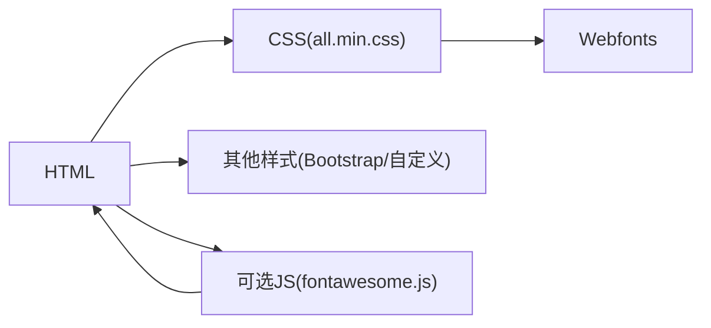

# 图标系统

<cite>
**本文引用的文件**
- [index.html](file://index.html)
- [about/index.html](file://about/index.html)
- [commit.html](file://commit.html)
- [assets/css/all.min.css](file://assets/fontawesome-5.15.4/css/all.min.css)
- [assets/css/all.css](file://assets/fontawesome-5.15.4/css/all.css)
- [assets/js/fontawesome.js](file://assets/fontawesome-5.15.4/js/fontawesome.js)
</cite>

## 目录
1. [简介](#简介)
2. [项目结构](#项目结构)
3. [核心组件](#核心组件)
4. [架构总览](#架构总览)
5. [详细组件分析](#详细组件分析)
6. [依赖关系分析](#依赖关系分析)
7. [性能考虑](#性能考虑)
8. [故障排除指南](#故障排除指南)
9. [结论](#结论)
10. [附录：使用示例与最佳实践](#附录使用示例与最佳实践)

## 简介
本文件面向本项目中的图标系统，聚焦 Font Awesome 5.15.4 的集成、版本管理、引入方式、样式分类（solid/regular/brands）、自定义与扩展（颜色、尺寸、动画）、性能优化策略（按需加载、缓存、CDN）以及可访问性与跨浏览器兼容性等最佳实践。文档基于仓库中实际代码与资源进行分析，并提供图示化的架构与流程说明。

## 项目结构
- 页面入口通过 HTML 引入 Font Awesome 的 CSS 与可选 JS，并在各处使用 i 标签配合 fa 前缀类名来渲染图标。
- 字体资源位于 assets/fontawesome-5.15.4/webfonts，CSS 提供基础样式、动画、旋转、翻转等能力；JS 用于 SVG 模式增强与兼容处理。
- 项目中同时存在自研 iconfont（iconfont-3.03029.1.css），与 Font Awesome 并存，分别承担不同场景的图标需求。

图表来源
- [index.html:17-30](file://index.html#L17-L30)
- [about/index.html:15-25](file://about/index.html#L15-L25)
- [commit.html:15-25](file://commit.html#L15-L25)
- [assets/css/all.min.css:1-5](file://assets/fontawesome-5.15.4/css/all.min.css#L1-L5)

章节来源
- [index.html:17-30](file://index.html#L17-L30)
- [about/index.html:15-25](file://about/index.html#L15-L25)
- [commit.html:15-25](file://commit.html#L15-L25)

## 核心组件
- 版本与引入
  - 版本：Font Awesome Free 5.15.4
  - 引入方式：在页面 head 中引入 all.min.css；如需 SVG 模式或高级特性，可引入 fontawesome.js
  - 字体路径：相对路径指向 assets/fontawesome-5.15.4/webfonts
- 样式分类
  - solid（实心）：fas 前缀
  - regular（常规）：far 前缀
  - brands（品牌）：fab 前缀
- 内置能力
  - 尺寸：fa-xs / fa-sm / fa-1x … fa-10x / fa-lg
  - 对齐与布局：fa-fw / fa-ul / fa-li / fa-border / fa-pull-left / fa-pull-right
  - 动画与变换：fa-spin / fa-pulse / fa-rotate-90 / fa-rotate-180 / fa-rotate-270 / fa-flip-horizontal / fa-flip-vertical / fa-stack
- 可访问性
  - 支持 role="img"、aria-*、title 等属性（SVG 模式下由 JS 注入）
  - 屏幕阅读器友好：避免读取无关字符

章节来源
- [assets/css/all.min.css:1-5](file://assets/fontawesome-5.15.4/css/all.min.css#L1-L5)
- [assets/css/all.css:103-140](file://assets/fontawesome-5.15.4/css/all.css#L103-L140)
- [assets/js/fontawesome.js:950-985](file://assets/fontawesome-5.15.4/js/fontawesome.js#L950-L985)

## 架构总览
下图展示页面到图标渲染的整体链路：HTML 引入 CSS/JS → 浏览器加载字体 → 渲染 i 标签为图标；当启用 SVG 模式时，JS 将 i 标签替换为内联 SVG，并注入可访问性属性。

图表来源
- [index.html:17-30](file://index.html#L17-L30)
- [assets/css/all.min.css:1-5](file://assets/fontawesome-5.15.4/css/all.min.css#L1-L5)
- [assets/js/fontawesome.js:950-985](file://assets/fontawesome-5.15.4/js/fontawesome.js#L950-L985)

## 详细组件分析

### 版本管理与引入配置
- 版本锁定：通过本地目录 assets/fontawesome-5.15.4 固定版本，便于统一升级与回滚
- CSS 引入：
  - 首页与子页均在 head 中引入 all.min.css，确保所有样式（solid/regular/brands）可用
  - 若仅需部分样式，可按需引入 solid.css / regular.css / brands.css 以减少体积
- JS 引入：
  - 当前页面未显式引入 fontawesome.js；如需 SVG 模式或动态插入图标，可在 body 末尾引入对应脚本
- 字体路径：
  - all.min.css 中通过 @font-face 引用 webfonts 下的 eot/woff2/woff/ttf/svg 多格式字体，保证跨浏览器兼容

章节来源
- [index.html:17-30](file://index.html#L17-L30)
- [about/index.html:15-25](file://about/index.html#L15-L25)
- [commit.html:15-25](file://commit.html#L15-L25)
- [assets/css/all.min.css:1-5](file://assets/fontawesome-5.15.4/css/all.min.css#L1-L5)

### 图标选择与分类（solid/regular/brands）
- solid（fas）：适用于强调、主操作、导航项等
- regular（far）：适用于次要信息、辅助提示
- brands（fab）：用于第三方平台标识（如 GitHub、Python、Java 等）
- 项目中多处使用 fas/far/fab 组合，体现不同语义层级

章节来源
- [index.html:73-166](file://index.html#L73-L166)
- [about/index.html:273-285](file://about/index.html#L273-L285)

### 自定义与扩展（颜色、尺寸、动画）
- 颜色：通过 CSS color 继承控制图标颜色，或使用主题变量覆盖
- 尺寸：使用 fa-xs / fa-sm / fa-1x … fa-10x / fa-lg 快速调整
- 动画：
  - 旋转：fa-spin（持续旋转）、fa-pulse（步进旋转）
  - 角度：fa-rotate-90 / 180 / 270
  - 翻转：fa-flip-horizontal / vertical / both
- 堆叠：fa-stack + fa-stack-1x / 2x 实现叠加效果
- 列表：fa-ul + fa-li 构建图标列表

章节来源
- [assets/css/all.css:103-140](file://assets/fontawesome-5.15.4/css/all.css#L103-L140)
- [commit.html:357](file://commit.html#L357)

### 可访问性与 SEO
- 可访问性：
  - SVG 模式下，JS 会为图标注入 role="img"、aria-*、title 等，提升读屏体验
  - 纯字体模式下，建议为 i 添加 aria-label 或 title，避免无意义字符被朗读
- SEO：
  - 图标本身不承载文本内容，关键文案应放在可见文本或 alt/title 中
  - 合理使用语义化标签（如 nav、ul/li）组织菜单与列表

章节来源
- [assets/js/fontawesome.js:950-985](file://assets/fontawesome-5.15.4/js/fontawesome.js#L950-L985)

### 跨浏览器兼容性
- 字体多格式：eot/woff2/woff/ttf/svg，覆盖 IE 至现代浏览器
- 动画兼容：使用标准 animation 与 -webkit- 前缀
- SVG 模式：通过 fontawesome.js 在旧环境降级或增强渲染

章节来源
- [assets/css/all.min.css:1-5](file://assets/fontawesome-5.15.4/css/all.min.css#L1-L5)

## 依赖关系分析
- HTML 依赖 CSS：页面通过 link 引入 all.min.css，从而获得图标样式与字体声明
- CSS 依赖字体：@font-face 声明字体源，浏览器根据 UA 选择最优格式
- 可选 JS 增强：fontawesome.js 负责 DOM 扫描与 SVG 替换，提升可访问性与灵活性
- 与其他样式共存：Bootstrap、自定义样式与 Font Awesome 互不冲突，按层叠顺序生效

图表来源
- [index.html:17-30](file://index.html#L17-L30)
- [assets/css/all.min.css:1-5](file://assets/fontawesome-5.15.4/css/all.min.css#L1-L5)
- [assets/js/fontawesome.js:950-985](file://assets/fontawesome-5.15.4/js/fontawesome.js#L950-L985)

章节来源
- [index.html:17-30](file://index.html#L17-L30)
- [assets/css/all.min.css:1-5](file://assets/fontawesome-5.15.4/css/all.min.css#L1-L5)

## 性能考虑
- 按需加载
  - 仅引入需要的样式：solid.css / regular.css / brands.css 替代 all.min.css
  - 移除未使用的图标：通过构建工具或裁剪工具减少 CSS 体积
- 字体缓存
  - 利用浏览器缓存机制，静态资源设置合理 Cache-Control
  - 使用 CDN 托管字体与 CSS，降低首屏延迟
- 动画与重绘
  - 谨慎使用 fa-spin/fa-pulse，避免大量并发动画导致卡顿
  - 优先使用 transform 与 opacity 的动画以提升性能
- 资源压缩
  - 已使用 .min.css，保持压缩状态
  - 开启 Gzip/Brotli 压缩传输

[本节为通用指导，不直接分析具体文件]

## 故障排除指南
- 图标不显示
  - 检查 all.min.css 是否成功加载
  - 检查 webfonts 路径是否正确，浏览器控制台是否有 404
  - 确认类名前缀正确（fas/far/fab）
- 动画无效
  - 确认元素具有宽高且可见
  - 检查是否被父级 overflow:hidden 截断
  - 确认未禁用动画（如系统省电模式）
- 可访问性问题
  - 在 SVG 模式下确认 role/title 已注入
  - 在字体模式下为 i 添加 aria-label 或 title
- 兼容性问题
  - 旧版 IE 建议使用 SVG 模式或 v4-shims
  - 检查浏览器对 keyframes 的支持

章节来源
- [assets/css/all.css:103-140](file://assets/fontawesome-5.15.4/css/all.css#L103-L140)
- [assets/js/fontawesome.js:950-985](file://assets/fontawesome-5.15.4/js/fontawesome.js#L950-L985)

## 结论
本项目采用 Font Awesome 5.15.4 作为图标库，通过 all.min.css 集中引入，结合 solid/regular/brands 三类样式满足多样化场景。借助内置的尺寸、动画与堆叠能力，可实现丰富的交互表现。通过按需引入、字体缓存与 CDN 加速等手段，可进一步优化性能。建议在新增图标时遵循可访问性与 SEO 最佳实践，确保一致的用户体验。

[本节为总结，不直接分析具体文件]

## 附录：使用示例与最佳实践

### 常见用法示例（基于项目实际）
- 导航菜单图标
  - 使用 fas/far 表示功能类别，配合 fa-lg 与 fa-fw 保持视觉一致
  - 参考位置：侧边栏菜单项
- 品牌图标
  - 使用 fab 展示技术栈或平台标识
  - 参考位置：关于页面的技能卡片
- 加载反馈
  - 使用 fa-spinner 与 fa-spin 表示提交中状态
  - 参考位置：提交按钮交互

章节来源
- [index.html:73-166](file://index.html#L73-L166)
- [about/index.html:273-285](file://about/index.html#L273-L285)
- [commit.html:357](file://commit.html#L357)

### 最佳实践清单
- 引入策略
  - 生产环境使用 all.min.css；开发阶段可按需引入 solid/regular/brands
  - 需要 SVG 模式或动态插入时引入 fontawesome.js
- 样式规范
  - 统一使用 fa-fw 对齐图标宽度，配合 fa-lg/fa-2x 等控制尺寸
  - 使用 color 继承控制图标颜色，避免硬编码
- 可访问性
  - 为重要图标添加 aria-label 或 title
  - 在 SVG 模式下信任 JS 注入的可访问性属性
- 性能优化
  - 启用浏览器缓存与 CDN
  - 限制动画数量与时长，避免过度重绘
- 兼容性
  - 保留多格式字体；必要时启用 v4-shims 兼容旧项目

[本节为通用指导，不直接分析具体文件]