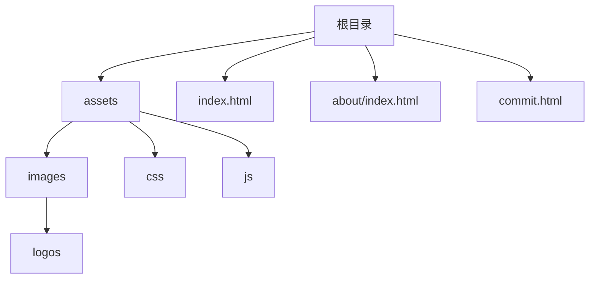
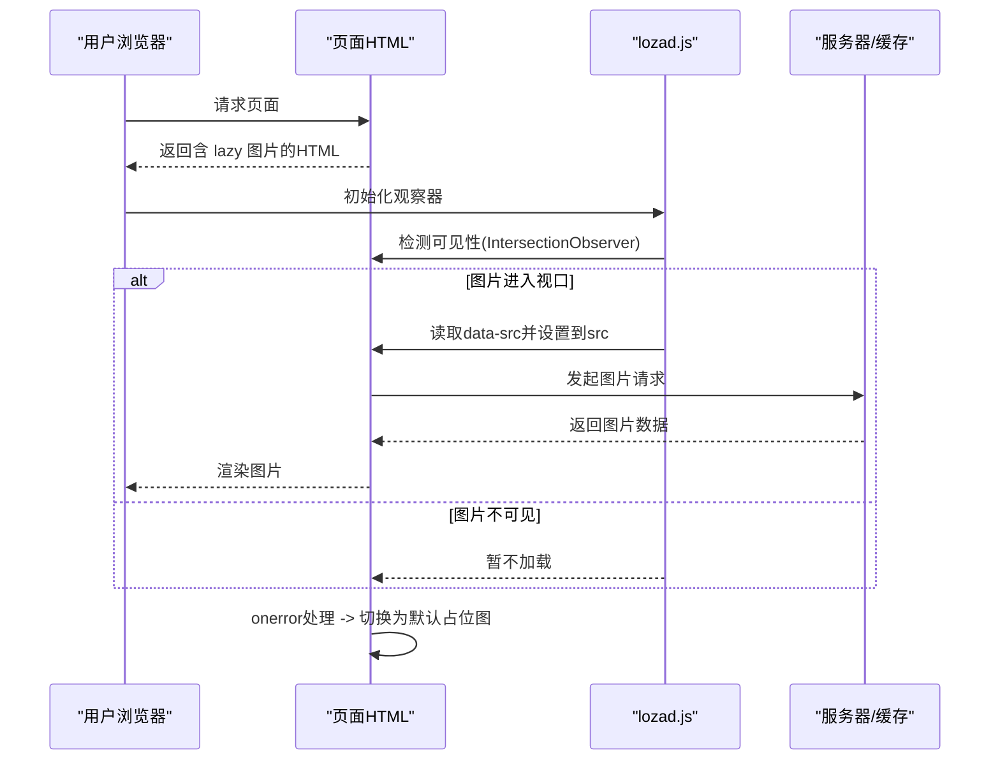
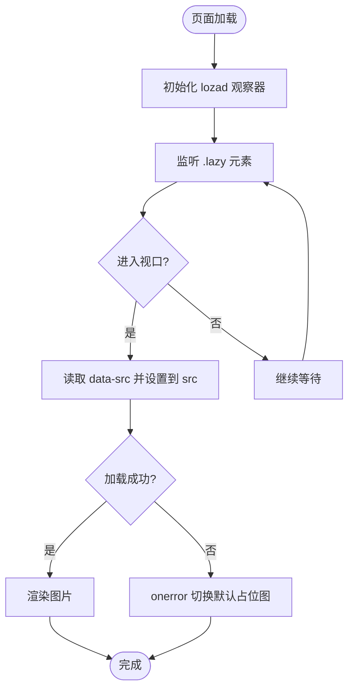
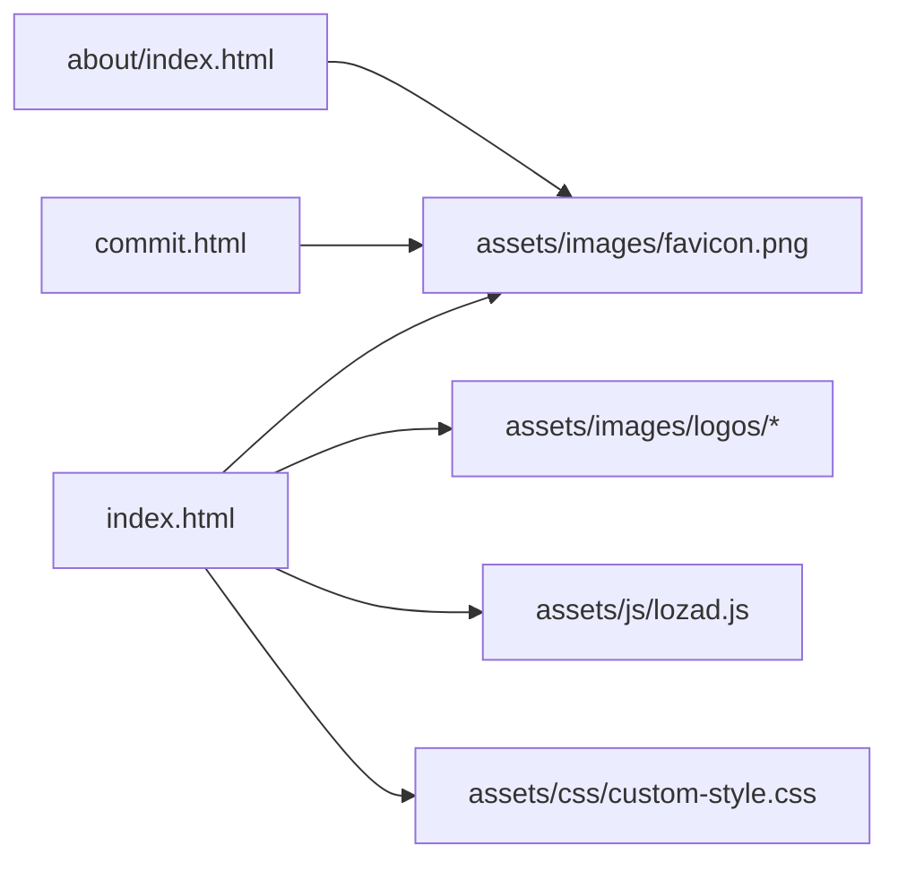

# 图片资源管理

<cite>
**本文引用的文件**
- [index.html](file://index.html)
- [about/index.html](file://about/index.html)
- [commit.html](file://commit.html)
- [assets/css/custom-style.css](file://assets/css/custom-style.css)
- [assets/js/lozad.js](file://assets/js/lozad.js)
</cite>

## 目录
1. [简介](#简介)
2. [项目结构](#项目结构)
3. [核心组件](#核心组件)
4. [架构总览](#架构总览)
5. [详细组件分析](#详细组件分析)
6. [依赖关系分析](#依赖关系分析)
7. [性能考虑](#性能考虑)
8. [故障排查指南](#故障排查指南)
9. [结论](#结论)
10. [附录](#附录)

## 简介
本文件面向本项目中的“图片资源管理”，系统性说明图片资源的组织方式、命名规范、引用策略（相对路径与绝对路径）、优化策略（格式选择、尺寸适配、压缩）、响应式图片实现（srcset）以及懒加载方案（基于 lozad.js）。同时给出最佳实践与常见问题解决方案，帮助开发者在保持可维护性的前提下提升页面加载性能与用户体验。

## 项目结构
项目的静态资源统一放置在 assets 目录下，其中图片资源位于 assets/images，品牌标识与网站图标集中在 assets/images/logos；CSS 样式位于 assets/css，脚本位于 assets/js。favicon 在各页面通过 link rel="shortcut icon" 引用。

图表来源
- [index.html:1-35](file://index.html#L1-L35)
- [about/index.html:1-26](file://about/index.html#L1-L26)
- [commit.html:1-26](file://commit.html#L1-L26)

章节来源
- [index.html:1-35](file://index.html#L1-L35)
- [about/index.html:1-26](file://about/index.html#L1-L26)
- [commit.html:1-26](file://commit.html#L1-L26)

## 核心组件
- 图片资源目录：assets/images/logos，用于存放各工具或站点的 logo 图片。
- 站点 favicon：assets/images/favicon.png，在各页面 head 中通过 link 标签引入。
- 懒加载库：assets/js/lozad.js，负责按需加载图片以提升首屏性能。
- 样式控制：assets/css/custom-style.css 与主题样式共同控制 logo 显示尺寸与明暗模式切换。

章节来源
- [index.html:47-62](file://index.html#L47-L62)
- [index.html:13](file://index.html#L13)
- [assets/js/lozad.js:19-76](file://assets/js/lozad.js#L19-L76)
- [assets/css/custom-style.css:106-110](file://assets/css/custom-style.css#L106-L110)

## 架构总览
图片资源在页面中以“懒加载 + 错误回退”的方式呈现：
- HTML 中使用 class="lazy" 的 img 元素，将真实地址放在 data-src 中，初始 src 可放置占位图或空值。
- 页面加载后，lozad.js 监听可视区域，当图片进入视口时，将 data-src 赋值给 src 触发加载。
- 若图片加载失败，onerror 事件会切换到默认占位图（如 default.webp），保证界面一致性。
- 对于品牌 logo，使用两套图片（light/dark）以支持明暗主题切换，并通过 CSS 控制显隐。

图表来源
- [assets/js/lozad.js:19-76](file://assets/js/lozad.js#L19-L76)
- [assets/js/lozad.js:87-101](file://assets/js/lozad.js#L87-L101)
- [assets/js/lozad.js:117-168](file://assets/js/lozad.js#L117-L168)
- [index.html:604-606](file://index.html#L604-L606)

## 详细组件分析

### 品牌标识与网站图标
- 站点 favicon：在各页面 head 中通过 link rel="shortcut icon" 引用 assets/images/favicon.png，确保浏览器标签页图标一致。
- 侧边栏与头部 Logo：使用 light 与 dark 两套图片，分别对应浅色与深色主题；通过 CSS 类名控制显隐，实现主题切换时的视觉一致性。

章节来源
- [index.html:13](file://index.html#L13)
- [about/index.html:11](file://about/index.html#L11)
- [commit.html:11](file://commit.html#L11)
- [index.html:47-62](file://index.html#L47-L62)
- [index.html:225-230](file://index.html#L225-L230)

### 图片资源组织与命名规范
- 目录结构：所有工具或站点的 logo 统一存放在 assets/images/logos，便于集中管理与批量处理。
- 命名建议：
  - 使用英文或拼音命名，避免中文文件名带来的兼容性问题。
  - 名称应具业务语义，如 github.jpg、qq邮箱.png。
  - 同一逻辑资源的多分辨率版本可采用后缀区分，如 name@2x.png。
- 当前状态：项目中已存在大量以中文命名的图片文件（URL编码形式），建议在后续重构中逐步迁移至英文命名，减少 URL 编码开销与潜在兼容问题。

章节来源
- [index.html:604-606](file://index.html#L604-L606)
- [index.html:637-639](file://index.html#L637-L639)
- [index.html:670-672](file://index.html#L670-L672)
- [index.html:703-705](file://index.html#L703-L705)
- [index.html:736-738](file://index.html#L736-L738)
- [index.html:769-771](file://index.html#L769-L771)

### 图片引用方式（相对路径与绝对路径）
- 相对路径：页面内图片普遍采用相对于页面的相对路径，如 ./assets/images/... 或 assets/images/...，利于本地开发与部署灵活性。
- 绝对路径：CDN 或跨域场景建议使用绝对路径（协议+域名+路径），提高缓存命中率与跨域访问稳定性。
- 当前实践：本项目主要使用相对路径，便于本地调试与静态托管；如需接入 CDN，可在构建阶段替换为绝对路径。

章节来源
- [index.html:13](file://index.html#L13)
- [index.html:47-62](file://index.html#L47-L62)
- [index.html:225-230](file://index.html#L225-L230)

### 图片优化策略（格式、尺寸、压缩）
- 格式选择：
  - SVG：适用于矢量图标与简单图形，体积小且无损缩放。
  - PNG：适用于需要透明背景的图像。
  - JPEG/WebP：适用于照片类大图，WebP 在同等质量下体积更小，推荐优先使用。
- 尺寸适配：
  - 根据展示尺寸输出对应分辨率的图片，避免在 CSS 中强制缩放导致模糊或带宽浪费。
  - 对高 DPI 屏幕提供 @2x/@3x 版本，结合 CSS 媒体查询或 JS 动态选择。
- 压缩处理：
  - 使用无损/有损压缩工具对 PNG/JPEG/WebP 进行压缩，平衡画质与体积。
  - 启用 HTTP 缓存与 CDN 缓存策略，减少重复请求。

章节来源
- [assets/js/lozad.js:51-57](file://assets/js/lozad.js#L51-L57)
- [index.html:604-606](file://index.html#L604-L606)

### 响应式图片实现（srcset）
- 当前实现：项目中未直接使用 ，而是通过懒加载与 CSS 控制尺寸。
- 推荐方案：
  - 使用  为不同设备像素比与视口宽度提供多分辨率图片。
  - 配合 CSS 媒体查询与容器尺寸，让浏览器自动选择合适的图片源。
- 与懒加载结合：lozad.js 支持 data-srcset，可在懒加载时同步设置 srcset，实现响应式与懒加载的统一。

章节来源
- [assets/js/lozad.js:55-57](file://assets/js/lozad.js#L55-L57)

### 图片懒加载实现（lozad.js）
- 工作原理：
  - 页面中包含 class="lazy" 的 img 元素，真实地址置于 data-src。
  - 初始化 IntersectionObserver，监听元素是否进入视口。
  - 进入视口后将 data-src 赋值给 src，触发实际加载。
  - 支持 data-background-image 与 data-srcset，扩展背景图与响应式图片的懒加载。
- 配置项：
  - rootMargin、threshold：控制触发时机与范围。
  - load、loaded：自定义加载前后回调。
- 错误处理：
  - 页面中对 img 添加 onerror 事件，加载失败时切换为默认占位图，保障界面一致性。

图表来源
- [assets/js/lozad.js:19-76](file://assets/js/lozad.js#L19-L76)
- [assets/js/lozad.js:87-101](file://assets/js/lozad.js#L87-L101)
- [assets/js/lozad.js:117-168](file://assets/js/lozad.js#L117-L168)
- [index.html:604-606](file://index.html#L604-L606)

章节来源
- [assets/js/lozad.js:19-76](file://assets/js/lozad.js#L19-L76)
- [assets/js/lozad.js:87-101](file://assets/js/lozad.js#L87-L101)
- [assets/js/lozad.js:117-168](file://assets/js/lozad.js#L117-L168)
- [index.html:604-606](file://index.html#L604-L606)

## 依赖关系分析
- 页面与资源：
  - index.html、about/index.html、commit.html 均引用 assets/images/favicon.png 作为站点图标。
  - 页面内容区包含多个工具卡片，每个卡片内的 logo 图片位于 assets/images/logos。
- 脚本与样式：
  - lozad.js 提供懒加载能力，被页面通过 script 引入（或在构建流程中注入）。
  - custom-style.css 与主题样式共同控制 logo 尺寸与主题切换效果。

图表来源
- [index.html:13](file://index.html#L13)
- [index.html:604-606](file://index.html#L604-L606)
- [about/index.html:11](file://about/index.html#L11)
- [commit.html:11](file://commit.html#L11)
- [assets/js/lozad.js:19-76](file://assets/js/lozad.js#L19-L76)
- [assets/css/custom-style.css:106-110](file://assets/css/custom-style.css#L106-L110)

章节来源
- [index.html:13](file://index.html#L13)
- [index.html:604-606](file://index.html#L604-L606)
- [about/index.html:11](file://about/index.html#L11)
- [commit.html:11](file://commit.html#L11)
- [assets/js/lozad.js:19-76](file://assets/js/lozad.js#L19-L76)
- [assets/css/custom-style.css:106-110](file://assets/css/custom-style.css#L106-L110)

## 性能考虑
- 首屏性能：
  - 使用懒加载减少首屏请求数量，提升首屏渲染速度。
  - 对非关键图片延迟加载，优先加载首屏必要资源。
- 带宽优化：
  - 合理选择图片格式（WebP/PNG/SVG），并进行压缩。
  - 为不同设备提供合适分辨率的图片，避免过度下载。
- 缓存策略：
  - 利用浏览器缓存与 CDN 缓存，降低重复请求。
  - 对静态资源添加版本号或哈希，便于缓存更新。
- 主题切换：
  - 使用 light/dark 两套 logo 图片，通过 CSS 控制显隐，避免运行时切换导致的重绘与闪烁。

[本节为通用性能指导，不直接分析具体文件]

## 故障排查指南
- 图片不显示：
  - 检查 data-src 路径是否正确，确认资源是否存在。
  - 检查 onerror 是否触发了默认占位图，定位原始图片加载失败原因。
- 懒加载失效：
  - 确认 lozad.js 已正确引入并初始化。
  - 检查元素是否具备 class="lazy" 与 data-src。
  - 检查 IntersectionObserver 是否被阻塞（如主线程繁忙）。
- 主题切换异常：
  - 检查 CSS 类名是否正确应用（logo-light/logo-dark）。
  - 确认媒体查询或主题切换逻辑是否生效。

章节来源
- [index.html:604-606](file://index.html#L604-L606)
- [assets/js/lozad.js:51-57](file://assets/js/lozad.js#L51-L57)
- [assets/js/lozad.js:87-101](file://assets/js/lozad.js#L87-L101)

## 结论
本项目通过统一的图片目录结构与懒加载机制，实现了良好的可维护性与首屏性能。未来可进一步引入响应式图片（srcset）、更严格的命名规范与自动化构建流程，以持续提升加载效率与开发体验。

[本节为总结性内容，不直接分析具体文件]

## 附录
- 最佳实践清单：
  - 统一资源目录与命名规范，优先使用英文命名。
  - 使用 WebP/PNG/SVG 等合适格式，并进行压缩。
  - 为不同设备提供多分辨率图片，结合 srcset 与 sizes。
  - 使用懒加载减少首屏压力，结合错误回退提升鲁棒性。
  - 启用缓存与 CDN，优化全局分发。
- 常见问题速查：
  - 中文文件名导致 URL 编码与兼容性问题，建议迁移至英文。
  - 懒加载未生效时，检查类名、属性与脚本初始化。
  - 主题切换时注意两套图片的显隐逻辑与 CSS 优先级。

[本节为补充信息，不直接分析具体文件]