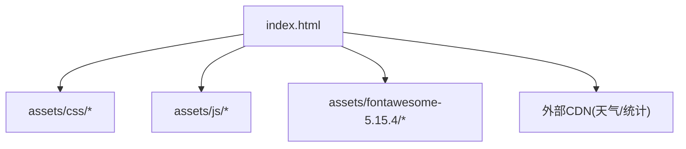
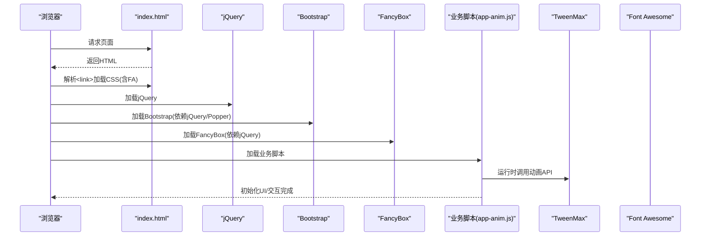
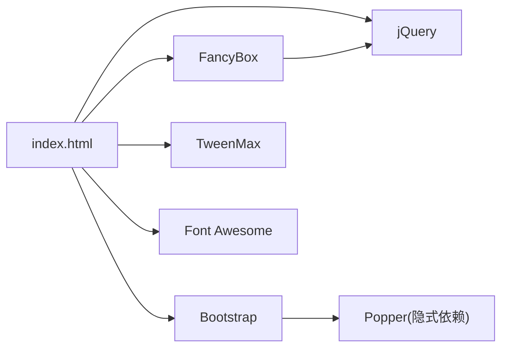

# 第三方依赖管理

<cite>
**本文引用的文件**
- [index.html](file://index.html)
- [README.md](file://README.md)
- [bootstrap.min-4.3.1.js](file://assets/js/bootstrap.min-4.3.1.js)
- [fancybox.min-3.5.7.js](file://assets/js/fancybox.min-3.5.7.js)
- [TweenMax.min.js](file://assets/js/TweenMax.min.js)
- [app-anim.js](file://assets/js/app-anim.js)
- [xenon-api.js](file://assets/js/xenon-api.js)
- [custom-style.css](file://assets/css/custom-style.css)
</cite>

## 目录
1. [简介](#简介)
2. [项目结构](#项目结构)
3. [核心组件](#核心组件)
4. [架构总览](#架构总览)
5. [详细组件分析](#详细组件分析)
6. [依赖关系分析](#依赖关系分析)
7. [性能与优化](#性能与优化)
8. [安全与合规](#安全与合规)
9. [版本控制与更新策略](#版本控制与更新策略)
10. [故障排查指南](#故障排查指南)
11. [结论](#结论)
12. [附录：配置示例与最佳实践](#附录：配置示例与最佳实践)

## 简介
本文件面向本项目“第三方依赖管理”的完整说明，覆盖外部库与框架的选择标准（本地托管 vs CDN）、版本锁定与更新策略、冲突检测、按需引入与压缩合并、安全与许可证合规、以及自动化与回滚等最佳实践。项目为纯静态站点，所有前端资源以本地文件为主，少量第三方服务通过CDN动态加载。

## 项目结构
- 样式与脚本统一放置在 assets 目录下，按类型分目录组织：
  - CSS：基础样式、主题样式、自定义样式
  - JS：jQuery、Bootstrap、FancyBox、动画库、业务脚本
  - 图标：Font Awesome 5 本地包
- 入口页面 index.html 集中声明并加载所需依赖，便于统一管理与审计。

图表来源
- [index.html:17-31](file://index.html#L17-L31)

章节来源
- [index.html:17-31](file://index.html#L17-L31)
- [README.md:298-314](file://README.md#L298-L314)

## 核心组件
- jQuery：作为 Bootstrap 与部分插件的基础依赖，本地引入。
- Bootstrap 4：UI 框架，本地引入，依赖 jQuery 与 Popper。
- FancyBox：图片/媒体灯箱，本地引入，依赖 jQuery。
- TweenMax：动画引擎，本地引入，被业务脚本调用。
- Font Awesome 5：图标库，本地引入。
- 第三方服务：天气组件与站点统计通过 CDN 动态注入。

章节来源
- [index.html:17-31](file://index.html#L17-L31)
- [bootstrap.min-4.3.1.js:1-6](file://assets/js/bootstrap.min-4.3.1.js#L1-L6)
- [fancybox.min-3.5.7.js:1-13](file://assets/js/fancybox.min-3.5.7.js#L1-L13)
- [xenon-api.js:61-80](file://assets/js/xenon-api.js#L61-L80)

## 架构总览
下图展示页面加载时依赖的加载顺序与交互关系：CSS 优先加载，随后是 jQuery、Bootstrap、FancyBox、业务脚本；业务脚本在 DOM 就绪后初始化 UI 与动画。

图表来源
- [index.html:17-31](file://index.html#L17-L31)
- [bootstrap.min-4.3.1.js:1-6](file://assets/js/bootstrap.min-4.3.1.js#L1-L6)
- [fancybox.min-3.5.7.js:1-13](file://assets/js/fancybox.min-3.5.7.js#L1-L13)
- [app-anim.js:1-25](file://assets/js/app-anim.js#L1-L25)
- [xenon-api.js:61-80](file://assets/js/xenon-api.js#L61-L80)

## 详细组件分析

### jQuery
- 角色：DOM 操作与事件处理的核心库，被 Bootstrap、FancyBox 及业务脚本使用。
- 引入方式：本地引入，确保版本稳定可控。
- 注意事项：需保证在 Bootstrap/FancyBox 之前加载。

章节来源
- [index.html:30-31](file://index.html#L30-L31)

### Bootstrap 4
- 角色：栅格布局、组件与交互基础。
- 依赖：jQuery、Popper（用于定位）。
- 引入方式：本地引入，版本固定。
- 风险点：若未正确引入 jQuery/Popper，将导致下拉、模态等交互失效。

章节来源
- [index.html:21-22](file://index.html#L21-L22)
- [bootstrap.min-4.3.1.js:1-6](file://assets/js/bootstrap.min-4.3.1.js#L1-L6)

### FancyBox
- 角色：图片/视频灯箱与滑动浏览。
- 依赖：jQuery。
- 引入方式：本地引入，版本固定。
- 使用建议：仅对需要灯箱效果的元素启用，避免全局开销。

章节来源
- [index.html:23-24](file://index.html#L23-L24)
- [fancybox.min-3.5.7.js:1-13](file://assets/js/fancybox.min-3.5.7.js#L1-L13)

### TweenMax 与动画
- 角色：高性能动画引擎，被业务脚本用于进度条、过渡等动效。
- 引入方式：本地引入。
- 使用位置：业务脚本中通过全局 API 驱动动画。

章节来源
- [index.html:30-31](file://index.html#L30-L31)
- [xenon-api.js:61-80](file://assets/js/xenon-api.js#L61-L80)

### Font Awesome 5
- 角色：矢量图标库，提供丰富的图标资源。
- 引入方式：本地引入，包含 CSS/JS/SVG/Webfonts 等多格式资源。
- 优势：离线可用、版本可控、无网络抖动。

章节来源
- [index.html:29](file://index.html#L29)

### 第三方服务（CDN）
- 天气组件：通过 CDN 动态注入脚本，提供天气信息。
- 站点统计：在 about 页面动态注入统计 SDK。
- 风险与建议：此类服务受外部可用性影响，建议增加降级逻辑或缓存策略。

章节来源
- [index.html:295](file://index.html#L295)
- [about/index.html:240](file://about/index.html#L240)

## 依赖关系分析
- 直接依赖链：
  - index.html → jQuery → Bootstrap / FancyBox
  - index.html → TweenMax（业务脚本调用）
  - index.html → Font Awesome（样式与图标）
- 间接依赖：
  - Bootstrap 依赖 Popper（用于弹出层定位）
  - FancyBox 依赖 jQuery
- 外部依赖：
  - 天气组件、站点统计通过 CDN 动态加载

图表来源
- [index.html:17-31](file://index.html#L17-L31)
- [bootstrap.min-4.3.1.js:1-6](file://assets/js/bootstrap.min-4.3.1.js#L1-L6)
- [fancybox.min-3.5.7.js:1-13](file://assets/js/fancybox.min-3.5.7.js#L1-L13)

章节来源
- [index.html:17-31](file://index.html#L17-L31)

## 性能与优化
- 本地化优先：核心依赖（jQuery、Bootstrap、FancyBox、TweenMax、Font Awesome）均本地托管，减少外部网络不确定性，利于缓存与离线访问。
- 压缩与合并：已采用 .min 文件，体积更小；可按需拆分业务脚本，避免首屏阻塞。
- 按需引入：
  - 仅在需要的页面引入 FancyBox。
  - 动画相关逻辑集中在业务脚本，避免全局污染。
- 缓存策略：静态资源可设置长期缓存头（如 README 中的 Nginx 配置），提升重复访问速度。
- 懒加载：图片懒加载由业务脚本实现，降低首屏压力。

章节来源
- [index.html:17-31](file://index.html#L17-L31)
- [README.md:96-108](file://README.md#L96-L108)
- [app-anim.js:26-33](file://assets/js/app-anim.js#L26-L33)

## 安全与合规
- 来源验证：
  - 核心依赖本地托管，避免供应链劫持风险。
  - 第三方服务（天气、统计）来自可信域名，建议校验证书与来源。
- 漏洞扫描：
  - 定期扫描本地依赖（如 jQuery、Bootstrap、FancyBox、TweenMax）是否存在已知漏洞。
  - 对 CDN 脚本进行白名单管理，限制可加载域名。
- 许可证检查：
  - 确认各依赖许可证兼容（MIT、GPLv3 等），并在项目中保留必要的归属信息。
- 最小权限：
  - 第三方脚本尽量使用异步加载，避免阻塞主线程。
  - 对外部脚本添加 rel="noopener" 等安全属性（已在部分链接中使用）。

章节来源
- [index.html:295](file://index.html#L295)
- [fancybox.min-3.5.7.js:1-13](file://assets/js/fancybox.min-3.5.7.js#L1-L13)
- [bootstrap.min-4.3.1.js:1-6](file://assets/js/bootstrap.min-4.3.1.js#L1-L6)

## 版本控制与更新策略
- 版本锁定：
  - 所有依赖文件名包含版本号（如 bootstrap.min-4.3.1.js、fancybox.min-3.5.7.js），便于精确追踪与回滚。
- 更新流程：
  - 新增/升级依赖前，先在开发环境验证兼容性。
  - 更新后执行回归测试，重点检查 UI 组件与交互。
  - 提交变更并记录更新日志。
- 冲突检测：
  - 关注 jQuery 版本与插件兼容性。
  - 注意多个动画库共存时的命名空间冲突（本项目使用 TweenMax，避免与其他动画库混用）。
- 回滚策略：
  - 保留旧版本文件，出现问题快速切换引用至稳定版本。
  - 通过 Git 提交历史快速回退到上一稳定版本。

章节来源
- [index.html:21-31](file://index.html#L21-L31)
- [bootstrap.min-4.3.1.js:1-6](file://assets/js/bootstrap.min-4.3.1.js#L1-L6)
- [fancybox.min-3.5.7.js:1-13](file://assets/js/fancybox.min-3.5.7.js#L1-L13)

## 故障排查指南
- 常见问题
  - 样式不生效：检查 CSS 路径与加载顺序，确认自定义样式在主题之后加载。
  - 弹窗/下拉失效：确认 jQuery 与 Bootstrap 均已正确加载且版本匹配。
  - 灯箱无法打开：确认 FancyBox 已加载且目标元素具备正确的 data-* 属性。
  - 动画异常：确认 TweenMax 已加载且业务脚本在 DOM 就绪后执行。
  - 第三方服务不可用：天气/统计脚本来自外部 CDN，可能出现网络问题，建议增加错误处理与降级方案。
- 调试建议
  - 使用浏览器开发者工具查看网络面板，确认资源是否成功加载。
  - 检查控制台是否有 JavaScript 报错，定位依赖缺失或版本冲突。
  - 对关键脚本添加 try/catch 与日志输出，便于快速定位问题。

章节来源
- [index.html:17-31](file://index.html#L17-L31)
- [app-anim.js:1-25](file://assets/js/app-anim.js#L1-L25)
- [xenon-api.js:61-80](file://assets/js/xenon-api.js#L61-L80)

## 结论
本项目采用“核心依赖本地化 + 必要服务CDN”的策略，兼顾稳定性与功能扩展。通过版本锁定、压缩合并、按需引入与安全合规措施，有效提升了性能与可维护性。建议在后续迭代中持续完善自动化更新、漏洞扫描与回滚机制，进一步降低运维成本与风险。

## 附录：配置示例与最佳实践
- 依赖引入清单（示例）
  - CSS：Bootstrap、主题样式、自定义样式、Font Awesome
  - JS：jQuery、Bootstrap、FancyBox、TweenMax、业务脚本
  - 外部：天气组件、站点统计（CDN）
- 最佳实践
  - 使用 .min 文件生产部署，开发环境可使用非压缩版便于调试。
  - 将依赖版本写入文件名，便于追溯与回滚。
  - 对第三方 CDN 脚本增加超时与错误处理，保障用户体验。
  - 定期审查依赖许可证与漏洞信息，及时更新或替换高风险依赖。
  - 利用构建工具进行资源压缩与合并，减少请求数量与体积。

章节来源
- [index.html:17-31](file://index.html#L17-L31)
- [README.md:96-108](file://README.md#L96-L108)