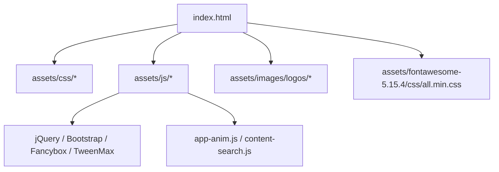
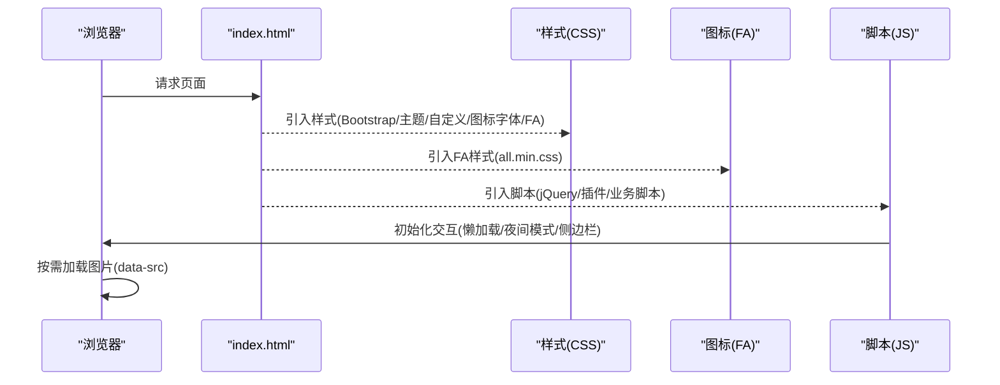
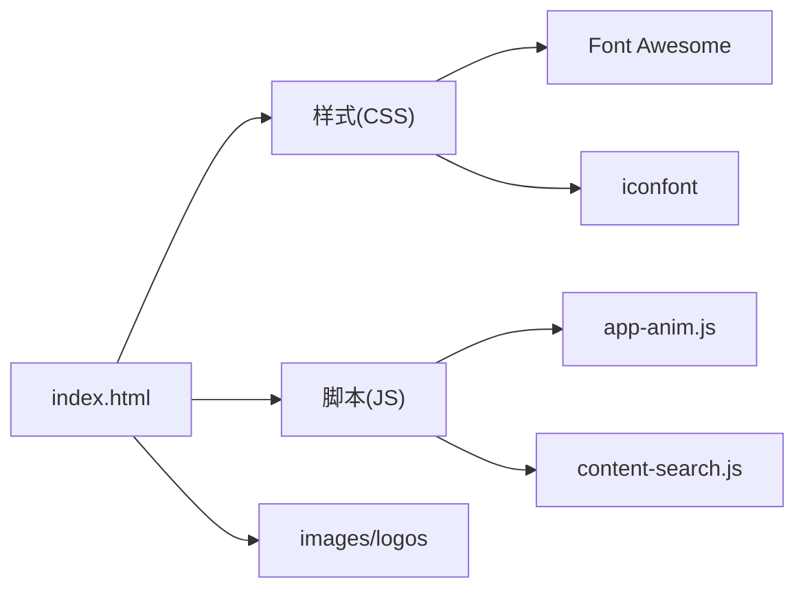

# 资源管理

<cite>
**本文引用的文件**
- [index.html](file://index.html)
- [custom-style.css](file://assets/css/custom-style.css)
- [app-anim.js](file://assets/js/app-anim.js)
- [content-search.js](file://assets/js/content-search.js)
- [README.md](file://README.md)
</cite>

## 目录
1. [简介](#简介)
2. [项目结构](#项目结构)
3. [核心组件](#核心组件)
4. [架构总览](#架构总览)
5. [详细组件分析](#详细组件分析)
6. [依赖关系分析](#依赖关系分析)
7. [性能考虑](#性能考虑)
8. [故障排查指南](#故障排查指南)
9. [结论](#结论)
10. [附录：资源配置示例与最佳实践](#附录：资源配置示例与最佳实践)

## 简介
本文件面向“静态资源组织与管理”，覆盖图片资源目录结构与命名规范、Font Awesome 图标库集成与使用、第三方依赖引入策略（含 CDN）、资源加载优化（懒加载、缓存、压缩传输）以及资源管理的最佳实践。内容基于仓库中的实际资源引用与脚本行为进行说明，帮助读者在不深入代码细节的前提下掌握项目的资源管理方式。

## 项目结构
项目采用清晰的 assets 分层组织：
- assets/css：样式文件，包含主题、自定义样式、图标字体等
- assets/js：前端交互与动画脚本，包含 jQuery、Bootstrap、Fancybox、动画库等
- assets/images/logos：站点 Logo 与卡片缩略图
- assets/fontawesome-5.15.4：本地 Font Awesome 5.15.4 完整包（CSS/JS/SVG/Less/SCSS/Metadata/Webfonts）

图表来源
- [index.html:17-31](file://index.html#L17-L31)

章节来源
- [index.html:17-31](file://index.html#L17-L31)
- [README.md:298-314](file://README.md#L298-L314)

## 核心组件
- 样式层
  - 基础框架：Bootstrap 4.3.1 样式
  - 主题样式：style-3.03029.1.css
  - 自定义样式：custom-style.css（覆盖导航、搜索区、网格背景等）
  - 图标字体：iconfont-3.03029.1.css（项目自有图标字体）
  - 图标库：Font Awesome 5.15.4（all.min.css）
- 脚本层
  - 交互与动画：app-anim.js（侧边栏、夜间模式、滚动、提示、懒加载相关逻辑）
  - 搜索建议：content-search.js（百度联想词）
  - 第三方库：jQuery、Bootstrap JS、Fancybox、TweenMax、Popper 等
- 媒体资源
  - 图片：assets/images/logos/*（Logo、网站缩略图）
  - 图标：Font Awesome 5.15.4（SVG/JS/CSS）

章节来源
- [index.html:17-31](file://index.html#L17-L31)
- [custom-style.css:1-126](file://assets/css/custom-style.css#L1-L126)
- [app-anim.js:1-800](file://assets/js/app-anim.js#L1-L800)
- [content-search.js:1-91](file://assets/js/content-search.js#L1-L91)

## 架构总览
页面在 head 中按顺序引入 CSS 与 JS，确保样式优先加载；body 内通过 class 与 data-* 属性配合 app-anim.js 实现懒加载、夜间模式、侧边栏交互等。图片资源以相对路径引用，统一位于 assets/images/logos。图标通过 Font Awesome 的类名直接渲染。

图表来源
- [index.html:17-31](file://index.html#L17-L31)
- [app-anim.js:1-800](file://assets/js/app-anim.js#L1-L800)

## 详细组件分析

### 图片资源组织与命名规范
- 目录结构
  - 所有站点 Logo 与卡片缩略图集中存放于 assets/images/logos
  - 页面 favicon 位于 assets/images/favicon.png
- 命名规范
  - 建议使用英文或拼音命名，避免中文文件名带来的编码问题
  - 同一品牌多尺寸时，可采用前缀区分（如 logo-light、logo-dark），本项目已在侧边栏与头部使用不同显示状态的图片
- 引用方式
  - 通过相对路径引用，如 ./assets/images/logos/xxx.jpg
  - 列表项图片普遍使用 lazy 类与 data-src 实现懒加载，首屏仅加载可见区域图片，提升首屏性能

章节来源
- [index.html:49-61](file://index.html#L49-L61)
- [index.html:225-230](file://index.html#L225-L230)
- [index.html:604-800](file://index.html#L604-L800)

### Font Awesome 图标库集成与使用
- 引入方式
  - 通过本地 all.min.css 引入全部图标样式
  - 可选引入 JS 模块以实现 SVG + JS 渲染（当前页面主要使用 CSS 方式）
- 使用方式
  - 在 HTML 中使用 i 标签并添加 fa 系列类名，如 fas/fa-star、fab/fa-github 等
  - 可通过 size 类控制大小（fa-lg 等），通过 margin/padding 控制间距
- 版本与更新
  - 当前版本为 5.15.4，如需升级需替换整个 fontawesome-5.15.4 目录并检查兼容
- 性能优化建议
  - 生产环境保留 all.min.css，避免未使用的样式体积过大
  - 若仅需部分图标，可改用按需构建方案（例如只引入 solid/regular/brands 子集）

章节来源
- [index.html:29](file://index.html#L29)
- [index.html:71-210](file://index.html#L71-L210)

### 第三方依赖管理策略
- 本地依赖
  - Bootstrap、Fancybox、TweenMax、jQuery 等均以本地 min 版本引入，便于离线运行与版本锁定
- CDN 引入
  - 天气小部件通过外部 CDN 引入（qweather.net），注意跨域与可用性
- 版本控制
  - 文件名中包含版本号（如 bootstrap.min-4.3.1.js），便于缓存与回滚
- 冲突解决
  - 通过独立 ID 引入关键脚本（如 jquery-js、content-search-js），避免重复加载
  - 注意 jQuery 版本一致性，避免与其他插件冲突

章节来源
- [index.html:17-31](file://index.html#L17-L31)
- [index.html:295-296](file://index.html#L295-L296)

### 资源加载优化策略
- 懒加载
  - 图片使用 class="lazy" 与 data-src，结合 app-anim.js 与 lozad.js（项目中存在 lozad.js）实现视口内加载
  - 首屏减少图片请求，降低带宽占用与渲染阻塞
- 缓存配置
  - README 提供 Nginx 静态资源缓存配置示例，对图片、CSS、JS 设置长期缓存与不可变头
- 压缩传输
  - README 提供启用 gzip 的配置示例，减小传输体积
- 渐进增强
  - 图片加载失败时提供默认占位（onerror 指向 default.webp），保证界面完整性

章节来源
- [index.html:604-800](file://index.html#L604-L800)
- [README.md:96-108](file://README.md#L96-L108)

### 交互与动态行为（与资源相关）
- 夜间模式切换：app-anim.js 根据 body 类名切换主题样式与图标
- 侧边栏展开/收起：app-anim.js 控制宽度与二级菜单展示
- 搜索联想：content-search.js 调用百度接口返回热词，点击后触发搜索
- 工具提示：tooltip 在 PC 端启用 hover 触发，移动端针对二维码图片启用

章节来源
- [app-anim.js:1-800](file://assets/js/app-anim.js#L1-L800)
- [content-search.js:1-91](file://assets/js/content-search.js#L1-L91)

## 依赖关系分析
- 页面依赖链
  - index.html 引入样式与脚本
  - 样式层：Bootstrap → 主题 → 自定义 → 图标字体 → Font Awesome
  - 脚本层：jQuery → 插件（Fancybox/Bootstrap JS）→ 业务脚本（app-anim.js/content-search.js）
- 资源依赖
  - 图片资源由 HTML 模板与 app-anim.js 懒加载逻辑共同驱动
  - 图标由 Font Awesome 样式与 HTML 类名组合渲染

图表来源
- [index.html:17-31](file://index.html#L17-L31)
- [app-anim.js:1-800](file://assets/js/app-anim.js#L1-L800)
- [content-search.js:1-91](file://assets/js/content-search.js#L1-L91)

章节来源
- [index.html:17-31](file://index.html#L17-L31)

## 性能考虑
- 首屏优化
  - 使用懒加载减少首屏图片请求
  - 将关键 CSS 置于 head，非关键脚本置于底部或异步加载
- 缓存策略
  - 为静态资源设置长期缓存与不可变头（参考 README 的 Nginx 配置）
- 传输优化
  - 启用 gzip 压缩，减小响应体大小
- 资源精简
  - 按需引入 Font Awesome 子集，减少 CSS/JS 体积
  - 图片使用合适格式与尺寸，必要时转换为 WebP

[本节为通用性能建议，不直接分析具体文件]

## 故障排查指南
- 图片加载失败
  - 检查相对路径是否正确，确认 assets/images/logos 下存在对应文件
  - 查看 onerror 是否生效，确认默认占位图路径正确
- 图标不显示
  - 确认 Font Awesome 样式已引入且未被覆盖
  - 检查类名拼写（fas/far/fab 前缀）
- 懒加载无效
  - 确认图片元素包含 class="lazy" 与 data-src
  - 检查 app-anim.js 与 lozad.js 是否成功加载并执行
- 搜索联想不工作
  - 检查网络连通性与跨域限制
  - 查看控制台是否有 JSONP 回调错误

章节来源
- [index.html:604-800](file://index.html#L604-L800)
- [app-anim.js:1-800](file://assets/js/app-anim.js#L1-L800)
- [content-search.js:1-91](file://assets/js/content-search.js#L1-L91)

## 结论
本项目采用本地化与 CDN 混合的资源管理策略，通过清晰的目录结构与统一的引用方式，实现了良好的可维护性。借助懒加载、缓存与压缩等优化手段，有效提升了首屏性能与用户体验。Font Awesome 的本地集成保证了图标的一致性与可控性。建议在后续迭代中继续推进资源按需引入与格式优化，进一步提升性能与可维护性。

[本节为总结性内容，不直接分析具体文件]

## 附录：资源配置示例与最佳实践

- 图片资源组织与命名
  - 统一存放于 assets/images/logos
  - 使用英文或拼音命名，避免中文路径
  - 多状态图片使用前缀区分（如 logo-light、logo-dark）
  - 懒加载：class="lazy" + data-src，首屏仅加载可视区域
- Font Awesome 使用
  - 通过 all.min.css 引入，HTML 中使用 i 标签与 fa 类名
  - 生产环境保留最小化文件，必要时按需构建子集
- 第三方依赖管理
  - 本地引入关键库并锁定版本（文件名带版本号）
  - 外部 CDN 用于轻量功能（如天气小部件），注意可用性与降级
- 加载优化
  - 懒加载：结合 app-anim.js 与 lozad.js
  - 缓存：Nginx 配置静态资源长期缓存与不可变头
  - 压缩：启用 gzip，减小传输体积
- 路径引用策略
  - 使用相对路径引用资源，便于迁移与部署
  - 保持资源目录稳定，避免频繁重构路径
- 性能监控
  - 使用浏览器开发者工具观察资源加载与渲染时间
  - 关注首屏关键资源（CSS/JS/首屏图片）的体积与加载顺序

章节来源
- [index.html:17-31](file://index.html#L17-L31)
- [index.html:604-800](file://index.html#L604-L800)
- [README.md:96-108](file://README.md#L96-L108)