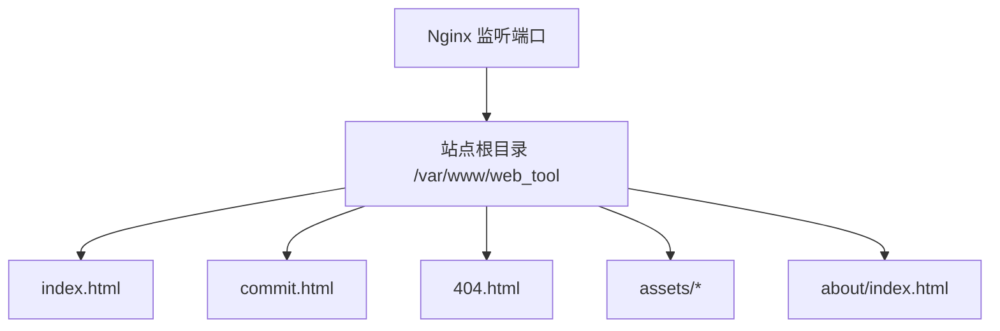
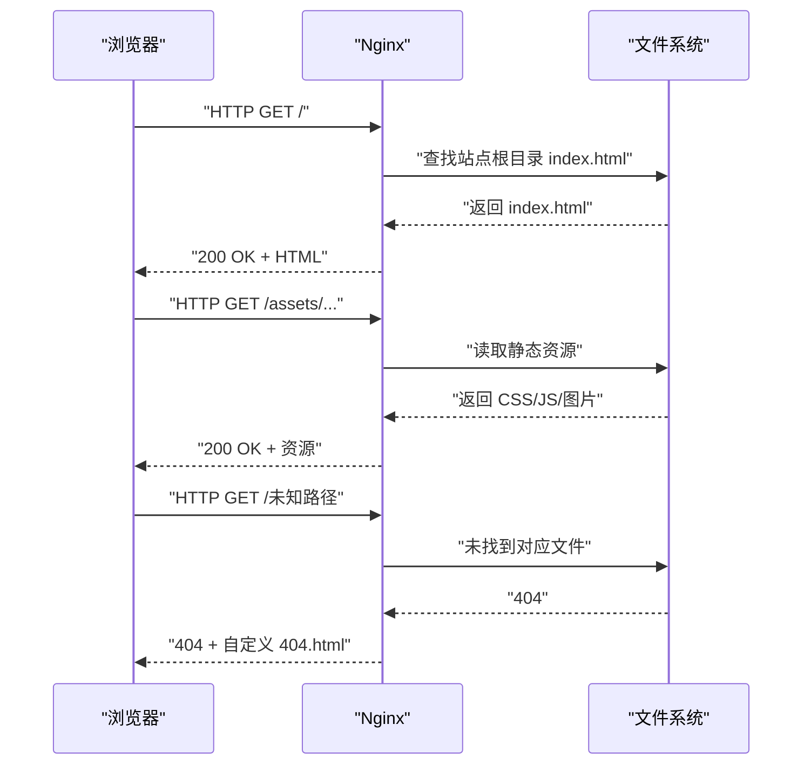
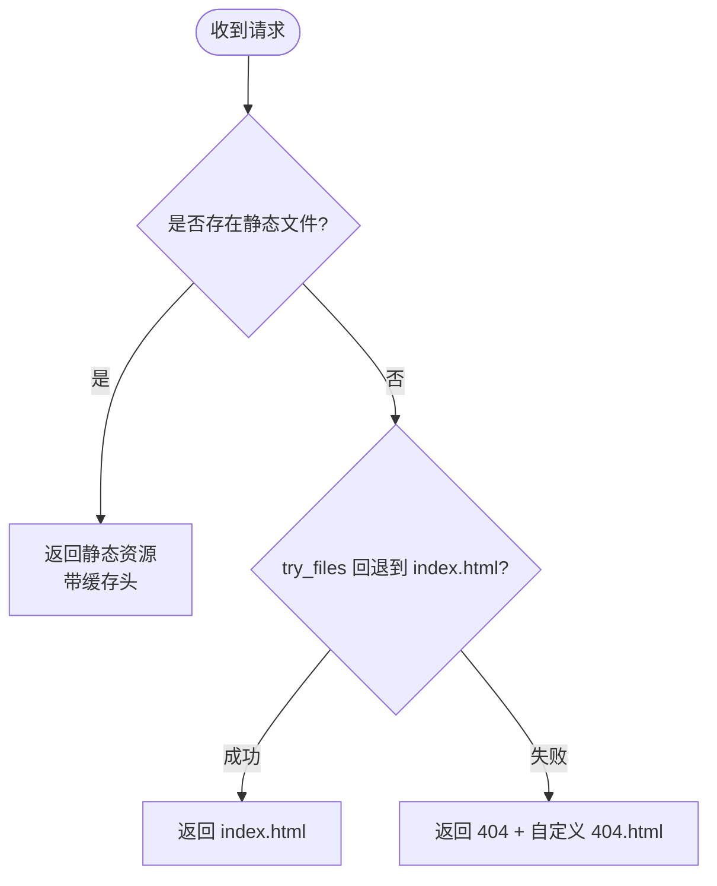
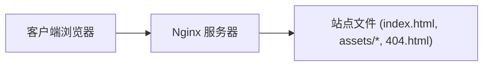

# Nginx部署

<cite>
**本文引用的文件**
- [README.md](file://README.md)
- [404.html](file://404.html)
- [index.html](file://index.html)
- [commit.html](file://commit.html)
</cite>

## 目录
1. [简介](#简介)
2. [项目结构](#项目结构)
3. [核心组件](#核心组件)
4. [架构总览](#架构总览)
5. [详细组件分析](#详细组件分析)
6. [依赖关系分析](#依赖关系分析)
7. [性能与优化建议](#性能与优化建议)
8. [故障排除指南](#故障排除指南)
9. [结论](#结论)
10. [附录：完整部署步骤](#附录完整部署步骤)

## 简介
本指南面向需要在自有服务器上部署该静态网站的用户，重点覆盖以下目标：
- 服务器环境准备（Ubuntu/Debian 与 CentOS/RHEL）
- Nginx 安装与站点配置
- 项目文件上传方法（SCP 与 Git 克隆）
- Nginx 配置文件详解（gzip、静态资源缓存、404 页面处理等）
- HTTPS 证书配置（Let's Encrypt 免费证书及自动续期）
- 完整的命令行操作步骤与常见问题排查

该项目为纯静态 HTML/CSS/JS 站点，无需后端服务即可运行，适合通过 Nginx 直接对外提供服务。

## 项目结构
仓库根目录包含站点入口页、提交页、错误页以及静态资源目录。关键路径如下：
- 首页入口：index.html
- 网址提交页：commit.html
- 404 错误页：404.html
- 静态资源：assets/css、assets/js、assets/images、assets/fontawesome-5.15.4
- 关于页：about/index.html

图表来源
- [README.md:45-132](file://README.md#L45-L132)
- [index.html:1-35](file://index.html#L1-L35)
- [commit.html:1-25](file://commit.html#L1-L25)
- [404.html:1-3](file://404.html#L1-L3)

章节来源
- [README.md:45-132](file://README.md#L45-L132)
- [index.html:1-35](file://index.html#L1-L35)
- [commit.html:1-25](file://commit.html#L1-L25)
- [404.html:1-3](file://404.html#L1-L3)

## 核心组件
- 站点入口与路由：Nginx 将请求映射到站点根目录，默认返回 index.html；对于单页应用或前端路由，可通过 try_files 回退到 index.html。
- 静态资源：CSS/JS/图片等位于 assets 目录，可配合缓存策略提升加载速度。
- 错误页：提供自定义 404.html 以提升用户体验。
- 提交页：commit.html 用于用户提交网址，当前实现基于前端逻辑，如需持久化需结合后端或第三方表单服务。

章节来源
- [README.md:45-132](file://README.md#L45-L132)
- [index.html:1-35](file://index.html#L1-L35)
- [commit.html:1-25](file://commit.html#L1-L25)
- [404.html:1-3](file://404.html#L1-L3)

## 架构总览
下图展示浏览器访问站点时，Nginx 如何响应请求并返回静态资源或错误页。

图表来源
- [README.md:78-132](file://README.md#L78-L132)
- [404.html:1-3](file://404.html#L1-L3)

## 详细组件分析

### 服务器环境准备与 Nginx 安装
- Ubuntu/Debian：使用包管理器安装 Nginx，启动并设置开机自启。
- CentOS/RHEL：使用 yum 安装 Nginx，启动并设置开机自启。
- 验证安装：访问服务器 IP 或域名确认默认欢迎页正常显示。

章节来源
- [README.md:45-60](file://README.md#L45-L60)

### 项目文件上传方法
- SCP 上传：在本地执行 scp 命令将项目文件复制到服务器的站点目录。
- Git 克隆：在服务器站点目录下直接 git clone 仓库源码。
- 权限设置：确保 Nginx 进程对站点目录具有读取权限。

章节来源
- [README.md:62-76](file://README.md#L62-L76)

### Nginx 配置文件编写详解
- server 块：监听 80 端口，设置 server_name 为域名或 IP。
- root 与 index：指定站点根目录与默认索引文件。
- try_files：支持前端路由回退到 index.html。
- gzip 压缩：启用并配置合适的 MIME 类型。
- 静态资源缓存：为常见静态资源设置过期时间与 Cache-Control。
- 404 页面：定义 error_page 指向自定义 404.html，并限制为内部访问。

图表来源
- [README.md:78-132](file://README.md#L78-L132)

章节来源
- [README.md:78-132](file://README.md#L78-L132)

### 静态资源与页面说明
- 首页 index.html：站点主入口，引用 assets 下的样式与脚本。
- 提交页 commit.html：提供网址提交界面，当前为前端交互，如需后端存储需扩展。
- 404 错误页：简洁的提示信息，便于用户感知异常。

章节来源
- [index.html:1-35](file://index.html#L1-L35)
- [commit.html:1-25](file://commit.html#L1-L25)
- [404.html:1-3](file://404.html#L1-L3)

## 依赖关系分析
- Nginx 作为 Web 服务器，负责接收 HTTP 请求并返回静态资源。
- 站点文件（HTML/CSS/JS/图片）由 Nginx 直接从文件系统读取并返回。
- 404 页面作为错误响应的一部分，由 Nginx 根据配置返回。

图表来源
- [README.md:78-132](file://README.md#L78-L132)
- [index.html:1-35](file://index.html#L1-L35)
- [404.html:1-3](file://404.html#L1-L3)

章节来源
- [README.md:78-132](file://README.md#L78-L132)
- [index.html:1-35](file://index.html#L1-L35)
- [404.html:1-3](file://404.html#L1-L3)

## 性能与优化建议
- 启用 gzip 压缩：减少传输体积，提升首屏加载速度。
- 静态资源缓存：为 CSS/JS/图片等设置长期缓存与不可变头，降低重复请求。
- 合理设置 expires 与 Cache-Control：平衡更新频率与缓存效率。
- 最小化资源：在生产环境建议使用构建工具进行压缩与合并（可选）。
- 开启 HTTP/2：若服务器支持，可在 Nginx 中启用以进一步提升性能。

[本节为通用优化建议，不直接分析具体文件]

## 故障排除指南
- 无法访问站点：检查 Nginx 是否运行、防火墙是否放行 80/443 端口、server_name 是否正确。
- 静态资源 404：确认资源路径与相对引用正确，检查 Nginx 的 root 与 location 匹配规则。
- 前端路由 404：确保 try_files 配置回退到 index.html。
- 404 页面未生效：确认 error_page 指令与 internal 限制配置正确。
- HTTPS 证书问题：检查 Let's Encrypt 证书是否获取成功、自动续期任务是否配置。

章节来源
- [README.md:78-132](file://README.md#L78-L132)
- [404.html:1-3](file://404.html#L1-L3)

## 结论
通过本指南，您可以在 Ubuntu/Debian 或 CentOS/RHEL 系统上完成 Nginx 的安装与站点配置，采用 SCP 或 Git 方式上传项目文件，并根据需要启用 gzip、静态资源缓存与自定义 404 页面。同时，可使用 Let's Encrypt 免费证书为站点提供 HTTPS 加密，并设置自动续期以确保安全性与可用性。

[本节为总结性内容，不直接分析具体文件]

## 附录：完整部署步骤

### 一、服务器环境准备
- Ubuntu/Debian：
  - 更新包索引并安装 Nginx
  - 启动 Nginx 并设置开机自启
- CentOS/RHEL：
  - 使用 yum 安装 Nginx
  - 启动 Nginx 并设置开机自启

章节来源
- [README.md:45-60](file://README.md#L45-L60)

### 二、上传项目文件
- 使用 SCP 从本地上传至服务器站点目录
- 或在服务器上使用 Git 克隆仓库到站点目录
- 设置目录权限，确保 Nginx 可读

章节来源
- [README.md:62-76](file://README.md#L62-L76)

### 三、编写 Nginx 配置
- 创建站点配置文件，设置 server 块、root、index、try_files
- 启用 gzip 并配置 MIME 类型
- 为静态资源设置缓存策略
- 配置 404 页面

章节来源
- [README.md:78-132](file://README.md#L78-L132)

### 四、启用站点并重启 Nginx
- 创建软链接启用站点
- 测试配置文件语法
- 重启 Nginx 并设置开机自启

章节来源
- [README.md:118-132](file://README.md#L118-L132)

### 五、HTTPS 证书配置（Let's Encrypt）
- 安装 certbot 与 Nginx 插件
- 获取证书并自动配置 Nginx
- 设置自动续期任务

章节来源
- [README.md:134-147](file://README.md#L134-L147)

### 六、验证与排错
- 访问域名或 IP 验证首页是否正常
- 检查静态资源是否被缓存且加载正常
- 访问不存在的路径验证 404 页面是否生效
- 检查 HTTPS 是否正常工作

章节来源
- [README.md:78-132](file://README.md#L78-L132)
- [404.html:1-3](file://404.html#L1-L3)