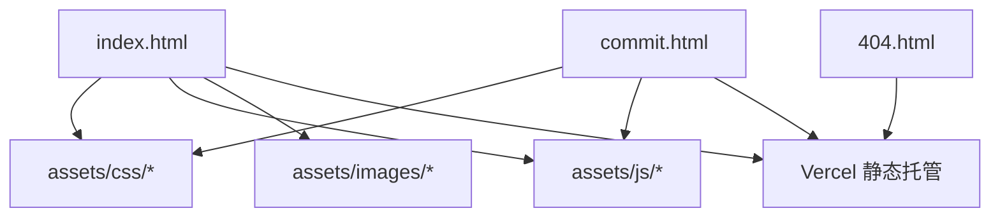
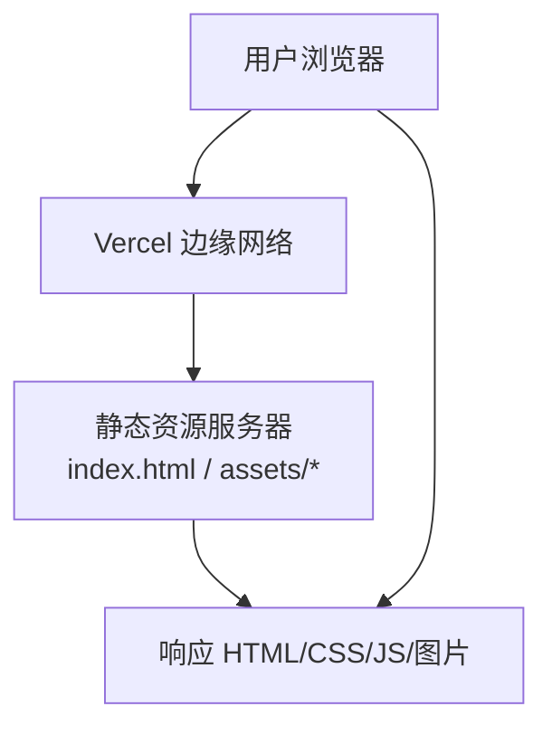
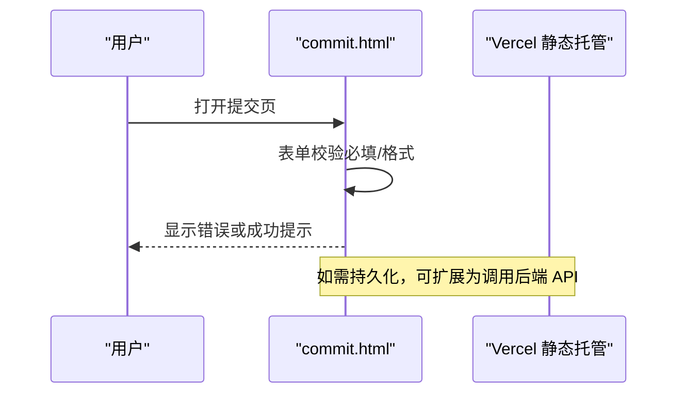
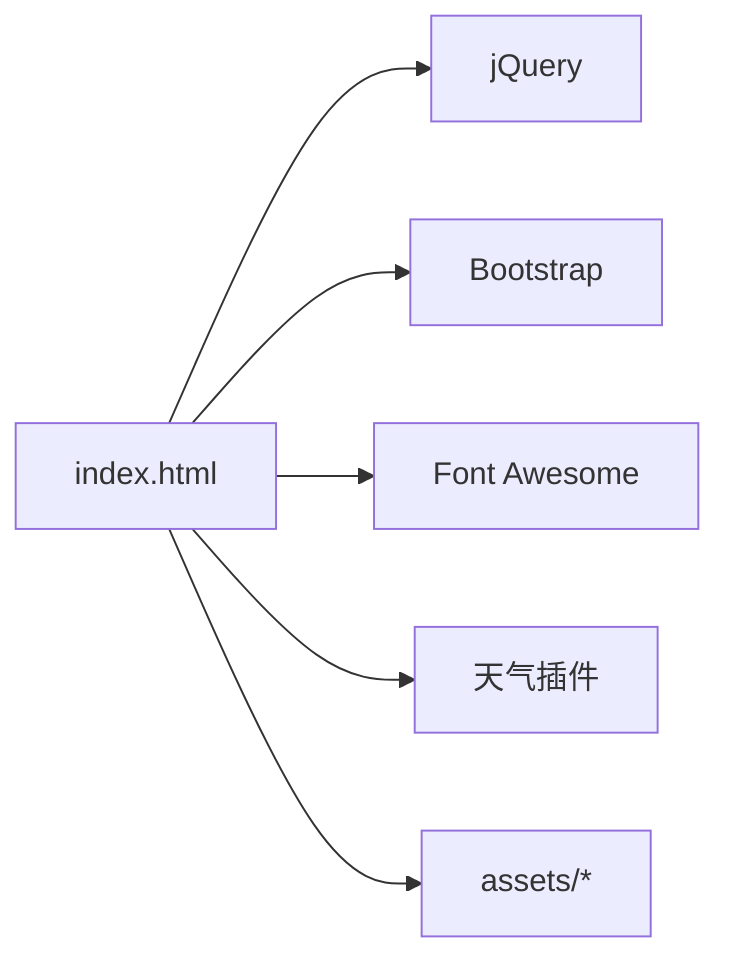

# Vercel部署

<cite>
**本文引用的文件**
- [README.md](file://README.md)
- [index.html](file://index.html)
- [404.html](file://404.html)
- [commit.html](file://commit.html)
</cite>

## 目录
1. [简介](#简介)
2. [项目结构](#项目结构)
3. [核心组件](#核心组件)
4. [架构总览](#架构总览)
5. [详细组件分析](#详细组件分析)
6. [依赖分析](#依赖分析)
7. [性能考虑](#性能考虑)
8. [故障排查指南](#故障排查指南)
9. [结论](#结论)
10. [附录](#附录)

## 简介
本指南面向不同技术水平的用户，提供在 Vercel 上部署该纯静态网址导航项目的完整方案。内容涵盖：
- 通过 Vercel Dashboard 的可视化部署
- 通过 Vercel CLI 的命令行部署
- 项目配置选项（Framework Preset、Root Directory、构建命令等）
- 自定义域名绑定与 DNS 配置步骤
- CI/CD 集成（代码推送自动部署）
- 常见问题解决方案与性能优化建议

该项目为纯静态 HTML/CSS/JS 站点，无需后端服务即可运行，非常适合使用 Vercel 进行零配置或最小化配置的托管与发布。

## 项目结构
仓库根目录包含多个静态页面与资源目录，Vercel 可直接识别并托管这些静态资源。关键入口与说明如下：
- index.html：主站首页，包含导航分类、搜索框、天气插件等
- commit.html：网站提交页，前端表单校验与交互逻辑
- 404.html：自定义 404 页面
- assets：样式、脚本、图标与图片等资源目录
- README.md：包含多种部署方式说明（含 Vercel），以及二次开发指引

图表来源
- [index.html:1-35](file://index.html#L1-L35)
- [commit.html:1-30](file://commit.html#L1-L30)
- [404.html:1-3](file://404.html#L1-L3)

章节来源
- [README.md:298-314](file://README.md#L298-L314)

## 核心组件
- 首页（index.html）：负责展示分类导航、搜索功能、天气小部件与外部链接卡片
- 提交页（commit.html）：提供表单输入、前端校验与提交交互
- 404 页面（404.html）：用于未匹配路由时的友好提示
- 资源目录（assets）：集中管理 CSS、JS、字体与图片资源

上述组件均为纯静态资源，Vercel 会直接将其作为静态站点托管并分发到全球 CDN。

章节来源
- [index.html:1-35](file://index.html#L1-L35)
- [commit.html:1-30](file://commit.html#L1-L30)
- [404.html:1-3](file://404.html#L1-L3)

## 架构总览
由于是纯静态站点，整体架构非常简洁：浏览器请求 Vercel 边缘节点，返回 index.html 及关联资源；如需扩展功能（如表单持久化），可通过 Vercel Serverless Functions 或第三方服务接入。

[此图为概念性架构图，不直接映射具体源码文件]

## 详细组件分析

### 通过 Vercel Dashboard 的可视化部署
- 登录 Vercel 并创建新项目，导入 GitHub 仓库
- 框架预设选择“Other”
- Root Directory 设置为“./”（保持默认）
- 构建命令留空（纯静态站点无需构建）
- Output Directory 设置为“./”（保持默认）
- 点击 Deploy，等待部署完成并获得预览域名

参考步骤详见文档中的“方法 1: 通过 Vercel Dashboard”。

章节来源
- [README.md:153-171](file://README.md#L153-L171)

### 通过 Vercel CLI 的命令行部署
- 安装 Vercel CLI
- 在项目根目录执行 vercel 命令并按提示完成配置
- 生产环境部署使用 vercel --prod

参考步骤详见文档中的“方法 2: 通过 Vercel CLI”。

章节来源
- [README.md:173-205](file://README.md#L173-L205)

### 项目配置选项说明
- Framework Preset：选择“Other”，因为本项目为纯静态站点
- Root Directory：设置为“./”，表示以仓库根目录为发布根
- Build Command：留空，无构建步骤
- Output Directory：设置为“./”，表示将根目录下的静态资源直接发布

以上配置确保 Vercel 正确识别并托管所有静态文件。

章节来源
- [README.md:163-168](file://README.md#L163-L168)

### 自定义域名绑定与 DNS 配置
- 在 Vercel Dashboard 的项目设置中进入“Domains”
- 添加你的自定义域名
- 根据提示在域名服务商处添加相应的 DNS 记录（通常为 A 或 CNAME）
- 等待 DNS 生效后即可通过自定义域名访问

章节来源
- [README.md:207-216](file://README.md#L207-L216)

### CI/CD 集成（代码推送自动部署）
- 将 GitHub 仓库与 Vercel 项目关联后，每次推送到指定分支都会触发自动构建与部署
- 可在 Vercel Dashboard 中查看构建日志与部署状态
- 若需限制触发分支或启用预览部署，可在项目设置中进行相应配置

[本节为通用流程说明，不直接引用具体源码文件]

### 404 页面处理
- 项目根目录包含 404.html，Vercel 会自动将其作为 404 错误页面
- 当用户访问不存在的路径时，将显示友好的 404 提示

章节来源
- [404.html:1-3](file://404.html#L1-L3)

### 提交页交互流程（commit.html）
- 表单字段包括网站名称、地址、分类、描述、关键词、邮箱与联系方式
- 前端进行基础校验（必填项、URL 格式、邮箱格式）
- 提交按钮禁用与加载态反馈
- 当前实现仅在前端收集数据，如需持久化可结合 Vercel Serverless Functions 或第三方表单服务

[此图为概念性流程图，不直接映射具体源码文件]

章节来源
- [commit.html:199-371](file://commit.html#L199-L371)

## 依赖分析
- 外部依赖：jQuery、Bootstrap、Font Awesome、天气插件等
- 本地资源：CSS、JS、图片与字体均位于 assets 目录
- Vercel 对静态资源的缓存与 CDN 分发由平台自动处理

[此图为概念性依赖图，不直接映射具体源码文件]

章节来源
- [index.html:17-31](file://index.html#L17-L31)

## 性能考虑
- 静态资源缓存：Vercel 默认会对静态资源启用缓存策略，有助于提升重复访问速度
- 压缩与传输：建议使用现代浏览器支持的格式（如 WebP）与按需加载
- 首屏优化：减少不必要的脚本与样式体积，避免阻塞渲染
- 外部资源：谨慎引入第三方脚本，必要时采用异步加载或延迟执行
- 404 页面：自定义 404 提升用户体验，降低无效请求带来的影响

[本节为通用性能建议，不直接引用具体源码文件]

## 故障排查指南
- 图片或样式加载失败：检查相对路径是否正确，确保资源路径引用准确
- 提交功能后端实现：当前提交逻辑仅在前端收集数据，如需持久化存储可使用 Vercel Serverless Functions 或第三方表单服务
- 统计与 SEO：可集成 Google Analytics、百度统计、51.la 等工具；完善 meta 标签与 sitemap 提升收录效果

章节来源
- [README.md:316-341](file://README.md#L316-L341)

## 结论
本项目为纯静态站点，适合通过 Vercel 快速部署与托管。推荐使用 Dashboard 进行可视化部署，或通过 CLI 进行自动化发布。配合自定义域名与 CI/CD，可实现从代码推送至线上发布的完整闭环。对于需要后端能力的功能（如表单持久化），可基于 Vercel Serverless Functions 或第三方服务进行扩展。

[本节为总结性内容，不直接引用具体源码文件]

## 附录
- 本地预览：可使用任意 HTTP 服务器或直接打开 index.html
- 其他部署平台：GitHub Pages、Cloudflare Pages、Netlify 等均可托管静态站点

章节来源
- [README.md:22-43](file://README.md#L22-L43)
- [README.md:218-240](file://README.md#L218-L240)