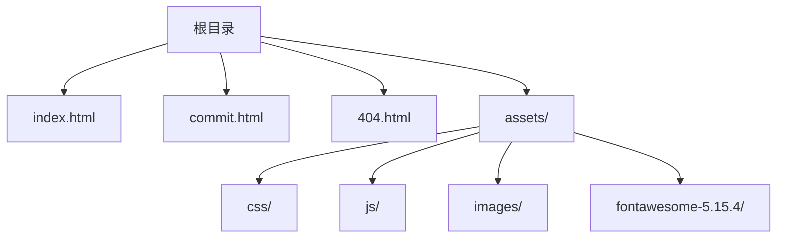
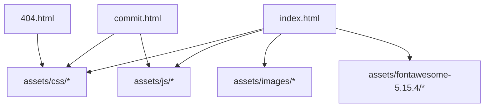

# 其他平台部署

<cite>
**本文引用的文件**
- [README.md](file://README.md)
- [index.html](file://index.html)
- [404.html](file://404.html)
- [commit.html](file://commit.html)
</cite>

## 目录
1. [简介](#简介)
2. [项目结构](#项目结构)
3. [核心组件](#核心组件)
4. [架构总览](#架构总览)
5. [详细组件分析](#详细组件分析)
6. [依赖关系分析](#依赖关系分析)
7. [性能与优化建议](#性能与优化建议)
8. [故障排查指南](#故障排查指南)
9. [结论](#结论)
10. [附录：各平台部署步骤与自定义域名配置](#附录各平台部署步骤与自定义域名配置)

## 简介
本指南面向纯静态站点（HTML + CSS + JavaScript），提供在 GitHub Pages、Cloudflare Pages、Netlify 三大平台的完整部署流程，包括仓库设置、分支与目录选择、构建参数、自定义域名配置与性能优化建议。同时对比各平台特点与适用场景，帮助快速选择合适的方案。

## 项目结构
本项目为纯静态网站，根目录包含首页、提交页、404 页面以及资源目录 assets（样式、脚本、图标等）。无需后端服务即可直接部署到任意静态托管平台。

**图表来源**
- [README.md:298-314](file://README.md#L298-L314)

**章节来源**
- [README.md:298-314](file://README.md#L298-L314)

## 核心组件
- 入口页面 index.html：站点主界面，引用本地样式与脚本，作为所有静态资源的根入口。
- 提交页面 commit.html：用户提交网址的表单页面，前端校验与交互逻辑位于该文件中。
- 错误页 404.html：当访问不存在的路径时展示的错误页面。
- 资源目录 assets：集中管理 CSS、JS、图片与第三方库，便于缓存与复用。

**章节来源**
- [index.html:1-35](file://index.html#L1-L35)
- [commit.html:1-50](file://commit.html#L1-L50)
- [404.html:1-3](file://404.html#L1-L3)

## 架构总览
由于是纯静态站点，整体架构简单清晰：浏览器直接请求静态资源，由托管平台分发并缓存。

[本节为概念性说明，不直接映射具体源码文件]

## 详细组件分析

### 入口页面（index.html）
- 负责加载全局样式与脚本，组织导航与内容区块。
- 通过相对路径引用 assets 下的资源，确保在不同部署路径下均可正确加载。
- 适合直接作为静态站点根目录发布。

**章节来源**
- [index.html:1-35](file://index.html#L1-L35)

### 提交页面（commit.html）
- 提供表单结构与基础校验样式，用于收集用户提交的网站信息。
- 当前实现以本地存储或前端交互为主；如需持久化可对接外部 API 或服务端函数。

**章节来源**
- [commit.html:1-50](file://commit.html#L1-L50)

### 错误页面（404.html）
- 简单的 404 提示页，可在各平台中配置为默认 404 页面以提升用户体验。

**章节来源**
- [404.html:1-3](file://404.html#L1-L3)

## 依赖关系分析
- 页面之间无强耦合，均为独立 HTML 文件。
- 资源统一集中在 assets 目录，便于缓存与版本管理。
- 第三方库（如 Font Awesome、Bootstrap）以本地静态文件形式引入，减少外部依赖风险。

**图表来源**
- [index.html:17-31](file://index.html#L17-L31)
- [commit.html:15-25](file://commit.html#L15-L25)

**章节来源**
- [index.html:17-31](file://index.html#L17-L31)
- [commit.html:15-25](file://commit.html#L15-L25)

## 性能与优化建议
- 启用压缩与缓存：利用托管平台的 CDN 与缓存策略，对静态资源设置长期缓存头。
- 资源合并与压缩：将 CSS/JS 进行压缩与合并，减少请求数与体积。
- 图片优化：使用现代格式（WebP/AVIF）、按需懒加载与响应式尺寸。
- 预连接与关键资源优先：优先加载首屏关键 CSS/字体，非关键资源延迟加载。
- 路由回退：对于单页应用或需要 SPA 路由的场景，配置服务器回退到 index.html（本仓库为多页静态，通常不需要）。

[本节为通用性能建议，不直接分析具体源码文件]

## 故障排查指南
- 资源加载失败：检查相对路径是否正确，确认 assets 目录结构与引用一致。
- 404 问题：确认入口文件命名与平台默认规则一致（通常为 index.html），必要时配置自定义 404 页面。
- 提交功能异常：若需后端支持，请接入 Serverless Functions 或第三方表单服务，并在前端调整接口地址。

**章节来源**
- [README.md:316-341](file://README.md#L316-L341)

## 结论
本项目为纯静态站点，适合直接部署到 GitHub Pages、Cloudflare Pages、Netlify 等平台。根据需求选择：
- GitHub Pages：与代码同仓管理，免费且稳定，适合个人与开源项目。
- Cloudflare Pages：全球网络与强大缓存，适合追求速度与安全的场景。
- Netlify：友好的可视化操作与插件生态，适合快速迭代与团队协作。

[本节为总结性内容，不直接分析具体源码文件]

## 附录：各平台部署步骤与自定义域名配置

### GitHub Pages 部署
- 启用 Pages：在仓库 Settings -> Pages 中选择分支与目录（推荐 main 分支的根目录 /）。
- 分支与目录：选择 main 分支，Publish source 设置为根目录 /。
- 自定义域名：在 Settings -> Pages 中添加自定义域名，并按提示配置 DNS 记录。
- 注意事项：静态站点可直接发布，无需构建命令。

**章节来源**
- [README.md:218-224](file://README.md#L218-L224)

### Cloudflare Pages 部署
- Dashboard 操作：登录 Cloudflare，进入 Pages，创建新项目。
- 连接仓库：选择 GitHub 并授权，导入 web_tool 仓库。
- 构建设置：框架预设选择 Other，构建命令留空，输出目录为 ./（根目录）。
- 自定义域名：在 Pages 项目的 Domains 中添加域名，按提示完成 DNS 配置。
- 优势：CDN 加速、边缘缓存、安全策略完善。

**章节来源**
- [README.md:226-232](file://README.md#L226-L232)

### Netlify 部署
- 站点创建：登录 Netlify，点击 Add new site -> Import an existing project。
- Git 仓库导入：选择 GitHub 仓库并授权，选择 web_tool。
- 构建参数：构建命令留空，发布目录为 ./（根目录）。
- 自定义域名：在 Site settings -> Domain management 中添加域名，按提示配置 DNS。
- 优势：可视化配置、插件丰富、CI/CD 友好。

**章节来源**
- [README.md:234-240](file://README.md#L234-L240)

### 平台对比与适用场景
- GitHub Pages：与代码同仓，零成本，适合个人博客、文档与小型工具站。
- Cloudflare Pages：高性能与高可用，适合对速度与稳定性要求高的项目。
- Netlify：易用性与扩展性强，适合快速原型与团队协作。

[本节为概念性对比，不直接分析具体源码文件]

### 自定义域名配置要点
- 在各平台添加域名后，需在域名服务商处添加对应的 CNAME 或 A 记录。
- 建议使用 HTTPS，并开启强制跳转。
- 如需子域名，可按平台指引分别配置。

[本节为通用配置指导，不直接分析具体源码文件]