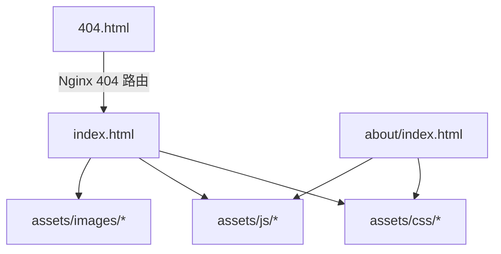
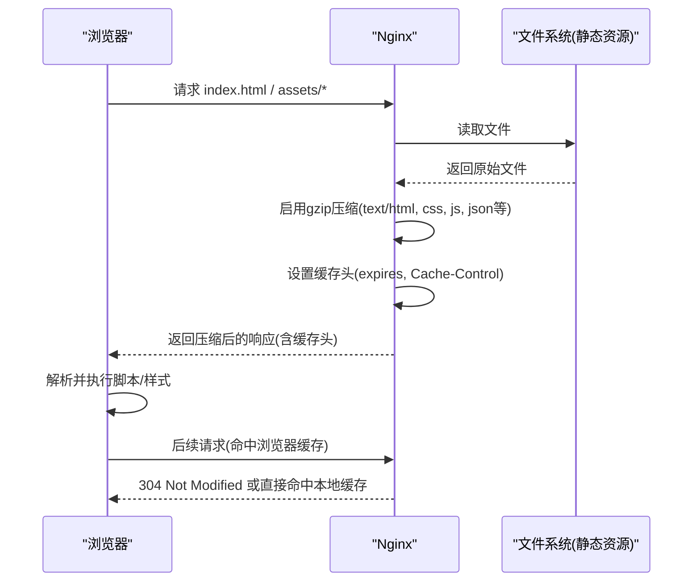
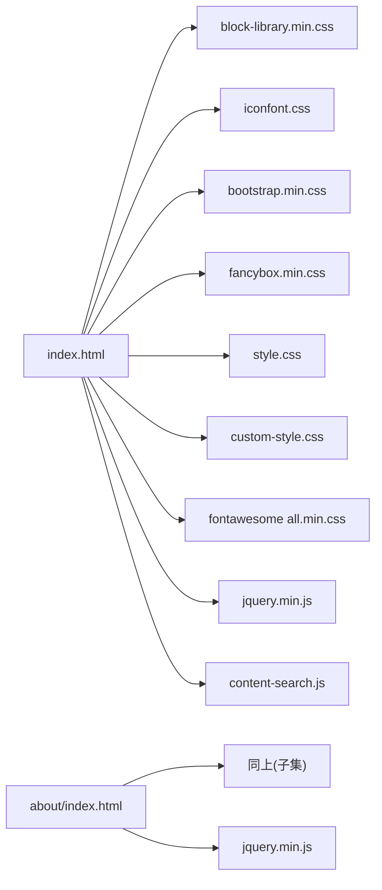

# 性能优化配置

<cite>
**本文引用的文件**
- [index.html](file://index.html)
- [README.md](file://README.md)
- [about/index.html](file://about/index.html)
- [404.html](file://404.html)
- [assets/css/custom-style.css](file://assets/css/custom-style.css)
- [assets/js/content-search.js](file://assets/js/content-search.js)
</cite>

## 目录
1. [简介](#简介)
2. [项目结构](#项目结构)
3. [核心组件](#核心组件)
4. [架构总览](#架构总览)
5. [详细组件分析](#详细组件分析)
6. [依赖关系分析](#依赖关系分析)
7. [性能考量](#性能考量)
8. [故障排查指南](#故障排查指南)
9. [结论](#结论)
10. [附录](#附录)

## 简介
本文件面向静态站点（HTML/CSS/JS）的部署与运行环境，提供一套可落地的网站性能优化配置方案。内容覆盖：
- Nginx gzip 压缩与缓存策略
- 浏览器缓存头设置与资源版本化
- CDN 集成加速全球访问
- 图片优化（格式、尺寸、懒加载）
- SEO 基础优化（meta、站点地图、收录）
- 性能监控与测试方法

本项目为纯静态站点，已内置响应式布局与部分前端优化实践（如图片懒加载），适合通过 Nginx 或各类静态托管平台部署。

## 项目结构
项目由少量 HTML 页面与静态资源组成，资源集中在 assets 目录下，包含 CSS、JS、图标库与图片等。首页 index.html 引入多类样式与脚本，并实现搜索建议与图片懒加载；关于页 about/index.html 独立展示；404.html 用于错误页。

图表来源
- [index.html:1-35](file://index.html#L1-L35)
- [about/index.html:1-26](file://about/index.html#L1-L26)
- [404.html:1-3](file://404.html#L1-L3)

章节来源
- [README.md:298-314](file://README.md#L298-L314)

## 核心组件
- 首页入口与资源引用：index.html 负责引入 CSS/JS 与图片资源，并启用图片懒加载以提升首屏性能。
- 搜索建议：content-search.js 通过 AJAX 调用外部接口提供搜索词提示，减少用户输入成本。
- 自定义样式：custom-style.css 调整主题与交互细节，不影响核心性能但影响渲染体验。
- 错误页：404.html 作为未命中资源的兜底页面。

章节来源
- [index.html:17-31](file://index.html#L17-L31)
- [assets/js/content-search.js:1-91](file://assets/js/content-search.js#L1-L91)
- [assets/css/custom-style.css:1-126](file://assets/css/custom-style.css#L1-L126)
- [404.html:1-3](file://404.html#L1-L3)

## 架构总览
下图展示了从浏览器请求到 Nginx 返回静态资源的关键路径，以及缓存与压缩的作用点。

图表来源
- [README.md:86-116](file://README.md#L86-L116)

## 详细组件分析

### Nginx 压缩与缓存配置
- 压缩类型与级别
  - 启用 gzip，针对文本类资源（HTML、CSS、JS、JSON、XML、RSS、JavaScript 等）进行压缩，显著降低传输体积。
  - 建议根据服务器 CPU 与带宽权衡压缩级别，一般 6 为常用平衡点；若 CPU 紧张可降至 4-5。
- 静态资源缓存
  - 对图片、字体、CSS、JS 等设置长期缓存（如 30 天），并添加 immutable 标识，提升二次访问速度。
  - 结合文件名哈希或版本号（构建期生成）避免缓存污染。
- 404 处理
  - 将未命中资源重定向至 404.html，改善用户体验。

参考路径
- [README.md:86-116](file://README.md#L86-L116)

章节来源
- [README.md:86-116](file://README.md#L86-L116)

### 浏览器缓存与资源版本化
- 缓存头
  - 使用 expires 与 Cache-Control 控制缓存策略，静态资源建议 public + immutable。
- 版本化
  - 在文件名中加入哈希或版本号（如 style-v1.2.3.css），确保更新后强制刷新。
- 条件请求
  - 配合 Last-Modified/ETag，减少不必要的数据传输。

参考路径
- [README.md:104-108](file://README.md#L104-L108)

章节来源
- [README.md:104-108](file://README.md#L104-L108)

### CDN 集成方案
- 选择 CDN 厂商（如 Cloudflare、阿里云 CDN、腾讯云 CDN 等），将域名 CNAME 指向 CDN。
- 源站回源配置：
  - 开启 HTTP/2 与 TLS 1.2+，启用 Gzip/Brotli。
  - 配置缓存规则：静态资源长缓存，HTML 短缓存或按需缓存。
- 安全与优化：
  - 开启自动最小化、HTTP 自动跳转 HTTPS、防刷与 WAF。
  - 配置边缘缓存与预热，提升首次访问速度。

参考路径
- [README.md:149-233](file://README.md#L149-L233)

章节来源
- [README.md:149-233](file://README.md#L149-L233)

### 图片优化技巧
- 格式选择
  - 优先使用 WebP/AVIF 以获得更高压缩比与更好画质；同时保留 PNG/JPG 作为兼容回退。
- 尺寸压缩
  - 按显示尺寸输出图片，避免过大图片；使用响应式 srcset/sizes 适配不同屏幕密度。
- 懒加载实现
  - 项目中已使用 class="lazy" 与 data-src 属性，配合懒加载库延迟加载非首屏图片，减少初始负载。
- 其他
  - 去除元数据、合理命名与目录结构、使用 CDN 分发图片。

参考路径
- [index.html:604-1398](file://index.html#L604-L1398)

章节来源
- [index.html:604-1398](file://index.html#L604-L1398)

### SEO 优化建议
- Meta 标签
  - 完善 title、description、keywords，确保语言与视口设置正确。
  - 当前首页与关于页已包含基本 meta 信息。
- 站点地图
  - 生成 sitemap.xml 并提交至搜索引擎控制台，便于收录。
- 收录优化
  - 提交 robots.txt，规范爬虫抓取；使用结构化数据（可选）。
  - 保证 URL 稳定、内链清晰、移动端友好。

参考路径
- [index.html:4-15](file://index.html#L4-L15)
- [about/index.html:4-13](file://about/index.html#L4-L13)
- [README.md:336-341](file://README.md#L336-L341)

章节来源
- [index.html:4-15](file://index.html#L4-L15)
- [about/index.html:4-13](file://about/index.html#L4-L13)
- [README.md:336-341](file://README.md#L336-L341)

### 前端性能现状与改进点
- 现状
  - 已实现图片懒加载，减少首屏网络与渲染压力。
  - 使用第三方统计 SDK（异步加载），对首屏影响较小。
- 改进点
  - 合并与压缩 JS/CSS，减少请求数与体积。
  - 关键 CSS 内联，非关键 CSS 延迟加载。
  - 脚本按需加载与 defer/async 优化。
  - 预连接与预取：对关键第三方资源使用 rel="preconnect"/rel="dns-prefetch"。

章节来源
- [index.html:17-31](file://index.html#L17-L31)
- [about/index.html:239-241](file://about/index.html#L239-L241)

## 依赖关系分析
- 首页依赖
  - 样式：block-library、iconfont、bootstrap、fancybox、主题样式、自定义样式、Font Awesome。
  - 脚本：jQuery、搜索建议脚本、动画与交互脚本。
- 关于页依赖
  - 与首页类似，但仅引入必要样式与脚本，减少冗余。
- 外部依赖
  - 天气小部件与统计 SDK 通过外链加载，注意其可用性与性能影响。

图表来源
- [index.html:17-31](file://index.html#L17-L31)
- [about/index.html:15-25](file://about/index.html#L15-L25)

章节来源
- [index.html:17-31](file://index.html#L17-L31)
- [about/index.html:15-25](file://about/index.html#L15-L25)

## 性能考量
- 传输层
  - 启用 gzip/brotli，减小响应体积。
  - 开启 HTTP/2，提升并发能力。
- 缓存层
  - 静态资源长缓存 + 文件名哈希；HTML 短缓存或按需缓存。
  - 合理使用 ETag/Last-Modified。
- 资源优化
  - 图片格式与尺寸优化、懒加载、CDN 分发。
  - 脚本与样式合并、压缩、按需加载。
- 网络与边缘
  - 接入 CDN，就近分发；开启边缘缓存与预热。
- 监控与度量
  - 使用 Lighthouse、WebPageTest、Chrome DevTools 进行性能审计。
  - 关注 LCP、FID、CLS、TTI 等指标，持续优化。

[本节为通用指导，不直接分析具体文件]

## 故障排查指南
- 资源加载失败
  - 检查相对路径是否正确，确认 Nginx 根目录与 try_files 配置。
  - 确认 404.html 是否生效。
- 缓存问题
  - 清理浏览器缓存或使用无痕模式验证；检查 Cache-Control 与 expires 是否生效。
- 搜索建议异常
  - content-search.js 依赖外部 API，检查网络连通性与跨域限制。
- 第三方脚本
  - 天气小部件与统计 SDK 来自外部，需评估可用性；必要时增加降级逻辑。

章节来源
- [README.md:316-341](file://README.md#L316-L341)
- [assets/js/content-search.js:1-91](file://assets/js/content-search.js#L1-L91)
- [404.html:1-3](file://404.html#L1-L3)

## 结论
本项目为轻量级静态站点，已具备基础的前端优化（如图片懒加载）。通过合理的 Nginx 压缩与缓存策略、CDN 接入、图片优化与 SEO 基础配置，可显著提升首屏加载速度与整体性能。建议结合监控工具持续评估与迭代优化。

[本节为总结性内容，不直接分析具体文件]

## 附录
- 快速部署参考
  - Nginx 部署步骤与示例配置见 README。
  - 支持 Vercel、GitHub Pages、Cloudflare Pages 等静态托管平台。
- 相关参考
  - Nginx 官方文档、Let's Encrypt 证书、各平台部署文档。

章节来源
- [README.md:47-147](file://README.md#L47-L147)
- [README.md:149-233](file://README.md#L149-L233)
- [README.md:351-355](file://README.md#L351-L355)