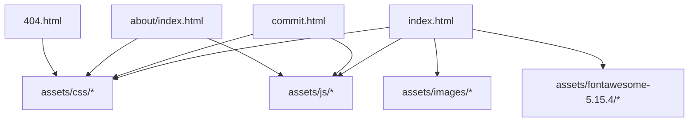
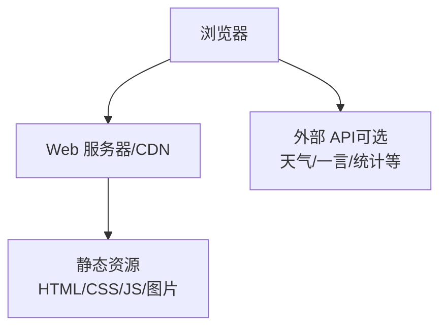
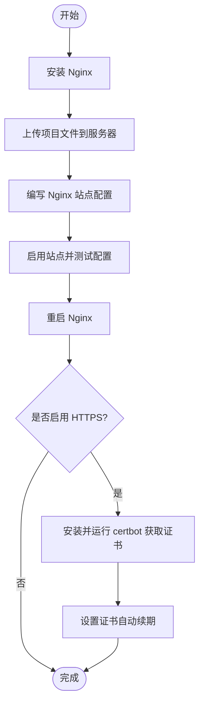
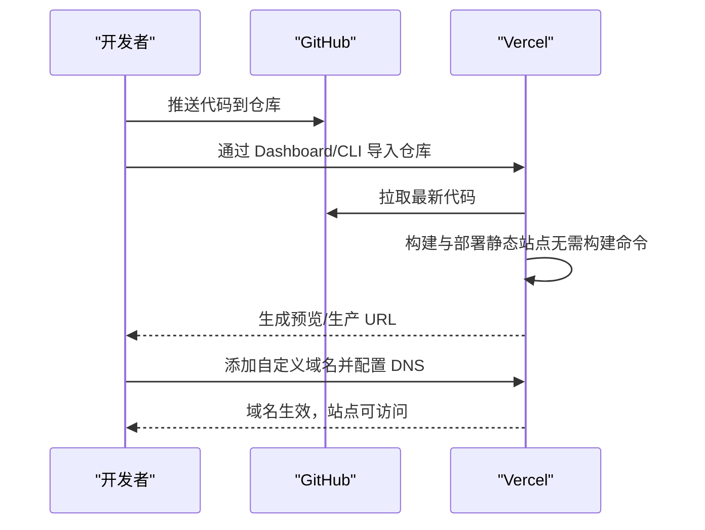
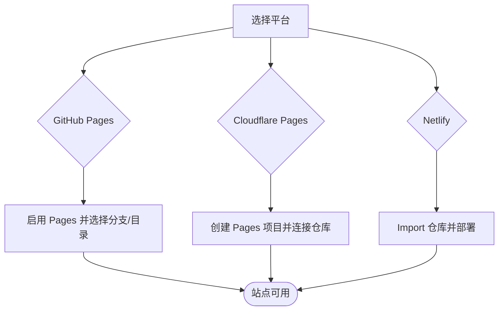
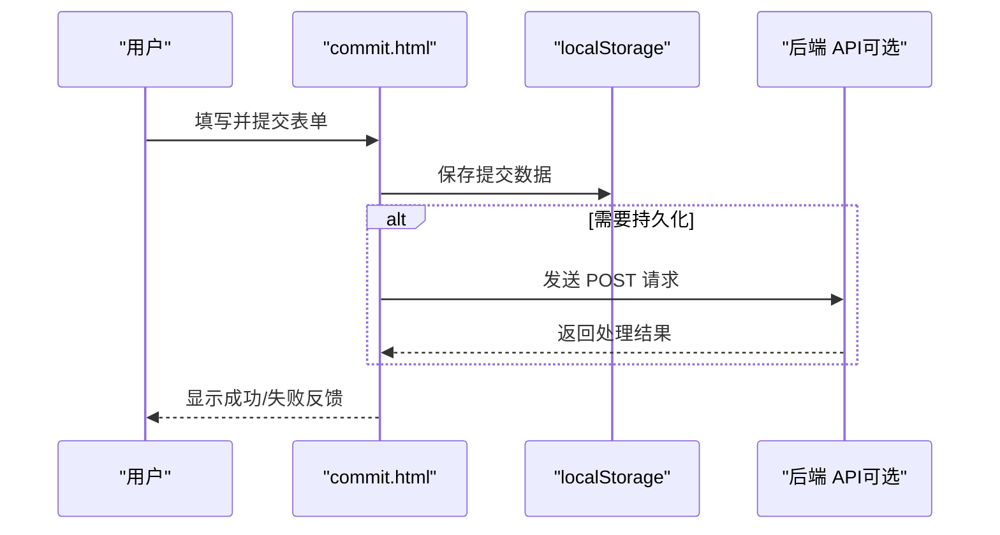
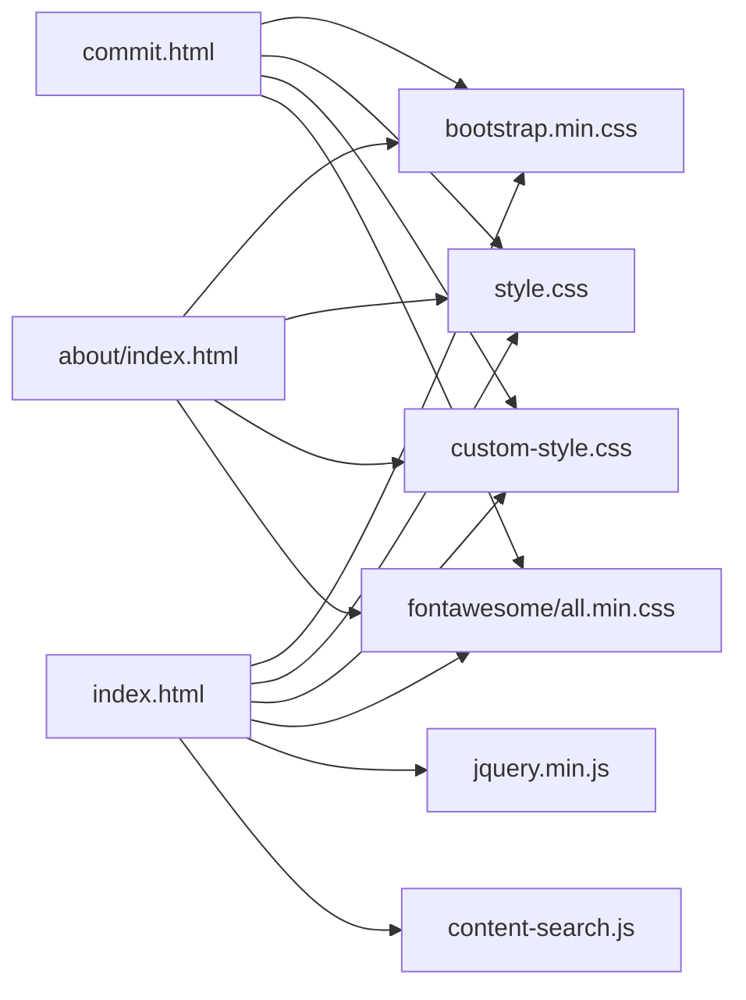

# 部署指南

<cite>
**本文引用的文件**
- [README.md](file://README.md)
- [index.html](file://index.html)
- [commit.html](file://commit.html)
- [about/index.html](file://about/index.html)
- [404.html](file://404.html)
</cite>

## 目录
1. [简介](#简介)
2. [项目结构](#项目结构)
3. [核心组件](#核心组件)
4. [架构总览](#架构总览)
5. [详细组件分析](#详细组件分析)
6. [依赖关系分析](#依赖关系分析)
7. [性能优化建议](#性能优化建议)
8. [故障排除指南](#故障排除指南)
9. [结论](#结论)
10. [附录：平台部署步骤速查](#附录平台部署步骤速查)

## 简介
本指南面向不同技术水平的用户，提供从本地预览到多平台上线的完整部署方案。本项目为纯静态站点（HTML/CSS/JS），无需后端即可运行，适合通过 Nginx、Vercel、GitHub Pages、Cloudflare Pages、Netlify 等平台快速部署与发布。文档重点覆盖：
- Nginx 服务器准备、文件上传、配置编写、HTTPS 设置
- Vercel 两种部署方式（Dashboard 与 CLI）及自定义域名
- GitHub Pages、Cloudflare Pages、Netlify 的部署步骤
- 性能优化（gzip、缓存等）
- 常见问题的排查与解决
- 针对不同技术背景用户的部署方案选择建议

## 项目结构
项目为纯静态网站，根目录包含入口页面、提交页、关于页和错误页，资源统一放置在 assets 目录下。关键文件如下：
- index.html：主导航首页
- commit.html：网址提交页面
- about/index.html：关于页面
- 404.html：404 错误页面
- assets/css、assets/js、assets/images、assets/fontawesome-5.15.4：样式、脚本、图片与图标库

**图表来源**
- [index.html:1-35](file://index.html#L1-L35)
- [commit.html:1-26](file://commit.html#L1-L26)
- [about/index.html:1-26](file://about/index.html#L1-L26)
- [404.html:1-3](file://404.html#L1-L3)

**章节来源**
- [README.md:298-314](file://README.md#L298-L314)
- [index.html:1-35](file://index.html#L1-L35)
- [commit.html:1-26](file://commit.html#L1-L26)
- [about/index.html:1-26](file://about/index.html#L1-L26)
- [404.html:1-3](file://404.html#L1-L3)

## 核心组件
- 首页（index.html）：包含导航菜单、搜索框、分类卡片等内容，引用了 Bootstrap、Font Awesome、自定义样式与脚本。
- 提交页（commit.html）：提供表单界面与前端校验逻辑，用于收集用户提交的网站信息。
- 关于页（about/index.html）：展示项目介绍、联系方式等信息。
- 404 页面（404.html）：当访问不存在的路径时返回友好提示。

这些页面均为静态 HTML，可直接由任意 Web 服务器或静态托管平台提供服务。

**章节来源**
- [index.html:1-35](file://index.html#L1-L35)
- [commit.html:1-200](file://commit.html#L1-L200)
- [about/index.html:1-200](file://about/index.html#L1-L200)
- [404.html:1-3](file://404.html#L1-L3)

## 架构总览
由于是纯静态站点，整体架构简单清晰：浏览器请求静态资源（HTML/CSS/JS/图片），由 Web 服务器或 CDN 直接响应。对于需要后端能力的功能（如提交数据持久化），可通过外部服务或 Serverless 函数扩展。

[无图表来源；该图为概念性架构图]

## 详细组件分析

### Nginx 部署流程（完整）
- 服务器准备
  - 安装 Nginx（Ubuntu/Debian 使用 apt，CentOS/RHEL 使用 yum）
- 上传文件
  - 创建网站目录并上传项目文件或 git clone 仓库
- 配置 Nginx
  - 创建站点配置文件，设置监听端口、server_name、root、index
  - 启用 gzip 压缩，提升传输效率
  - 配置 try_files 以支持单页应用路由回退
  - 配置静态资源缓存策略（图片、CSS、JS 等）
  - 配置 404 页面指向项目中的 404.html
- 启用站点并重启 Nginx
  - 创建软链接启用站点，测试配置后重启服务，并设置开机自启
- HTTPS 设置（推荐）
  - 使用 Let's Encrypt 获取免费证书并自动配置 Nginx
  - 设置证书自动续期

**图表来源**
- [README.md:47-147](file://README.md#L47-L147)

**章节来源**
- [README.md:47-147](file://README.md#L47-L147)

### Vercel 部署（Dashboard 与 CLI）
- Dashboard 方式（最简单）
  - 注册/登录 Vercel，添加新项目，导入 GitHub 仓库
  - 框架选择 Other，根目录与输出目录保持默认
  - 部署成功后获得 vercel.app 子域名
- CLI 方式
  - 全局安装 Vercel CLI，登录后在项目目录执行 vercel
  - 按提示完成配置，生产环境使用 vercel --prod
- 自定义域名
  - 在 Vercel 项目中添加自定义域名，并在域名服务商处配置 DNS 记录

**图表来源**
- [README.md:149-216](file://README.md#L149-L216)

**章节来源**
- [README.md:149-216](file://README.md#L149-L216)

### GitHub Pages、Cloudflare Pages、Netlify 部署
- GitHub Pages
  - 在仓库设置中启用 Pages，选择分支与目录（通常为 main 分支根目录）
- Cloudflare Pages
  - 登录 Cloudflare Dashboard，创建 Pages 项目，连接 GitHub 仓库，留空构建设置后部署
- Netlify
  - 登录 Netlify，选择 Import an existing project，选择 Git 仓库，构建命令与发布目录留空后部署

**图表来源**
- [README.md:218-240](file://README.md#L218-L240)

**章节来源**
- [README.md:218-240](file://README.md#L218-L240)

### 提交功能与后端集成（可选）
- 当前提交功能将数据保存在浏览器 localStorage，如需持久化存储可：
  - 使用 Vercel Serverless Functions
  - 配置后端 API（Node.js、Python、PHP 等）
  - 使用第三方表单服务（Formspree、Typeform 等）

**图表来源**
- [commit.html:1-200](file://commit.html#L1-L200)
- [README.md:316-328](file://README.md#L316-L328)

**章节来源**
- [commit.html:1-200](file://commit.html#L1-L200)
- [README.md:316-328](file://README.md#L316-L328)

## 依赖关系分析
- 首页与提交页均依赖以下资源：
  - CSS：block-library.min、iconfont、bootstrap.min、style、custom-style、fontawesome all.min
  - JS：jQuery、content-search 等
- 关于页同样引用上述资源，路径相对调整
- 404 页面为极简 HTML，不引入额外资源

**图表来源**
- [index.html:17-31](file://index.html#L17-L31)
- [commit.html:15-25](file://commit.html#L15-L25)
- [about/index.html:15-25](file://about/index.html#L15-L25)

**章节来源**
- [index.html:17-31](file://index.html#L17-L31)
- [commit.html:15-25](file://commit.html#L15-L25)
- [about/index.html:15-25](file://about/index.html#L15-L25)

## 性能优化建议
- 启用 gzip 压缩：减少传输体积，提升加载速度
- 静态资源缓存：对图片、CSS、JS、字体等设置长期缓存与不可变头
- 资源合并与压缩：在生产环境合并与压缩 CSS/JS，减少请求数
- 懒加载与按需加载：对图片等资源使用懒加载，降低首屏压力
- CDN 加速：将静态资源托管至 CDN，就近分发
- 最小化 HTML：移除无用注释与空白，减小页面体积

[本节为通用性能建议，不直接分析具体文件]

## 故障排除指南
- 图片或样式加载失败
  - 检查资源路径是否正确，确保相对路径引用准确
- 网址提交功能如何实现后端
  - 当前使用 localStorage 存储，如需持久化可接入 Serverless 或第三方表单服务
- 如何添加网站统计
  - 可集成 Google Analytics、百度统计、51.la 等
- 如何优化 SEO
  - 完善 meta 标签（title、description、keywords）
  - 添加 sitemap.xml 并提交搜索引擎收录
  - 优化页面加载速度

**章节来源**
- [README.md:316-341](file://README.md#L316-L341)

## 结论
本项目为纯静态站点，部署门槛低、适配多种平台。推荐初学者优先使用 Vercel 或 GitHub Pages 快速上线；企业或自有服务器场景可选择 Nginx + HTTPS 以获得更高可控性与性能优化空间。根据需求选择合适的平台与优化策略，即可稳定高效地提供服务。

[本节为总结性内容，不直接分析具体文件]

## 附录：平台部署步骤速查
- Nginx
  - 安装 → 上传文件 → 编写站点配置（含 gzip、缓存、try_files、404）→ 启用并重启 → 可选 HTTPS
- Vercel
  - Dashboard：导入仓库 → 选择 Other → 部署 → 自定义域名
  - CLI：安装 CLI → 登录 → 执行 vercel → 生产部署 → 自定义域名
- GitHub Pages
  - 启用 Pages → 选择分支与目录
- Cloudflare Pages
  - 创建项目 → 连接仓库 → 留空构建 → 部署
- Netlify
  - Import 仓库 → 留空构建与发布目录 → 部署

[本节为操作速查，不直接分析具体文件]