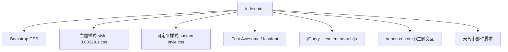
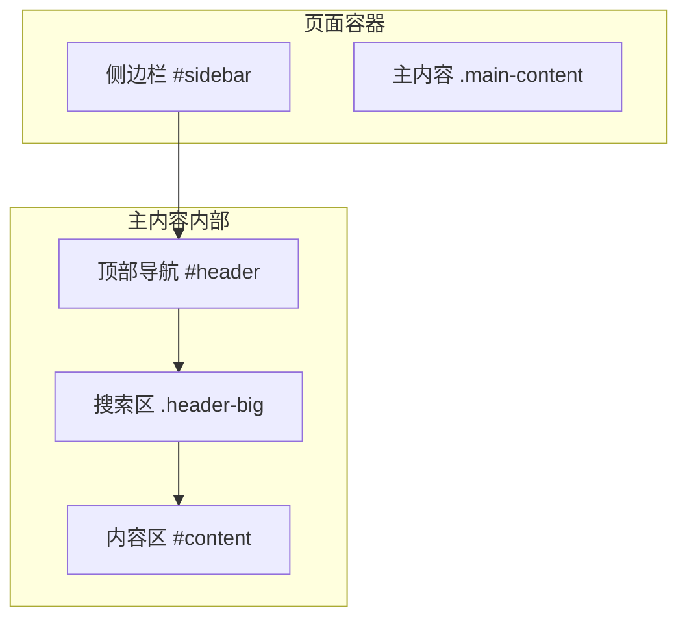
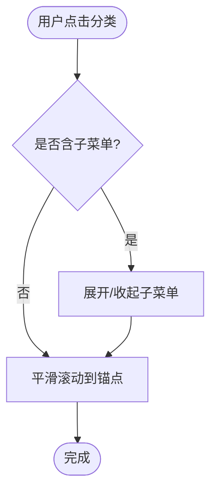
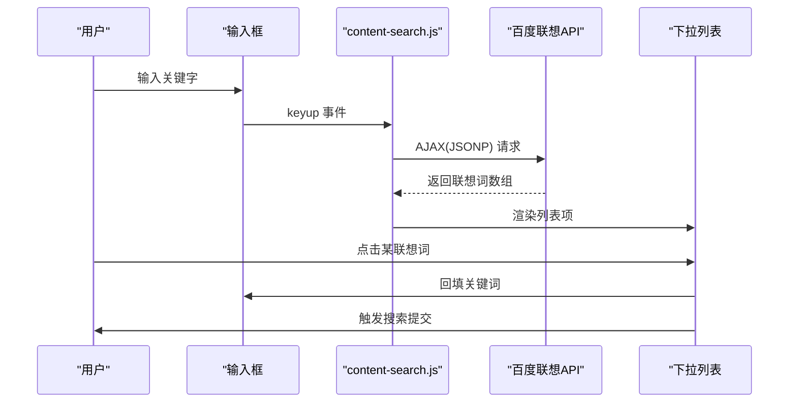
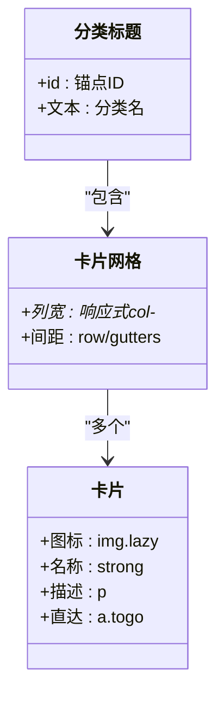
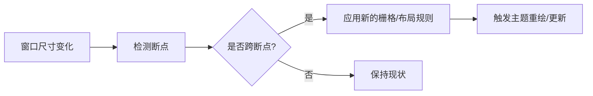
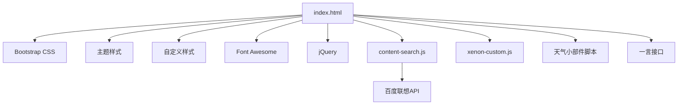

# 主页面架构

<cite>
**本文引用的文件**
- [index.html](file://index.html)
- [custom-style.css](file://assets/css/custom-style.css)
- [style-3.03029.1.css](file://assets/css/style-3.03029.1.css)
- [content-search.js](file://assets/js/content-search.js)
- [xenon-custom.js](file://assets/js/xenon-custom.js)
- [README.md](file://README.md)
</cite>

## 目录
1. [简介](#简介)
2. [项目结构](#项目结构)
3. [核心组件](#核心组件)
4. [架构总览](#架构总览)
5. [详细组件分析](#详细组件分析)
6. [依赖关系分析](#依赖关系分析)
7. [性能优化](#性能优化)
8. [故障排查指南](#故障排查指南)
9. [结论](#结论)
10. [附录：定制方法](#附录定制方法)

## 简介
本页面是一个纯静态的网址导航首页，采用 Bootstrap 栅格与自定义主题样式构建，提供左侧分类导航、顶部搜索区域与内容卡片展示区。页面具备响应式布局、SEO 基础配置、懒加载图片、搜索联想等特性，适合个人或团队快速部署使用。

## 项目结构
- 入口文件：index.html（首页）
- 样式资源：assets/css/ 下包含 Bootstrap、主题样式与自定义样式
- 脚本资源：assets/js/ 下包含 jQuery、搜索联想、主题交互等脚本
- 图标与字体：assets/fontawesome-5.15.4/ 与 assets/css/iconfont-*.css
- 其他页面：about/index.html、commit.html、404.html

图表来源
- [index.html:17-31](file://index.html#L17-L31)
- [style-3.03029.1.css:1-200](file://assets/css/style-3.03029.1.css#L1-L200)
- [custom-style.css:1-126](file://assets/css/custom-style.css#L1-L126)
- [content-search.js:1-91](file://assets/js/content-search.js#L1-L91)
- [xenon-custom.js:1-800](file://assets/js/xenon-custom.js#L1-L800)

章节来源
- [index.html:1-35](file://index.html#L1-L35)
- [README.md:298-314](file://README.md#L298-L314)

## 核心组件
- 头部引入的资源
  - CSS：block-library、iconfont、Bootstrap、fancybox、主题样式、自定义样式、Font Awesome
  - JS：jQuery、content-search（搜索联想）
- 侧边栏导航
  - 固定定位的左侧菜单，支持多级折叠与展开，移动端以抽屉形式呈现
- 顶部导航与工具区
  - 站点导航、天气插件、一言接口、搜索弹窗开关、移动端菜单切换按钮
- 搜索区域
  - 多搜索引擎分组选择、输入框、联想热词下拉、提交跳转
- 内容展示区域
  - 按分类标题与网格卡片展示各网站链接，卡片含图标、名称、描述与直达按钮
- 页脚与附加功能
  - 友情链接、关于导航、网站提交入口

章节来源
- [index.html:42-216](file://index.html#L42-L216)
- [index.html:219-331](file://index.html#L219-L331)
- [index.html:334-574](file://index.html#L334-L574)
- [index.html:577-800](file://index.html#L577-L800)

## 架构总览
页面采用“左固定侧边栏 + 右侧主内容”的经典布局，通过 Bootstrap 栅格组织内容卡片；顶部导航在桌面端横向展开，在移动端折叠为汉堡菜单或抽屉菜单。搜索区域位于首屏显著位置，支持多引擎切换与联想词建议。

图表来源
- [index.html:42-216](file://index.html#L42-L216)
- [index.html:219-331](file://index.html#L219-L331)
- [index.html:334-574](file://index.html#L334-L574)
- [index.html:577-800](file://index.html#L577-L800)

## 详细组件分析

### 头部资源与 SEO 配置
- 字符集与兼容性
  - UTF-8 编码，IE=edge, chrome=1 兼容模式
- 视口与主题色
  - viewport 限制缩放，theme-color 设置浏览器地址栏颜色
- 标题与元信息
  - title、keywords、description 用于搜索引擎摘要与关键词
- 资源引入顺序
  - CSS 优先加载，JS 按需引入；Fancybox、Bootstrap、主题样式依次引入
- 外部服务
  - 天气小部件通过第三方脚本注入；一言接口通过 fetch 获取并渲染

章节来源
- [index.html:7-15](file://index.html#L7-L15)
- [index.html:17-31](file://index.html#L17-L31)
- [index.html:270-296](file://index.html#L270-L296)
- [index.html:303-315](file://index.html#L303-L315)

### 侧边栏导航系统
- 结构与交互
  - 一级分类项可带二级子菜单，点击展开/收起；移动端以全屏抽屉显示
  - 通过 data-change 与 smooth 类实现平滑滚动到对应锚点
- 样式与行为
  - 固定宽度与高度，滚动条隐藏；悬停高亮与箭头旋转动画
  - 迷你侧边栏时仅显示图标，文本隐藏

图表来源
- [index.html:68-184](file://index.html#L68-L184)
- [style-3.03029.1.css:56-108](file://assets/css/style-3.03029.1.css#L56-L108)
- [custom-style.css:4-10](file://assets/css/custom-style.css#L4-L10)

章节来源
- [index.html:44-216](file://index.html#L44-L216)
- [style-3.03029.1.css:56-108](file://assets/css/style-3.03029.1.css#L56-L108)
- [custom-style.css:4-10](file://assets/css/custom-style.css#L4-L10)

### 顶部导航与工具区
- 站点导航
  - 首页、关于等菜单项，支持下拉子菜单
- 天气插件
  - 通过第三方脚本注入，配置模块、颜色、尺寸等参数
- 一言接口
  - 使用 fetch 异步获取随机句子并渲染至指定节点
- 搜索弹窗与移动端菜单
  - 搜索弹窗触发器与移动端侧边栏切换按钮

章节来源
- [index.html:219-331](file://index.html#L219-L331)
- [index.html:270-296](file://index.html#L270-L296)
- [index.html:303-315](file://index.html#L303-L315)

### 搜索区域与联想热词
- 多引擎分组
  - 常用、搜索、工具、社区、生活、求职等分组，单选切换目标搜索引擎
- 表单提交
  - 将输入值拼接为目标搜索引擎 URL，新窗口打开
- 联想热词
  - 监听输入事件，调用百度联想接口，动态生成下拉列表，点击后回填并触发搜索

图表来源
- [index.html:334-574](file://index.html#L334-L574)
- [content-search.js:1-91](file://assets/js/content-search.js#L1-L91)

章节来源
- [index.html:334-574](file://index.html#L334-L574)
- [content-search.js:1-91](file://assets/js/content-search.js#L1-L91)

### 内容展示区域（分类与卡片）
- 分类标题
  - 每个分类以标题区块标识，配合侧边栏锚点定位
- 卡片网格
  - 使用 Bootstrap 栅格列类控制不同屏幕下的列数，形成自适应网格
- 卡片内容
  - 图标、名称、描述、直达按钮；图片使用懒加载属性，失败回退默认图
- 交互
  - 悬浮提升阴影、直达跳转、Tooltip 提示

图表来源
- [index.html:577-800](file://index.html#L577-L800)
- [style-3.03029.1.css:188-200](file://assets/css/style-3.03029.1.css#L188-L200)

章节来源
- [index.html:577-800](file://index.html#L577-L800)
- [style-3.03029.1.css:188-200](file://assets/css/style-3.03029.1.css#L188-L200)

### 响应式设计实现原理
- 栅格系统
  - 使用 Bootstrap 的 col-6、col-sm-6、col-md-4、col-xl-5a、col-xxl-6a 等类在不同断点下调整每行卡片数量
- 侧边栏适配
  - 桌面端固定左侧；移动端隐藏并通过抽屉方式滑出
- 媒体查询
  - 针对 768px、992px、1200px、1400px、1920px 等断点调整布局与字号
- 主题交互
  - xenon-custom.js 中封装了断点检测与响应式重绘逻辑

图表来源
- [index.html:590-800](file://index.html#L590-L800)
- [style-3.03029.1.css:151-163](file://assets/css/style-3.03029.1.css#L151-L163)
- [style-3.03029.1.css:373-399](file://assets/css/style-3.03029.1.css#L373-L399)
- [xenon-custom.js:1-800](file://assets/js/xenon-custom.js#L1-L800)

章节来源
- [index.html:590-800](file://index.html#L590-L800)
- [style-3.03029.1.css:151-163](file://assets/css/style-3.03029.1.css#L151-L163)
- [style-3.03029.1.css:373-399](file://assets/css/style-3.03029.1.css#L373-L399)
- [xenon-custom.js:1-800](file://assets/js/xenon-custom.js#L1-L800)

### SEO 优化配置
- meta 标签
  - charset、viewport、theme-color、keywords、description
- 语义化 HTML
  - 使用 h4 作为分类标题，a 标签承载链接，img 提供 alt 描述
- 可访问性
  - 为图片添加 alt，链接具有明确文本与提示

章节来源
- [index.html:7-15](file://index.html#L7-L15)
- [index.html:590-800](file://index.html#L590-L800)

### 性能优化策略
- 资源加载优化
  - 样式与脚本分离引入，按需加载；使用 CDN 或本地缓存
- 图片懒加载
  - 使用 lazy 类与 data-src 延迟加载，减少首屏压力
- 网络请求
  - 一言接口使用 fetch 异步获取；天气插件按需加载
- 主题与交互
  - 主题脚本初始化滚动条、模态框、日期控件等，避免不必要的计算

章节来源
- [index.html:17-31](file://index.html#L17-L31)
- [index.html:590-800](file://index.html#L590-L800)
- [index.html:303-315](file://index.html#L303-L315)
- [xenon-custom.js:1-800](file://assets/js/xenon-custom.js#L1-L800)

## 依赖关系分析
- 页面依赖
  - index.html 依赖 Bootstrap、主题样式、自定义样式、图标库、jQuery、content-search、xenon-custom
- 脚本依赖
  - content-search.js 依赖 jQuery 与百度联想 API
  - xenon-custom.js 依赖 jQuery 与主题 UI 组件
- 外部服务
  - 天气小部件、一言接口

图表来源
- [index.html:17-31](file://index.html#L17-L31)
- [content-search.js:1-91](file://assets/js/content-search.js#L1-L91)
- [xenon-custom.js:1-800](file://assets/js/xenon-custom.js#L1-L800)

章节来源
- [index.html:17-31](file://index.html#L17-L31)
- [content-search.js:1-91](file://assets/js/content-search.js#L1-L91)
- [xenon-custom.js:1-800](file://assets/js/xenon-custom.js#L1-L800)

## 性能优化
- 首屏优化
  - 关键 CSS 内联或优先加载，非关键 JS 延后执行
- 图片优化
  - 使用 WebP/AVIF 格式，设置合适的宽高与懒加载
- 缓存策略
  - 静态资源开启强缓存与版本化；CDN 加速
- 网络优化
  - 启用 gzip/brotli 压缩；合并与压缩资源
- 交互优化
  - 防抖/节流处理高频事件；减少重排重绘

[本节为通用指导，不直接分析具体文件]

## 故障排查指南
- 搜索联想不显示
  - 检查网络连接与百度联想 API 可达性；确认 jQuery 已加载
  - 查看控制台是否有 JSONP 回调错误
- 图片加载失败
  - 检查路径是否正确；确认 onerror 回退逻辑生效
- 侧边栏异常
  - 检查移动端显示逻辑与 CSS 媒体查询；确认主题脚本初始化成功
- 天气/一言无输出
  - 检查第三方脚本与接口域名是否被拦截；查看控制台错误

章节来源
- [content-search.js:1-91](file://assets/js/content-search.js#L1-L91)
- [index.html:590-800](file://index.html#L590-L800)
- [style-3.03029.1.css:151-163](file://assets/css/style-3.03029.1.css#L151-L163)
- [xenon-custom.js:1-800](file://assets/js/xenon-custom.js#L1-L800)

## 结论
该主页以简洁清晰的布局与完善的响应式方案，提供了高效的网址导航体验。通过合理的资源组织、SEO 基础配置与性能优化手段，保证了良好的用户体验与可维护性。后续可按需扩展分类、集成更多搜索源与统计服务。

## 附录：定制方法
- 添加新的分类
  - 在侧边栏新增分类项与子项，并在内容区添加对应分类标题与卡片网格
  - 参考路径：[index.html:68-184](file://index.html#L68-L184)、[index.html:577-800](file://index.html#L577-L800)
- 修改导航结构
  - 调整侧边栏层级与图标；确保 data-change 与锚点一致
  - 参考路径：[index.html:68-184](file://index.html#L68-L184)
- 调整页面布局
  - 修改栅格列类以改变卡片密度；调整主题样式中的间距与字号
  - 参考路径：[index.html:590-800](file://index.html#L590-L800)、[style-3.03029.1.css:373-399](file://assets/css/style-3.03029.1.css#L373-L399)
- 接入新的搜索源
  - 在搜索分组中添加新的 radio 选项与目标 URL
  - 参考路径：[index.html:334-574](file://index.html#L334-L574)
- 自定义样式
  - 在 custom-style.css 中覆盖主题样式；注意优先级与媒体查询
  - 参考路径：[custom-style.css:1-126](file://assets/css/custom-style.css#L1-L126)
- 可访问性与兼容性
  - 为图片添加 alt；为交互元素提供键盘操作与焦点管理
  - 测试主流浏览器与移动端设备，确保布局与功能正常

章节来源
- [index.html:68-184](file://index.html#L68-L184)
- [index.html:334-574](file://index.html#L334-L574)
- [index.html:590-800](file://index.html#L590-L800)
- [custom-style.css:1-126](file://assets/css/custom-style.css#L1-L126)
- [style-3.03029.1.css:373-399](file://assets/css/style-3.03029.1.css#L373-L399)