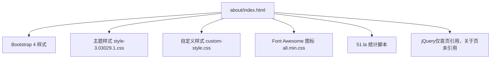
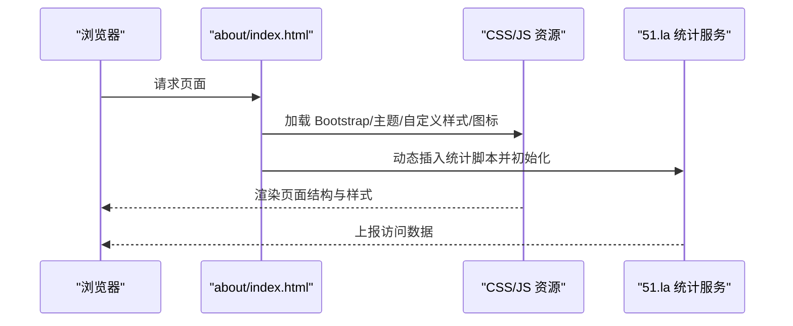
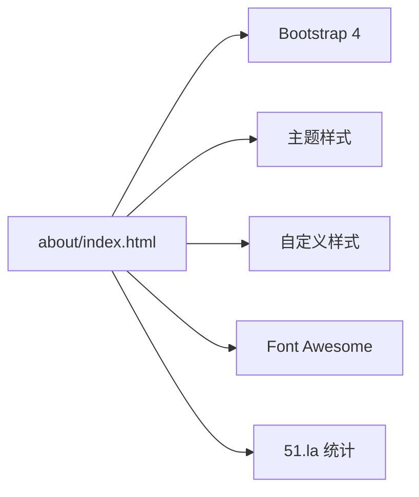

# 关于页面

<cite>
**本文引用的文件**
- [about/index.html](file://about/index.html)
- [assets/css/custom-style.css](file://assets/css/custom-style.css)
- [assets/css/style-3.03029.1.css](file://assets/css/style-3.03029.1.css)
- [index.html](file://index.html)
- [README.md](file://README.md)
</cite>

## 目录
1. [简介](#简介)
2. [项目结构](#项目结构)
3. [核心组件](#核心组件)
4. [架构总览](#架构总览)
5. [详细组件分析](#详细组件分析)
6. [依赖关系分析](#依赖关系分析)
7. [性能考量](#性能考量)
8. [故障排查指南](#故障排查指南)
9. [结论](#结论)
10. [附录](#附录)

## 简介
本文件针对“关于页面”（about/index.html）进行系统化文档说明，覆盖内容组织、SEO 配置、样式与响应式布局、可访问性与用户体验优化、维护与扩展方法等。该页面用于展示项目介绍、作者信息、技术栈、工作理念与联系方式，并提供返回首页的入口。

## 项目结构
关于页面位于 about/index.html，采用独立静态 HTML 文件形式，内联样式与外部资源结合：
- 头部引入 Bootstrap 4、主题样式、自定义样式与 Font Awesome 图标库
- 页面主体包含：
  - 顶部标题区（作者/项目名与标语）
  - 内容区（个人简介、技术栈、工作理念、联系方式）
  - 底部返回主页按钮
- 集成第三方统计脚本（51.la）
- 使用响应式媒体查询适配移动端

图表来源
- [about/index.html:15-25](file://about/index.html#L15-L25)
- [about/index.html:239-241](file://about/index.html#L239-L241)

章节来源
- [about/index.html:1-338](file://about/index.html#L1-L338)
- [assets/css/style-3.03029.1.css:1-200](file://assets/css/style-3.03029.1.css#L1-L200)
- [assets/css/custom-style.css:1-126](file://assets/css/custom-style.css#L1-L126)

## 核心组件
- 页面元信息与 SEO
  - 语言设置、视口、主题色、标题、关键词、描述、favicon
- 资源加载
  - CSS：block-library、iconfont、bootstrap、主题样式、自定义样式、Font Awesome
  - JS：51.la 统计 SDK
- 内容区块
  - 头部标题区：标题与标语
  - 个人简介：高亮框 + 段落文本
  - 技术栈：网格卡片（图标 + 名称）
  - 工作理念：段落文本
  - 联系方式：列表项（GitHub、个人主页、邮箱）
  - 返回首页：居中按钮
- 交互与动画
  - 卡片悬停提升阴影与位移
  - 联系项悬停背景变化
  - 按钮悬停位移与变色

章节来源
- [about/index.html:4-25](file://about/index.html#L4-L25)
- [about/index.html:27-237](file://about/index.html#L27-L237)
- [about/index.html:244-333](file://about/index.html#L244-L333)

## 架构总览
关于页面为纯静态单页，无后端依赖；通过 CSS 实现响应式布局与视觉层次，通过 Font Awesome 提供图标，通过 51.la 注入统计代码。整体结构清晰，易于维护与扩展。

图表来源
- [about/index.html:15-25](file://about/index.html#L15-L25)
- [about/index.html:239-241](file://about/index.html#L239-L241)

## 详细组件分析

### 内容与组织结构
- 头部标题区
  - 使用渐变背景与居中对齐，突出“关于作者”主题
  - 标题前添加用户图标增强识别度
- 个人简介
  - 高亮框强调关键信息，配合多段文字详细介绍背景与技术方向
- 技术栈
  - 使用网格布局自适应列数，每项包含图标与名称，便于快速浏览
- 工作理念
  - 以段落形式阐述协作、代码质量与学习热情
- 联系方式
  - 列表项包含图标、标签与链接，支持外链与邮件协议
- 返回首页
  - 居中按钮，带图标与悬停动效

章节来源
- [about/index.html:244-333](file://about/index.html#L244-L333)

### SEO 优化配置
- 语言与兼容性
  - lang="zh-CN"，X-UA-Compatible 兼容 IE
- 视口与主题色
  - viewport 限制缩放，theme-color 指定主题色
- 标题与描述
  - title 明确页面主题
  - description 概括网站功能与工具类型
- 关键词
  - keywords 包含站点与页面相关词
- 图标
  - favicon 指向 assets/images/favicon.png

章节来源
- [about/index.html:4-13](file://about/index.html#L4-L13)

### 样式设计与响应式布局
- 基础样式
  - body 背景与内边距，容器最大宽度与圆角阴影
- 区块样式
  - section-title 带下划线与图标
  - skills-grid 使用 CSS Grid 自适应列宽
  - contact-list 列表项带图标与悬停效果
- 响应式
  - 在 max-width: 768px 时调整容器边距、标题字号、网格列宽与内边距
- 主题适配
  - 页面类 io-grey-mode 与主题样式协同，保证一致的主题体验
- 图标
  - 使用 Font Awesome 图标（fas/fab）统一风格

章节来源
- [about/index.html:27-237](file://about/index.html#L27-L237)
- [assets/css/style-3.03029.1.css:1-200](file://assets/css/style-3.03029.1.css#L1-L200)
- [assets/css/custom-style.css:1-126](file://assets/css/custom-style.css#L1-L126)

### 可访问性与用户体验优化
- 语义化结构
  - 使用 h1/h2 层级组织内容，利于屏幕阅读器理解
- 链接与目标
  - 外链使用 target="_blank"，建议配合 rel="noopener" 提升安全性
- 颜色对比与可读性
  - 正文颜色与背景对比良好，行高适中
- 交互反馈
  - 悬停状态提供视觉反馈（阴影、位移、背景色变化）
- 移动端友好
  - 媒体查询确保小屏下的可读性与可用性

章节来源
- [about/index.html:244-333](file://about/index.html#L244-L333)

### 第三方服务集成
- 51.la 统计
  - 通过动态创建 script 标签并插入到 head，完成异步加载与初始化
  - 配置 id 与 ck 参数用于站点标识与数据采集

章节来源
- [about/index.html:239-241](file://about/index.html#L239-L241)

## 依赖关系分析
- 样式依赖
  - Bootstrap 4：栅格与基础组件
  - 主题样式：全局字体、布局与导航样式
  - 自定义样式：页面特定样式与细节调整
  - Font Awesome：图标资源
- 脚本依赖
  - 51.la：统计 SDK（异步加载）
  - jQuery：首页使用，关于页未直接引用
- 资源路径
  - 相对路径 ../assets/... 指向根目录资源

图表来源
- [about/index.html:15-25](file://about/index.html#L15-L25)
- [about/index.html:239-241](file://about/index.html#L239-L241)

章节来源
- [about/index.html:15-25](file://about/index.html#L15-L25)
- [index.html:17-31](file://index.html#L17-L31)

## 性能考量
- 资源加载
  - 样式文件按需引入，避免冗余
  - 图标使用 CDN 或本地压缩版（all.min.css）
- 脚本执行
  - 统计脚本异步加载，不阻塞首屏渲染
- 图片与图标
  - 建议使用 WebP/SVG 格式与懒加载策略（当前页面主要为图标）
- 缓存策略
  - 静态资源可启用浏览器缓存与 gzip 压缩（服务器侧配置）

[本节为通用指导，无需具体文件来源]

## 故障排查指南
- 样式未生效
  - 检查 CSS 路径是否正确（../assets/css/...）
  - 确认浏览器控制台无 404 错误
- 图标不显示
  - 确认 Font Awesome 样式已加载
  - 检查 class 名称是否匹配（如 fas/fa）
- 统计未上报
  - 检查 51.la 脚本是否成功插入并初始化
  - 查看网络面板是否有统计请求
- 移动端显示异常
  - 检查媒体查询是否被覆盖
  - 验证容器宽度与内边距在小屏下的表现

章节来源
- [about/index.html:15-25](file://about/index.html#L15-L25)
- [about/index.html:239-241](file://about/index.html#L239-L241)

## 结论
关于页面采用简洁清晰的静态结构，结合 Bootstrap 与主题样式实现响应式布局，使用 Font Awesome 提升视觉一致性，并通过 51.la 完成访问统计。页面具备良好的 SEO 基础与可访问性实践，易于维护与扩展。建议在后续迭代中持续优化资源加载与可访问性细节，以提升用户体验与搜索引擎收录效果。

[本节为总结性内容，无需具体文件来源]

## 附录

### 如何更新与维护页面内容
- 修改项目信息
  - 编辑 about/index.html 中的标题、描述与正文段落
- 更新联系方式
  - 在联系方式列表中替换链接与邮箱地址
- 添加新功能介绍
  - 新增 section 区块，复用 skills-grid 或 highlight-box 样式
- 调整样式
  - 在 about/index.html 的 style 标签或 custom-style.css 中调整颜色、间距与动画

章节来源
- [about/index.html:244-333](file://about/index.html#L244-L333)
- [assets/css/custom-style.css:1-126](file://assets/css/custom-style.css#L1-L126)

### 页面扩展指导
- 新增信息板块
  - 复制现有 section 结构，修改标题与内容
- 集成第三方服务
  - 在 head 中插入对应 SDK 脚本（参考 51.la 的异步加载方式）
- 自定义样式
  - 在 custom-style.css 中定义新类，或在 about/index.html 的 style 中局部覆盖
- 主题适配
  - 遵循 io-grey-mode 类约定，保持与主站一致的明暗模式体验

章节来源
- [about/index.html:239-241](file://about/index.html#L239-L241)
- [assets/css/style-3.03029.1.css:1-200](file://assets/css/style-3.03029.1.css#L1-L200)

### 可访问性与用户体验最佳实践
- 语义化标签与层级
  - 合理使用 h1/h2/h3，确保内容结构清晰
- 链接安全
  - 外链增加 rel="noopener" 防止反向标签劫持
- 键盘可达性
  - 确保所有交互元素可通过 Tab 键聚焦
- 色彩对比
  - 保持文本与背景对比度符合 WCAG 标准
- 移动端体验
  - 使用媒体查询优化小屏布局与触控区域大小

章节来源
- [about/index.html:244-333](file://about/index.html#L244-L333)